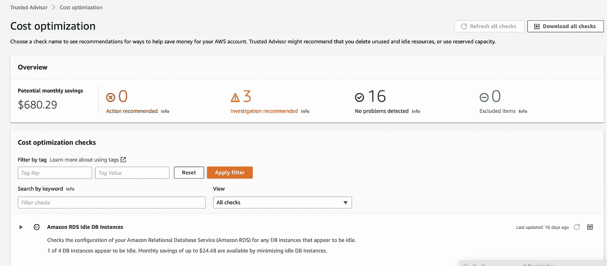
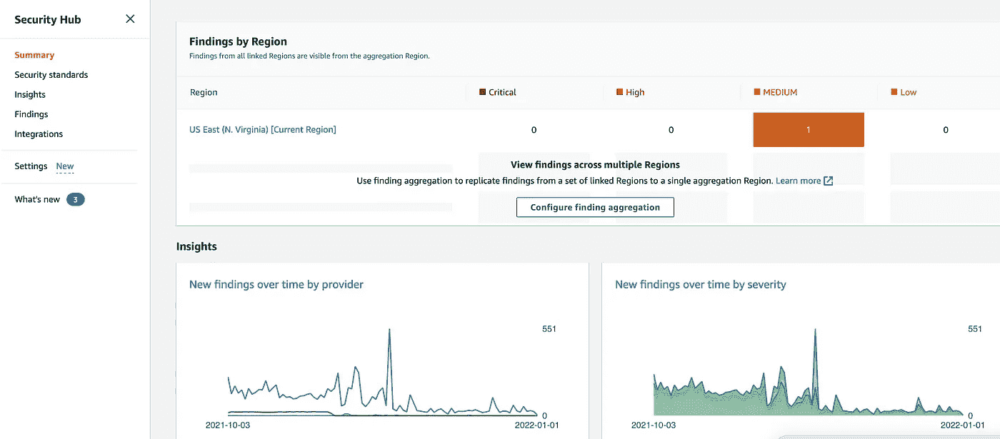
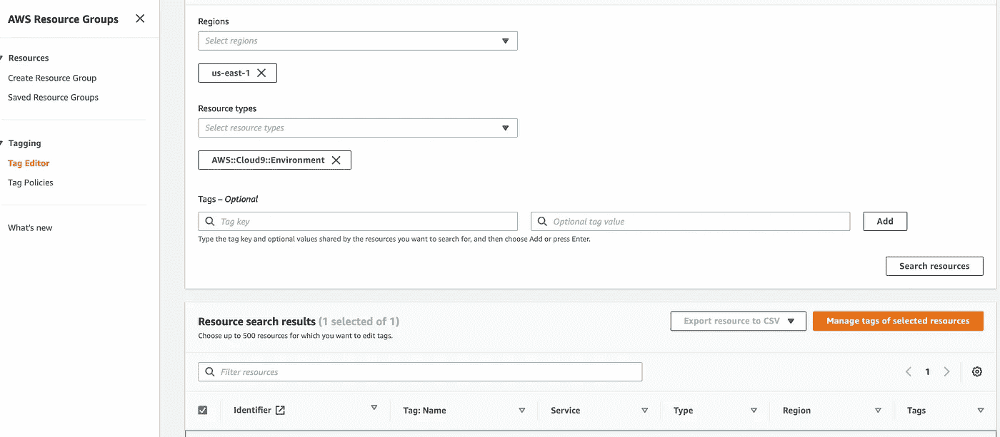
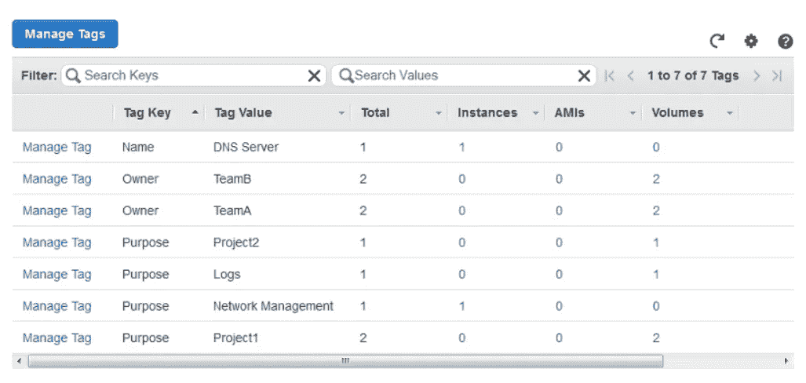

# 清理 AWS 云环境的 4 种方法

> 原文：<https://betterprogramming.pub/4-approaches-to-declutter-aws-cloud-environments-7e59b76c6206>

## 净化您的云环境

照片由[帕特里克·福尔](https://unsplash.com/@patrickian4?utm_source=unsplash&utm_medium=referral&utm_content=creditCopyText)在 [Unsplash](https://unsplash.com/s/photos/candy-scoop?utm_source=unsplash&utm_medium=referral&utm_content=creditCopyText) 拍摄

创建云资源就像从糖果店买糖果一样简单。对于一个组织(初创或已建立)来说，只需点击几下鼠标，就可以通过公共云提供商创建一个帐户，并最终创建可能包含复杂基础架构的资源来支持分布式环境。

随着时间的推移，包括未使用或不想要的资源在内的“杂物”会越积越多。这种混乱不仅限于计算、存储等类别，还可能包括未使用的角色、过度特权策略、未使用的标签等。这种云混乱会导致:

*   不必要的云支出增加
*   攻击表面积的增加暴露了安全风险

我最近面临了一个类似的挑战，这篇文章总结了我通过清理混乱来净化 AWS 环境(有多个帐户)的方法。这种净化工作最终将提供对正在使用的资源的更多控制，并有助于减少攻击面、增强安全态势和降低运营成本。

下面总结了清理 AWS 环境的多种方法。

# 通过值得信赖的顾问识别闲置或未充分利用的资源—成本优化

[AWS 可信顾问](https://aws.amazon.com/premiumsupport/technology/trusted-advisor/)中的“成本优化”功能不仅推荐了节省成本的方法，还列出了可能会被删除的未使用或闲置资源。这是一项非常有用的服务，是开始清理云混乱的良好开端，但不是万能的，因为对资源利用率的检查仅限于:

*   空闲 RDS 数据库实例
*   空闲负载平衡器
*   低利用率 EC2 实例
*   无关联的 IP 地址
*   未充分利用的 EBS 卷

AWS 值得信赖的顾问—成本优化

# 通过 AWS 安全中心调查结果识别不必要的资源

[AWS 安全中心](https://aws.amazon.com/security-hub/)主要用于检测与安全最佳实践的偏差，并通过自动响应和补救措施加快平均解决时间。然而，AWS Security Hub 的一个关键特性是从几个 AWS 集成和合作伙伴服务中汇总安全发现。

AWS 集成包括 Amazon GuardDuty、Amazon Inspector、Amazon Macie、AWS IAM Access Analyzer、AWS Systems Manager Patch Manager、AWS Config 和 AWS Firewall Manager。这意味着安全调查结果将集中在广泛的 AWS 资源上，其中也包括 IAM 角色和策略。

补救每个安全发现是一个繁琐的过程，但有助于从资源角度了解组织的状况。例如，补救安全发现的流程将识别未使用的 SNS 主题、SQS 队列、机密、KMS 密钥、过度配置的策略、具有控制台访问权限但没有 MFA 设置的用户等。

修正 AWS 安全中心发现的问题

# 确定适当的标签并标记所需的资源

一旦清理了空闲的、未充分利用的和不必要的资源，确定一组可用于对资源进行分组并进行适当标记的清晰标记就非常重要。

强烈建议使用基础设施即代码(IaaC)等方法(例如 Terraform 或 AWS CloudFormation)进行资源标记。标记资源的另一种手动方法是使用服务“ [AWS 资源组](https://docs.aws.amazon.com/ARG/latest/userguide/tagging-resources.html)”下的“标记编辑器”功能

通过 AWS 资源组管理标记—标记编辑器

还建议将所需标签激活为“成本分配标签”。这可以通过 AWS 计费下的“成本分配标签”选项来完成

# 识别附加了不需要的标记的资源，以清理资源或附加到资源的标记

在此净化工作之前，可能存在标签。这些标签可以与需要或需要删除的资源相关联。EC2 服务下的“标签”部分将列出所有使用的标签和相关资源。查看不需要的标签将有助于进一步清理环境。

通过 Amazon EC2 服务管理标签

# 通过自动化解决方案(如云托管)维护环境健全性

[云托管](https://cloudcustodian.io/#)是一款开源工具，可以通过确保遵守安全策略、标记策略、未使用资源的垃圾收集和成本管理来自动管理云环境。该工具易于使用，并允许使用易于阅读的 DSL 创建数百万个策略。该工具提供了消除云混乱所需的自动化，强烈推荐使用。

# 结论

总之，清理云环境通常是一项被忽视的任务。然而，就实际支出而言，这可能被证明是极其昂贵的，但对安全态势而言，这是一个迫在眉睫的风险。从长远来看，在一次性清理之后，通过云托管等工具设置自动化将被证明是非常有益的。