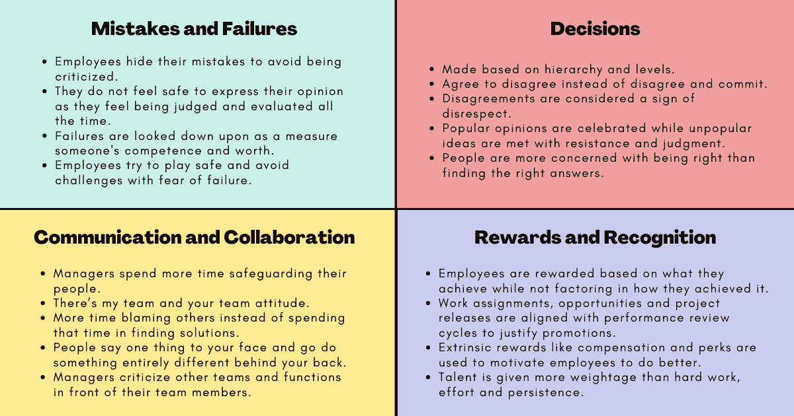

# 组织内部文化问题的 4 个注意点

> 原文：<https://betterprogramming.pub/4-areas-to-watch-out-for-culture-problems-within-your-organization-7cf378d4f8ff>

## 经常被忽视的微妙的文化问题

鸣谢:作者

当彼得·德鲁克在 2006 年说“文化早餐吃战略”时，他并不是说战略不重要。更确切地说，有效的战略对组织的成功至关重要。一个好的策略是成功实现愿景的关键。但是一个[战略](https://www.techtello.com/strategy-vs-tactics/)本身并不能推动任何组织实现巨大的增长和成功。赋予这一战略生命力的是它的员工。

不管你的策略有多可靠，没有员工的支持，它是不会成功的。员工如何处理压力情况，他们如何应对失败，他们如何应对挑战，以及他们如何合作，在实施任何变革或推动任何战略方面都起着重要作用。

员工的工作环境会限制他们的成就。强大的授权文化可以让他们实现变革性的结果，而[令人不安的](https://www.techtello.com/office-politics/)工作场所态度和行为会限制他们的效率，破坏他们所能实现的目标。

你的文化是你执行战略的背景。就像一群登山者没有好的战略和相互支持就无法到达山顶一样，一家公司如果没有与必须共同努力才能实现战略的人保持一致，就无法取得成功。与其让你的员工在艰难的地形中挣扎，不如让他们轻松享受旅程。

> “在我来到 IBM 之前，我可能会告诉你，文化只是任何组织的构成和成功的几个重要因素之一，还有愿景、战略、市场营销、财务等……我在 IBM 的时候发现，文化不只是游戏的一个方面，它是游戏。最终，一个组织只不过是其员工创造价值的集体能力…你可以很快发现，有时在一个地方的几个小时内，文化鼓励和不鼓励什么，奖励和惩罚什么。是奖励个人成就还是团队合作的文化？它重视冒险还是建立共识？”IBM 前首席执行官路易斯·郭士纳

如果你致力于加强你的文化，从而促进发展，那么请注意这四个领域，在这四个领域中，你的组织可能存在微妙的文化问题。

# 1.决策是如何制定和执行的

良好的决策是任何组织有效性的关键因素。决策的方式不仅会影响结果，还会影响组织的文化。

在以下情况下，您的组织存在文化问题:

*   决策是根据层级和级别做出的，而不是让掌握信息的人参与进来。
*   员工不喜欢一个想法，他们只[同意不同意](https://www.techtello.com/agree-to-disagree-vs-disagree-and-commit/)而不是不同意和承诺。这使得他们反对这个想法，试图在任何时候破坏它，只是为了证明他们的观点——“我是这么说的。”
*   不同意见被认为是不尊重的表现。
*   比起找到正确的答案，人们更关心正确与否。
*   流行的观点受到欢迎，而不受欢迎的观点则遭到抵制和评判。
*   做出决定是为了保持现状，同时抵制变革的需要。

> “在一家快速创新的公司中，关键、重大决策的所有权应该分散在所有不同级别的员工中，而不是根据层级地位进行分配。当你让低层员工访问通常为高层管理人员保留的信息时，他们自己就能完成更多工作。他们工作得更快，不会停下来询问信息和请求批准。他们不需要高层的意见就能做出更好的决定……如果你给员工更多的自由，而不是制定流程来阻止他们行使自己的判断，他们会做出更好的决定，也更容易让他们承担责任。”—没有规则的雷德·哈斯汀斯规则

通过授权人们做出决策，您可以将组织的文化从依赖等级和级别转变为在决策过程中鼓励知识和经验。

# 2.团队如何沟通和协作

组织中的大量工作需要跨多个团队和职能的[协作](https://www.techtello.com/cross-functional-teams/)。人们如何跨团队合作不仅对完成项目所需的努力、时间表和资源有重大影响，它还反映了组织的文化。

在以下情况下，您的组织存在文化问题:

*   管理人员花更多的时间保护他们的员工，保护他们免受无关紧要的要求，并防止范围蔓延，而不是实际构建产品。
*   有一种我的团队和你的团队的态度。员工对自己的团队和工作有优越感，但在与团队以外的人打交道时会表现出抵触情绪。
*   员工花更多的时间去指责别人，而不是花时间去寻找解决方案。
*   人们当着你的面说一件事，背地里却做完全不同的事。
*   经理在团队成员面前批评其他团队和职能。他们一边说别人如何无能，一边称赞自己的团队做的每一件事都是对的。

> “不是金融。不是战略。不是技术。团队合作仍然是最终的竞争优势，因为它是如此强大和罕见……如果你能让一个组织中的所有人朝着同一个方向前进，你就能在任何时候、在任何行业、在任何市场、在任何竞争中占据主导地位。”—帕特里克·兰西奥尼

通过纳入健康的协作实践并强化合作的价值，您可以将组织的文化从依赖指责和借口转变为承担责任并作为一个团队有效地协作。

# 3.奖励和认可是如何构建的

组织依靠奖励员工来激励他们产生更好的结果。但是，这些奖励的结构对一个组织的文化有很大影响。

在以下情况下，您的组织存在文化问题:

*   员工的奖励基于他们取得的成就，而不考虑他们是如何取得成就的。只要取得了成果，不良行为就会被忽略。
*   工作分配、机会和项目发布与绩效评估周期保持一致，以证明晋升的合理性。
*   薪酬和津贴等外在奖励被用来激励员工做得更好。
*   天赋比勤奋、努力和坚持更重要。
*   经理们特别关注表现出色的员工，而很少或根本不关注那些需要指导和支持才能变得更好的员工。
*   员工更关心证明自己的价值，而不是创造真正的影响。他们花费大量的时间和精力去管理别人对他们的印象。
*   花在办公室的时间比创造价值的时间更有价值。

> “奖励可以执行一种奇怪的行为炼金术:它们可以把有趣的任务变成苦工。他们可以把玩耍变成工作。通过削弱内在动机，他们可以像多米诺骨牌一样将表现、创造力甚至良好的行为推倒。”—丹尼尔·平克

通过特别关注受到奖励的行为和行动，你可以将组织的文化从依赖外部激励因素转变为挖掘员工的内在动机，以实现更好的结果。

# 4.如何处理错误和失败

即使有最好的意图，错误和失败还是会发生。如何处理错误和失败会影响一个组织的文化。

在以下情况下，您的组织存在文化问题:

*   员工隐藏他们的[错误](https://www.techtello.com/learning-from-mistakes/)以避免被批评。
*   他们不觉得表达自己的观点是安全的，因为他们感觉一直在被评判和评估。
*   失败不是学习和成长的自然结果，而是被视为衡量他们能力和价值的标准。
*   员工试图谨慎行事，避免挑战，因为他们害怕失败。

> “恐惧抑制学习……当人们害怕时，他们很难把工作做得最好。因此，一个人心理上的安全感强烈地影响着参与学习行为的倾向，如信息共享、寻求帮助或实验。在心理安全的环境中，人们相信如果他们犯了一个错误或寻求帮助，其他人不会有不好的反应。相反，坦诚是被允许和期待的。当人们觉得他们的工作场所是一个他们可以畅所欲言、提出想法和提问而不用担心被惩罚或尴尬的环境时，心理安全就存在了。这是一个欢迎新想法并以此为基础的地方吗？还是被挑刺被嘲讽？你的同事会因为你提出不同的观点而为难或惩罚你吗？他们会因为你承认自己不懂某件事而看轻你吗？”
> 
> —无畏组织中的艾米·埃德蒙森

通过将失败和错误作为组织内宝贵的学习机会，你可以改变组织的文化，从将失败视为个人，转变为将失败视为成长的重要因素。

# 摘要

1.  一个组织不能仅仅依靠战略来取得成功。它需要一个强大的文化来使这一战略有效。
2.  一个组织的文化有助于员工的工作效率。强大的文化可以让员工实现卓越，而错误的文化会限制他们的成就。
3.  决策是如何影响组织文化的。当等级和级别比有知识和经验的人更重要时，你的组织就是一种文化风险。
4.  员工如何跨团队协作也在塑造组织文化中发挥着重要作用。当指责和借口被用来保护团队边界时，一场文化危机可能正在逼近。
5.  欣赏人们的工作和贡献没有错。然而，当外在奖励被用作完成工作的强大动力时，你的文化就有风险了。
6.  当员工因为害怕被评判和批评而不放心表达自己的观点或隐藏自己的错误时，你的组织肯定存在文化问题。他们拒绝接受挑战，忽视机会，害怕失败会影响他们的能力。

*原载于 2021 年 7 月 22 日*[*【https://www.techtello.com】*](https://www.techtello.com/organization-culture-problems/)*。*