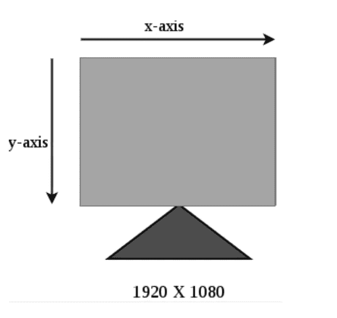
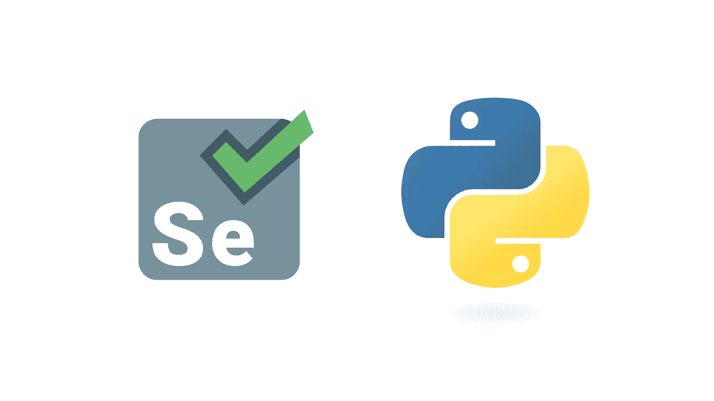

# 自动化工作流程的 4 个基本 Python 技巧

> 原文：<https://betterprogramming.pub/4-basic-python-tips-to-automate-your-workflow-befabe140b83>

## 让它看起来像你在工作，当你不在的时候


[DXL](https://unsplash.com/@davidleveque?utm_source=unsplash&utm_medium=referral&utm_content=creditCopyText) 在 [Unsplash](https://unsplash.com/search/photos/robots?utm_source=unsplash&utm_medium=referral&utm_content=creditCopyText) 上拍照

自动化。它应该可以消除工作。那么，为什么不帮助它呢？

说实话，即使是简单任务的自动化也需要时间和大量的依赖管理，这会变得非常复杂。

然而，将一些简单的任务自动化是非常有益的。即使更多的是为了好玩。

对于那些已经是 [Python](https://www.python.org/) 粉丝的人来说，你知道 Python 对于与任何东西交互是多么友好。从发送 HTTP 请求，与[API](https://medium.com/better-programming/using-python-to-scrape-meet-up-api-38e15f1354f)交互，到[加载和管理数据库](http://www.acheronanalytics.com/acheron-blog/how-to-load-multiple-files-into-your-database-with-python-and-sql)。

Python 是自动化的绝佳选择。

这里有五个简单的事情，你可以自动化，可以帮助你的各种工作流程和项目。

# 1.自动移动鼠标，让您的 Skype/Lynk 显示您在工作中的活跃状态

想象一下，在过去的十分钟里，你一直在浏览你最喜欢的社交媒体应用的新闻提要。突然，您的 [Lynk](https://lynk.global/) 活动符号变成黄色。您不活跃，不在会议中。

你爱管闲事的老板走过来拍了拍你的肩膀。

惊讶之余，你抬头看到他正怒视着你。他有一个坏习惯，就是对你的每一秒钟都进行微观管理。

“嘿，呃，我想让你放松，除了那个模块进展如何，”他问道。你咬紧牙关，礼貌地回答。

“酷，好吧，我只是想确定你正在集中注意力。我们的副总裁贾尼斯非常希望我们能在最后期限前完成任务。”

互动结束。

要是林克没那样叫你就好了。

等等，你可以绕过这个。在谷歌搜索了一会儿之后，你找到了一个移动鼠标的脚本，并开始编写一个每隔几分钟运行一次的任务，以确保你的鼠标在移动。

就 Skype 或 Lynk 而言，鼠标和键盘的这些移动有助于让你看起来像是在积极工作。

自动化运动使用 Python 的 [PyAutoGUI 模块](https://pyautogui.readthedocs.io/)。要安装 PyAutoGUI 模块，请运行以下命令:

```
pip install pyautogui
```

Python 使用屏幕的坐标系来控制和跟踪鼠标。例如，如果您使用 1920x1080 的屏幕分辨率，屏幕的坐标系将如下所示:



PyAutoGUI 模块下提供了以下函数:

*   `size()`:`size()`功能让你知道你的屏幕分辨率。

```
import pyautoguiprint(pyautogui*.size())*
```

运行这个文件(保存为`.py`扩展名)，Python 代码使用`size()`函数给出屏幕分辨率的 x，y 格式作为输出:

*   `moveTo()`:PyAutoGUI 模块中的`moveTo()`功能移动鼠标。下面的代码使用函数，该函数接受 x 和 y 的坐标，以及一个可选的持续时间参数。该函数使用指定的持续时间参数将鼠标指针从当前位置移动到 x 和 y 坐标。

```
import pyautoguiprint(pyautogui.size())pyautogui.moveTo(150,100, duration = 2)
```

运行这个 Python 脚本神奇地将鼠标指针从当前位置移动到坐标(`150, 100`)，用了`2`秒来完成这个过程。

除了这些基本功能之外，您还可以对单击和键入字符串使用函数，如 click 和 type。

所有这些都有助于确保你的老板不会很快发现你偷懒。

# 2.使用 Selenium 自动化网站登录过程



许多网站不赞成使用自动爬虫和程序登录他们的网站。但是，这仍然是一项很好的技能。

Selenium 是一个有用的库，可以被多种语言使用，可以帮助自动化 UI QA，甚至可以通过登录来抓取网站。

虽然学习硒需要一些时间，但是要从小处着手。搭建一个可以登录自己喜欢的网站的工具就可以了。

首先，你必须安装 Chrome 驱动程序和 Python 的 Selenium 库。使用下面的命令添加 Selenium 库。：

```
pip install Selenium
```

首先，我们需要从 Python 的 Selenium 库中导入一些选定的模块。添加下面的命令:

```
From selenium import webdriverdriver = webdriver.Chrome()
```

现在，为了自动化登录过程，我们从一个简单的任务开始，比如网站的登录表单。

这项任务需要:

*   导航到网站。
*   查找登录字段(通常是用户名和密码)。
*   填写您的登录信息。
*   提交登录详细信息，让您自动通过登录屏幕。

**提示:**您可能决定定义一个“方法”(用于频繁登录)来支持在其他测试中的重用。

代码行将类似于:

您会注意到，您需要获得想要与之交互的元素。这可以说是创建 web 抓取器或登录网站的自动化脚本最困难的部分之一。

有几种方法可以检测 web 应用程序的元素以找到登录字段。

查找元素的常见方法包括 ID(如上例)、CSS 选择器、名称和 XPaths。

在 Selenium 的官方文档[中可以找到定位登录流程元素的不同方法。一些网站包含更多动态内容(比如几个 JavaScript！).](http://selenium-python.readthedocs.io/locating-elements.html)

总的来说，看着 Selenium 自动点击按钮并登录你最喜欢的网站是令人着迷的。没有你的参与，事情就开始运转。

几乎像魔术一样！

# 3.自动文件备份

如果您执行定期备份，创建自动备份文件会非常有用。

您可能熟悉 ZIP 文件(带有。zip 扩展名)。ZIP 文件可以包含几个带有压缩内容的文件。此外，由于 ZIP 文件还可以包含许多文件夹和子文件夹，因此通过将它们打包成一个文件来备份文件是一种便捷的方式。

可以使用 [zipfile 模块](https://docs.python.org/3/library/zipfile.html)中的 Python 函数自动创建一个单独的 ZIP 文件，称为归档文件。

您还可以使用 Python 打开(或提取)ZIP 文件。脚本分享如下。

这个脚本摘自《T4》一书《用 Python 自动化枯燥的东西》(如果你想要更多的想法)。

# 4.自动将 YouTube 视频发布到 Reddit 线程

我们最近看到并想到的另一个一次性想法是[一种有趣的](https://jimblackler.net/blog/?p=402)自动化您可能经常做的任务的方式，即使用一个脚本将多个视频发布到 Reddit。

在 Reddit 线程中发布 YouTube 视频也可以实现自动化。使用 [PRAW](https://praw.readthedocs.io/en/latest/getting_started/installation.html) ，一个让你抓取数据的 Python 包装器，可以为你的 Reddit 体验提供更多。

首先，[使用](https://praw.readthedocs.io/en/latest/getting_started/installation.html) [pip](https://pypi.org/project/pip/) 安装 PRAW 。

下面的脚本自动将 YouTube 视频发布到 Reddit 线程。

# 结论

自动化任务会很有趣。看着你的程序自动登录到你最喜欢的网站，或者[把几百个文件加载到一个数据库](https://www.theseattledataguy.com/automating-file-loading-into-sql-server-with-python-and-sql/)，会让你觉得好像重新设计了轮子。

而且，有很多很棒的库可以帮助您轻松地自动化任务。 [Excel](https://office.live.com/start/Excel.aspx) 报告、电子邮件和其他任务可以简化为几行代码。

只要是可维护的！