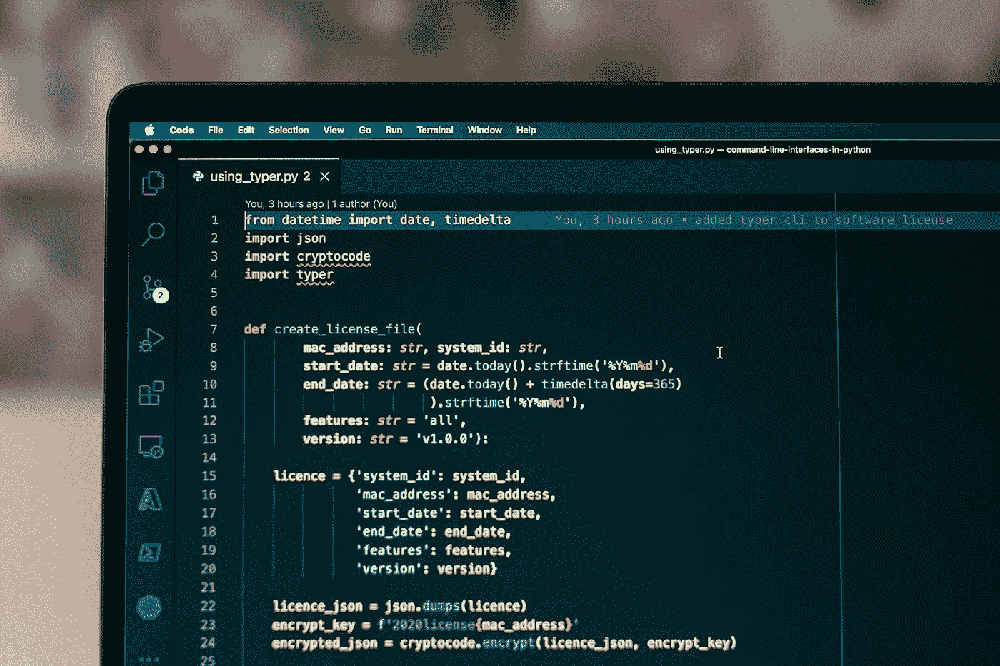
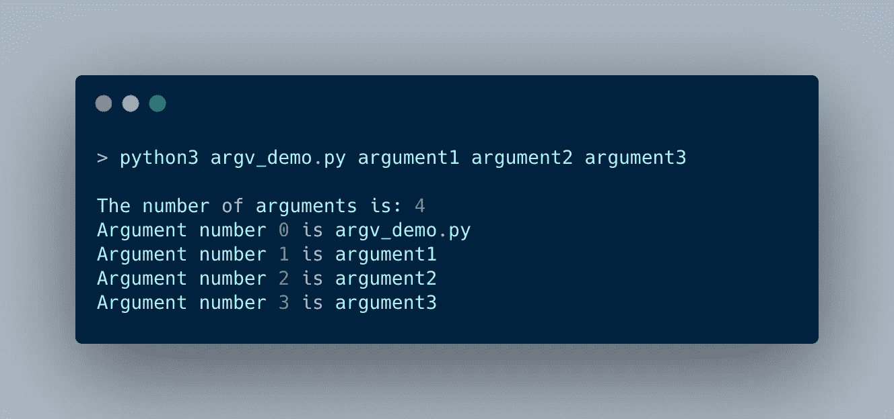
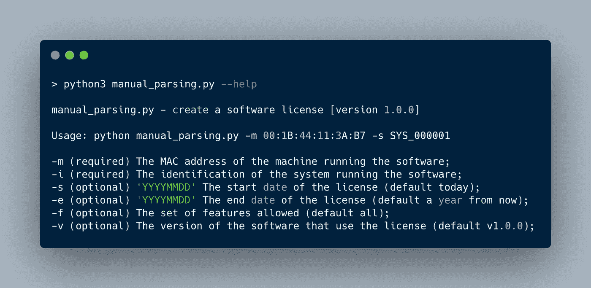
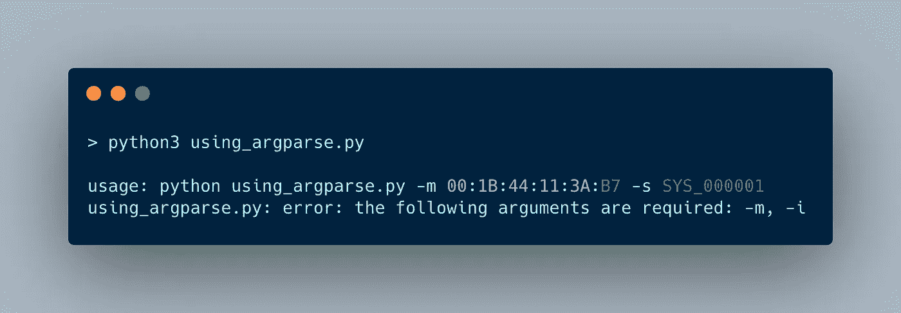
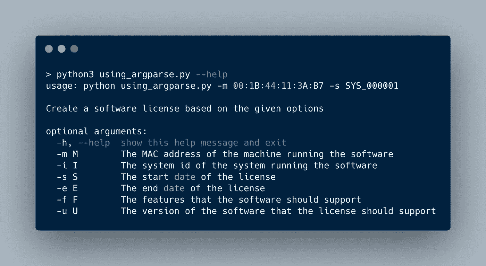
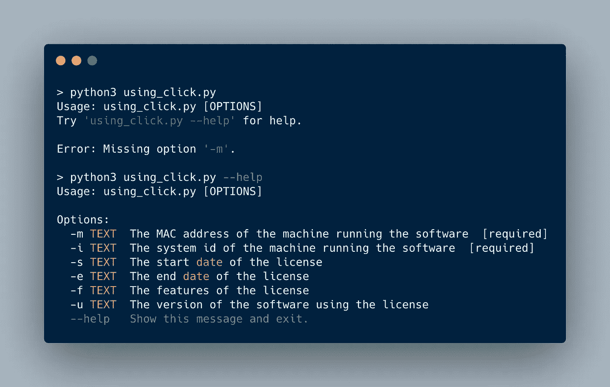
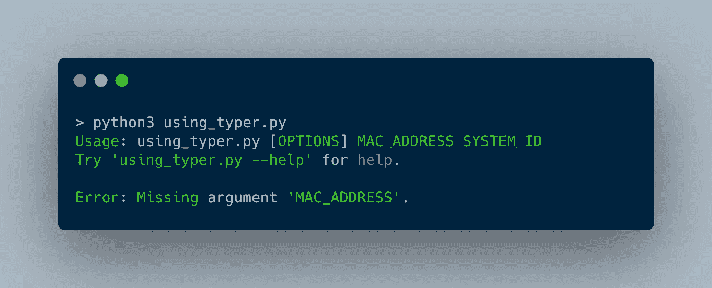
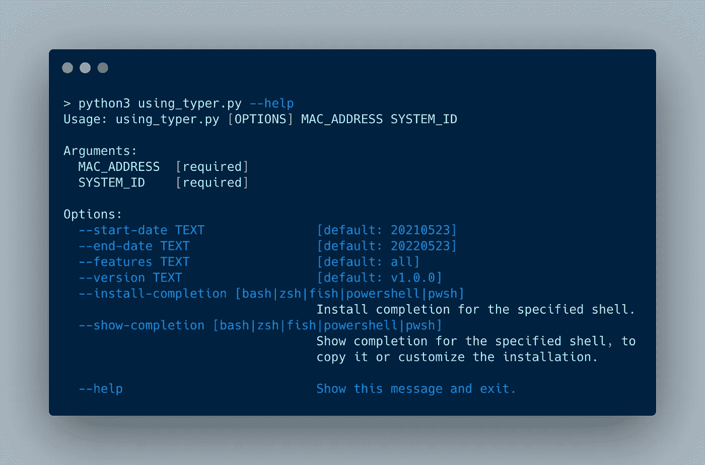

# 用 Python 创建命令行界面的 4 个最佳实践

> 原文：<https://betterprogramming.pub/4-best-practices-to-create-command-line-interfaces-in-python-5043fbb7c52b>

## 展示如何用 Python 实现命令行接口的真实例子

使用 VSCode 为您的 Python 脚本创建命令行界面

如果你像我一样，你可能有很多 Python 脚本来自动完成无聊的任务。我的大多数脚本使用硬编码的路径和选项。如果我需要它们，我会在代码编辑器中打开它们，并进行必要的修改。

但是，有更好的办法。通过投入更多的时间来参数化这些脚本，您可以重用它们，而不必每次都修改它们。

我们将通过添加命令行界面来参数化这些脚本。

我们将讨论并构建以下四个选项:

1.  手动解析和处理命令行参数
2.  使用内部 Python 库 argparse
3.  使用外部 Python 库 Click
4.  使用 Typer，另一个外部 Python 库

你可以在 Github 库中找到这些解决方案的源文件。

# 脚本，生成软件许可证

我们将使它变得更有趣，而不是使用另一个 hello world 演示。我们将使用一个真实的例子。我们将创建一个脚本，您可以使用它来创建软件许可证。

您可以使用软件许可证来保护软件的使用或再分发。软件许可证可以采取多种形式。我们将使用一个文件，您必须在使用它的软件旁边分发该文件。

有两部分。首先，是生成软件许可证的应用程序。其次，应用程序只有在能够访问软件许可证的情况下才能运行。

在本文中，我们将讨论第一部分:生成包含软件许可证的文件的 Python 脚本。

该程序需要以下信息来生成软件许可证。

*   MAC 地址—运行程序的机器的 MAC 地址
*   开始日期—许可证开始生效的日期
*   结束日期—许可证有效的截止日期
*   功能—客户可以使用的功能列表
*   版本—使用此许可证的应用程序的版本
*   系统 Id —系统的标识

许可证文件以加密方式存储这些信息。加密密钥是 MAC 地址和固定密码的组合。

当应用程序启动时，它获取系统的 MAC 地址并解密许可证。然后，它验证信息，如开始和结束日期。

## 脚本的实现

该脚本的第一个实现没有命令行界面。如果你想创建一个许可证，改变参数`create_license_file`并运行脚本。

该脚本在第 7 行创建了一个包含必要信息的字典。然后我们把这本字典翻译成 JSON。

应用程序使用由 MAC 地址和固定令牌组成的加密密钥对 JSON 进行加密。最后，我们将加密字符串写入许可证文件:

用于生成软件许可证的 Python 脚本

# 手动解析和处理命令行参数

我们将要构建的第一个命令行界面不会使用任何外部模块；我们将自己进行解析和验证。

在我们开始之前，我们首先要谈一谈`sys.argv`。这个全局变量包含传递给 Python 脚本的命令行参数列表。索引 0 处的第一项`sys.argv[0]`，包含您的脚本的名称。

我们来看一个小例子。我们像 Python 中的其他列表一样遍历`sys.argv`,并打印每一项。

展示 sys.argv 的小演示

当我们运行这个程序时，我们得到以下结果。你看到`sys.argv`中的第一项是脚本本身的名字。以下是传递的参数。

显示 sys.argv 的内容

需要记住的一点是`sys.argv`是全球性的。一个好的做法是在更改它之前制作一个副本。

## 命令行界面的结构

在开始解析和验证命令行参数之前，我们必须考虑结构。我们需要什么参数，如何给它们命名？我们将使用最佳实践，而不是提出我们自己的版本。

我们将使用[命令行界面指南](https://clig.dev/)中描述的结构。这是一个帮助编写更好的命令行程序的开源指南。

指南中描述的一些准则。

## 基本准则

您的脚本应该在成功时返回一个零退出代码。如果失败，它应该返回一个非零退出代码。

您应该将所有主要输出发送到`stdout`。日志消息和错误应发送到`stderr`。

## 显示帮助

CLI 指导方针声明的另一件事是，当没有传递选项或使用了`-h`或`--help`标志时，您的程序应该显示帮助文本。

使用-h 或-help 时显示帮助

## 解析命令行参数并遵守准则

现在是时候实现解析参数并应用指导方针了。

下面你可以看到接受`sys.argv`并返回 LicenseInformation 类的方法。该类的成员拥有程序存储在许可证文件中的所有信息。

如果不提供任何参数，该函数将打印帮助字符串，并以退出代码 0 退出程序。

如果有争论，我们用`collection.deque`。Deque 是一个双端队列。双端意味着您可以从队列的任意一端弹出项目。在我们的例子中，我们想从左边开始，所以我们使用`popleft`。代码如下:

使用 collections.deque 解析命令行参数

我们使用`parse`返回的类来创建实际的许可证文件。

使用 LicenseInformation 类创建许可证文件

只有系统 id 和 MAC 地址是必需的。其他参数将获得默认值。默认值被添加到`LicenseInformation`类的构造函数中。代码如下:

保存可选参数默认值的 LicenseInformation 类

## 确认

直到现在，我们还没有验证给定的论点。例如，我们可以验证用户是否提供了两个必需的参数——系统 id 和 MAC 地址。我们还可以确保 MAC 地址的格式正确。

此外，我们可以确保开始和结束日期的格式正确，并且结束日期在开始日期之后。

我不会添加这些验证，因为如您所见，源代码的数量会迅速增加。添加验证会使代码更加复杂。

我们将把验证留到下一个例子中，在那里我们将使用 Python 模块。这让生活变得容易多了。

# 使用内部 Python 库 argparse

Python 在 3.2 版中引入了`argparse`模块。这是一个内部模块，可以轻松编写用户友好的命令行界面。

要使用它，您必须执行以下步骤:

1.  导入 Python `argparse`库
2.  创建解析器
3.  向解析器添加可选参数和位置参数
4.  执行`.parse_args()`

让我们看看如何使用`argparse`为软件许可程序创建命令行界面。

首先，我们创建一个`argparse.ArgumentParser`的实例，给出用法和描述。然后，我们通过调用解析器上的`add_argument`逐个添加所有参数。我们告诉它参数的类型，以及是否需要。代码如下:

创建 ArgumentParser 来解析软件许可证的选项

`parse_args`返回的对象可用于获取解析后的参数值。我们将这个`args`对象传递给`create_license`函数。然后，我们通过指定像`args.m`这样的字段来获得各个参数。

使用 args 对象创建许可证文件

现在，当我们在没有参数的情况下运行程序时，我们会得到下面的输出。它显示用法信息，并显示一条错误消息，指出没有给出所有必需的参数。

当没有参数时，argparse 显示所需的参数

—帮助显示应用程序的用法和帮助

这是对我们手工解析器的一个很大的改进。这个程序更容易扩展和修改。它使用您给`add_argument`的参数来自动执行验证

# 使用外部 Python 库 Click

虽然`argparse`是一个内部库，但是 [Click](https://click.palletsprojects.com/en/8.0.x/) 是一个 Python 包，你必须使用`pip`来安装。这是使用外部库的缺点之一。

Click 是一个包，它可以帮助您用尽可能少的代码创建漂亮的命令行界面。这是[命令行界面指南](https://clig.dev/)推荐用于 Python 的包之一。

Click 使用 decorators 来定义命令和参数。因此，我们更改了`create_license_file`，并在函数中添加了装饰器。

我们将`required=True`添加到 MAC 地址和系统 Id 中，以确保这些参数是必需的。代码如下:

向 create_license_file 函数添加 click decorators

当我们在没有任何参数或`--help`的情况下执行脚本时，我们会得到下面的结果。单击报告缺少的参数，并在询问时显示帮助控制台。

使用 Click 实现时运行脚本

如果我们将点击实现的代码行数(34 行)与手动实现的代码行数(90 行)进行比较，我们会发现我们将其减少了一半——这是一个相当大的改进。

# 使用外部 Python 库 Typer

命令行界面指南推荐用于 Python 的另一个外部库是 [Typer](https://typer.tiangolo.com/) 。有趣的是 Typer 是建立在点击之上的。

下面你会看到一个简单的例子。Click 和 Typer 的区别在于 Typer 使用类型提示。所以，你必须添加参数的类型。您可以在第 3 行看到`name`参数的`str`类型:

一个使用 Typer 的小例子

## 使用 Typer 转换软件许可证脚本

下面是使用 Typer 创建软件许可证的完整脚本。我更改了`create_license_file`的参数名，使它们更具描述性。Typer 在命令行中使用这些名称作为参数。代码如下:

使用 Typer 的完整实现

现在，这是您使用 Typer 创建命令行界面唯一需要更改的内容。如果我们不带任何参数运行脚本，我们会得到以下结果。

运行使用不带参数的 Typer 创建的软件许可脚本

如果没有为参数提供默认值，Typer 会认为它们是必需的。命令行上不需要任何选项。Typer 假设第一个参数是 MAC 地址，第二个参数是系统 id。

当我们使用`--help`时，Typer 也会生成一个漂亮的用法/帮助界面，如下图所示。

帮助屏幕，键入为软件许可证脚本生成的内容

# 结论

本文向您展示了如何将用于自动化枯燥任务的脚本转换成具有成熟且用户友好的命令行界面的优秀的全功能程序。

如果你不想给你的脚本添加一个外部依赖，你应该使用`argparse`。这个内部 Python 库使得向脚本添加命令行界面变得很容易。

如果你不介意有一个外部依赖，那么[点击](https://click.palletsprojects.com/en/8.0.x/)包是一个很好的选择。通过向函数中添加装饰器，可以快速地向脚本中添加用户友好的命令行界面。

我们最后展示了[打字机](https://typer.tiangolo.com/)。Typer 也是一个外部库。它基于点击，使用打字来创建命令行界面，甚至更容易。

你可以在 Github 库中找到这些例子的源代码。

感谢您的阅读。