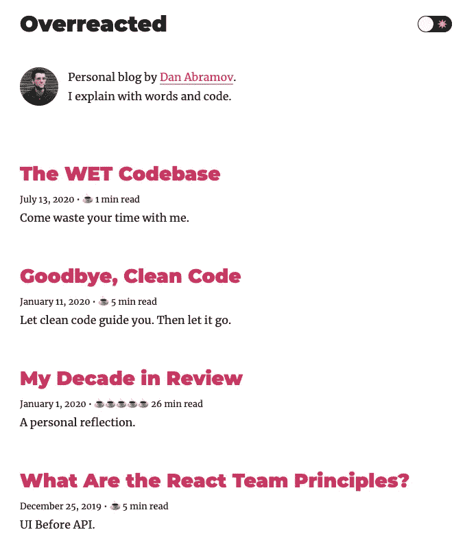
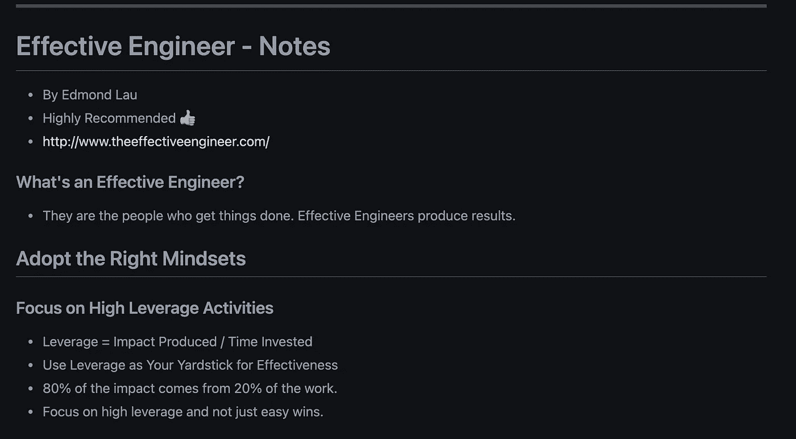

# 每个开发人员或工程师都应该阅读的 4 篇博客和文章

> 原文：<https://betterprogramming.pub/4-blogs-and-articles-every-developer-or-engineer-should-read-603c6319a7ee>

## 每个开发人员都应该阅读的有用文章

Nubelson Fernandes 在 [Unsplash](https://unsplash.com?utm_source=medium&utm_medium=referral) 上拍摄的照片。

本周，我们将讨论一些每个开发人员都应该阅读的有用文章和博客。

# 1.最佳开发者语录

开发人员的工作很艰难。它并不总是迷人的。

并不是每个开发者都像电影《T4》中的马克·扎克伯格那样是天生的天才，他能在一夜之间编写出应用程序。

开发人员日复一日地处理复杂的问题。有时候，你会在一个问题上坚持几天，感觉没有动力。你经常问自己:“我够好吗？”

当你对编程感到没有动力或厌烦时，我推荐阅读 [Dhiraj](https://twitter.com/only2dhir) 写的[这篇文章](https://www.devglan.com/blog/best-developer-quotes)。

# 2.反应过度

如果你进入了 web 开发领域，那么你应该看看丹·阿布拉莫夫的《反应过度的 T10》。

Dan 主要写 React 和 JavaScript。我真的很喜欢他的博客帖子，因为它们在开发人员的日常工作中非常实用和有用。

来源:[反应过度](https://overreacted.io/)

# 3.高效工程师

查看[这个 GitHub 页面](https://gist.github.com/rondy/af1dee1d28c02e9a225ae55da2674a6f)发布了 [Edmond Lau 的书*The Effective Engineer*](http://www.effectiveengineer.com/)的内容。

这里有一些给工程师的很好的建议，还有一些必备的品质，你应该努力争取，以便在工作中更有效率。

我总是每隔几周就回到这个页面，提醒自己作为一名工程师，我应该关注什么，我需要改进什么。

什么是有效的工程师？

> “他们是把事情做好的人。有效的工程师会产生结果。”——有效的工程师 Edmond Lau

[生效 _ 工程师. md](https://gist.github.com/rondy/af1dee1d28c02e9a225ae55da2674a6f)

# 4.实用工程师的开发人员文化测试

如果你是工程主管或管理一个工程师团队，并希望在你的公司有一个强大的工程文化，那么你应该读一下 [Gergely Orosz](https://blog.pragmaticengineer.com/) 的这篇[文章](https://blog.pragmaticengineer.com/the-developer-culture-test/)。

在这篇文章中，Gergely 提供了一个非常简单的文化测试，它集中在三个关键领域，每个领域有五个问题。

感谢阅读！