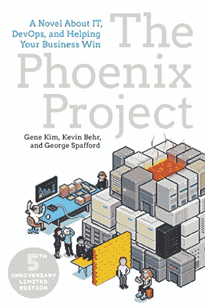
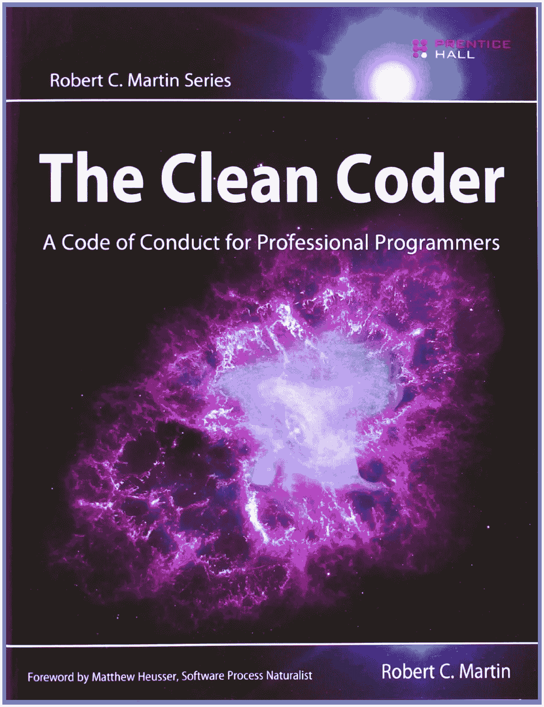
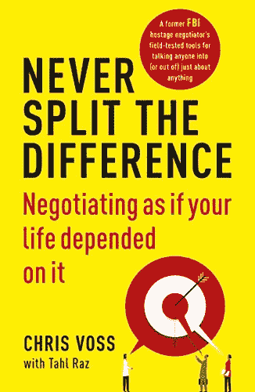

# 从事技术工作的每个人都应该读的 4 本书，为什么

> 原文：<https://betterprogramming.pub/4-books-every-it-professional-should-read-and-why-b50628175372>

## 帮助我成为职业程序员的读物

劳伦·格雷在 [Unsplash](https://unsplash.com?utm_source=medium&utm_medium=referral) 上的照片

跨越过去的一年，我重新发现了久违的读书乐趣。作为一名软件开发人员，过去五年的大部分时间我都在电脑上学习，忘记了翻阅一本写得很好的书的感觉。

由于去年我遇到的一些聪明人的建议，我回到了旧的纸质书上，不仅作为一名软件工程师，而且作为现实世界中的专业人士，我都得到了成长。

相对于其他技术书籍，我阅读这些书籍是为了提高我的编码技能，最有助于我开阔思路的是这四本书——一本比其他的更具技术性，但都对读者的思维模式有很大的影响。我希望有一天你会读到它们；他们对我帮助很大。

# 重构

马丁·福勒

**[**重构**](https://martinfowler.com/books/refactoring.html)**绝对是每一个开发者绝对应该阅读的佳作。当另一位开发人员向我推荐这本书时，我认为从一个新的角度来看待我通常应用的一些模式会很有趣，但是我从来没有想到这本书的内容对我现在的编码方法有如此大的意义。****

****基本上，Fowler 希望深入解释我们的代码在处理许多依赖项、数据结构和语言限制时如何迅速变得混乱，从而提供很好的解决方案，将代码转换成可读性更好的版本。****

****这本书更像是一个重构的目录，当你认为你的代码可以得到更好、更坚实的形状时，你可以参考它。这是…的表格。对整本书所涉及的主题有所了解的内容:****

*   ****真实世界的重构示例****
*   ****重构的原则以及为什么我们应该这样做****
*   ****代码中有异味****
*   ****测试的重要性以及如何构建测试****
*   ****第一组重构(提取函数、封装变量、引入参数对象等等)****
*   ****重构封装****
*   ****四处移动特征****
*   ****组织数据****
*   ****简化条件逻辑****
*   ****重构 API****
*   ****重构继承****

# ****凤凰计划****

********

****吉恩·金，凯文·贝尔，乔治·斯帕福德。****

****不止一个人向我推荐这本书，但在开始时，我并没有真正被一本小说吸引，尤其是当我的主要精力放在提高我的编码技能上时。我错得多离谱。****

****凤凰计划 让我对大公司应该如何运作有了更好的了解，但它也帮助我改变了自己的观点，让团队从我们编写的代码中获得成功。****

****如果你决定去做，你将不会仅仅看到管理相互依赖的庞大团队有多困难；你还将学习如何用 [**三种方式**](https://itrevolution.com/the-three-ways-principles-underpinning-devops/) 的理念最大化你公司的工作流程。****

****读者不仅会学到如何改进他们自己的 IT 组织，他们再也不会以同样的方式看待它。****

# ****干净的编码器****

********

****罗伯特·马丁****

****在阅读了他的书《 [**干净的代码**](https://www.oreilly.com/library/view/clean-code/9780136083238/) **》之后，我被鲍勃叔叔(罗伯特·c·马丁的昵称)在他的下一本书《干净的编码者** 中提到的观点所吸引。****

****没有人向我推荐这本书，但我的好奇心让我试了一下，这很值得！****

****在这本书里，我发现了一个专业开发人员应该如何表现的很好的描述。它涉及了影响每个开发人员日常工作的许多领域，从*职业精神的定义*到给出如何从项目工作中获得一致结果的有用建议。****

****我绝对推荐它，以获得更大的视野，并了解一些关于如何在职业生涯中专业成长的有用指南。以下是主题列表，用于快速查看内容:****

*   ****什么是职业精神？****
*   ****何时以及如何说是/否****
*   ****接近编码时间****
*   *******TDD*。它是什么，不是什么******
*   ****验收测试和测试策略****
*   ****实践和时间管理****
*   ****准确的任务评估****
*   ****如何应对压力****
*   ****项目协作/团队合作****
*   ****指导、学徒和工艺****

# ****永远不要分割差异****

********

****克里斯·沃斯****

****最后但同样重要的是， [**永不分裂的区别**](https://info.blackswanltd.com/never-split-the-difference) 一直是我的一个启示。它与 It 专业人员如何工作或任何技术主题没有密切关系，但它教会了我如何处理妥协和需要改进才能获得成功结果的情况。****

****这是作者在作为前联邦调查局特工的职业生涯中的一系列真实经历——这些经历帮助他学会了如何在任何可能的情况下谈判并从中获得最大收益。****

****阅读这本书，你不仅会学到如何使用正确的语言技巧恰当地说话，还会深刻理解如何运用一些原则来缓解生活中的问题。****

****即使它与我的能力范围相去甚远，但它绝对是我最喜欢的一本书，我很乐意将它推荐给任何对提高你的沟通技巧感兴趣的人。****

# ****最后一提****

****还有 Kyle Simpson 的作品集*You not Know JS*，我发现这是对 JavaScript 社区和任何有兴趣深入研究 JavaScript 语言的 JavaScript 开发人员的惊人贡献。****

# ****包扎****

****我在这里列出的所有书籍都帮助我在 IT 的不同领域成长。如果你知道任何其他对你有启发的书，请在评论中分享——我很乐意将它们添加到我的阅读清单中！****