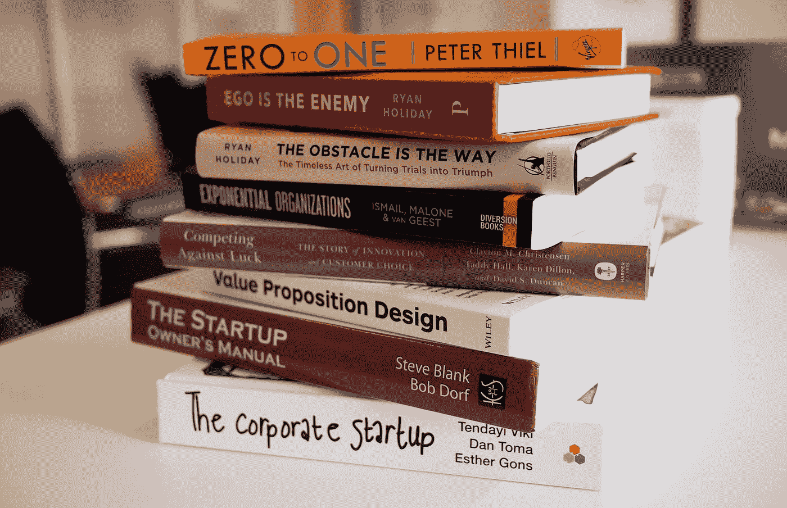
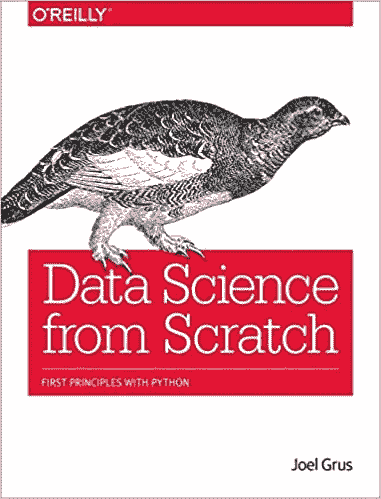
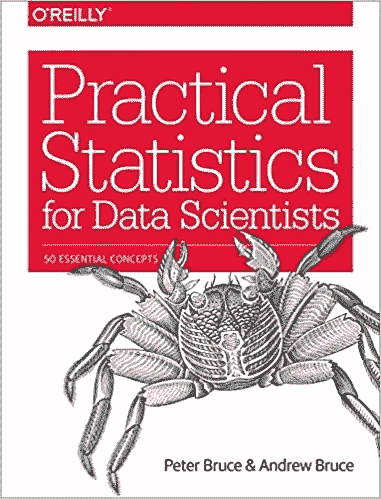
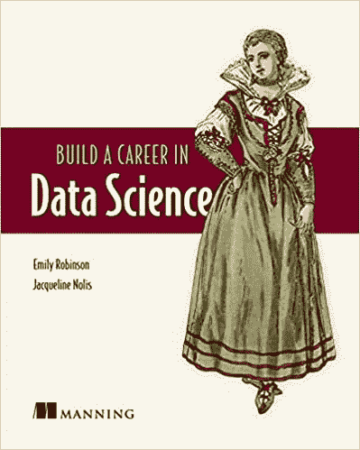
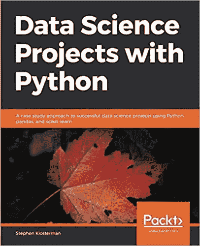

# 作为一名自学成才的数据科学家，我读了 4 本书

> 原文：<https://betterprogramming.pub/4-books-i-read-as-a-self-taught-data-scientist-380d13d8bb0c>

## 涵盖成为数据科学家所需的大部分内容的书籍

Daria Nepriakhina 在 [Unsplash](https://unsplash.com?utm_source=medium&utm_medium=referral) 上拍摄的照片

数据科学是过去几年中许多人一直在谈论的一个领域。数据科学家甚至被称为“21 世纪最性感的工作”，然而，有许多灰色区域使有抱负的数据科学家不确定他们需要学习什么才能成为数据科学家。

这就是为什么我列出了我进入数据科学时读过的书的清单。如果您已经涉足数据科学，并且希望从头开始学习，我建议您阅读它们。此外，这些书对于那些以前有一些编程语言、统计或数学知识，并且想知道如何在数据科学领域使用这些知识的人来说非常有用。

*免责声明:本文中列出的任何书籍都没有附属链接。确保你总是得到下面列出的任何一本书的最新版本(一些像“数据科学家实用统计学”这样的书在最新版本中包含了 Python 代码)。*

# Joel Grus 的《从零开始的数据科学:Python 的基本原则》

来自[亚马逊](https://www.amazon.com/Joel-Grus/dp/149190142X)的图书封面图片

这本书旨在帮助你发展开始从事数据科学所必需的黑客技术。读完这本书后，你会对作为数据科学核心的数学和统计学感到满意。虽然这本书有一章叫做“Python 速成课”，但这本书的目标不是从头开始教你 Python，所以，如果你从未用 Python 写过代码，你应该用我推荐的 Python 书籍中的[来补充这本书。](/4-python-books-i-read-as-a-self-taught-programmer-5a5453840cdb)

这本书包含了每个数据科学家在统计(概率、假设和推理)、线性代数(向量和矩阵)和机器学习(机器学习模型背后的理论和概念)领域应该熟悉的主题。

请记住，这本书主要是对前面提到的主题进行概述；然而，要成为一名优秀的数据科学家，你应该对这些主题有更多的了解，所以在读完这本书之后，考虑阅读下面列出的书籍，排名不分先后。

# 彼得·布鲁斯和安德鲁·布鲁斯的《数据科学家实用统计学:50 个基本概念》

来自亚马逊[的图书封面图片](https://www.amazon.com/Peter-Bruce/dp/1491952962)

这本书非常适合那些对 R 或 Python 编程语言有所了解，并且之前接触过统计学的人。通过阅读这本书，您将了解从数据科学的角度来看哪些概念是重要和有用的。

我会把《数据科学家实用统计学:50 个基本概念》描述为一本初学者友好的书，而不是一本有深度的书。在大多数章节中，你可以期待一个你应该知道的数据科学的统计概念的演练，比如 p 值、假设检验、t 检验、回归、抽样技术，以及更多用 Python 和 r 编写的代码片段。

对于想学习数据科学统计学的程序员来说，这绝对是一本必读的书。

# Emily Robinson 和 Jacqueline Nolis 的“在数据科学领域开创职业生涯”

图书图片来自[亚马逊](https://www.amazon.com/Emily-Robinson/dp/1617296244)

与本文列出的所有书籍不同，《在数据科学领域建立职业生涯*》*主要致力于帮助你进入数据科学领域，并在其中发展职业生涯。

这本书非常适合尚未进入数据科学领域并希望学习成为数据科学家所需技能的有抱负的数据科学家，以及处于该角色第一年并希望变得更高级的人。

这本书分成四部分。第一部分是数据科学概述，作者描述了数据科学家的角色以及成为数据科学家所需的技能。第二部分旨在帮助您找到您的数据科学工作，而第三部分和第四部分分别带您度过工作的头几个月以及如何在您的数据科学职业生涯中成长。

# “使用 Python 的数据科学项目:使用 Python、pandas 和 scikit-learn 的成功数据科学项目的案例研究方法”,作者 Stephen Klosterman

图书图片来自[亚马逊](https://www.amazon.com/Stephen-Klosterman/dp/1838551026)

这本书将帮助你开发数据科学所需的编程技能，将一个端到端的项目分解成实际的练习。每个练习对应于数据科学项目中遵循的步骤，这些步骤将帮助您学习 Python 库，如 Pandas、Matplotlib 和 scikit-使用真实数据学习。

通过阅读这本书，你将学会用 Python 完成数据科学项目的基本步骤，例如数据清理、数据探索、模型构建和评估。此外，这本书不仅会展示制造机器学习算法的代码，还会解释算法如何工作和进行预测。

阅读这本书的一些必要条件是用 Python 或另一种类似的语言编程的基本经验和统计学。

# 奖金:Aurélien Géron 的“用 Scikit-Learn、Keras 和 TensorFlow 进行机器实践学习”

前面列出的书籍只会给你温和地介绍像机器学习这样的高级数据科学主题；然而，如果你想阅读一本关于机器学习的深入书籍，你应该考虑阅读“用 Scikit-Learn，Keras & TensorFlow 进行机器学习实践”

顾名思义，这本书专注于数据科学家使用的三个机器学习库，所以你应该对大学水平的数学(微积分、线性代数、概率和统计)有一个合理的了解。此外，在阅读这本书之前，请确保您熟悉 Python 的主要科学库(NumPy、Pandas 和 Matplotlib)。

我现在正在读这本书，我建议你只有在具备扎实的 Python、统计学和数学知识的情况下才读这本书。

*就是这样！我希望这些书像帮助我一样帮助你学习数据科学。下面你可以找到一些我做的关于数据科学中使用的库的指南(Matplotlib/Seaborn，Pandas 和 Scikit-Learn)。*

*   【Excel 用户熊猫指南
*   [如何用 Matplotlib 和 Seaborn 制作漂亮的可视化效果](https://towardsdatascience.com/a-simple-guide-to-beautiful-visualizations-in-python-f564e6b9d392)
*   [Scikit-Learn 的简单指南——用 Python 构建你的第一个机器学习模型](https://towardsdatascience.com/a-beginners-guide-to-text-classification-with-scikit-learn-632357e16f3a)

[**与 3k 以上的人一起加入我的电子邮件列表，获取我在所有教程中使用的 Python for Data Science 备忘单(免费 PDF)**](https://frankandrade.ck.page/bd063ff2d3)