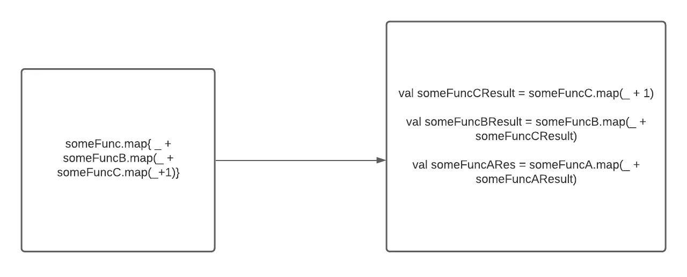

# Scala 函数式编程的 4 条简洁代码原则

> 原文：<https://betterprogramming.pub/4-clean-code-principles-for-functional-programming-in-scala-6764f8b2a213>

## 隔离您的 I/O，避免过度嵌套，等等

由[斯潘塞·埃弗雷特](https://unsplash.com/@sp3v?utm_source=medium&utm_medium=referral)在 [Unsplash](https://unsplash.com?utm_source=medium&utm_medium=referral) 上拍摄的照片。

在编写命令式代码时，有许多原则和设计模式。例如，有四本书提到了编写维护良好的面向对象代码的 23 种不同方法。您一定听说过 SOLID principles、DRY principles 和许多其他关于编写干净代码的原则的缩写。

然而，在编写功能性代码时，一些命令性代码原则可能不适用。

不要误会，SOLID 和其他设计模式原则对于构造可读代码非常有用。然而，软件工程师可以采用特定于函数式编程的规则来编写可读代码——尤其是在围绕纯函数创建代码时。由于可用编程促进了不变性和纯函数，您考虑构建代码的方式不同于编写命令式代码。

作者照片。

在面向对象编程中有一个策略模式，因为你没有办法创建一个 lambda 函数。我将提取经典的`shape`类，其中每个形状都将打印该形状的名称:

如果有更高阶的函数，可以创建一个 lambda 函数将其传递给`SomeClass`。上面的策略模式可以浓缩成几行代码:

在本文中，我想分享编写可读代码的四个一般原则，您可以在编写函数时应用这些原则。

*免责声明:这些都不是硬性规定，如果你有任何其他模式可以帮助你写出可读性更好的代码，请在下面的评论区分享吧！*

有吻干原则，这是从命令性代码到功能性代码的合理原则。我不会在这里提及它们，因为它们已经被广泛涉及。

# 1.不要过度筑巢

我自己也有这个问题。因为函数代码中没有状态，所以大部分代码都是一系列的表达式。拥有多个嵌套表达式似乎是正确的。当你处于心流状态时，写作会更容易。

关于过度嵌套的另一件事是，我们倾向于将事情一般化以使它们可重用(DRY 原则)，但这样会损害代码的可读性。当你回去读它的时候，你经常会对你的代码中发生的事情感到困惑。

看一下这段代码:

在这种情况下，我们可以用名字清晰的更小的函数来重构它:

虽然你不知道这个功能是做什么的，但至少它对眼睛来说更容易。

有时，函数式编程将代码分解成一行。其中一个原因是，这是最基本的操作原语，不能用其他操作符来实现。试着将函数分解成多个更小的函数——你会发现你的代码更容易组合。

# 2.不要去掉中间变量

当人们想到函数式编程或 Scala 时，一个常见的抱怨是人们喜欢一行程序。由于每个表达式返回一个值，我们可以将它们链接在一起来编写函数。尽管我们需要输入更多的击键，但当你的代码没有任何错误时，你可能会感谢我。

Scala 中有多种通用操作可以帮助你在[一行](https://gist.github.com/mkaz/d11f8f08719d6d27bab5)中编写代码。就拿上面的例子来说吧。在`incrementByOneAndMultipleByTwoWith(x:Int)`里面，我不去掉中间值。它看起来会像这样:

但是，具有中间值可以帮助您理解代码，并使调试代码库更快。

# 3.如果有对应的标准库，就不要使用模式匹配

模式匹配很酷的原因之一是你可以用它做任何事情。如果我想得到一个选项的值，我可以通过模式匹配来得到这个选项的值。如果我想反转一个整数数组，我可以做模式匹配来改变一个整数数组。

然而，它的优点也是它的缺点。因为它太普通了，你通过重新发明现有的代码来打破枯燥的原则。您可以使用`getOrElse`，而不是使用模式匹配来获取选项 monad 中的值，这具有相同的目的。不用使用模式匹配来反转整数数组，你可以只使用标准库`reverse`。

记住，不是所有的规则都是硬性规则。使用模式匹配时也有例外。如果你想应用的操作不在标准库中，你需要使用它。如果你在你的函数上做些尝试，并且模式匹配更容易理解，你应该选择模式匹配。

# 4.隔离您的 I/O

编写函数代码并不意味着你所有的函数都必须是纯函数。功能性编写就是知道如何将 I/O 推到边界的尽头。我们想把不纯的调用隔离在一个地方。

一些函数式编程语言，如 Haskell，是在语言本身中实现的。然而，当它不是强制的时候，试着把所有的 I/O 调用放在你的程序边界的末端或者一个小盒子里，这样可以帮助你的代码更容易维护。然后，您可以突然快速地对代码进行单元测试，因为这些函数是纯函数。

让我们举一个例子:

我们可以通过分离 I/O 并返回一个`String`来进一步将 I/O 的边界推到边缘:

那么我们可以这样称呼它:

在上面的例子中，我们可以快速测试`contest`函数，因为`contest`变成了一个纯函数。

# 结论

就是这样！我希望您在编写可读的功能性代码方面得到了一些指导。请记住，这些原则更像是指导方针，而不是规则。

如果你知道任何隐藏的模式或者创建更多模块化代码的方法，请在下面评论让全世界都知道！

*最初发表于***。**