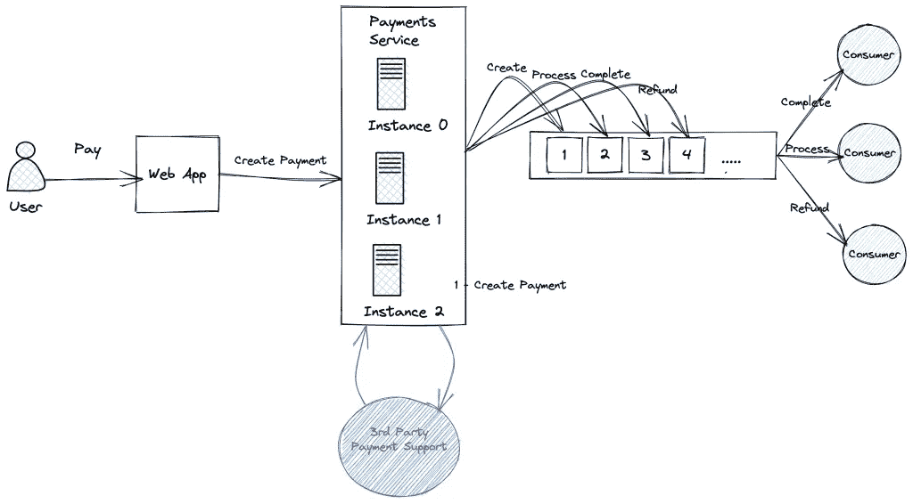
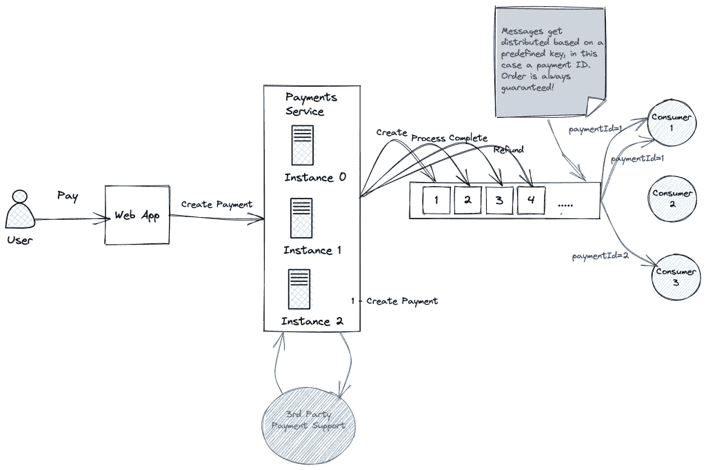
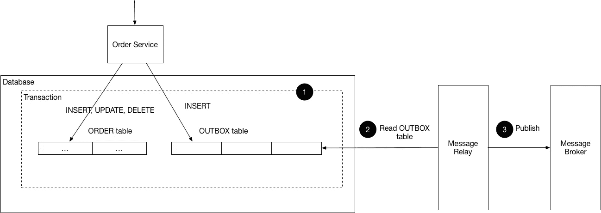
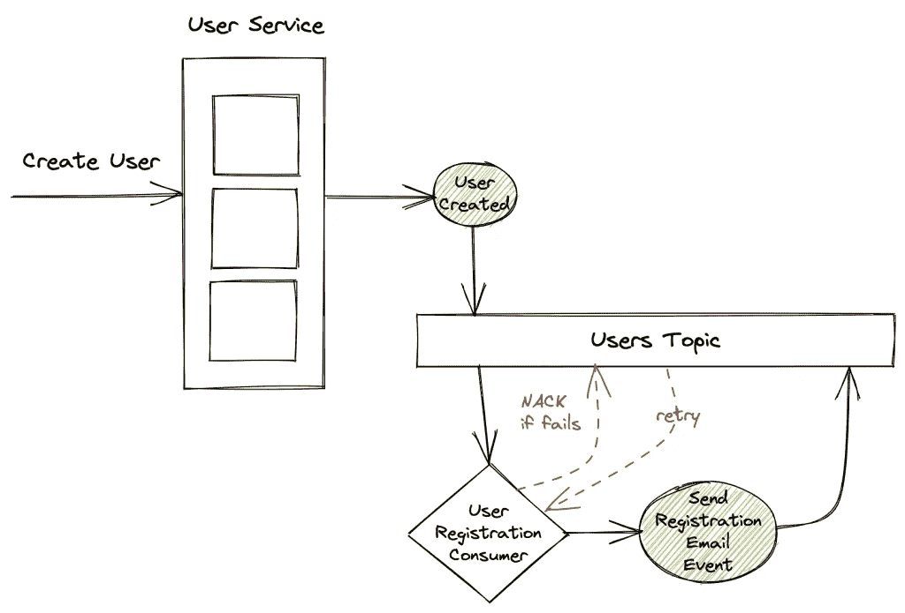
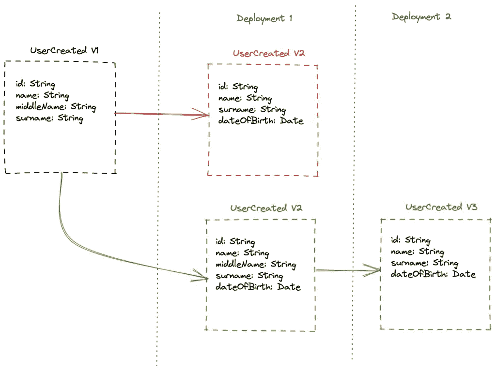

# 事件驱动系统中的 4 个常见错误

> 原文：<https://betterprogramming.pub/4-common-mistakes-in-event-driven-systems-9e70c06f79a9>

## 简短的探索

安娜·格鲁在 [Unsplash](https://unsplash.com?utm_source=medium&utm_medium=referral) 上的照片

在过去的几年中，大公司对事件驱动系统的采用有了相当大的增长。这种趋势背后的主要原因是什么？这纯粹是基于炒作还是有任何合理的理由来支持采用这种架构？在我们看来，许多公司走这条路的主要原因是:

# 组件之间的松耦合

通过事件以异步方式交互的单个组件实现了低耦合。我们可以在不同的时间独立地修改、部署和操作这些组件，没有问题；这在维护和生产成本方面是一个巨大的优势。

# 解雇和遗忘概念

这个优势与松耦合高度相关，但是我们认为由于它的重要性，值得单独提及。这些系统的最大优势之一是事件可以被触发，我们并不真正关心该事件是如何以及何时被处理的，只关心它是否在相应的主题中持续存在并变得持久。

一旦一种类型的事件被发送到一个主题，对该事件感兴趣的新消费者就可以订阅并开始处理它们。生产者不需要做任何工作来集成新的消费者，因为生产者和消费者是完全分离的。

在传统的组件间同步 HTTP 通信中，生产者必须独立地调用每个消费者。考虑到对每个消费者的每个调用都可能失败，实现和维护这一点的成本比遵循事件驱动的方法要高得多。

# 没有时间耦合

一个主要的好处是组件不需要同时运行。例如，一个组件可能不可用，而这根本不会影响另一个组件(只要它有工作要做)。

## 易于将一些业务模型融入基于事件的系统

一些模型，尤其是那些实体在其生命周期中经历不同阶段的模型，非常适合基于事件的系统。将模型定义为一组基于原因和结果的相互关联的关系变得非常容易和明智。每一个“原因”都源于一个事件，这个事件给系统中的一个特定实体甚至多个实体带来了“副作用”。

考虑到上面提到的所有好处，我们可以清楚地看到为什么这种架构近年来越来越受欢迎。对于公司来说，敏捷性和经济高效的维护非常重要。选择一种架构而不是另一种架构会对公司的业绩产生相当大的影响。我们必须明白，在未来的几年中，许多公司将由技术驱动，这就是为什么我们的工作和我们的架构决策对任何公司的成功都如此重要。

说到这里，我们还必须知道，构建事件驱动的系统并不是一件容易的事情。使用这些系统的初学者经常会犯一些常见的错误。让我们来看看其中的一些。

# 4 个常见错误

正如在任何发生异步操作的系统中一样，许多事情都可能出错。然而，我们已经发现了一小部分错误，这些错误在尚未进入高级阶段的项目中很容易发现。

## 不保证秩序

我们要研究的第一个问题是，在我们的业务模型中，当我们忽略了在给定的实体上保证某些操作的顺序的需要时。

例如，假设我们有一个支付系统，其中每笔支付都基于特定事件经历不同的状态。我们可以有一个`ProcessPayment`事件、一个`CompletePayment`事件和一个`RefundPayment`事件；这些事件(或本例中的命令)中的每一个都将付款转换到其相应的状态。

如果我们在这种情况下不保证订货，会发生什么？我们可能会遇到这样的情况，例如，对于相同的付款，一个`RefundPayment`事件可以在一个`CompletePayment`事件之前处理。这将意味着付款将保持完整，尽管我们的意图是获得退款。

这是因为在我们处理`RefundPayment`事件时，付款仍处于不允许退款的状态。我们可以采取其他措施来解决这个问题，尽管这不是很有效。让我们用图表来看看这种情况，以便更好地理解这个问题！

作者提供的图片

在上面的插图中，我们可以看到消费者如何在同一时间为同一支付 ID 消费支付事件。由于各种原因，这肯定会是一个问题，主要原因是我们总是希望在处理下一个事件之前等待一个事件的处理。

像 [Kafka](https://kafka.apache.org/) 或 [Pulsar](https://pulsar.apache.org/) 这样的发布/订阅消息系统提供了一种机制来轻松实现这一点。例如，在 Apache Pulsar 中，您可以使用[键共享订阅](https://pulsar.apache.org/docs/concepts-messaging/#key_shared)来确保给定支付 ID 的事件总是由同一个消费者按顺序处理。在 Kafka 中，您可能必须使用[分区](https://developer.confluent.io/learn-kafka/apache-kafka/partitions/#:~:text=This%20allows%20Kafka%20to%20guarantee%20that%20messages%20having%20the%20same%20key%20always%20land%20in%20the%20same%20partition%2C%20and%20therefore%20are%20always%20in%20order)，并确保给定付款 ID 的所有事件都被分配到同一个分区。

在新的场景中，属于现有支付的所有事件将由同一个消费者处理。

## 非原子多重操作

另一个常见的错误是在一个业务关键部分中做不止一件事情，并假设每个操作都会一直工作。永远记住这一点:如果某件事可能失败，它就会失败。

例如，一个典型的场景是当我们持久化一个实体并在该实体被持久化后立即发送一个事件。让我们看一个例子来更好地理解这个问题:

如果发送`UserCreated`事件失败会发生什么？用户将在那个点被持久化，因此在我们的系统和我们的消费者的系统之间将会有不一致。有人会说，在这种情况下，如果你先发送`UserCreated`事件呢？那么，如果在发送事件后持久化用户失败了，会发生什么呢？

消费者会认为用户已经被创建了，但实际上并没有！
现在的主要问题是如何解决这个问题；解决这个问题有不同的方法。让我们来看看其中的一些。

## 交易的使用

解决这种不一致问题的一个简单方法是利用我们的数据库系统，并在支持事务的情况下使用事务。假设我们被提供了一个`withinTransaction`方法，如果我们提供的闭包中有任何东西失败，该方法将启动一个新的事务并回滚。

请记住，在某些情况下，事务可能会影响性能，在做出任何决定之前，请检查您的数据库文档。

## 事务发件箱模式

解决这个问题的另一种方法是在用户通过实现[事务发件箱模式](https://microservices.io/patterns/data/transactional-outbox.html)保持后在后台发送事件。你可以在这里查看它是如何实现的[。](https://microservices.io/patterns/data/transactional-outbox.html)

## 发送多个事件

当我们试图在一个业务关键部分中发送多个事件时，也会出现类似的问题。如果在之前发送了其他事件之后，发送一个事件失败，会发生什么情况？同样，不同的系统可能处于不一致的状态。

有一些方法可以避免这个问题。让我们看看怎么做。

## 连锁事件

解决这个问题的最好方法可能就是避免一次发送多个事件。您总是可以将事件链接起来，这样它们就可以按顺序处理，而不是并行处理。

例如，让我们看看这个场景。当创建用户时，我们需要发送一封“注册成功”的电子邮件。

如果发送`SendRegistrationEmailEvent`失败，即使我们重试，也无法从错误中恢复。因此，注册电子邮件将永远不会被发送。如果我们改做这个呢？

通过拆分事件，我们允许其他消费者在发送`UserCreated`事件后继续，同时将注册电子邮件的发送拆分到一个单独的功能，该功能可以根据我们的需要独立重试多次。

## 交易支持

如果您的消息传递系统支持事务，您也可以利用它们在出错时回滚所有事件。例如，如果需要，Apache Pulsar [支持事务](https://pulsar.apache.org/docs/transactions/)。

## 不向后兼容的更改

我们要看的最后一个常见问题是，当我们修改现有事件时，没有考虑到事件必须向后兼容。

例如，假设我们向一个现有事件添加一些字段，同时从该事件中删除一个现有字段。

在下面的图片中，我们可以看到像我们刚刚描述的发布变更的错误和正确的方式。

在第一种情况下，我们立即删除`middleName`字段并添加新的`dateOfBirth`字段。为什么这有问题？

这第一个更改将导致问题，并使一些现有事件处于阻止状态。为什么？

假设当我们触发新版本的部署时，在我们的`Users`主题中有一些`UserCreated`事件。最常见的不停机部署应用程序的方式是所谓的[滚动升级](https://www.techtarget.com/searchitoperations/definition/rolling-deployment)，所以我们从现在开始假设这是我们应用程序的部署方式。

在我们的部署过程中，可能会发生一些节点包含新事件版本的代码更改的情况。然而，仍然会有一些节点运行旧版本的代码，因此不支持新的事件版本。

我们还必须记住，在第一次部署中发布的代码必须使新字段可选，以便能够处理主题中等待处理的旧事件。一旦我们 100%确定我们的主题中没有旧事件，我们就可以取消这个限制，让它们都是强制性的。

# 结论

我们已经看到了事件驱动架构是多么有用。然而，以正确的方式实现它并不是一件容易的事情，它需要一些经验来做好。在这种情况下，特别是，与有这种架构工作经验的人进行结对编程特别有用，因为它可以节省我们非常宝贵的时间。

如果你正在寻找一本好书来更好地理解事件驱动系统，我们强烈推荐“[构建事件驱动微服务](https://geni.us/AZntBL)”。

这就是我们今天的全部内容。我真的希望你喜欢我们的文章，并希望学到一些新的东西。

一如既往，我们希望尽快看到你回来！