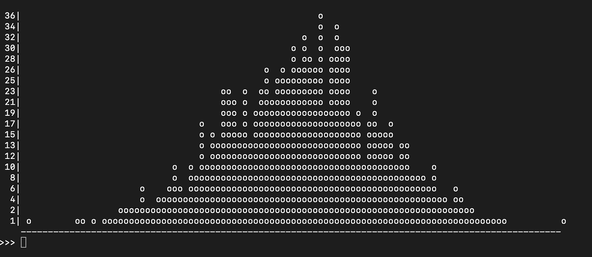
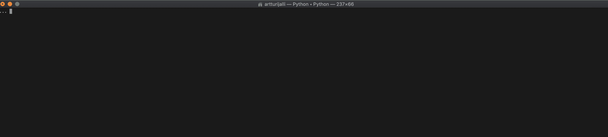
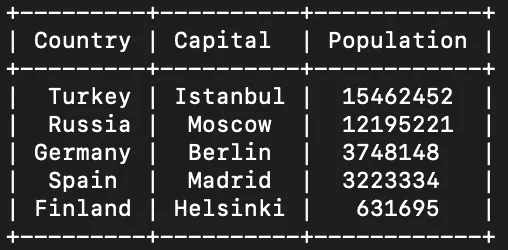
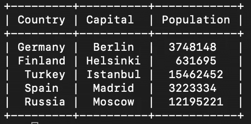
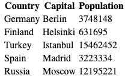
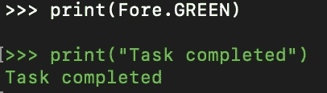
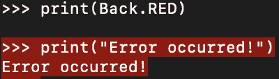
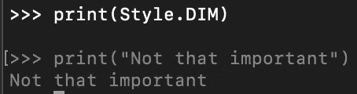

# Python 中 4 个很酷的命令行可视化库

> 原文：<https://betterprogramming.pub/4-cool-command-line-visualization-libraries-in-python-c881f493bbc5>

## 为您的命令行注入活力


Johannes Groll 在 [Unsplash](https://unsplash.com?utm_source=medium&utm_medium=referral) 上拍摄的照片。

# 1.使用 Bashplotlib 在命令行中打印

您是否一直想在命令行窗口中绘制数据？那么 PyPi 的 [Bashplotlib](https://pypi.org/project/bashplotlib/) 就是给你的。

用`pip`安装 Bashplotlib:

```
pip install bashplotlib
```

## 用法示例

让我们用 Bashplotlib 绘制一些正态分布的数字。要实现这一点:

1.  生成一个正态分布的数字列表(例如在 [NumPy](https://numpy.org/) 库的帮助下)。如果还没有 NumPy，用`pip install numpy`安装。

2.使用 Bashplotlib 的直方图绘图仪`plot_hist`:

结果:



# 2.用 TQDM 添加进度条

你可以用 [TQDM](https://github.com/tqdm/tqdm) 直接在命令行中可视化你的程序的进度。如果您正在使用 Python 创建命令行工具，以便向最终用户显示进度，此工具会非常有用。

使用`pip`安装 TQDM:

```
pip install tqdm
```

## 用法示例

例如，让我们遍历数字`0...1000`并添加一个小的延迟来看看 TQDM 进度条是如何工作的:

结果:



# 3.带有漂亮表格的漂亮打印表格

使用 [PrettyTable](https://pypi.org/project/prettytable/) 在控制台中以可读的、类似表格的格式打印表格。

安装:

```
pip install prettytable
```

## 用法示例

让我们创建一个欧洲一些首都城市和相关人口的表格:

结果:



例如，您可以根据`Capital`对表格进行排序:

```
table.sortby = "Capital"
print(table)
```



如果您想将这个表格插入到您的网站中，您可以很容易地获得一个 HTML 字符串，它包含:

```
print(table.get_html_string())
```

结果:

如果您将这个表格 HTML 代码放到您的 HTML 文档中，您会在您的网站上看到这个表格:



# 4.用 Colorama 美化你的命令行

用 Colorama 给你的命令行应用添加一些有用的颜色。

使用`pip`安装它:

```
pip install colorama
```

Colorama 支持三种不同的颜色类型:

*   `foreground`为文本颜色
*   `background`为背景色
*   `style`用于一些额外的颜色造型

通过适当地配置这些，您可以为您的 Python 命令行应用程序增添一些活力。接下来我们来看一些例子。

## 用法示例

例如，让我们首先将文本改为绿色，以便用绿色字体显示“任务完成”。这可以通过在`Fore`渲染模式下将前景色改为绿色来实现:

结果:



然后，让我们通过将背景渲染模式`Back`设置为`RED`，用红色背景突出显示错误:

结果:



您也可以通过更改渲染样式使文本变暗:

结果:



最后，为了重置一切，您调用:

```
print(Style.RESET_ALL)
```

# 结论

感谢阅读。我希望你觉得这是有用的。

编码快乐！

# 你可能会发现这些文章很有见地

[](/5-must-have-homebrew-packages-for-command-line-lovers-d3d18c48199a) [## 命令行爱好者必备的 5 个自制软件包

### 使用这些神奇的命令行工具，让您的编码生活更加轻松

better 编程. pub](/5-must-have-homebrew-packages-for-command-line-lovers-d3d18c48199a) [](/10-useful-python-snippets-to-code-like-a-pro-e3d9a34e6145) [## 10 个有用的 Python 片段，让你像专业人士一样编写代码

### 我每天使用的有用的提示和技巧

better 编程. pub](/10-useful-python-snippets-to-code-like-a-pro-e3d9a34e6145)