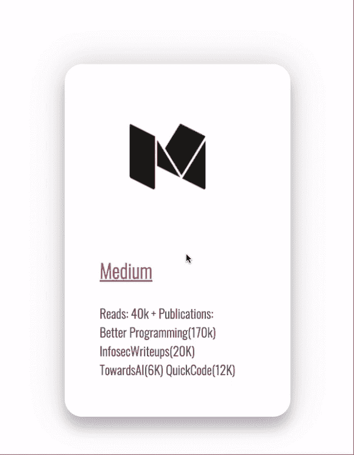
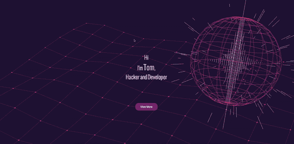
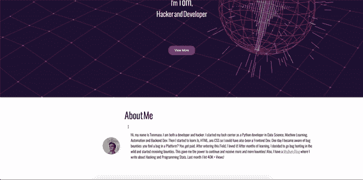
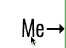
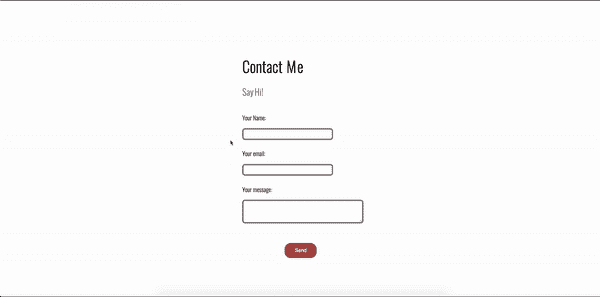

# 给你的网站注入活力的 4 个 CSS 和 JavaScript 技巧

> 原文：<https://betterprogramming.pub/4-css-and-javascript-tricks-to-breathe-life-into-your-website-6464f470a86d>

## 这些代码片段将为你的静态网站注入活力


Anton Darius 在 [Unsplash](https://unsplash.com?utm_source=medium&utm_medium=referral) 上拍摄的照片。

在过去的几周里，我一直在做我的新网站。我想给它一点活力。经过一番思考后，我决定使用 CSS 和 JS——我对最终结果非常满意。

这篇文章不是关于建立或设计一个网页。今天，我将向您展示一些代码片段(带解释),为您正在构建的网站注入活力。

# 1.JS 中的 3D 动画

第一招是 JS 中一个很奇妙的立体效果。



如您所见，当鼠标经过这张“卡片”时，卡片内的元素变成了 3D。

## 如何做到这一点

首先，我们创建一个 HTML `div`:

这里，我们有一个主类(`card`)和在`card`类中的另外两个类(`header`和`info`)。`Header`将是包含图像的类(在我们的例子中，是 Medium logo)，而`info`将包含卡片中的文本。现在，让我们添加一些 CSS 以便给卡片一个更好的外观:

在这里，我声明了高度、宽度、边框、填充和阴影。重新加载页面，您将看到结果。最后一步是实现鼠标经过卡片时的 3D 效果。为此，我使用了 JS:

1.  声明变量。
2.  为`card`创建两个事件监听器。
3.  在`mouseenter`上，对于`title`、`header`和`description`，将`Z`平移 3px。您也可以决定是否旋转这些元素(`rotateZ`)。
4.  在`mouseleave`上，将一切恢复正常。

就这样:你有了这个漂亮的三维动画。当然，这现在真的很原始。你可以在任何地方添加 CSS 来改变宽度、颜色等。

# 2.探索 Vanta.js，让你的背景充满活力

厌倦了那些静态的颜色和图片作为你的网页背景？ [VantaJs](https://www.vantajs.com) 来帮忙了:



## 如何做到这一点

这很简单。将以下内容添加到 HTML 代码中:

这将为`htmlid` ID 设置 [Vanta.js Globe](https://www.vantajs.com/?effect=globe) 背景。Vanta.js 提供了 13 种预设背景:

*   [鸟类](https://www.vantajs.com/?effect=birds)
*   [雾](https://www.vantajs.com/?effect=fog)
*   [波浪](https://www.vantajs.com/?effect=waves)
*   [云](https://www.vantajs.com/?effect=clouds)
*   [云 2](https://www.vantajs.com/?effect=clouds2)
*   [地球仪](https://www.vantajs.com/?effect=globe)
*   [网](https://www.vantajs.com/?effect=net)
*   [细胞](https://www.vantajs.com/?effect=cells)
*   [行李箱](https://www.vantajs.com/?effect=trunk)
*   [拓扑](https://www.vantajs.com/?effect=topology)
*   [圆点](https://www.vantajs.com/?effect=dots)
*   [铃声](https://www.vantajs.com/?effect=rings)
*   [光环](https://www.vantajs.com/?effect=halo)

要在这两者之间切换，只需将`VANTA.GLOBE`修改为`VANTA.[backgroundname]`。当然，在这之前，你需要添加各自的[https://cdn.jsdelivr.net/npm/vanta@latest/dist/vanta.[](https://cdn.jsdelivr.net/npm/vanta@latest/dist/vanta.clouds2.min.js) `backgroundname` [].min.js](https://cdn.jsdelivr.net/npm/vanta@latest/dist/vanta.clouds2.min.js) 。

# 3.滚动显示

对于那些不知道这个神奇的 JS 库的人来说， [ScrollReveal](https://scrollrevealjs.org/) 可以在滚动网页时显示项目:



## 如何做到这一点

1.  将`<script src="https://unpkg.com/scrollreveal"></script>`添加到你的 HTML 的`head`中。
2.  在您的 JS 文件中，使用以下代码:

```
ScrollReveal().reveal('.htmlclass',{ delay: 400 })
```

这将在滚动页面时显示延迟 400 的`.htmlclass`类。

# 4.调整字母大小和改变它们的颜色

如果使用得当，这个小小的 CSS 技巧真的会有所不同:



## 如何做到这一点

1.  创建一些新的`span` HTML 元素并为它们指定一个类:

3.使用 CSS `:hover`，我们将改变字母的大小和颜色:

现在，当我们将指针放在字母上时，你会看到它们改变了大小和颜色。

为了有一个更动态的效果，我建议你用不同的大小和颜色为每个字母创建一个不同的类。

此外，你可以在每种类型的 HTML 元素上应用 CSS `:hover`。例如，我还将它应用于我的联系人表单:



# 结论

这是我用来给我的网站注入新生命的四个技巧。我希望他们也能为你做这项工作。