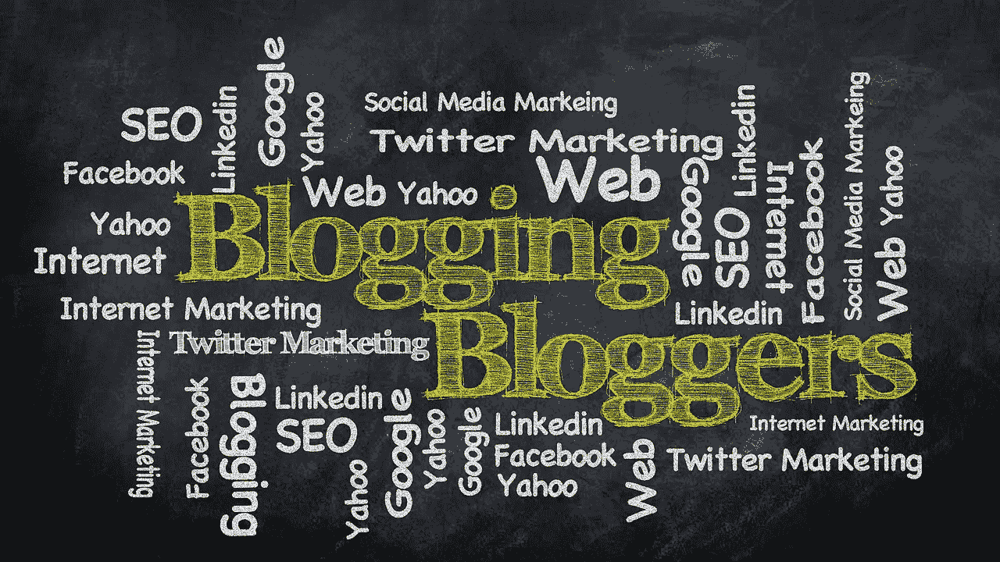
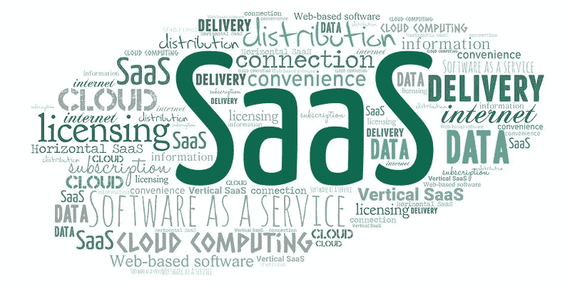

# 程序员的 4 个简单的被动收入来源

> 原文：<https://betterprogramming.pub/4-easy-passive-income-sources-for-programmers-3d3c67e596e6>

## 每月有机会赚取 500 到 50，000 美元

照片由[像素](https://www.pexels.com/photo/abundance-bank-banking-banknotes-259027/?utm_content=attributionCopyText&utm_medium=referral&utm_source=pexels)的[皮克斯拜](https://www.pexels.com/@pixabay?utm_content=attributionCopyText&utm_medium=referral&utm_source=pexels)拍摄

谁不想赚点外快呢？但问题是每个人都有工作，为了赚更多的钱，我们必须付出更多的时间。

经常加班几乎是不可能的，而且对你的身心健康有害。

这就是被动收入的来源。不积极工作也能挣钱。有很多方法可以创造被动收入，但让我们来谈谈程序员如何做到这一点。

## 什么是被动收入？

**被动收入**是你不需要做很多“主动”工作就能继续赚到的钱。就像你拥有一栋房子，你从租金收入中赚钱。不积极工作也能从租金收入中挣钱。

根据维基百科，当挣钱者不花什么力气来增加收入时，这被称为累进被动收入。由于他们的技能，程序员比其他人有更多的机会获得被动收入。

这里有四种简单的方法:

# 1.以一次性费用出售软件

这是作为程序员挣钱的最好方法之一，也是对你技能的最好利用。绝大多数(89%)的 B2B 研究人员在他们的研究过程中使用互联网。有一些很好的市场，你可以在那里出售你的软件。

让我们来了解一下你能在哪里卖，能赚多少钱。

**App Store/Play Store:** 你可以在苹果 App Store 或谷歌 Play Store 出售你的手机应用，一次性付费。设置很简单，因为他们处理付款。

这张照片是在知识共享许可下从 [Flickr](https://www.flickr.com/photos/121483302@N02/14031043893) 上拍摄的

你将从 Google play 商店的每笔销售中获得 70%的收入。从 7 月 1 日开始，Google Play 将服务费从 30%降至 15%。

苹果公司也收取 30%的佣金，但它也会将对小企业主的收费降至 15%。

也可以花几块钱在商店里推广你的 app，也可以做 SEO。一旦你开始获得客户和良好的评级，钱就自动来了。

这是网络上最大的 WordPress 主题市场。这个网站获得的巨大流量将帮助你获得最初的几笔销售，然后就可以开始比赛了。

如果你在 Themeforest 上独家销售你的产品，你将获得每笔销售额的 62.5%。你的佣金随着总销售额的增加而不断增加。一旦你在他们平台上的总销售额达到 75，000 美元，你将获得每笔销售额的 87.5%。非独家作者仅获得 45%。

[**code canyon**](http://link.competethemes.com/codecanyon)**:**这是 Envato 的另一个热门集市。如果你对 [**销售 WordPress 插件**](https://wedevs.com/blog/326439/how-to-sell-wordpress-plugins) 感兴趣，CodeCanyon 是你产品的一个很好的候选。

有很多其他的市场可以出售你的软件。

程序员卖主题赚得盆满钵满。你只要做一个好的主题或者软件就可以了。

Themeforest 上个月的前两个主题分别获得了 78 万美元和 12.87 万美元。

## 技巧

做一些市场调查。找个利基。人们通常喜欢在生产力或商业工具上花费。

**下水的艰辛:5/10(不那么容易)**

**创收的艰难:7/10(艰难)**

# 2.开始写博客

我发现这种方式比其他方式更容易。难的是作为一名作家被好的博客/出版物接受。在你开始写作之前，阅读大量的文章。我分享了一些网站，作为一名科技作家，你可以在这些网站上赚钱:

**中等:**对于被动收益来说，中等是最好的。你就写一次，按照成员的阅读时间来拿报酬。虽然一开始挣钱很难，但是没有限制。一篇文章可能会产生 200-1000 美元，甚至更多，如果它能吸引大量的读者！

图片由[凯文·金](https://pixabay.com/users/kevinking-289243/?utm_source=link-attribution&utm_medium=referral&utm_campaign=image&utm_content=428955)来自[皮克斯拜](https://pixabay.com/?utm_source=link-attribution&utm_medium=referral&utm_campaign=image&utm_content=428955)

你也可以开自己的个人博客。但是，一开始会很难获得流量。你也可以通过在文章中加入联盟营销链接来赚取更多。

但是如果你想要一个固定的或活跃的收入，有许多博客可以用编程/技术写作赚钱。

其中有 [clubhouse.io](https://clubhouse.io/clubhouse-write-earn-give-program/) 、【tutorialspoint.com】T3、[vonage.com](https://developer.nexmo.com/spotlight/)、[digitalocean.com](https://www.digitalocean.com/community/pages/write-for-digitalocean)等等。他们会付给你每篇文章 250-500 美元。

## 技巧

在开始写作之前，要大量阅读。你也可以参加写作的短期课程。

**下水的艰辛:2/10(非常容易)**

**创收之难:4/10(容易)**

# 3.制作视频教程

如果你有任何与编程相关的特殊技能，你可以制作一个视频教程，并在教育/专业学习市场上出售。

如果你能用英语制作教程，那么你就能打入全球市场。现在，几乎每个国家都有“Udemy”类型的本地市场。你也可以试试。

有很多网站可以赚钱，但我会推荐两个。

**Udemy:** 有些人正在用巨大的销售额(一个月 20000 美元甚至更多)扼杀它！)而许多人一分钱也没赚到。一般的课程创建者每个月每门课程能赚 15-30 美元，但是顶尖的人每个月每门课程能赚 2000 美元。

这张照片是在知识共享许可下从[维基媒体](https://commons.wikimedia.org/wiki/File:Skillshare-Logo.jpg)拍摄的

**Skillshare:** 教师通常每观看一分钟可以赚 0.05 到 0.10 美元。这意味着，如果你的学生在第一个月看了你 10，000 分钟的课，你会赚到 500 到 1，000 美元。

我知道一些初级孟加拉程序员通过用当地语言制作教程每月获得 500 美元的被动收入！

## 技巧

对着镜头说话最初可能会让你感到不舒服，但你会习惯的。先试着对着镜子练习，看看自己的肢体语言。

额外的好处是当你开始教学的时候，你可以学到更多的东西。

**下水的艰难:6/10(艰难)**

**创收之难:5/10(容易)**

# 4.制作 SaaS 产品

Saas 的意思是“软件即服务”SaaS 是最好的商业模式之一。你将制作软件并按月收费出售。我们在日常生活中大量使用 SaaS，比如 Adobe 软件、微软 Office、Dropbox、Slack。

如果你能造出人们需要的有用的产品，你就能赚很多。你不必构建像那样复杂的软件。你可以构建一些简单有用的软件。

图片来源:[知识共享许可下的 www.epictop10.com](http://www.epictop10.com/)

我的一个高级开发人员从他的 SaaS 产品中每月赚 1000-1500 美元。他做了一个帮助人们减肥的应用程序。他的秘密配方是一个超级简单的 UX。他抓住了 500 名每月付费 2 美元的用户。他还通过向免费顾客展示广告来赚外快。

你可以在这里找到另一个励志故事。一个创始人从他们的三个 SaaS 产品中每月赚 2 万美元。

## 技巧和复杂性

制定一个 2-6 个月的计划。首先，做一些市场调查，使用相似类型的产品。

难的是人们如何找到你的软件？有一些像[销售 SaaS](https://sell-saas.com/) 这样的服务/网站会帮助你找到客户。但最好是与一些营销机构合作，采用收入共享的模式。

**下水的艰辛:5/10(不那么容易)**

**创收的艰难:8/10(非常艰难)**

# 为什么你应该考虑被动收入

## 更多属于自己的时间

被动收入说的都是时间和金钱的关系。这样睡觉也能赚。这不是很好吗？

那些为了额外的钱而加班的人绝对应该尝试一下。这会让他们有更多的时间留给自己，因为被动收入的全部意义在于不积极工作也能赚钱。

## 财务自由

大多数程序员都在做全职或兼职工作。一些人也从自由职业中赚钱。这些类型的积极收入是好的，但在某些情况下可能有点风险。你可能会在公司或全球危机中丢掉工作，比如新冠肺炎。

不受你的时间和努力的限制。它会对你积累财富的能力产生积极的和显著的影响。所以你为什么不试一试，在财务上变得更加稳定呢？

# 最后的话

不能保证你会获得多少被动收入。这可能是好的，也可能是坏的。你可以赚得比你期望的多很多，但你也可以赚得少很多。

但是如果你从不尝试，你将永远不会知道。你可能会比现在的收入多赚 10 倍或 100 倍。如果你赚了足够的钱，你可能不必做你的日常工作！

我遵循一个规则——一个标准——来计算我是否成功赚取了被动收入，即:

> 每小时被动收入>每小时主动收入

假设你的全职工作是每小时挣 30 美元。如果你写了一个博客，在它的生命周期中赚了 300 美元，你花了三个小时写这个博客，那么你每小时的收入是 100 美元。

但是我会要求你不要一开始就计算那么多。当你看到你的博客、教程或软件帮助了成千上万的人时，你也会变得高兴和兴奋！

很多程序员把这当成一种爱好来尝试！所以，至少试一次。我只是分享一些选择。如果你研究——你应该在开始之前研究——我相信你会找到其他方法。

> “睡觉的时候不找到赚钱的方法，就一直工作到死。”
> 
> **—沃伦·巴菲特**

请与我们分享你对被动收入的看法和经验！谢谢！