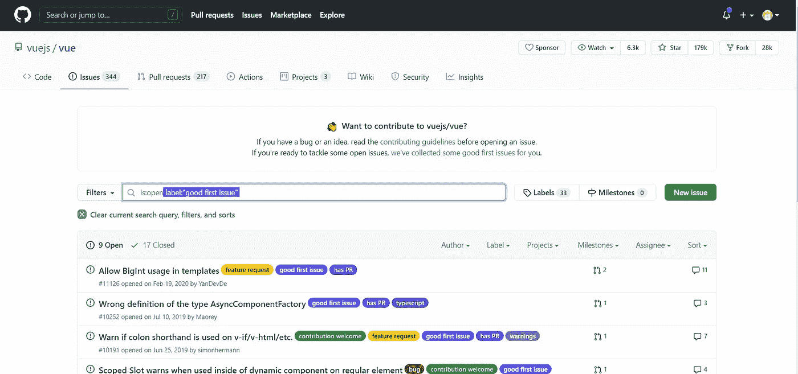
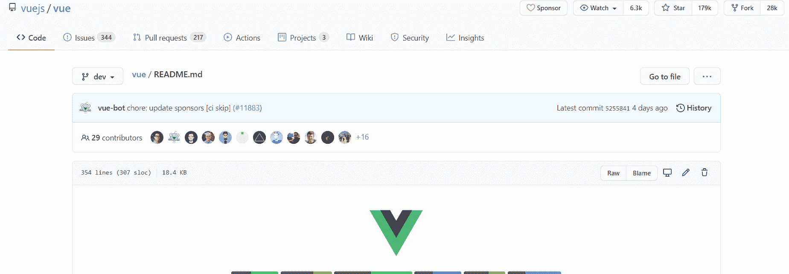
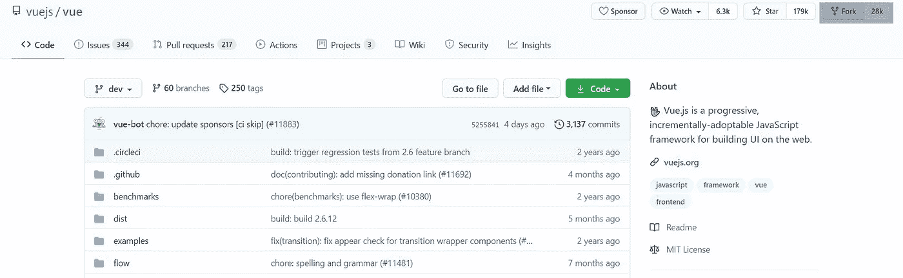

# 为开源项目做贡献的 4 个轻松步骤

> 原文：<https://betterprogramming.pub/4-effortless-steps-for-contributing-to-open-source-projects-35000599367b>

## 即使您是 GitHub 初学者，也可以开始使用开源软件


蒂姆·马歇尔在 [Unsplash](https://unsplash.com?utm_source=medium&utm_medium=referral) 上的照片

为开源做贡献是学习和提升技能的最好方式之一。

一个人应该为开源项目做贡献有各种各样的原因，比如改进库或框架、结识他人等等。

然而，即使在知道了为开源做贡献的好处之后，许多人实际上并没有做贡献，因为整个过程让人觉得有点不知所措。

因此，我试图简化投稿的过程，并把它分成四个步骤，以便于初学者理解。

在继续之前，请知道您需要很好地掌握您将要参与的框架及其使用的语言——以及 GitHub 帐户。

你可以去他们的[官方页面](https://github.com/)免费注册，创建一个 GitHub 账户。贡献不需要付费。

我们开始吧！

# 第一步:发现问题

开源贡献的第一步是找到你能够解决的合适的问题。

寻找此类问题的最佳位置是访问您喜欢使用的框架或库的 GitHub 页面，然后前往问题部分。

否则，你可以在 GitHub 中搜索“JavaScript”或“frontend”等主题，并手动搜索随机存储库及其问题。



[Vue 库](https://github.com/vuejs/vue/labels/good%20first%20issue)。来源:作者。

在上面的图片中，你可以看到我专门搜索了标有“好的第一期”和“欢迎投稿”的问题，这是初学者友好的问题的常用标签，它们是一个很好的起点。

最初参与这些问题是有好处的，因为它会给你关于如何参与和开始的实践经验。

如果可能的话，试着发现问题并贡献给一个像 Vue 和 React 这样有很大社区的库。

# 第二步:理解规则

尽管贡献的过程基本上是相同的，但是不同的项目之间会有细微的差别。

通常，每个项目都有一套规则，他们希望您在编写代码和做出贡献时遵守并牢记在心。

如何发现这些规律？

这些规则和指导原则通常放在自述文件中。

有时，他们将这些指南放在一个单独的文件中，但这并不常见，您可以在 README 中找到该文件的链接。



Vue 库的 Gif。来源:作者。

你会发现各种各样的规则和指南，关于如何建立项目，项目结构等。

你必须遵守这些规则。否则，你的贡献可能会被拒绝。

# 第三步:做出改变

现在，您已经找到了想要解决的问题，并且阅读了规则和指南，是时候实际编码并修复问题了！



突出显示叉按钮。来源:作者

要进行更改，您必须派生存储库。通俗地说，forking 将创建一个您可以参与的项目的个人副本。

您对个人副本所做的更改不会影响实际的存储库。

例如，如果我分叉 React 库，那么我的 GitHub 帐户上将显示 React 的个人副本，然后我可以对它进行更改，而不会影响官方、公共的 React 库。

一旦你完成了项目，你必须克隆它。克隆基本上意味着将代码下载或复制到您的本地机器上，在那里您可以使用像 Visual Studio 代码这样的 IDE 并开始编辑。

为了简化这个过程，您可以使用 [GitHub CLI。](https://cli.github.com/)


GitHub 克隆项目。来源:作者。

一旦你克隆了，到你的个人副本，点击绿色的“代码”按钮，获得 GitHub CLI 代码。

您可以将这一行代码粘贴到您的编辑器控制台中，以将您的个人副本下载到您的本地计算机上。

# 步骤 4:推送变更并提交

一旦完成编辑，你需要将你的修改推送到你储存在 GitHub 上的个人副本中。

为此，您需要创建一个具有相关名称的分支。

如果要添加警告或警报，创建分支的代码可能如下所示:

```
git checkout -b added-warning-alert
```

之后，您需要添加所有文件并提交您的更改。这个过程看起来是这样的:

```
git add.git commit -m "Added warning message"
```

引号中的文本是与此特定提交相关的消息。

最后，我们需要将我们所做的所有更改推送到存储在 GitHub 上的个人副本。

为此，请运行以下命令:

```
git push --set-upstream origin added-warning-alert
```

我们必须首先通知 GitHub，我们之前创建了一个名为“添加-警告-警报”的新分支，所有的更改都需要推送到这个分支上。

最后，我们需要发送一个拉请求。pull 请求是对您在前面的步骤中分叉的原始的、实际的存储库的变更的建议。

例如，如果您派生并编辑了 Vue 存储库，然后提出了一个 pull 请求，那么官方的 Vue 存储库将获得您提议的更改，并且他们将在将其与他们的存储库合并之前对其进行审查。

要提出拉取请求，请在做出更改后转到您的个人分叉存储库的拉取请求部分，然后单击“比较和拉取请求”绿色按钮。

你会看到一个消息框，你必须写下你所做的改变。

一般来说，投稿指南涵盖了这些评论和消息的结构。你应该参考一下。

完成后，点击“创建拉动请求”。

您刚刚提出了您的第一个“拉”请求，如果您的更改被批准，它们将与官方存储库合并！

# 结论

为他人的项目做贡献和阅读他人写的代码是一种成长为开发人员的奇妙方式。

明智的做法是使用该语言的现代实践——如果存储库允许的话——因为它们会产生更短的、可读的代码，这也使项目更经得起未来的考验。

虽然贡献是一种很好的学习方式，但它可能会成为一个令人沮丧的过程。

因此，我建议选择有大型社区参与的项目，因为如果你遇到困难，他们会帮助你。

希望我的文章对你有帮助。

感谢阅读！