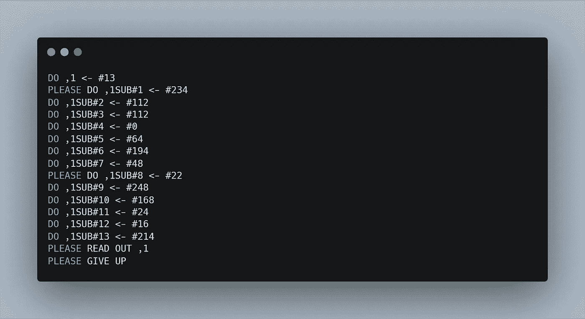
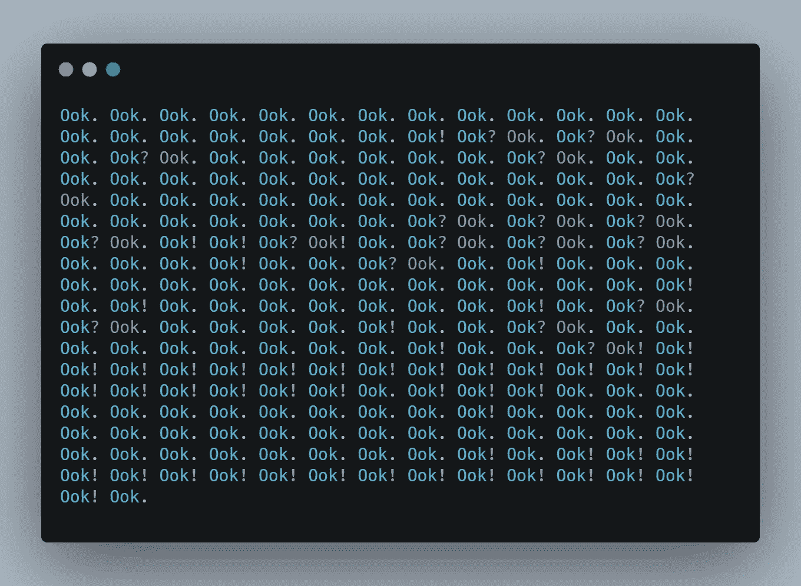
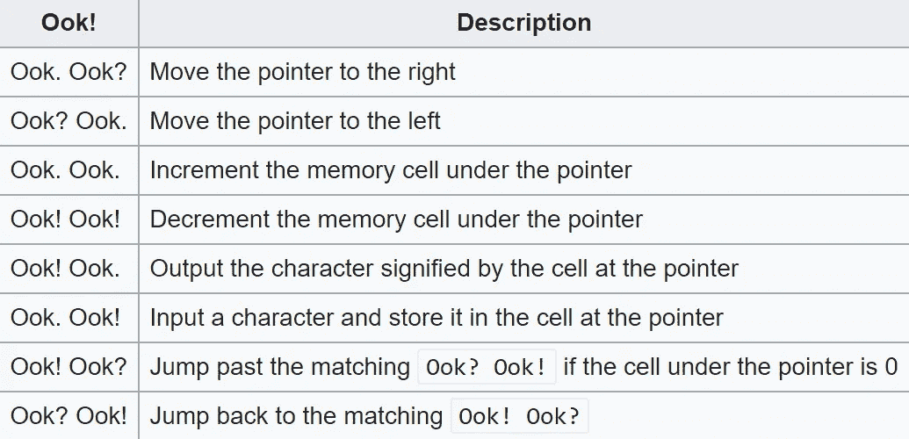
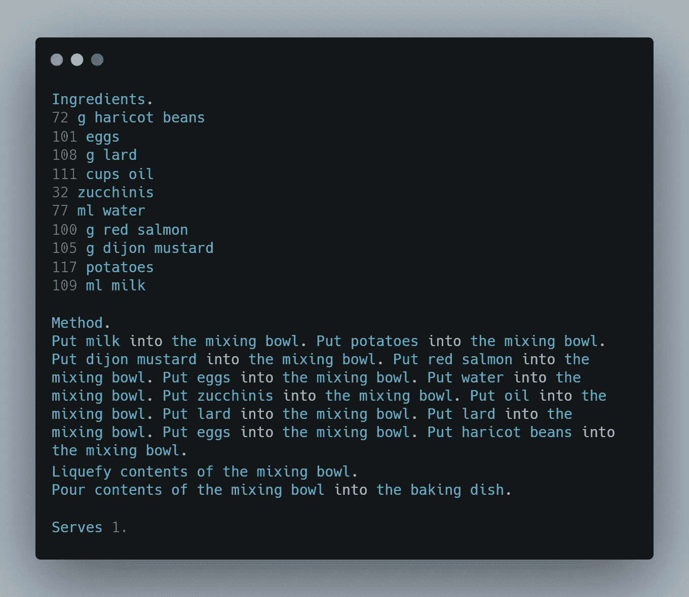

# 4 种深奥的编程语言会让你大吃一惊

> 原文：<https://betterprogramming.pub/4-esoteric-programming-languages-that-will-blow-your-mind-f7a3e8f155f6>

## 如果你认为 JavaScript 很奇怪，你不了解这些语言


由[拍摄的科尔顿鲟鱼](https://unsplash.com/@coltonsturgeon?utm_source=medium&utm_medium=referral)在 [Unsplash](https://unsplash.com?utm_source=medium&utm_medium=referral) 上。

世界上最古怪的编程语言是什么？有些人会说 JavaScript 应该这么叫。互联网上充斥着用那种语言写的一些奇怪东西的文章，我并不感到惊讶。


JavaScript——本文不会讨论它。

以上只是一个小例子，说明当你不是专家时，JS 是如何让你震惊的。但是说实话，和 esolangs 比起来，这根本不算什么。那些是什么？Esolangs，也称为深奥的编程语言，是被创造出来的怪异的编程语言。这是他们的目标，他们真的很擅长。人们为什么要创造它们？因为他们可以。

其中一些语言是作为一个笑话而创造的，而另一些则提出了智力挑战。让我给你介绍我最喜欢的四个英语单词！

# 1.CLWNPA

没有发音缩写的编译器语言是最早的 esolangs 之一(它创建于 1972 年！)，所以它必须是我清单上的第一位。最讽刺的是，这种语言大多被称为[INTERCAL](http://catb.org/~esr/intercal/)*——*而不是 CLWNPA。我真的不知道为什么。经典的“Hello world”app 用这种语言是什么样子的？



程序显示“Hello World”更复杂的例子，查看马特·迪梅奥创作的[《墙上的 99 瓶啤酒】](http://www.ofb.net/~jlm/beer.i)。

你厌倦了现代编程语言吗？你是否觉得用他们创建的代码非常不友好和粗鲁？如果是这样的话，INTERCAL 适合你。当你用它创建代码时，你必须不时地使用特殊的命令`PLEASE`。当你试图不用这些命令来编译你的代码时，编译器会被你冒犯。但是要小心！INTERCAL 不喜欢不诚实的程序员！当你过度使用`PLEASE`命令时，编译器也会拒绝你的代码。

对于编译可能失败，INTERCAL 还有许多其他有趣的原因。例如，有时您可能会因 E774 错误而失败，该错误为`RANDOM_COMPILER_BUG`。根据文档，这个错误完全是随机发生的。幸运的是，要解决这个问题，您只需在编译期间使用`-b`标志。正如《嵌入》的作者所说，这面旗帜是对阅读手册的人的奖励。我真心推荐查看官方文档——尤其是错误部分。

你可以说这种语言完全没用。不对！INTERCAL 是一种图灵完全语言，所以在你的下一个项目中，它会是一个很好的选择。事实上，这是网络的未来。interc at Interstates 是 Ruby on Rails 的现代替代方案。它支持路由和数据库，所以我肯定会使用这个框架开始我的新项目。


来源:[插入州际](https://www.intercaloninterstates.org/examples.html)

# 2.空白

大多数编程语言都忽略空白。很明显，它对制表符和空格是有区别的。当然，当您选择 Python 或 YAML 时，您必须更加注意空白，但这不足以弥补在 C++、PHP、JS 和其他语言中被忽视的多年。

因此，让我们来看一个“Hello Medium”应用程序的代码，这个应用程序是用一种除了空格之外的所有内容都被忽略的语言编写的！


空白-程序显示“Hello Medium”空格和制表符号被着色以使其可见。

在[空格](https://esolangs.org/wiki/Whitespace)中，你可以通过制表符和空格的组合来操作堆栈和堆。例如，`tab-space-space-tab`从堆栈中减去顶部的两个元素。简单实用！你不必使用键盘上的所有这些键。由于缺少分号，不再有错误。更重要的是，你甚至不需要安装 IDE，因为有一些在线编辑器和编译器！

我强烈推荐学习这种语言，因为在这种技术中没有太多的专家。这在劳动力市场上是一个完美的利基市场。

# 3.Ook！



Ook 中的“Hello Medium”！

你知道特里·普拉切特和他关于 Discworld 的书吗？如果是这样，也许你已经知道了 [Ook 的意义！](https://esolangs.org/wiki/Ook!)。如果你不熟悉 *Discworld* ，这是一系列带有许多抽象幽默的奇幻书籍。在这些书中，世界是四只大象背上的一个圆盘，这四只大象站在一只名为“阿图恩”的巨型宇宙龟背上。这些书中描述的一个地方是一所神奇的大学，那里的图书管理员是一只猩猩。那个不寻常的角色只能用不同的语调说“Ook”来交流。

Ook！是由 David Morgan-Mar 创建的一种编程语言，其中一个基本原则是它应该对猩猩是可写可读的。这就是为什么，类似于 *Discworld* 中的图书管理员，程序员只允许使用三种语法元素:

```
Ook.
Ook!
Ook?
```

您可能认为这种语言不能用来创建任何有用的东西，但是请记住 Ook！图灵完备。只有三个关键词怎么可能？它们以两个为一组进行解释，所以你有八个不同的指令。Ook！对一个内存单元数组进行操作，下面的指令允许您将指针移过它们并操作里面的值。



来源:[https://esolangs.org/wiki/Ook](https://esolangs.org/wiki/Ook)！

它与另一个名字[不太好听的](https://esolangs.org/wiki/Brainfuck)esolang 基本相同。

谁应该对使用 Ook 感兴趣！？罗伯特·马丁的《干净的代码》这本书的绝对粉丝。那本书的原则之一是你的代码应该是自解释的，注释通常是不必要的。那正是 Ook！的作者在谈到这种语言的代码时说:

> “因为‘ook’这个词可以根据音调变化的细微差别来表达整个思想、情感和抽象思维，所以 Ook！不需要评论。代码本身很好地描述了它做什么和如何做的细节。前提是你是猩猩。”大卫·摩根·马尔

# 4.厨师

烹饪是你的爱好，但你选择编程作为你的工作，因为它更有利可图？[厨师](https://www.dangermouse.net/esoteric/chef.html)是为你创造的语言！



《大厨》中的“Hello Medium”

烹饪类比是向非技术人员解释什么是算法的一种非常常见的方式。现在你可以更进一步，学习一些基于食谱的编码。用厨师语言，你可以创造一个 [Hello World 蛋奶酥](https://www.dangermouse.net/esoteric/chef_hello.html)或者[斐波那契数配焦糖酱](https://www.dangermouse.net/esoteric/chef_fib.html)！

与前面的 esolangs 不同，这里您可以注意到与更传统的编程语言有许多相似之处。第一步是声明烹饪程序所需的配料清单。所以在我上面的代码中，我们有一个值为`117`的`potato`变量，一个值为`109`的`milk`变量，等等。如果不想硬编码变量的值，可以使用`Take ingredient from refrigerator`命令从标准输入中读取值。

所有成分都必须是数字，因为将土豆计数声明为字符串或对象没有任何意义。这不是什么大问题，因为在执行`serve`命令时，所有液体成分都被转换成 Unicode 字符。因为土豆在默认情况下不是液体(这将是无意义的)，我们必须在搅拌碗中将所有成分混合在一起，并创造液体的一致性。有一个特殊的命令可以做到这一点:

```
Liquefy contents of the mixing bowl 
```

差不多准备好了。现在我们可以把所有东西都转移到烤盘里，过一会儿，就可以上菜了。祝你胃口好！

# 结论

还有很多其他有趣搞笑的编程语言。这四个 esolangs 只代表了拼图的一小部分，但它们显示了作者的创造力。我希望你喜欢这篇文章，我真心推荐你尝试用 esolang 来编码。这是一次非常酷的经历。

要了解更多信息，请查看专门介绍英语的整个[维基页面](https://esolangs.org/wiki/Main_Page)！