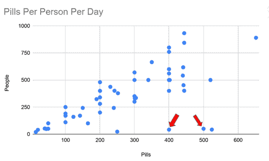
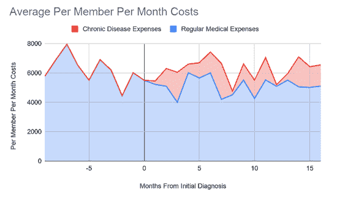

# 我如何使用数据来降低成本和增加利润的 4 个例子

> 原文：<https://betterprogramming.pub/4-examples-of-how-i-used-data-to-reduce-costs-and-increase-profits-2921d8ad5107>

## 适用于大型、中型或小型企业的提示

在 [Unsplash](https://unsplash.com/@adeolueletu?utm_source=unsplash&utm_medium=referral&utm_content=creditCopyText) 上由 [Adeolu Eletu](https://unsplash.com/@adeolueletu?utm_source=unsplash&utm_medium=referral&utm_content=creditCopyText) 拍摄的照片

有很多关于如何应用数据、数据科学和机器学习来帮助做出关键商业决策的讨论。

由于我们的团队与美国各行业的各种公司合作，我们有很多机会不仅仅是交谈。我们已经帮助许多公司将他们的数据转化为有价值的决策。

并非每个数据项目都需要复杂的模型或机器学习。然而，所有这些都变成了我们的客户增加收入或降低成本的机会，这一切都是通过数据的力量实现的。

在今天的文章中，我们将与您一起讨论和思考其中的一些用例。希望它们能激发你寻找方法，通过数据洞察来帮助改善你的公司。

特别是，我们将重点关注欺诈检测、服务蚕食、动态定价和跟踪慢性病的成本。这些案例中的每一个都为我们的团队提供了不同的挑战和机会，通过结合使用数据工程和数据科学来提供更好的决策的清晰路径。

# 检测异常值—欺诈和超级用户

客户的一个常见问题是弄清楚人群中谁表现出某种异常行为，如欺诈、成为产品的超级用户或阿片类药物的处方。

通过寻找异常值，这些通常很容易被发现。这是关于找出人群中谁在[进行欺诈或不良行为的有趣之处。](https://www.theseattledataguy.com/healthcare-fraud-detection-with-python/)一般会突出来。

为什么？

因为这些行为不仅偏离了正常行为，也偏离了它们自己的模式。

例如，让我们看看阿片类药物的流行。许多报告显示，美国一些县的人均服药率远高于正常水平。

俄亥俄州杰克逊县的人均年服用量为 107 片。相比之下，大多数其他县只有这个数字的三分之一或四分之一。

看着文章中的地图，杰克逊县赫然在目。这类似于欺诈行为。

我们已经能够帮助公司类似地检测医疗欺诈。在医学领域，有一种东西叫做*upcode*。[升级编码](https://www.verywellhealth.com/what-is-upcoding-2615214)指的是医疗提供者可能会为比他们所做的更昂贵的服务开出账单的过程。

现在，向上编码可以以几种方式出现在数据中。例如，一种方式可以是全科医生不断地为紧急程序编码(比普通版本更昂贵)。

这意味着对于所述从业者来说，正常程序与紧急程序的比率通常较低。这通常会很突出。老实说，你通常可以看到它被绘制成散点图或分布图。

如下所示。

图片来源:作者

图片来源:作者

现在剧情很少够用。然而，这通常有助于讲述你的故事。当你带着这张图表去开会时，很容易向你的主管展示你可以在哪些地方省钱。

# 服务自相残杀——从自己身上偷钱

随着企业的成长，他们通常希望创造新的服务和产品。然而，这些产品和服务经常会交叉到你的企业已经在销售的其他服务和产品中。

有时这是可以的，因为你宁愿拆自己的产品，也不愿让竞争对手带着自己的新产品进来。想想 iPhone vs iPod。没错，苹果毁了 iPod 的销量。但如果他们没有，别人也会有。

另一方面，有时你只是提供一个重复的服务或产品。

想象一家咖啡店把相似的店放得太近。很久以前，华盛顿的 [Krispy Kreme](https://www.thestreet.com/opinion/behind-krispy-kremes-pain-10159126) 就发生过类似的事情，当时他们在扩张和蚕食自己的业务后不得不收缩。

我们的一个客户开始做类似的事情。这并不罕见。你的生意做得很好，所以你认为是时候扩张了。但是我们的一个客户没有意识到他们正在蚕食他们的服务，并且获得了最低的投资回报率。

在我们对他们的服务进行分析后，我们的团队很快发现了这一点。我们看到，他们的新服务实际上只为其他服务的相同成本增加了大约 3%的额外收入，而其他服务的成本约占收入的 13%-15%。

最终，客户只需要将他们的客户推向他们已经提供的其他服务，并减少重复服务。

# 动态定价—提高利润

像优步和 T2 这样的公司已经使用动态定价来优化用户和他们服务的成本。通过结合历史和当前数据，这些公司能够更好地为其服务定价。

但是优化定价并不局限于科技公司。事实上，有许多其他行业也可以从大型科技公司使用类似技术来更好地为他们的服务定价中受益。我们已经帮助运输行业中的一家这样的公司开发了自己的易于使用的工具，使他们能够更好地管理定价。

它不仅为该公司提供了增加收入的机会，还可以更好地管理员工和加班，因为他们更清楚哪些天会大量使用他们的服务，哪些天/月会减少加班时间。事实上，我们继续与该客户进一步合作，优化和分析他们业务的其他部分。

关于动态定价和利用的最后一点:动态定价甚至不总是需要定制工作。

有几种服务可以帮助填补这个空白。例如， [PricingHub](https://www.pricinghub.net/) 就是这样的一个例子。然而，与构建您自己的系统相比，从长远来看，您可能仍然会花费类似的金额来实施他们的系统，然后逐月地管理它。此外，预打包的工具通常不太健壮，可能被开发来广泛地解决问题，而不是满足您的需求。

# 预测慢性病的成本

当你开发一个分析或[仪表板](https://www.theseattledataguy.com/real-life-use-cases-of-dashboards-with-actual-roi/)时，你经常需要弄清楚终端用户希望从所述交付物中做出什么样的行动或决定。

例如，我们团队的一个用例是帮助一家医疗保健提供商弄清楚他们的新政策是否既改善了患者的健康又降低了成本，这种想法是，如果您可以改善患者的健康，您就可以反过来降低成本。我们团队的第一个项目就是这样。在这个项目中，有两个阶段。在第一阶段，我们发现当前的分析师一直试图使用 Microsoft Access 运行基本查询。

问题是数据太大，Microsoft Access 无法处理。

因此，我们的第一步是将数据转移到一个更好的系统中。在这种情况下，该公司是一家微软商店，所以我们使用微软 SQL Server。

仅这一项就将可能需要 10 到 20 分钟运行的查询在几毫秒内完成。因为这个小小的改变，我们的团队现在能够开发更复杂的查询。这是拥有一个不仅专注于复杂模型和算法，而且拥有良好数据原则的团队的好处之一。

我们能够建立一个数据库，不仅允许我们，也允许公司的其他团队开始执行分析。

在此基础上，我们的团队开发了一个模型，该模型有助于概述患者在感染慢性病后将经历的未来成本，并显示医疗保健提供商的新政策如何改善这些成本。

下面是我们如何显示数据的一个例子。我们的模型使用了几个特征来预测特定慢性病患者诊断的平均成本与医疗保健提供者是否继续他们改进的政策的对比。

图片来源:作者

# 伟大的数据带来伟大的决策

归根结底，拥有大量数据会带来重大决策。我们已经在上面的用例中使用数据，以及与其他客户一起，帮助客户做从驱动[业务战略到开发仪表板](https://www.theseattledataguy.com/17-questions-you-need-to-ask-about-your-data-strategy/)的一切事情，以获得新客户。