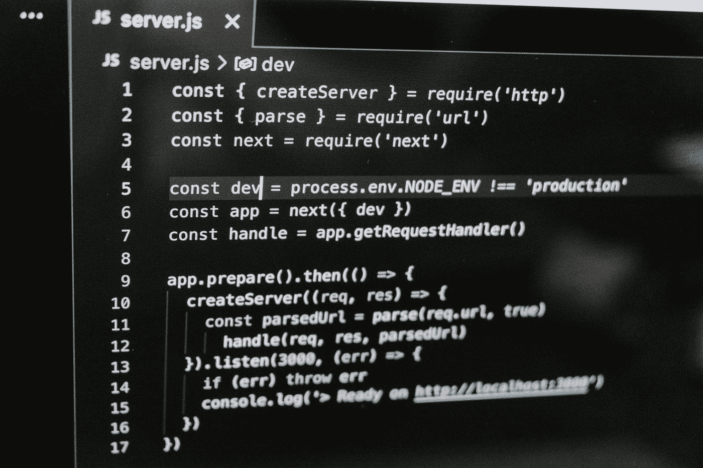

# Next.js 中 4 个非常有用的特性

> 原文：<https://betterprogramming.pub/4-extremely-useful-features-in-nextjs-af93fa1ea06f>

## 包括改善形象，搜索引擎优化，编译器，中间件，以帮助您更好地工作

詹姆斯·怀斯曼在 [Unsplash](https://unsplash.com?utm_source=medium&utm_medium=referral) 上的照片

# 概观

最好的 React 框架是什么？毫无疑问，我认为是 Next.js，它内置了优秀的特性，如 SSG 和 SSR、增量静态生成、快速刷新、自动 polyfill、基于文件系统的路由、高效的代码拆分和打包、SWC 快速编译等

有几个功能设计我认为最适合项目工程，对性能优化和用户体验有显著效果。

# 模糊数据 Url

当你的网站上加载了很多图片时，它们是空白的，还是你添加一个加载的更好。

然而，更好的做法是使用`next/image`，它将在图像成功加载之前设置一个占位符图像。以下是官网提供的在线示例:

*   [演示默认](https://image-component.nextjs.gallery/placeholder) `[blurDataURL](https://image-component.nextjs.gallery/placeholder)` [道具](https://image-component.nextjs.gallery/placeholder)
*   [用](https://image-component.nextjs.gallery/shimmer) `[blurDataURL](https://image-component.nextjs.gallery/shimmer)` [道具](https://image-component.nextjs.gallery/shimmer)演示微光效果
*   [用](https://image-component.nextjs.gallery/color) `[blurDataURL](https://image-component.nextjs.gallery/color)` [道具](https://image-component.nextjs.gallery/color)演示颜色效果

太棒了，这种闪烁的渐变效果给用户的感觉很棒，当然这也是我认为在用户体验方向做得比较好的项目之一。事实上，`nextjs/image`还支持 Webp、AVIF 格式的图片和不同格式的较小尺寸的图片(特别是在移动设备上更好)

而且相信我，这能有效提升用户体验！

# Rust 编译器

这是一个开拓性的进步。在 Next.js 12 版本中，默认使用 [SWC](https://swc.rs/) 来编译 JavaScript 和类型脚本文件。而且你也不需要担心编译问题，因为 Next.js 有一个完美的向后兼容解决方案。

另外，Next.js 更好的做法是，如果你的项目使用 Babel，那么它将为你提供 SWC 的快速实现。这也意味着您的新项目将通过 SWC 自动编译 JavaScript 和 TypeScript 文件。

另外很重要的一点是 Rust 编译器包含了代码压缩的功能，[比 Terser](https://swc.rs/blog/perf-swc-vs-babel) 快 7 倍。在当前阶段，rust 编译器的代码压缩是可选的

同时，Next.js 快速刷新功能是我的最爱！你能想象当你使用一个`useState`，修改部分代码，返回页面后又回到之前的状态时的惊喜吗？

在下面的代码沙箱中尝试以下操作:

# 感知 Bot 的 ISR (SEO)

目前，当您设置`fallback:true`时，ISR 将在页面生成之前，在第一次请求特定页面时呈现回退状态页面。如果想阻止页面的渲染，可以使用`fallback: ‘blocking’`

在 Next.js 12 中，[网络爬虫(如搜索机器人)](https://nextjs.org/learn/seo/introduction-to-seo/webcrawlers)会自动对使用`fallback: true`的页面进行服务器端 ISR。

虽然对于非 crawler 客户端来说，仍然会显示之前的回退状态页面，但是对于 crawler 客户端来说，这可以阻止它索引当前的回退页面，因为这并不是每个站长想要的结果。

# 中间件

这绝对是另一个伟大的特性，首先，中间件使你能够使用代码而不是配置。这为您在 Next.js 中提供了充分的灵活性，因为您可以在请求完成之前运行代码。基于用户的传入请求，您可以通过重写、重定向、添加头，甚至流式传输 HTML 来修改响应。

## 简单的例子

1.  安装最新版本的 Next.js: `npm install next@latest`
2.  然后，在您的`/pages`目录下创建一个`_middleware.ts`文件。
3.  最后，从`_middleware.ts`文件中导出一个中间件函数。

定义一个中间件

它将在`/pages`目录中的所有路线上运行

值得一提的是，中间件可以用于共享一组页面逻辑的任何东西，包括:

*   [认证](https://github.com/vercel/examples/tree/main/edge-functions)
*   [Bot 保护](https://github.com/vercel/examples/tree/main/edge-functions)
*   [重定向和重写](https://github.com/vercel/examples/tree/main/edge-functions)
*   [处理不支持的浏览器](https://github.com/vercel/examples/tree/main/edge-functions)
*   [功能标志和 A/B 测试](https://github.com/vercel/examples/tree/main/edge-functions)
*   [服务器端分析](https://github.com/vercel/examples/tree/main/edge-functions)
*   [高级 i18n 路由要求](https://github.com/vercel/examples/tree/main/edge-functions)
*   [测井](https://github.com/vercel/examples/tree/main/edge-functions)

# 参考

 [## next/image | Next.js

### 注意:这是图像组件和图像优化的 API 文档。有关功能概述和用法…

nextjs.org](https://nextjs.org/docs/api-reference/next/image#blurdataurl)  [## Next.js 12.1

### 我们很高兴在 Next.js 12.1 中发布我们最需要的特性之一:通过运行 npm i…立即更新

nextjs.org](https://nextjs.org/blog/next-12-1?utm_source=next-site&utm_medium=banner&utm_campaign=next-website)