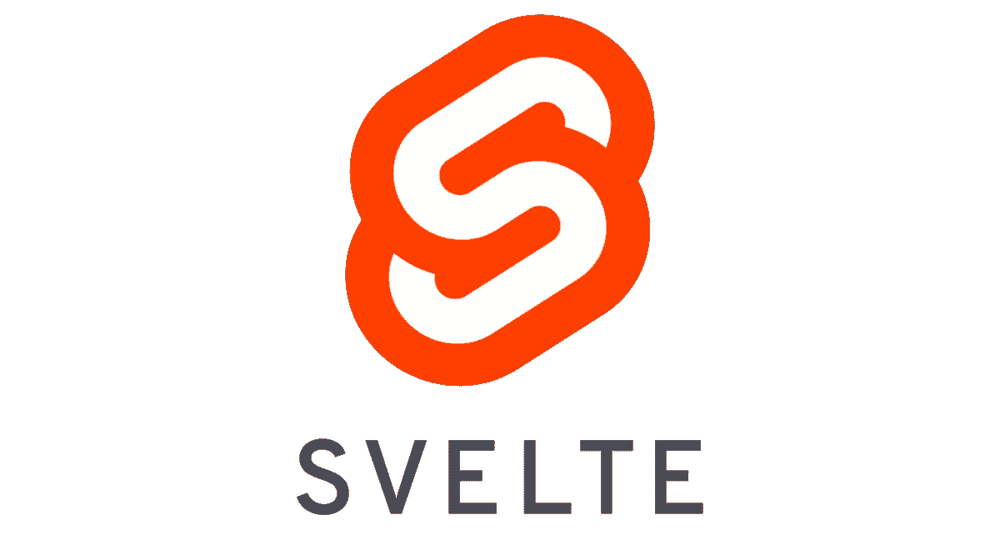
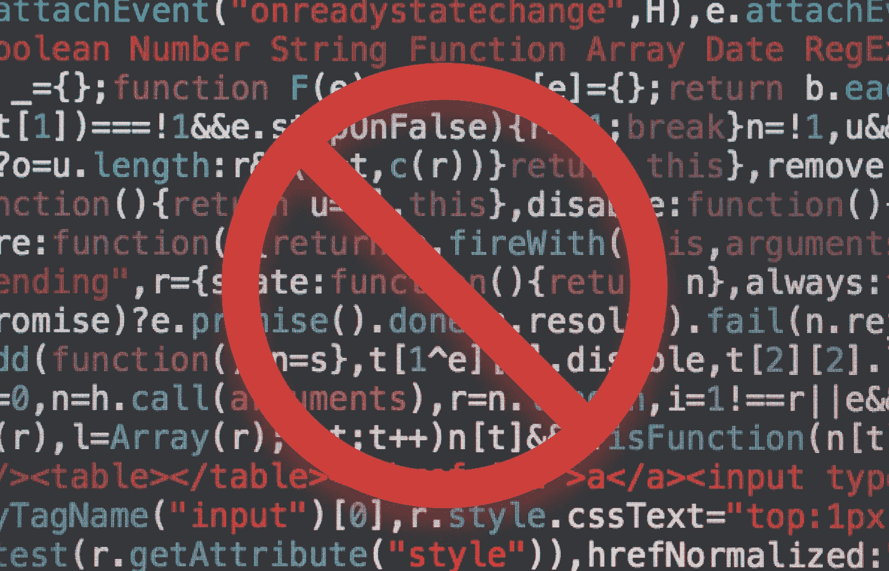
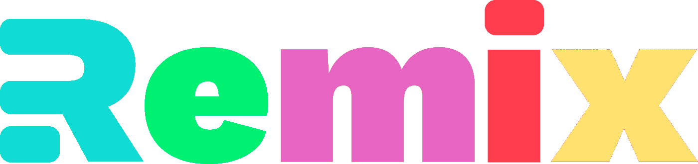
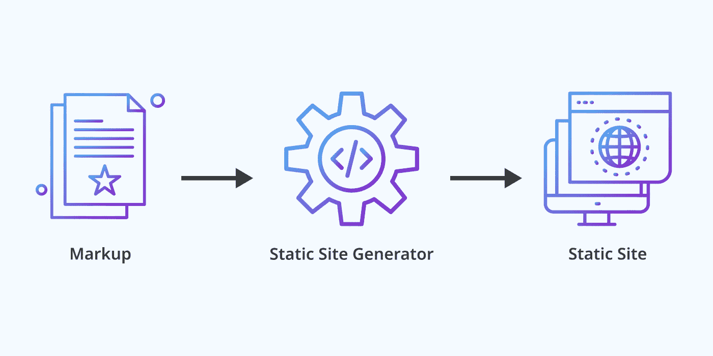
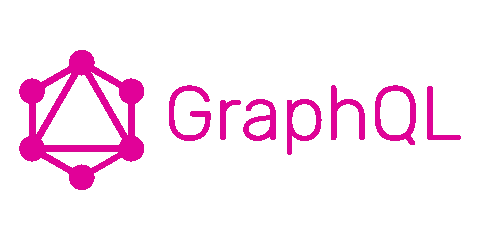

# 4 个前端趋势和 1 个失败者

> 原文：<https://betterprogramming.pub/4-front-end-trends-and-1-loser-5ce22c2406da>

## 2021 年要寻找的东西

蒂姆·哈夫纳在 [Unsplash](https://unsplash.com?utm_source=medium&utm_medium=referral) 上的照片。

我知道现在才 11 月，但我们许多人都希望这一年结束，所以让我们来看看 2021 年可能最重要的前端趋势——以及一个我认为不会流行的趋势。

照片来自[身材苗条](https://svelte.dev/)。

# 苗条的

根据[文档](https://svelte.dev/blog/svelte-3-rethinking-reactivity)，Svelte 是一个组件框架——像 React 或 Vue——但是有一个重要的区别。不同之处在于 Svelte 在构建时运行，将您的代码转换成高效的 JavaScript。因此，您可以获得组件框架的好处，而不会损失性能。

Svelte 已经存在几年了，最新版本(3)于 2019 年发货。它在 GitHub 上有超过 39K 颗星星，但它没有广泛用于更大的项目，因为它仍然被认为是不成熟的。那么为什么 2021 年会是 Svelte 受欢迎的决定性一年呢？

组件框架的典型问题是它们呈现在客户端，所以搜索机器人得到的几乎是空的 HTML，这对 SEO 是不利的。为了缓解这个问题，每个图书馆都有自己的解决方案。对苗条的人来说，通常是工蜂。但在 10 月，在 2020 年苗条峰会上，它的创造者决定放弃 Sapper，并提出一种新的方法来制作苗条的应用程序。

这种新方法将基于一种苗条的身材。它的目标是关注开发人员的体验，提供快速构建、热模块重载、错误覆盖和无服务器支持。如果 Svelte 可以添加无缝体验和开箱即用的 SSR 支持，它可能会改变游戏规则。

因此，似乎 Svelte 将为开发者提供一流的体验。但这足以说服他们使用它吗？

由 [Markus Spiske](https://unsplash.com/@markusspiske?utm_source=unsplash&utm_medium=referral&utm_content=creditCopyText) 在 [Unsplash](https://unsplash.com/s/photos/code?utm_source=unsplash&utm_medium=referral&utm_content=creditCopyText) 上拍摄的照片。

# **无代码/低代码**

无代码工具允许没有编程经验的人，即“公民开发者”，来创建软件。同时，具有一些编程经验的人可以使用低代码工具来创建软件并对其稍加修改。

多年来，公民开发者可以使用像 [Squarespace](https://www.squarespace.com/) 或 [Wix](https://wix.com/) 这样的工具创建网站。但是在过去的几年中，许多新的工具已经出现，让每个人都可以制作大量的其他应用程序。

你现在可以创建[移动应用](https://thunkable.com/#/)，使用[机器学习](https://runwayml.com/)，给电子商务网站添加[增强现实](https://www.scapic.com/)，构建[语音应用](https://www.voiceflow.com/)，[聊天机器人](https://landbot.io/home-alt?utm_expid=.2NpFdZsoSV2FEWbaZApyiQ.1&utm_referrer=https%3A%2F%2Fwww.google.com%2F)，或者设计[复杂表格](https://www.typeform.com/)。新工具的数量惊人。

我知道无代码和低代码工具的许多限制。他们开发的应用程序彼此相似，功能有限，有严格的限制。此外，供应商锁定可能会严重打击许多企业。但从长远来看，我觉得这并不重要。

这些工具为每个人提供了构建软件的独特机会。任何人只要有一个想法，一点钱，几周的时间，就能创造出他们梦想中的应用程序。取代了数月的开发和数千美元的投入，效果将会立竿见影。这将为廉价的概念验证或 A/B 测试提供一个很好的机会。

我不相信无代码会消除对软件开发人员的需求。但它将使人们能够自己构建东西，并让开发人员专注于更复杂和有趣的问题。

图片来自[混音](https://remix.run/)。

# 再搅拌

根据它的创造者的说法，Remix 是一个基于 React 和节点的全栈框架，它给你带来了最先进的 web 开发，而没有留下使 web 变得伟大的基础。

Remix 提供了开箱即用的 HTTP 缓存、元标记支持和带有正确状态代码的服务器呈现。它还为您提供了嵌套路径和加载数据的简单方法。

你可能会认为混音是现代的 Ruby on Rails。它努力将优秀的开发人员经验和开发速度与在单页面应用程序(SPA)时代被遗忘的 web 基础结合起来。

混音还不能用于生产。它刚刚开始它的测试版(它被称为支持者预览版)。这个框架看起来很有前途，由 React 世界中最有影响力的两个开发者维护——伟大的 [React 路由器](https://reactrouter.com/)的创造者。

混音的坏处？不是免费的。目前，一个独立许可证每年花费 250 美元。最大的 Remix 竞争对手 Next.js 是免费的。

开发人员已经习惯了开源，并期望免费获得他们的工具。看看你需要付费购买的一款优秀软件能否成为流行的选择，这将是一件有趣的事情。

图像由[玛格达·瓦克斯伯格](https://www.linkedin.com/in/magda-waksberg-986754180?originalSubdomain=pl)拍摄。

# 静态站点生成

单页应用程序对 SEO 来说不是很好。在过去的几年里，我们有两种解决方案:服务器端渲染(SSR)和静态站点生成(SSG)。

使用 SSR，我们在服务器上运行应用程序。它创建由前端获取的 HTML。使用 SSG，我们在构建时创建应用程序的所有页面。因此，存储在服务器上的文件是静态的，由浏览器读取，就像标准的非 SPA 应用程序一样。

SSR 最大的问题是，在服务器上构建一个应用程序需要很多资源，可能会很慢，所以它增加了页面加载时间。SSG 的缺点是每一个小的改变都需要重新构建和创建所有的应用程序页面。如果应用程序有很多页面，这个过程将会很慢，而且成本很高。

现在看起来 SSG 赢了，SSR(几乎)死了。Next.js 是一个流行的全栈框架，它将 SSG 作为默认设置，并增加了增量构建，以缓解每次更改都要重建所有页面的问题。此外，像 Gatsby 这样的静态站点生成器为他们的产品增加了增量构建。

凭借出色的速度、安全性和发展经验，SSG 将成为 2021 年的明显赢家。

但是不要忘了混音。它基于 SSR，所以如果它大获全胜，这种方法可以回到游戏中。

图片来自 [GraphQL](https://graphql.org/) 。

# 伟大的失败者——graph QL

根据[文档](https://graphql.org/):

> “GraphQL 是一种用于 API 的查询语言，也是用现有数据完成这些查询的运行时。GraphQL 为您的 API 中的数据提供了完整且易于理解的描述，使客户能够准确地要求他们需要的东西，使 API 更容易随着时间的推移而发展，并支持强大的开发工具。”

那是什么意思？这意味着它是 REST API 的替代品。在 REST 中，通常有几十个端点，每个端点都会返回太多的数据。GraphQL 允许您拥有更少的端点(通常是一个),并定义需要获取的数据。

GraphQL 在 2015 年开源，并定期列出“插入年度最热门趋势”的列表，但它仍然不是很受欢迎。为什么第二年会有所改变？

不会的。

GraphQL 旨在解决一系列特殊的问题——许多团队都没有的问题。作为交换，它引入了新的困难:缓存、伸缩、缺少 HTTP 状态处理等。

GraphQL 很棒，但是对于许多开发人员来说不值得这么麻烦。所以还是会被一些公司使用但不会大幅上涨。至少 2021 年不会。

你呢？你认为 2021 年什么会暴涨？