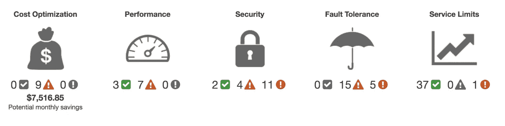
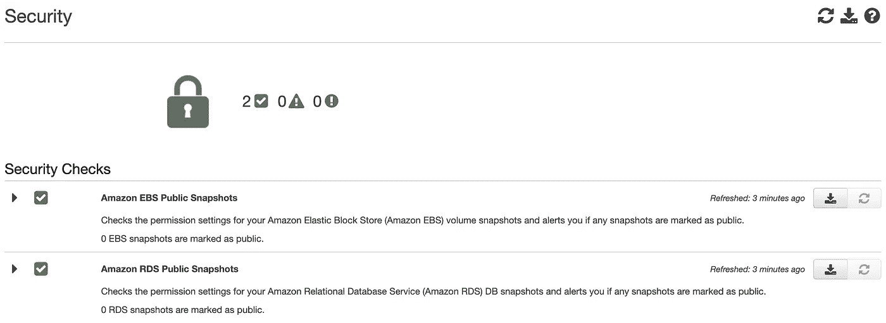
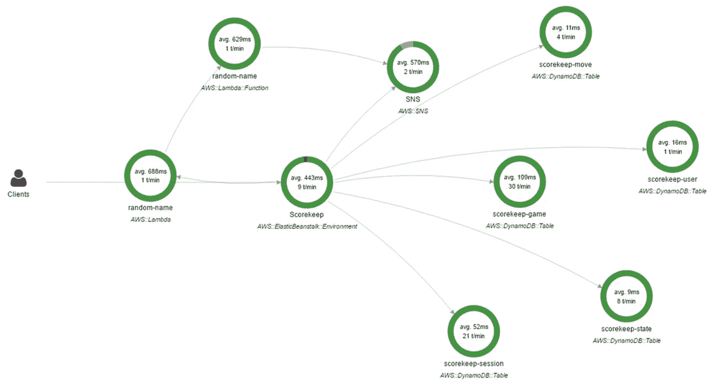

# 4 项出色但被低估的 AWS 服务

> 原文：<https://betterprogramming.pub/4-great-but-underrated-aws-services-3284ffcb6073>

## 以及如何利用它们来改善您的基础设施

克里斯蒂娜@ wocintechchat.com 在 [Unsplash](https://unsplash.com/s/photos/server?utm_source=unsplash&utm_medium=referral&utm_content=creditCopyText) 上的照片[。](https://unsplash.com/@wocintechchat?utm_source=unsplash&utm_medium=referral&utm_content=creditCopyText)

如今，亚马逊网络服务在数字业务中被广泛使用。这是可能的，因为每个人都听说过 EC2、SQS 或 S3 等服务。这些在生产系统中被大量使用，而且效果很好。2020 年，AWS 提供超过 175 项服务。可想而知，很难全部记住。结果，虽然其中一些非常有用，但是没有人谈论它们。

因此，我准备了一个 AWS 上的四项服务的列表，您的团队可以从中受益。

# 1.云的形成

CloudFormation 是一项使我们能够将基础设施描述为代码的服务。基础设施作为代码是一种众所周知的做法，通过配置文件来设置和管理 IT 基础设施。有了 CloudFormation，我们可以定义所有需要的组件以及它们之间的依赖关系。

将所有内容都放在配置文件中有一些好处。首先，它使加速过程成为可能，因为任务只存在于代码中。不同服务之间没有导航，也没有通过用户界面连接它们。其次，它增加了更多的可靠性，减少了人为错误。代码可以被其他工程师审查，如果出现错误，修改可以很快恢复。

例如，下面这段代码在您的帐户下创建了一个新的 S3 存储桶:

正如您所看到的，在任何时候，只有 7 行代码就可以用默认设置创建一个新的 S3 桶。无需通过 AWS 控制台手动完成工作。

CloudFormation 支持两种格式:JSON 和 YAML。除此之外，CloudFormation 还提供了嵌套堆栈、导出值或在堆栈之间传递参数等功能。的确，它是维护整个公司基础设施的非常强大的服务。

CloudFormation 是一项免费服务，您只需为提供的组件付费。

# 2.值得信赖的顾问

您是否希望确保您的系统符合安全标准？您是否希望优化当前设置的成本？您需要值得信赖的顾问。它就如何提高容错能力、增强性能和安全性以及降低成本提供了指导。

可信顾问仪表板

每个部分都有一个建议操作列表。这些操作是根据您的设置建议的。Trusted Advisory 对使用中的组件进行实时持续检查，并对其进行评估。

可信顾问安全仪表板

如果发现问题，可信赖的顾问会提供关于该问题的详细解释，并建议解决问题的方法。这项服务将帮助您以正确和最有效的方式使用不同的 AWS 组件。

可信顾问有不同的支持计划。这意味着如果你想启用更多的功能，你必须升级你的计划。

# 3.认知

许多网站都提供注册和创建帐户的选项。作为开发人员，我们知道它的成本。这项任务是琐碎的，但仍然需要大量的时间来建立一个用户管理系统。您的用户不仅希望注册和登录，还希望更新他们的个人资料或在忘记密码时恢复密码。

谢天谢地，AWS 有一个很棒的服务叫做 Cognito。它具有广泛的用户管理功能。您可以定义用户注册时哪些字段是必填的，定义密码强度和多因素身份验证等策略，指定自定义 UI 等。可以为每个用户动作连接 Lambda 函数。例如，每次用户登录系统时，Lambda 函数可以向数据库记录或发送推送通知。

除此之外，Cognito 还有一个面向移动平台和网络的 SDK。借助 SDK，可以更轻松地将完整的解决方案与前端客户端集成。为您的解决方案构建新的用户管理功能从未如此简单。

# 4.x 射线

AWS 上未被充分利用的最后一项服务是 X 射线。它的目的是帮助开发人员调试和分析分布式应用程序。这对开发者很有用。如果运行的生产系统出现任何问题，X 射线使我们能够追溯组件之间的所有请求和响应，并识别问题或瓶颈。

x 射线的工作原理如下。首先，必须将 SDK 添加到应用程序中。然后需要启动 X 射线守护程序。它作为一个中间件收集所有请求，并将其与 AWS 控制台同步。稍后，对 AWS 服务、数据库和 HTTP/HTTPS 请求的所有调用都将被可视化，以供进一步分析。

来自[文档](https://docs.aws.amazon.com/xray/latest/devguide/xray-console.html)的 X 射线控制台示例。

这使得 X 射线对于构建分布式系统的工程师来说是一个非常有用的服务。还有其他可用的特性，如采样规则、分组和详细分析。您必须检查它，因为它可以为您的应用程序如何工作带来一些见解。

# 结论

从 S3 等通用服务开始，到机器学习的特定服务结束，亚马逊网络服务可以为每一家数字企业提供很多东西。请随意探索它们，让您的公司更上一层楼。