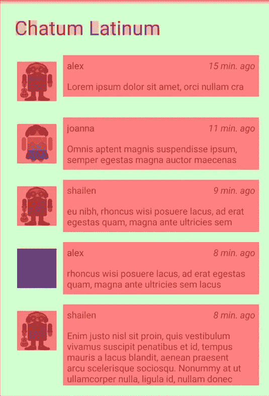
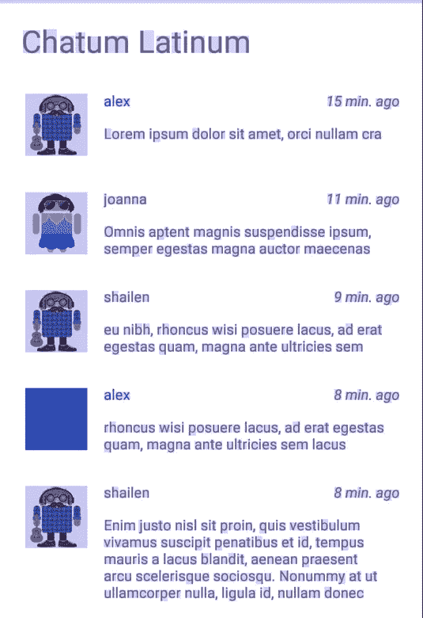

# Android 设备中的 4 个隐藏工具

> 原文：<https://betterprogramming.pub/4-hidden-tools-inside-your-android-device-b208336a7571>

## 重新发现您的开发者选项

劳拉·乔伊特在 [Unsplash](https://unsplash.com?utm_source=medium&utm_medium=referral) 拍摄的照片。

每个 Android 开发者都是通过在设备上启用开发者模式来开始他们的旅程的。如果没有此选项，您将无法在手机上安装应用程序。

虽然此菜单可以解锁您的设备进行部署，但它也包含许多调试工具。有一天，他们中的一个可能会把你从可怕的处境中拉出来。

因此，在深入研究代码之前，让我们花点时间看看开发人员选项中的可用工具。我就不一一呈现了。相反，我将把重点放在这些年来对我帮助很大的四个方面。

# 1.优化视图渲染

当构建布局时，您有无数的可能性来声明视图的结构。不要期望你的队友用你的方式编码。

但是，您必须记住视图是如何执行的。我们都喜欢流畅的应用程序，视图渲染取决于你的结构有多高效。

在我作为 Android 开发者的最初几年，我不知道如何优化我的布局。有一天，我的一个客户对他的应用程序如此落后感到不高兴。我不得不调查问题的根源。

然后就碰到了[这篇文章](https://developer.android.com/topic/performance/rendering/inspect-gpu-rendering#debug_overdraw)。

它帮助我极大地优化了视图渲染。通过去除过度绘制和扁平化布局层次，我的应用程序变得更加流畅。

事不宜迟，去你的开发者选项。在“调试 GPU 透支”中，选择“显示透支区域”打开你的应用程序，检查所有的红色区域。

严重透支——图片来自[安卓开发者](https://developer.android.com/topic/performance/rendering/inspect-gpu-rendering#debug_overdraw)

光线透支——图片来自[安卓开发者](https://developer.android.com/topic/performance/rendering/inspect-gpu-rendering#debug_overdraw)。

我必须承认我最近不常使用这个。自从引入`ConstraintLayout`以来，构建平面视图从未如此简单。

我偶尔还是会切换这个选项。它可以帮助您识别:

*   过于复杂的视图，不管子视图有多平。
*   不必要的背景透支。

# 2.让您的应用保持快速响应

当你的应用程序在主线程上做了太多的工作时，系统会试图通过跳过一些帧来进行补偿。你的用户最终会得到一个挂起的界面，这只会导致挫败感。

在最坏的情况下，您的应用程序可能在一定时间内没有响应。然后，系统在用户屏幕上显示应用程序无响应(ANR)对话框。你可以在这篇文章中找到更多信息[。](https://developer.android.com/training/articles/perf-anr)

预防 ANR 似乎显而易见，但它往往被忽视。当您开发 Android 应用程序时，您倾向于关注崩溃，原因有两个:

1.  它们象征着最糟糕的用户体验。
2.  有几种工具可以追踪它们，比如 [Firebase Crashlytics](https://firebase.google.com/docs/crashlytics/get-started?platform=android) 。

缺乏检测 ANR 的指标也于事无补。它们也更难调试，因为需要优化而不是修复代码来防止崩溃。

也就是说，你应该知道开发者选项中有一个工具可以跟踪它们。它被称为严格模式。

通过启用这个选项，系统会在你的应用程序每次在主线程上执行繁重的操作时告诉你。您可以检测线程和虚拟机策略。当你违反其中一条时，你的屏幕周围会有红色边框向你闪烁。

这个提示和控制台中的日志都可以帮助您指出哪里做错了。要深入了解这个话题，我建议看一看这篇文章:

 [## Android 开发工具:StrictMode 的最佳实践

### strict mode(Android . OS . strict mode)是一个开发者工具，它可以检测你可能不小心做错的事情，并且…

android.jlelse.eu](https://android.jlelse.eu/android-dev-tool-best-practice-with-strictmode-a023e09030a5) 

您可以将 StrictMode 与概要文件 HWUI 呈现结合起来。此选项显示不超过阈值的条形。每次这样做时，都会跳过一些帧。

# 3.确保您的应用能够正常恢复

我想说，我们可以从应用程序处理内存压力的方式来对它们进行分类。我们是为内存有限的环境开发的，所以我们应该预料到系统会关闭应用程序的任何部分。当系统重新创建组件时，您必须预测组件的行为。

因为我们无法控制系统，你会发现这很难模拟。幸运的是，我们有一个方便的工具叫做“不要保持活动”

启用此选项后，从后台转到前台，发现您的活动在重新创建时的行为。

您不仅可以检测不适当的行为，而且这个选项还可以帮助您调试崩溃。我数不清这个工具帮我调试了多少次无法重现的崩溃。从我尝试过的所有开发者选项中，它可能是我最喜欢的工具！

现在你可能忘记关闭这个选项了。因为你可能会有奇怪的行为，我建议让你的测试人员知道什么时候它是活动的。例如，当启动应用程序时，您可以在调试模式下显示一个`Toast`。您可以使用以下扩展方法来检测它:

# 4.限制后台进程

我们找到了一种方法来测试记忆对我们活动的压力。我们的后台进程呢？

多亏了 StrictMode，我们看到了利用线程的重要性。你应该专注于努力减轻主线。例如，您可能希望通过`Service`创建后台进程。

然而，在多线程应用中，你无法预料用户的手机能处理多少处理器。

此外，您不是唯一创建后台进程的应用程序。而且安卓系统有时候也要腾出空间。有些会留在记忆里一段时间。有些人会被杀。

您必须确保您的应用程序能够很好地处理您的进程的重建。

在【不保留活动】选项的正下方，可以找到“限制后台进程”字段。它允许您限制同时运行的数量。

要知道这个选项已经超出了开发者的理解范围。几个用户正在他们的电话上启用它:

*   性能原因
*   节省电池

不是每个人都拥有最新的旗舰。Android 生态系统非常庞大，你必须时刻考虑你的应用在其中的表现。

# 使用开发人员选项

不要害羞，尝试一下。不要忽视这些工具。它们可能是调试应用程序的最佳机会。

好的方面是你甚至不需要安装任何东西！你只需要去拜访他们。在这个隐藏的菜单里，他们遭受着微弱的曝光。

我只强调了四种调试工具，但是您也应该研究其他工具。取决于你在做什么，其中一些可能比我更能让你受益。

所以，拿起你的手机，玩玩它们，给你的应用一个惊喜吧！