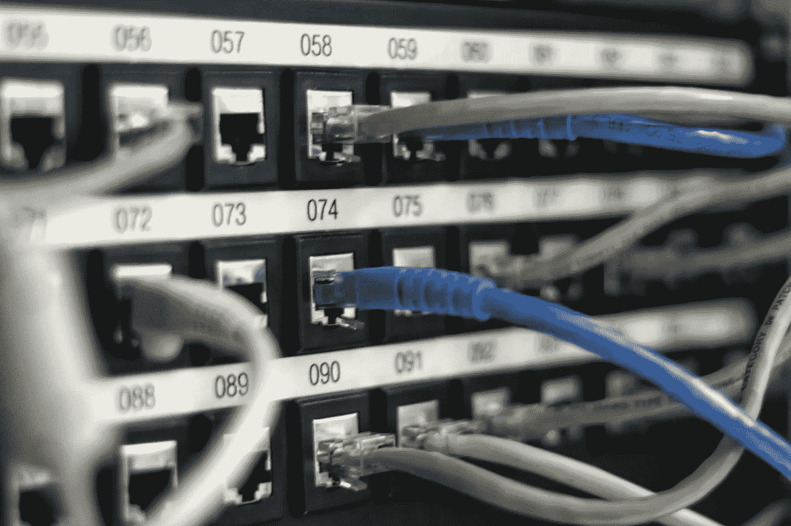

# AWS 上的 4 个重要网络组件

> 原文：<https://betterprogramming.pub/4-important-network-components-on-aws-e9ea362c4c47>

## 让您的应用坚如磐石的服务

照片由[乔丹·哈里森](https://unsplash.com/@jordanharrison?utm_source=unsplash&utm_medium=referral&utm_content=creditCopyText)在 [Unsplash](https://unsplash.com/s/photos/network?utm_source=unsplash&utm_medium=referral&utm_content=creditCopyText) 上拍摄

网络是 Amazon Web Services 上的一个高级主题。初学者可能会花费大量的时间来理解某些网络组件是如何相互绑定的。故障排除也变得很有挑战性，因为可能不清楚哪一层配置错误。

另一方面，将高级网络功能应用到您的云解决方案将使它们更加可靠和安全。正确的设置需要时间，但之后的优势是毋庸置疑的。这里是 AWS 上与网络相关的最重要的服务，需要熟悉一下。

# 虚拟私有云

这是 AWS 上的高级网络组件。它将多种资源组织在一个逻辑结构化的网络中。它们中的每一个都保持隔离，并保持元素的独立性。

例如，我们将一个应用程序的所有资源放在一个 VPC 中。数据库层，缓存，计算实例将是一个 VPC 的一部分。这种方法有助于将调配的资源整合为一个逻辑单元。稍后，我们可以在不同的 VPC 之间建立连接。这些可以在不同的地区，甚至在不同的 AWS 帐户。

此外，VPC 充当从外部进入应用程序的入口点。借助 Direct Connect、Transit Gateway、VPN 等服务，我们的解决方案可以超越 AWS 生态系统进行通信。VPC 在这种情况下发挥了重要作用，因为它不允许将 AWS 帐户中的所有数据暴露给外部。

# 子网络

下一个重要部分是子网。它是虚拟私有云的一部分，定义了要使用的 IP 地址范围。一个 VPC 中可以有多个子网。供应的资源可以放在不同的子网中。通过这种方式，我们获得了更多的逻辑粒度。

子网用于两种情况。首先，我们可以在许多可用性区域中拥有子网。这使得应用程序在其中一个可用性区域中断时可用。

其次，子网可以是私有的，也可以是公有的。公共资源将可以访问互联网，因此分配的资源将对世界其他地方可见。而私立学校(这不足为奇)没有互联网接入。它们是保护数据的完美选择。例如，如果您的目标是高安全级别，数据库必须在专用网络中。因为只有来自另一个子网的资源才能与它们对话。

# 网络访问控制列表

这是子网上的附加安全层。这不是强制性的，但它会非常有帮助。当我们需要控制网络流量时，访问控制列表(ACL)可以很好地帮助我们。它充当子网的防火墙——我们可以设置允许和拒绝规则。

例如，我们可以指定只允许来自特定 IP 地址的 HTTPS 流量。此外，我们必须为 rest 源显式指定拒绝规则(与安全组不同)。这些规则将应用于子网中的所有资源。这是增加子网中 EC2 实例保护的方法。

# 安全组

这是 AWS 上的最后一层网络安全。安全组类似于网络 ACL，也充当虚拟防火墙。但是它有一些不同之处。

首先，它在实例级运行，而不是在子网级。这意味着同一子网中的两个 EC2 实例可以分配不同的安全组。因此，它更像是单个实例上的防火墙。还可以为已经运行的实例分配安全组。

其次，安全组只定义“允许”规则。默认情况下，EC2 实例上不允许所有外部流量。定义网络规则可以逐渐提供对它们的访问。例如，您可以只允许 SSH 连接，并且只允许来自特定 IP 的连接。任何其他类型的连接或来自不同 IP 地址的连接都将被拒绝。

# 结论

熟悉 AWS 上的网络功能将为您的解决方案带来很多好处。您可以配置多个安全级别，并设置不同的访问权限。

尽管这是一个高级话题，但它对于任何云应用程序都是必不可少的。否则，当有人直接访问您的数据库时，您可能会感到惊讶。编程快乐！