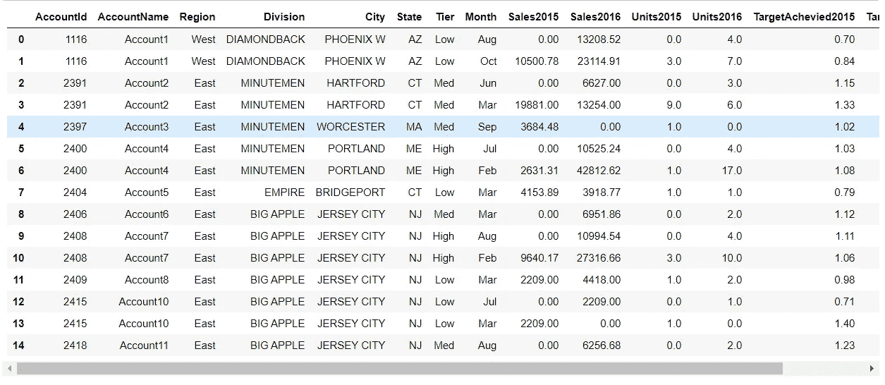
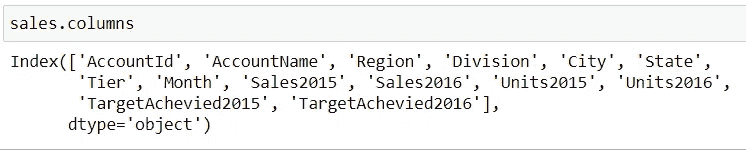
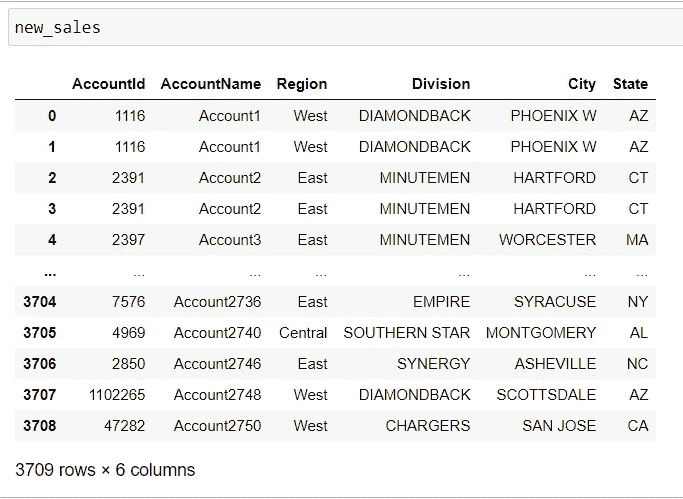
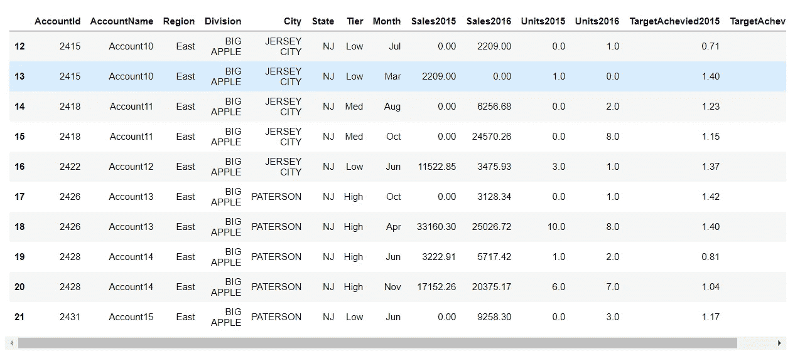
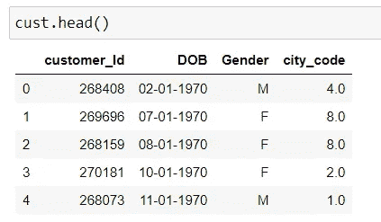
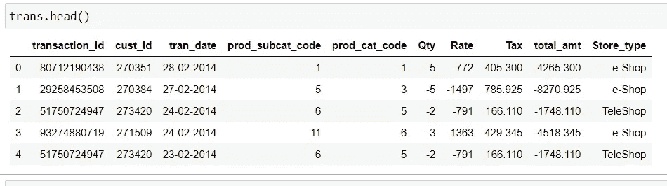
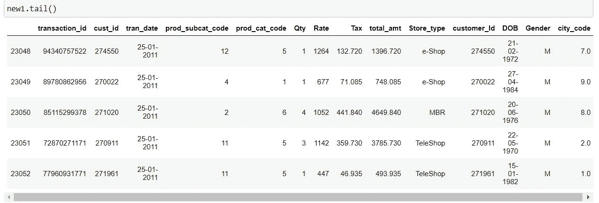
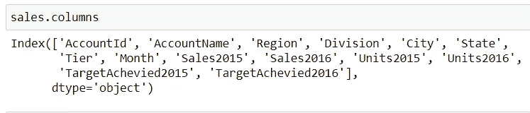
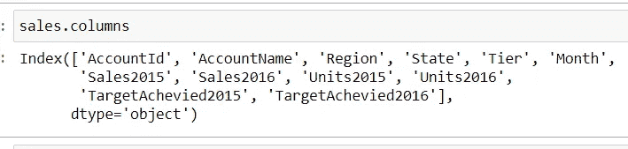
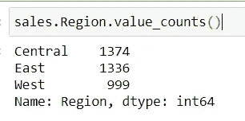

# 你应该知道的 4 个重要的熊猫图书馆操作

> 原文：<https://betterprogramming.pub/4-important-pandas-library-operations-you-should-know-a679348e9bae>

## 数据分析

## 使您的探索性数据分析任务更容易


照片由[米卡·鲍梅斯特](https://unsplash.com/@mbaumi?utm_source=medium&utm_medium=referral)在 [Unsplash](https://unsplash.com?utm_source=medium&utm_medium=referral) 上拍摄

任何数据建模过程的第一步都是分析数据。pandas 是一个非常著名和方便的用于完成数据分析的库。pandas 代表面板数据分析。在这里，*面板*代表我们的数据中不同种类的特征，我们比较这些特征或找到它们之间的关系。

熊猫图书馆的主要目标是操纵数据。这些操作可能涉及添加不同的列、删除列、更改数据集中的数据、合并其他数据集、填充缺失以及许多其他事情，这取决于您的业务。

# 入门指南

本文将涵盖我们在进行探索性数据分析时通常执行的前五项操作。

让我们首先看看我们将用于应用不同的`pandas`库操作的数据集。数据集可以在这里找到[。这是一个 CSV 文件，可以使用 Python 中的`pandas`模块加载。](https://github.com/pranjalAI/Walmart-Store-Sales-Forecasting/blob/master/SalesData.csv)

如果您没有安装`pandas`库，那么您可以使用命令`pip install pandas`来安装库。最后，您可以使用以下命令导入它:

```
import pandas as pd
sales = pd.read_csv("SalesData.csv")
```



用于分析的演示数据集

# 获取数据集的子集

我们经常需要根据列的重要性或者根据一定数量的行来创建数据的子集。

让我们首先看看如何基于列获取数据的子集。

从基于列的过滤开始，我们需要检查数据集中的各个列。



列列表

假设您只需要数据中的特定列来进行分析。这些列是`AccountId`、`AccountName`、`Region`、`Division`、`City`和`State`。

现在，让我们根据所选的列创建数据集的子集。

```
selected_columns=['AccountId', 'AccountName', 'Region', 'Division', 'City', 'State']**new_sales=sales[selected_columns]**
```

首先，我们需要列出选定的列，然后将该列表传递到主数据集中。



结果 new_sales 数据集

现在，让我们看看如何基于行获取数据子集。

```
new_sales_top50=sales.iloc[12:22]
```

上面的命令将给出从索引 12 开始到索引 21 结束的数据。这里，22(结束索引)将被排除。



合成数据集

# 合并不同的数据集

在做数据分析的时候，我们通常会有很多数据来源。为了获得数据的全貌，我们需要尽可能地合并数据集。数据集的合并基于数据集中的共同特征或列。

假设我们有两个名为`customers`和`transactions`的数据集。在这两个数据集中，我们有一个名为`customer id`的公共列。



客户和交易的数据集

我们可以使用下面的命令来合并这两个数据集。我们可以根据需要选择连接的类型。在这里，我们正在进行`left`连接。

```
new1 = pd.merge(trans, cust,  how='left', left_on=['cust_id'], right_on = ['customer_Id'])
```



合成联合数据集

# 删除列

这个操作经常用于从数据集中丢弃任何一组列。让我们假设我们发现`Division`和`City`列不适合我们的分析，我们想要删除它们。

按照以下命令完成工作:

```
to_be_deleted=['Division', 'City']
sales=sales.drop(to_be_deleted, axis=1)
```

我们需要创建一个要删除的列的列表，并在 drop 函数中传递该列表。



下落前与下落后

# 获取类别计数

当我们需要查找任何列中的类别数时，这个操作非常有用。这个操作在绘制数据的条形图时也很有用。

假设我们必须在销售数据集中找到每个地区的观察次数。我们可以使用下面的代码。

```
sales.Region.value_counts()
```



每个区域的观察次数

# 结论

好了，这篇文章就到这里。这些是 Python 中数据分析最常用的操作。

感谢您的阅读！