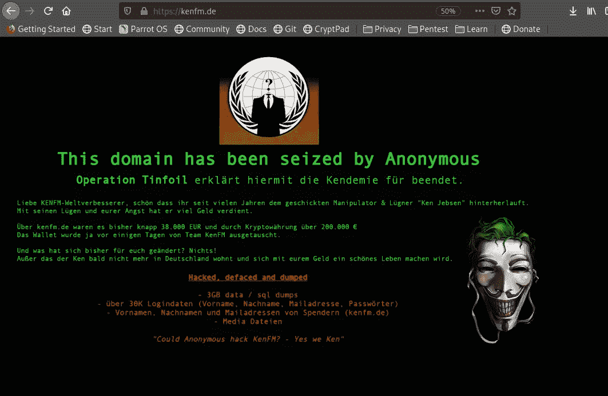
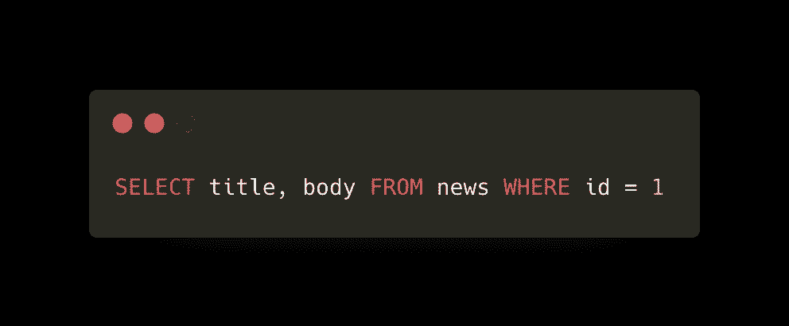
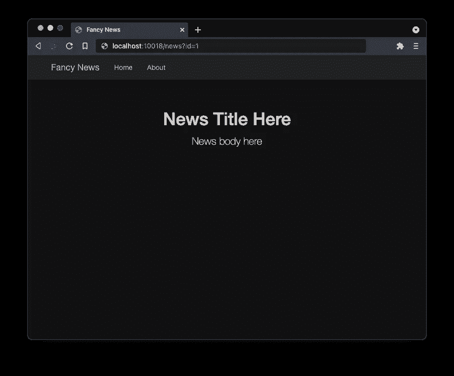
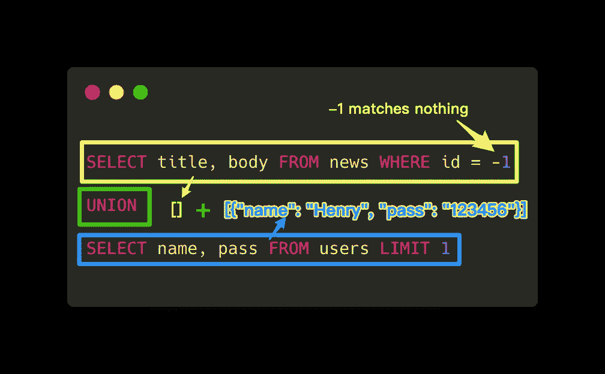
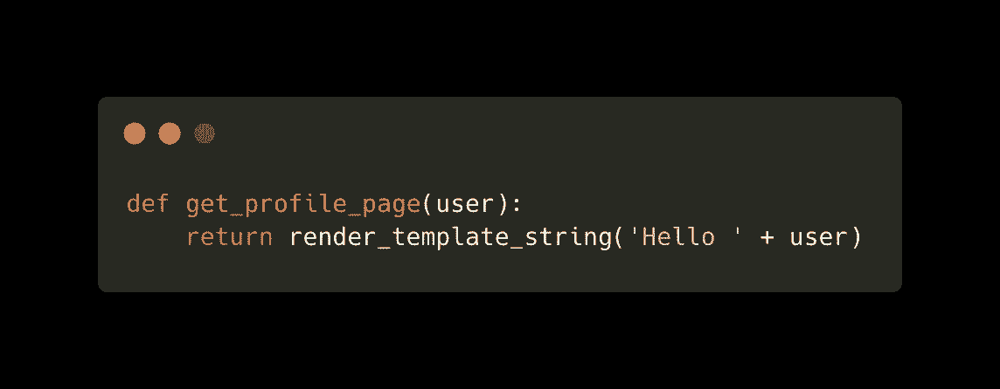
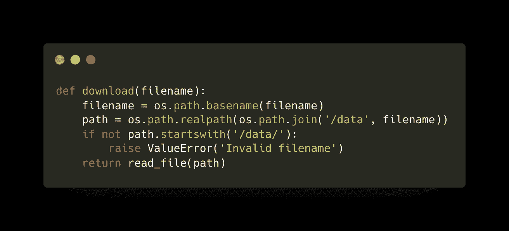

# 4 注入 bug 及如何处理

> 原文：<https://betterprogramming.pub/4-injection-bugs-and-how-to-deal-with-them-db4a411ad5bc>

## 从您的代码库中清除 bug


由 [Roman Synkevych](https://unsplash.com/@synkevych?utm_source=medium&utm_medium=referral) 在 [Unsplash](https://unsplash.com?utm_source=medium&utm_medium=referral) 上拍摄的照片

bug 和漏洞是一回事。当用户不小心打了一个，投诉举报，我们称之为 bug。当攻击者利用一个漏洞造成影响时，我们称之为漏洞。

我已经负责任地披露了几个高严重性的漏洞(bug)，但其中一个[被勒索软件集团利用来针对无辜的人。披露漏洞可以帮助研究人员发现更多的漏洞并修复它们，但它也可以让网络犯罪分子受益。](https://infosecwriteups.com/qnap-pre-auth-root-rce-affecting-450k-devices-on-the-internet-d55488d28a05)

所以我决定写文章来帮助开发人员理解这些漏洞是如何工作的，并提供实用的指南来帮助防止这类错误。现在来说说注射 bug！

# 注入错误的本质

让我从《尖峰时刻 3》中的一个场景开始:

“你是谁？”詹姆斯冲着余师傅喊。

“余。”俞大师回答。

“不，不是我，是你！”詹姆斯回敬道。

“没错，我就是余。”俞大师说。

“回答那些该死的问题！你是谁！”

这可以继续下去，但你得到的想法。

那里发生了什么？“于”这个名字听起来像“你”詹姆斯期望听到一个名字，他做到了，但他理解(解析)为代词(你)。俞师傅在这里不小心表演了一个代词注射。

当输入包含接收者不期望的其他类型的数据时，就会发生注入。

打针可以开“我是于”这样的玩笑，但是对于软件开发来说一点都不好笑。让我们看看一些最有影响力的例子和避免它们的最佳实践。

# 1.命令注入

考虑这个 API: `/ping?ip=1.1.1.1`

不管你使用的是什么编程语言，它最终都可能使用 shell 来执行`ping -C1 1.1.1.1`。

利用这一点最常见的方法是使用 shell 特性，如:

*   元字符:如`|`、`&`、`;`
*   控制符:如`||`、`&&`
*   命令替换:如`$(...)`、``...``

例如:

*   `/ping?ip=;reboot` → `ping -C1 ;reboot`
*   `/ping?ip=$(reboot)` → `ping -C1 $(reboot)`

在这两种情况下，如果有足够的权限，您的计算机可能会重新启动。shell 附带了许多有用的工具，许多程序员喜欢在他们的程序中使用这些工具，这样他们就可以编写更少的代码。

## 根本原因

期望:`ip`是一个有效的 IP

Got: `ip`包含触发意外 shell 逻辑执行的特殊字符

## 影响

*   数据泄露
*   可能的全面危害(整个生产服务器，可能还有您的云或内部网)
*   以及更多(您可以用 shell 做的任何事情)

你可以开始思考你将如何处理这样的问题，稍后我会谈谈我的建议。

# 2.文件路径注入

考虑这个 API: `/download?file=report.pdf`

让我们假设这个调用深入到打开文件`/data/report.pdf`。

利用这一点最明显的方法是`file=../etc/passwd`，它下载一个意外的文件`/etc/passwd`。

与下载相反，攻击者还可以将恶意文件上传到您的服务器。最常见的漏洞是将上传的文件保存到这样的地方:`/www/uploads/$USER_INPUT`。

以 PHP 为例，攻击者可以通过上传类似`webshell.php`的东西，并通过访问`/uploads/webshell.php?cmd=whoami`向它发出请求来执行任意代码。如果上传不能通过 HTTP 访问，他们可能会使用`../`技巧上传到公共可访问的目录。

JSP、ASP 等也是如此。这是潜入一个组织最常见的方式之一，因为我在工作中见过太多这样的案例。

## 根本原因

期望:`file`参数是一个文件名

Got: `file`是相对文件路径

## 影响

*   数据泄露(下载意外文件)
*   可能的全面妥协(web shell 案例)
*   主页污损如下(任意文件上传)



网站污损示例(图片来自[维基媒体](https://commons.wikimedia.org/wiki/File:Deface_KenFM_AnonLeaks.png)

# 3.SQL 注入

考虑这个 API: `/news?id=1`

这很可能会转化为一些 SQL 查询，如:



针对 id = 1 的新闻的 SQL 查询([要点](https://gist.github.com/Happyholic1203/a66cb142d2b09888cba4e310f44f1f90#file-news-sql))

页面可能看起来像这样:



显示合法新闻的新闻页面

攻击者:`/news?id=-1 UNION SELECT name, pass FROM users LIMIT 1`

上述 HTTP 请求可能会转换成以下 SQL 查询:



由 SQL 注入形成的 SQL 查询([要点](https://gist.github.com/Happyholic1203/a66cb142d2b09888cba4e310f44f1f90#file-news_injection-sql))

现在页面看起来如下，因为我们已经操作了 SQL 查询来返回用户凭证，而不是合法的新闻。


显示凭据而不是新闻的新闻页面

## 根本原因

期望:`id`是一个整数

Got: `id`包含触发 SQL 服务器中额外逻辑的 SQL 代码

## 影响

*   数据泄露(这是转储数据库最常见的方式之一)
*   可能全面受损(例如，一些 SQL 语句可以执行操作系统命令)

像这样的数据泄露会导致严重的问题，尤其是当您的服务受 GDPR 或类似法规管辖时。

如果你使用 NoSQL 数据库，就不会有这个问题。(他们有自己的问题)然而，如此多的实时系统，尤其是遗留系统，仍然使用传统的数据库。

## 奖金

你能找出为什么 15 年前`' or 1=1; --`是一个可以让你登录大多数系统的通用密码吗？

提示:

```
SELECT count(*) FROM users WHERE name = '$NAME' AND pass = '' or 1=1; --
```

# 4.模板注射

模板引擎帮助我们将视图从它的控制逻辑中分离出来，它们已经被广泛使用。对于不同种类的语言，有许多不同的引擎。但是它们的工作方式都差不多。

视图(例如，HTML 页面)模板将包括由控制逻辑替换的存根。例如:

```
<h1>{{title}}</h1>
```

当这个模板渲染时，`title`将被一个名为`title`的变量替换。

模板应该是静态的，如果它们是在运行时生成的，那么它们很容易被注入。以下易受攻击的函数就是一个很好的例子:



易受模板注入攻击的 Python 函数([要点](https://gist.github.com/Happyholic1203/a66cb142d2b09888cba4e310f44f1f90#file-get_profile_page-py))

攻击者现在可以通过指定`user={{1+1}}`来利用它，攻击者将在个人资料页面中看到`Hello 2`。或者，攻击者可能通过如下方式读取您服务器上的任意文件:

```
{{[].__class__.__mro__[1].__subclasses__()[40]('/etc/passwd').read()}}
```

## 根本原因

期望:模板变量

获得:模板代码

## 影响

*   数据泄露(它可以使用 web 服务器权限进行读/写)
*   可能的全面妥协

您可能会想，没有人会蠢到动态生成模板。正如橙仔负责任地披露的那样，这一完全相同的事情实际上发生在优步身上。

# 如何预防注射

注入的工作原理是通过用户输入走私意想不到的东西。防止它们的关键是防止用户输入的任何意外。有几种方法可以做到这一点，您可以采用在您的场景中起作用的任何方法。

## 仅允许预期的输入

只要有可能，你应该总是使用这个原则。

尽量不要“阻止”意外的输入。仅允许预期的输入。

上面两句不一样！例如，如果航空公司“阻止”乘客在登机时携带枪支，那么手榴弹、刀具或 RPG 怎么办？你今天挡了一个武器，明天人家会用你昨天没有想到的另一个武器给你惊喜。

所以不要“阻止”意外的输入。仅“允许”预期的输入。

以`/ping?ip=1.1.1.1`为例，IPv4 地址是定义明确的值，因此您可以使用像`inet_aton`这样的函数来过滤用户输入。仅当输入是有效的 IPv4 地址时才继续。

或者，您可以只允许某些 IP 地址(如`1.1.1.1`和`8.8.8.8`)用于您的 ping 服务。这也可以防止用户探查您的内部 IP 地址。

仅允许不包含任何路径分隔符的文件名。(`/`或`\`，取决于操作系统)通过这种方式，您可以强制使用像`/data/`这样的前缀，这样用户就不能访问该目录之外的任何内容。

# 将输入转换成预期的格式或值

如果允许列表在您的情况下不起作用，请尝试将用户输入转换为期望值。

处理路径注入时:

*   使用类似`realpath` (Python)的函数来获得真实路径
*   检查该路径是否在您期望的目录中
*   使用经验证路径

以`/download?file=report.pdf`为例，你可以这样实现:



Unix 安全文件下载([要点](https://gist.github.com/Happyholic1203/a66cb142d2b09888cba4e310f44f1f90#file-download-py))

**注:**

*   你也应该考虑上面代码中的窗口分隔符`\`，如果那是你运行服务的地方。
*   如果库有这样的 API，比如 Python Flask 有一个`send_from_directory`函数，你应该直接使用它们，而不是自己写。

或者，对于`/news?id=1`，您可以将`id`转换为一个整数，然后在您的 SQL 查询中使用该整数值。然而，当涉及到 SQL 时，您应该尽可能地使用准备好的语句或 ORM。这些库通常会很好地处理这类攻击。

在文件上传的情况下，您可以为每个上传的文件分配一个 ID(例如，UUID)。并通过 ID 而不是文件名来引用文件。另一种方法是使用 SHA256 这样的散列来命名每个上传的文件。因为哈希值只包含十六进制数字，所以很容易验证。

长话短说，尝试将用户输入转换为您期望的格式或值，并且只使用转换后的、检查过的值来继续。

# 永远不要同时允许可写和可执行权限

如果用户可以写东西，那么这个东西应该被配置成不可执行的。

如果某个东西是用户可执行的，那么这个东西就不应该是用户可写的。

模板注射就是这样一个例子。模板将在运行时执行，所以用户不应该向它们写任何东西。

另一个例子是文件上传。如果用户可以上传(写入)到`/www/uploads`，那么该目录应该配置为不可执行。(例如在`/www/uploads/.htaccess`中配置`php_flag engine off`)

# 结论

在这篇短文中，我们讨论了注入是如何发生的——当输入包含意外类型的数据和一些最具影响力的场景时:

*   命令注入
*   文件路径注入(路径遍历)
*   SQL 注入
*   模板注射

我们还讨论了预防这些注射的方法:

*   允许而不是阻止
*   将输入转换为预期的格式
*   没有同时可写和可执行的权限

然而，我们所涵盖的只是冰山一角。注入无处不在，尤其是当一个输入在多个模块之间“旅行”时，并且它只占用一个模块(例如，SQL、shell 等)。)来触发意外的逻辑。

注入错误已经在 OWASP 十大列表上很长时间了，原因很好——它们使我们的代码更灵活，更容易编写！框架和库正在尽力防止这些错误，但是这些项目的开发者也会犯错！

通过了解这些漏洞是如何被利用的，我希望我已经解释清楚了，我们朝着更安全的世界前进了一大步。非常感谢您对代码安全性的关注，我也感谢您的阅读。

编码快乐！

# 进一步阅读

*   [OWASP 前 10 名](https://owasp.org/www-project-top-ten/)
*   谷歌:[路由器命令注入](https://www.google.com/search?q=router+command+injection)，看看它们发生的频率
*   [Uber.com 远程代码执行通过 Flask Jinja2 模板注入](https://blog.orange.tw/2016/04/bug-bounty-uber-ubercom-remote-code_7.html)
*   [打破解析器逻辑！关闭你的路径规范化，0 天后弹出](https://i.blackhat.com/us-18/Wed-August-8/us-18-Orange-Tsai-Breaking-Parser-Logic-Take-Your-Path-Normalization-Off-And-Pop-0days-Out-2.pdf)
*   [服务器端模板注入:现代 webapp 的 RCE](https://www.blackhat.com/docs/us-15/materials/us-15-Kettle-Server-Side-Template-Injection-RCE-For-The-Modern-Web-App-wp.pdf)