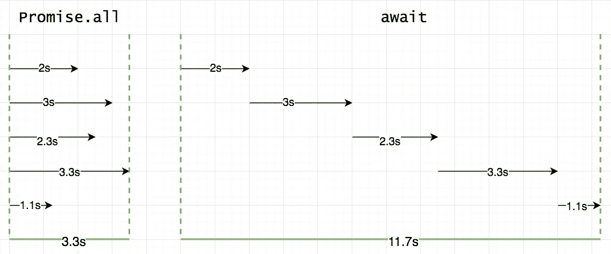

# 4 个 JavaScript Promise 方法— All、AllSettled、Any 和 Race

> 原文：<https://betterprogramming.pub/4-javascript-promise-methods-all-allsettled-any-and-race-ba0e0c8c034e>

## 让您的异步代码更上一层楼

安迪·赫尔曼万在 [Unsplash](https://unsplash.com?utm_source=medium&utm_medium=referral) 上的照片

承诺对于处理 JavaScript 中的异步操作非常有用。正确理解和使用它们是有效执行异步操作的基本技能。

我想分享我在日常工作中使用的 4 种有希望的方法。在进入实际的方法之前，理解我们如何在顺序/串行和并行流中运行承诺是很重要的。

考虑一个函数，它返回一个 1 秒钟后解决的承诺。

让我们看看如何在连续流中运行承诺

在第 2 行，我们创建了一个承诺并等待它完成，然后在第 3 行开始另一个承诺。由于在第一个承诺得到解决之前，我们不会创建第二个承诺，所以总的执行时间大约是 2 秒。

但是，如果我们同时取消两个承诺，然后等到两个都解决了呢

第 3 行和第 4 行几乎同时启动了两个承诺。在第 5 行，我们只是确保第 5 行之后的代码不会被执行，直到`p1`和`p2`被解析。由于两个承诺同时运行，所以总执行时间大约为 1 秒。

这里有一张图片可以让这个概念变得非常清晰

有五个异步任务。

在左边:

*   任务是并行启动的。
*   总执行时间是最长任务的时间。

在右边:

*   任务陆续拉开序幕。
*   总执行时间是所有任务的总时间。

请注意，承诺在创建时就开始了它们的任务。`Promise.all`只是等待，直到所有给定的承诺都得到解决。

# 承诺。所有

`Promise.all`方法接受一个承诺数组，并返回一个承诺，该承诺解析为一个输入承诺结果数组。

`Promise.all`当输入中的任何给定承诺失败时，立即拒绝。例如

因为`p1`被拒绝了`Promise.all`不会在意其他的承诺，直接跳到 catch 块。

## 使用承诺。所有时候

*   你只关心所有承诺的成功结果。
*   您的代码依赖于多个相关的异步任务才能正常工作。因此，与其串行运行这些任务，不如并行启动它们，然后用一个`Promise.all`等待它们的执行

# 承诺。都解决了

`Promise.allSettled`接受一个承诺数组并返回一个承诺，该承诺总是解析为一个包含输入承诺结果的对象数组。

`Promise.allSettled`类似于`Promise.all`,除了它返回一个承诺，无论输入承诺中的任何一个或全部被满足或拒绝，该承诺都会被解决。

`Promise.allSettled`的解析值是一个具有状态(或者是`fullfilled`或者是`rejected`)的对象数组，以及单个承诺的解析值。

由于`Promise.allSettled`总是解析，我们必须手动检查每个输入承诺的解析状态，以检查是否有任何承诺失败。

我在上面的代码片段中使用了数组析构。不懂的话，[按照这个指南](https://javascript.plainenglish.io/javascript-destructuring-explained-in-plain-english-1cd457419393)来。

## 使用 promise . all 结算时间

*   你不在乎所有承诺的成功结果。

# promise . all vs promise . all 已解决

`Promise.all`仅当所有输入承诺都实现时，解析为单个承诺，否则拒绝。`Promise.allSettled`始终解析为具有单个输入承诺状态的单个承诺。

# 承诺。任何

Promise.any 还接受一个承诺数组，并返回一个承诺，只要输入数组中的任何承诺满足，该承诺就会立即解析。

在上面的代码片段中，`p1`失败了，但是`Promise.any`不在乎，因为`p3`是最快的(在`p1`之后),并且也解决了。

如果所有承诺都被拒绝，则返回的承诺也会被拒绝，并出现错误。

## 使用 Promise.any when

*   你只关心最快解决的问题。

# 承诺.比赛

`Promise.race`与`Promise.any`类似，只是它返回一个承诺，该承诺基于解决或拒绝的最快承诺(作为输入给出)来解决或拒绝。

如果最快的承诺失败了，`Promise.race`也失败了

## 什么时候使用 Promise.race

*   你关心最快的承诺，要么成功，要么失败。

# 承诺。任何对承诺。比赛

`Promise.any`只关心最快解决的问题，而`Promise.race`关心最快解决或拒绝的问题。

有时，以顺序方式执行异步操作是唯一的选择，但是要确保尽可能并行地运行它们，因为这样可以减少执行这些操作的时间。

感谢阅读