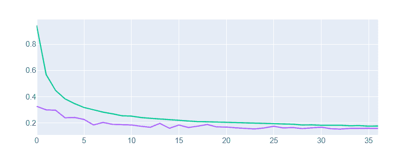
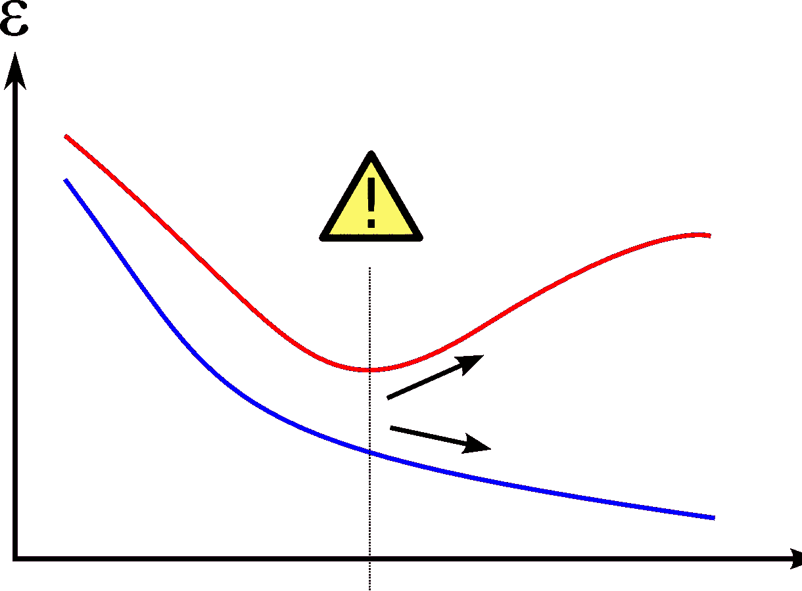
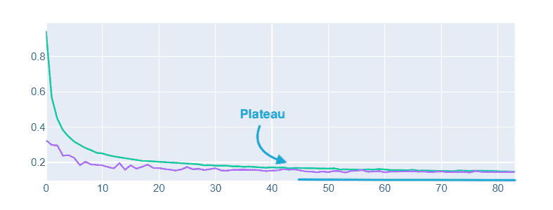

# 4 个 Keras 回调将改变你训练 ML 模型的方式

> 原文：<https://betterprogramming.pub/4-keras-callbacks-that-will-change-the-way-you-train-ml-models-a0df2592d36b>

## 添加模型检查点、CSV 记录器等等

照片由[查尔斯先行者](https://unsplash.com/@charles_forerunner?utm_source=medium&utm_medium=referral)在 [Unsplash](https://unsplash.com?utm_source=medium&utm_medium=referral) 上拍摄

当编写机器学习代码时，通常每个应用程序都会出现相同的模式，尤其是当每个人都学习相同的课程，并且您不能随意使用什么库时。这就是为什么这些库包含许多我们可能不知道的功能和选项，但却解决了传统问题。

Keras 回调是在你的纪元的不同阶段执行函数的类——记录数据、绘制数据或保存你的模型。这些回调非常有用，允许您编写更少的代码，并提高代码的效率。

让我们开始吧。

# 提前停止

理想情况下，我们的模型不会过度拟合，不管我们为它训练了多少个时期。但通常情况并非如此。很多时候，我们没有应用正确的正则化，或者模型对于我们的应用来说太深。显然，我们应该首先尝试解决这些问题，但很高兴知道，如果我们失败了，我们有一个故障保险。这就是提前停止。

提前停止有两个参数:

*   耐心
*   测试损失/准确性

作者图片

当测试损失或测试准确度在几个步骤(时期)内没有改善时，它停止训练。这背后的原因是，如果测试集的准确性恶化，这意味着模型不够一般化，因此过度拟合训练数据。

提前停止是我工具箱中的必备工具，您可以简单地用一行代码实现它:

然后，您只需将它与其他回调函数一起添加到您的`fit`函数中:

您可以在文档中查看其他参数:`[EarlyStopping](https://www.tensorflow.org/api_docs/python/tf/keras/callbacks/EarlyStopping)`。

# 模型检查点

这是我的最爱之一。

你有没有开始训练一个模型只是为了让你的 Jupyter 内核死掉？或者您可能不小心停止了脚本，因此培训也停止了？

嗯，这次回调就解决这个了！

每当你的模型精度提高时，它会将模型保存到你指定的路径。例如:

这段代码将在`val_loss`低于之前的`val_loss`(在纪元结束时)时保存您的模型。

假设你没有使用`EarlyStopping`和`ModelCheckpoint`。也许你让脚本运行了几个小时，然后你得到了这个:

由[维基共享资源](https://commons.wikimedia.org/wiki/File:Overfitting.png)提供

你想打爆你的头。过了这么久，模型明显过拟合，我也没有保存什么好的版本。

但是对于`ModelCheckpoint`回调来说，这已经不是问题了。

查看文档:`[ModelCheckpoint](https://www.tensorflow.org/api_docs/python/tf/keras/callbacks/ModelCheckpoint)`。

# CSVLogger

假设你正在训练一个深度学习模型。假设你在 Jupyter 笔记本上训练它。假设你这样做:

突然你的内核死了。

幸运的是，你已经配置了`ModelCheckpoint`，所以你没有丢失训练好的模型。但是您想对存储在`history`变量中的训练历史进行很好的绘图。

但是内核已经死了，那个变量也就没了。

这就是回调变得有用的地方。`CSVLogger`自动记录训练分数。它将它们很好地存储在一个 CSV 文件中。因此，如果您关闭了您的内核，您已经很好地保存了它，并准备好进行漂亮的绘制。

实现非常简单:

您只需要提供想要保存数据的文件的路径。

更多阅读文档:`[CSVLogger](https://www.tensorflow.org/api_docs/python/tf/keras/callbacks/CSVLogger)`。

# 降低高原学习率

当指标停止改善时，这种回调会降低学习率。这是避免停滞和动态改变训练参数的有益实践。

主要的优点是它允许你在开始时有一个较大的学习速率，然后动态地降低它。这减少了训练的时间和准确性，因为在开始时使用较高的学习率会更快，当没有改善时减少学习率会使你更接近最小值。

作者图片

要使用它:

可以调整的最重要的参数是:

*   `monitor`:这是我们想要跟踪的指标
*   `patience`:没有改善的时期数，在此之后学习率将降低
*   `factor`:学习率降低的系数。`new_lr` = `lr` * `factor`。
*   `min_delta`:测量新最佳值的阈值，仅关注重大变化
*   `min_lr`:学习率的下限

您可以在`[ReduceLROnPlateau](https://www.tensorflow.org/api_docs/python/tf/keras/callbacks/ReduceLROnPlateau)`查看更多详情。

# 参考

[1] [张量流文档](https://www.tensorflow.org/api_docs/python/tf/keras/callbacks/Callback)