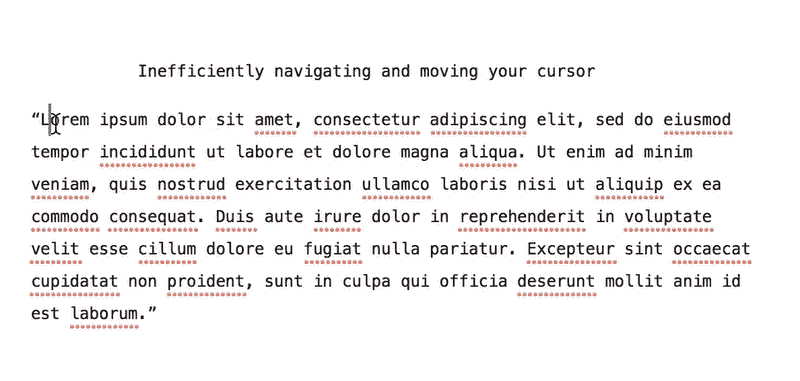
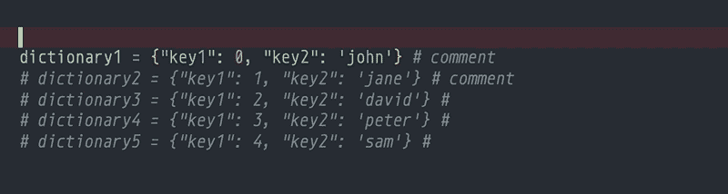
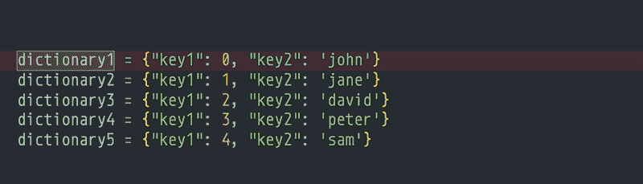
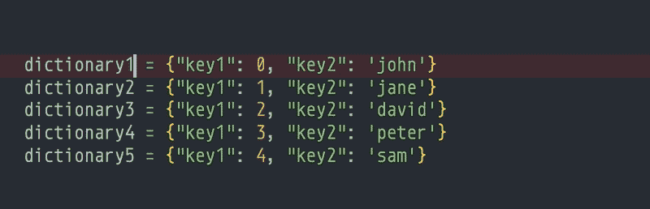
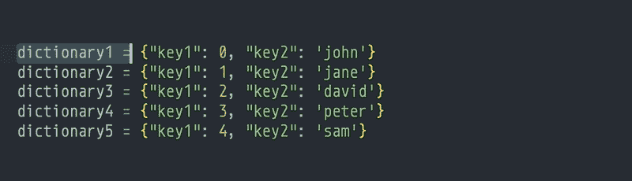
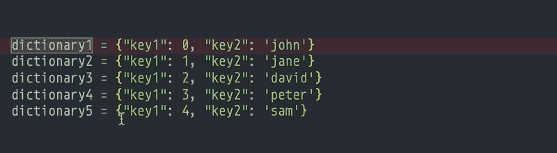
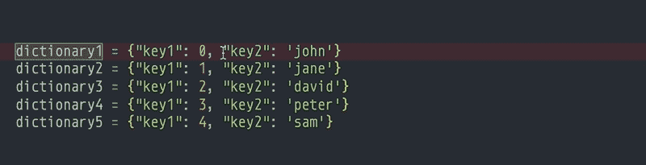

# 4 个键盘快捷键，可高效编辑文本并提高工作效率

> 原文：<https://betterprogramming.pub/4-keyboard-shortcuts-to-edit-text-efficiently-and-improve-productivity-66894c8d51b8>

## 高效地在文本中导航和移动光标

一次移动一个字符会非常低效。

我们大多数人定期在电脑上写作和编辑文本。因此，知道一些导航和选择文本的快捷键可以节省大量时间。

我下面的 GIF 教程适用于 Visual Studio 代码，但你可以在 Microsoft Word、任何编辑器或任何接受文本输入的应用程序中使用键盘快捷键。

为了遵循这个教程，我**强烈建议**你打开任何笔记应用程序或文本编辑器(例如[黑曜石](https://medium.com/swlh/take-better-notes-with-this-free-note-taking-app-that-wants-to-be-your-second-brain-1a97909a677b)【我最喜欢的笔记应用程序】，微软 Word，Evernote，TextEdit)，将本文的任何一段文本复制并粘贴到你的编辑器中，**在阅读我的文章时自己尝试快捷方式。**

我只展示了 Mac OS X 的快捷键，但是 Windows/Linux 用户应该有等效的快捷键。例如，Windows 用户通常应该用 Control 替换 Command。

如果你想接受真正的挑战，尝试学习 Vim，它真的可以提高你的生产力。

 [## 连续 15 天使用 Vim 后，我学到了什么

### 从 Vim noob 到业余爱好者的旅程

towardsdatascience.com](https://towardsdatascience.com/what-ive-learned-after-using-vim-15-days-straight-ceda7e773a6d)  [## 我是如何学会享受活力的

### 刻意的练习和环绕。vim 让我爱上了 Vim

towardsdatascience.com](https://towardsdatascience.com/how-i-learned-to-enjoy-vim-e310e53e8d56) 

# 跳到一行的开头/结尾

若要将光标移动或跳转到当前行的开头或结尾，请使用 Command+right 或 Command+left。

光标跳到当前行的开头或结尾。

# 选择光标左侧/右侧的所有内容

您可以使用 Command+Shift+left 或 Command+Shift+right 来选择光标左侧或右侧的所有内容。

选择光标左侧或右侧的所有内容。

# 一次向左/向右移动一个单词

您可以使用 Option+left 或 Option+right 一次移动一个单词，而不是重复按下左箭头键或右箭头键(或按住它)来一次移动一个字符。此快捷方式让您跳到上一个或下一个单词。

光标跳到下一个单词而不是字符。

# 向左/向右选择一个单词

您可以使用 Shift+Option+left 或Shift+Option+right 选择光标左侧或右侧的整个单词。

选择光标左侧或右侧的整个单词。

# 额外好处:多行编辑与多个光标

在许多文本编辑器中，如 Visual Studio 代码和 Atom，您可以使用 Command+Option+up 或 Command+Option+down 在不同的行上创建多个光标。

用许多光标一次选择许多单词的多行编辑。

有时，您甚至可以在任何需要的地方创建额外的光标。在 Visual Studio 代码中，按住 Option 键并单击任意位置将光标放在那里。

将光标放在 Visual Studio 代码中的任意位置。

# 摘要

通过学习一些键盘快捷键，你可能最终会更少地使用鼠标，更喜欢在电脑上打字，并降低重复性综合征损伤的风险。

# 更多来自我

如果你喜欢这篇文章，你可能也会喜欢这些文章。

 [## 2 元学习原则帮助你更有效地学习

### 高效获取知识和技能

medium.com](https://medium.com/@ausius/2-meta-learning-principles-to-help-you-learn-more-efficiently-44061c9951e1)  [## 使用终端多路复用器 tmux 提高编码和开发效率

### 简单的 tmux 命令来提高您的生产力

medium.com](https://medium.com/better-programming/code-and-develop-more-productively-with-terminal-multiplexer-tmux-eeac8763d273)  [## 在 Python 中更有效地循环的两种简单方法

### 使用枚举和压缩编写更好的 Python 循环

towardsdatascience.com](https://towardsdatascience.com/two-simple-ways-to-loop-more-effectively-in-python-886526008a70)  [## 在 Python 中重塑 numpy 数组—一步一步的图形教程

### 本教程和备忘单提供了可视化效果，帮助您理解 numpy 如何重塑数组。

towardsdatascience.com](https://towardsdatascience.com/reshaping-numpy-arrays-in-python-a-step-by-step-pictorial-tutorial-aed5f471cf0b) 

*更多帖子，* [*订阅我的邮件列表*](https://hauselin.ck.page/587b46fb05) *。*