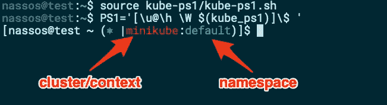
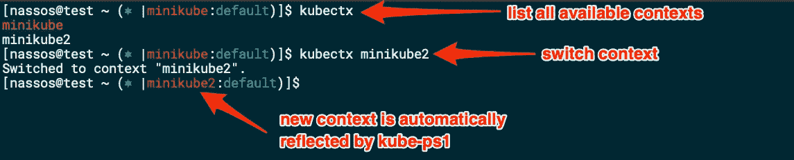
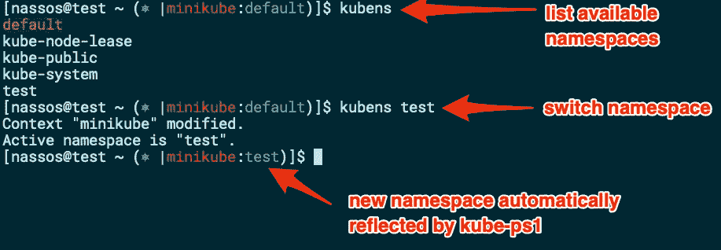
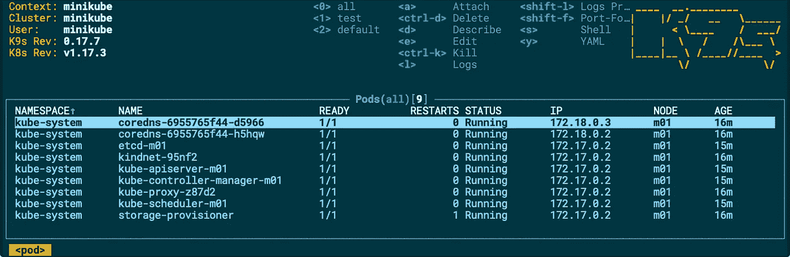
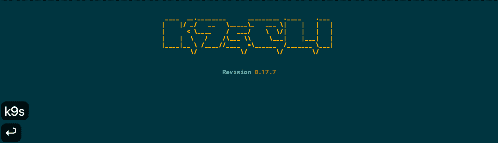

# 4 颗 Kubernetes CLI 宝石

> 原文：<https://betterprogramming.pub/4-kubernetes-cli-gems-c47a72e6fab0>

## 日常监控和浏览工具，以避免错误

由 [Samuel Sianipar](https://unsplash.com/@samthewam24?utm_source=medium&utm_medium=referral) 在 [Unsplash](https://unsplash.com?utm_source=medium&utm_medium=referral) 上拍摄的照片

众所周知，Kubernetes 主导着容器编排市场。StackRox 最近的一项研究证实，Kubernetes 的采用率比其他竞争解决方案高出 86%,创历史新高。Kubernetes 已经存在，所以让我们准备好开发/管理环境，以便在使用 Kubernetes 时获得最大的灵活性和效率。

在本文中，我将向您展示我在与 Kubernetes 集群交互时日常使用的四个命令行实用程序。我真的无法想象自己离开它们去机场，所以我希望它们对你也有用。

# 增强你的提示

我看到人们在与 Kubernetes 交互时最常犯的一个错误是对错误的集群或错误的名称空间发出命令。

即使你认为自己比别人更小心，并且在发布终端命令之前会仔细检查所有的命令，在压力大的时候——当生产舱出现问题时——犯错误并不困难。您是否曾经按下 Enter 键后才意识到，*糟糕，我将测试命令发送给了生产集群，而不是演示*？我们都经历过。

让我们来拯救 kube-ps1。通过使用 kube-ps1，CLI 提示符通过始终显示 Kubernetes 集群以及 kubectl 运行的名称空间而得到增强:

使用 kube-ps1 增强了 CLI 提示符(图片由作者提供)

由于 kube-ps1 修改了你的提示，当你不需要的时候，你可能想暂时关闭它。在会话期间，您可以发出`kubeon`和`kubeoff`来分别打开和关闭它。

如果您想知道如何实际更改您正在使用的默认上下文和名称空间，请继续阅读。

# kubens 和 kubectx:切换集群和名称空间

Kubernetes 的内置实用程序， [kubectl](https://kubernetes.io/docs/tasks/tools/install-kubectl) ，是一个强大的实用程序——允许您对您的 Kubernetes 集群发出命令。但是，如果您针对多个集群和名称空间进行工作或测试，那么每次都必须定义命令的目标，这将变得非常繁琐，而且容易出错。

这就是来自 [Ahmet Alp Balkan](https://medium.com/u/2cac56571879?source=post_page-----c47a72e6fab0--------------------------------) 的 [kubectx](https://github.com/ahmetb/kubectx) 和 [kubens](https://github.com/ahmetb/kubectx) 实用程序派上用场的地方。

第一个实用程序 kubectx 允许您在不同的 Kubernetes 集群之间切换，并且再次让您将来所有的 kubectl 命令都针对该集群执行:

使用 kubectx(图片由作者提供)

第二个实用程序 kubens 允许您切换 Kubernetes 名称空间，并让您将来所有的 kubectl 命令都针对这个新名称空间执行:

使用 kubens(图片由作者提供)

有了 kubectx 和 kubens，再加上 kube-ps1，您现在可以随时看到提示，告诉您下一个 kubectl 命令的目标是什么，并允许您在上下文和名称空间之间快速切换。

# K9s:资源浏览器

Kubernetes 提供了一个默认的、基于 web 的仪表板，它既强大又有效。Fernand Galiana 的 K9s 为 CLI 带来了许多这种力量:

跑步 K9s(图片由作者提供)

使用 K9s，您可以快速启动一个针对 Kubernetes 集群的 CLI 监视器来导航、观察和管理您的应用程序。K9s 之外发生在您的集群上的所有更改都会被实时监控和更新，因此您总是可以看到最新的视图，而不必手动更新/刷新。

浏览并不是 K9s 唯一允许你做的事情。您还可以删除/删除 pod，编辑 YAML 表示，将壳放入 pod，以及利用许多其他功能:

K9s 的快速演示(作者提供的视频)

# 结论

当您有多个集群和名称空间要与之交互时，在 CLI 上使用 Kubernetes 会变得很有挑战性。在本文中，我介绍了我在 Kubernetes 集群上工作时经常使用的四个有用的实用程序。我希望这些对你也有帮助。

感谢您的阅读。希望下一部能见到你。