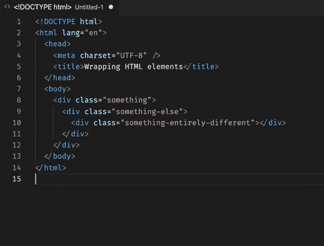
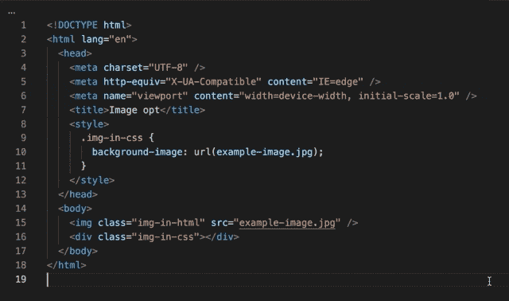

# 4 个鲜为人知的 Emmet 技巧来加速你的编码

> 原文：<https://betterprogramming.pub/4-lesser-known-emmet-tricks-to-speed-up-your-coding-882f4c8707e0>

## 以及为什么编码速度很重要

埃米特标识

Emmet 自称是 web 开发人员的基本工具包。它确实附带了一些方便的功能来大大加快你的编码速度。如果你是一名网站开发人员，你可能已经以这样或那样的方式遇到过它。我使用的 IDE， [Visual Studio Code，内置了插件](https://code.visualstudio.com/docs/editor/emmet)。

速度表，照片由[克里斯·利维拉尼](https://unsplash.com/@chrisliverani?utm_source=unsplash&utm_medium=referral&utm_content=creditCopyText)在 [Unsplash](https://unsplash.com/s/photos/fast?utm_source=unsplash&utm_medium=referral&utm_content=creditCopyText) 上拍摄

# 速度很重要

有人告诉我，打字速度与编码无关。有人说结构和逻辑才是最重要的。尽管我同意这样的总体观点，即要成为一名程序员，你需要的不仅仅是打字速度，输入速度也非常重要。

编程很多时候都是为了清除障碍。毫无疑问，如果你打字更快，你可以更专注于逻辑而不是输入。想想顶级运动员是如何训练和准备自己的。当涉及到许多更小的细节时，他们是一丝不苟的。他们专注于小事情，以提高他们的整体游戏。同样，你也应该考虑改进编码的各个方面。

# 隐含缩写

Emmet 最显著的特点是简写命令或缩写。这些漂亮的命令是 CSS 样式的紧凑语法，插件会自动将其转换为 HTML 代码。有了 CSS 简写，您可以立即快速创建 HTML 标记。语法非常紧凑，引擎将其从压缩形式扩展到更复杂的 HTML 代码。

这个功能，我想，是最常用的。这个特性有一个变化:您甚至不需要在输入时指定想要使用的 DOM 元素的种类。如果你从省略元素开始，Emmet 会帮你猜。它会根据你当前所处的环境选择最合适的方式。如果你在主体中，你会得到一个 div。如果您省略了未编号列表中的嵌套元素，您将得到一个列表元素 *li* 等等。

将 CSS 类隐式转换为 div 元素

# 链接 CSS 命令

正如我们所见，Emmet 缩写在 HTML 中创造了奇迹。一个鲜为人知的事实是，Emmet 缩写也存在于 CSS 中。在编写 CSS 代码时，您也可以使用压缩的 CSS 命令，这些命令可以膨胀成完整的 CSS 声明。与 HTML 缩写相比，这些 CSS 缩写扩展为规则值对。事实上，他们包装的价值，以及规则，使他们非常精简。

当然，有人会说你需要学习第二套命令，学习 CSS 已经够难了。但是，Emmet CSS 缩写非常直观。大多数情况下，它们是 CSS 规则及其值中每个单词的第一个字符。一旦你学会了 CSS 规则和它们的值，就很容易找到缩写。

为了加快 CSS 缩写的速度，Emmet 提供了链接 CSS 命令的能力。这是一个强大的功能，因为它使 CSS 编码快如闪电。下面是一个如何快速创建一个 *body* 规则集的例子。这个技巧适用于任何一组 CSS 规则。

链接 CSS 缩写

# 包装元素

通常，当您想要操作 HTML DOM 树结构时，您会想要在祖先中插入一个父节点。这就是“用缩写换行”功能派上用场的地方。它允许您在 DOM 树层次结构中更高的位置插入 HTML 父元素。您所需要做的就是选择要用新的父对象包装的内容，并启动该命令。它会自动缩进孩子，使你的代码漂亮整洁。

插入 HTML 父元素

# 图像大小和性能改进

2021 年的大部分网页性能优化往往与图片有关。提高网页速度最常见的技巧是设置图像元素的大小。使用 Emmet，您可以在不离开 IDE 的情况下快速确定图像的高度和宽度。它对 HTML 和 CSS 都有效。Emmet 将查看图像文件以确定比例，并将它们插入到您的代码中。

在 HTML/CSS 中插入大小

少打字，多做事。