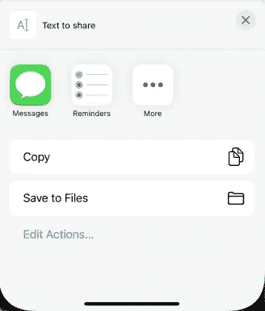
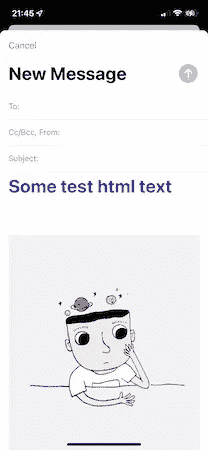
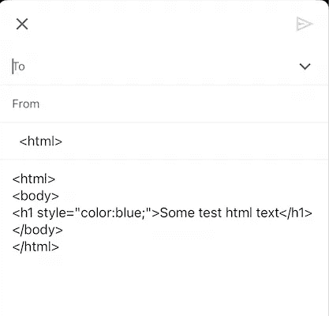

# 4 用于 iOS 共享的 UIActivityViewController 的限制

> 原文：<https://betterprogramming.pub/4-limitations-of-uiactivityviewcontroller-for-ios-sharing-ef88c886ba81>

## 分享特定应用程序的不同内容，在预定义的 iOS 列表之外处理`activity types`,等等

图片由 [Pixabay](https://pixabay.com/?utm_source=link-attribution&amp;utm_medium=referral&amp;utm_campaign=image&amp;utm_content=2187996) 提供

在这篇文章中，我们将看看 iOS 内容共享，以了解`UIActivityViewController`的挑战和局限性。

这个类提供了几个标准服务，比如将项目复制到粘贴板，将内容发布到社交媒体站点，通过电子邮件或 SMS 发送项目，等等。

让我们来看看它的实际应用:

这看起来很简单，只有 2 行代码。

作为输入，该视图控制器接收我们想要共享的项目列表，默认情况下，我们获得对文本、图像和任何其他类型的 URL 的支持，您需要自定义支持。

因此，出现了一个模态视图控制器，它显示系统中的所有应用程序，能够与您的给定内容共享或执行某些操作，在我们的示例文本中，输出如下:

到目前为止，一切看起来简单明了，如果你只是想分享一些内容，如文本或图像，那么你不需要任何其他东西。但是，如果你想为特定的应用程序提供不同的内容，事情可能会变得有点糟糕。

# 1.共享特定应用的不同内容

例如，如果你想分享一些文本，但对于邮件应用程序，你打算分享 HTML，因为它看起来更好，更专业。

要做到这一点，你必须遵从`UIActivityItemSource`并实施`itemForSourceType`方法。

如果举上面的例子，事情会是这样的:

我们实现了我们的委托方法。但是等一下！如果我们在当前状态下运行代码，我们仍然不能在邮件应用程序上显示 HTML。

那是因为我们没有设置`UIActivityViewController`委托，这里的问题是这个视图控制器没有这样的属性可用。

但是我们有一个快速和肮脏的方法来设置它，这很奇怪，这就是为什么我把它标记为一个潜在的挑战。

从上面的代码片段中可以看出，我们将委托作为共享项目列表中的一个项目进行传递，这应该可以解决我们的问题。请注意，我们有一个更好的方法来设置这个委托，我将在本文的后面谈到，但是如果你想要非常简单快捷的东西，这个方法可以是一个解决方案。

# 2.共享特定应用时移除项目

默认情况下，通过活动视图控制器 init 传递的所有项目会连接在一起，然后传递到共享应用程序。在这种情况下，我们不希望一些特定的应用程序分享我们面临的所有挑战。

例如，假设我们想要共享一个文本和一个图像，但是对于邮件应用程序，我们只想要共享 HTML。

如果我们以上面的例子为例，将一张图片添加到列表中，我们将得到下一个结果:

使用上面的方法，我们根本不能从邮件应用程序中删除图像，因为`itemForSourceType` delegate 方法只修改文本项，它不是为修改多个项而设计的。

在本文的前面，我保证我会在设置`UIActivityViewController`委托时提出一个更好的解决方案，现在，一个解决方案应该可以解决这两个问题。

因此，我们将传递符合`UIActivityItemSource`的自定义对象，而不是传递 init 列表中的`self`实例，这将给我们更多的灵活性，整个代码现在将变成:

现在，我们可以完全控制每个应用程序共享的内容。的确，我们有一个更复杂的方法，但它提供的控制和灵活性应该是值得的。

# 3.Gmail HTML 共享

在 Gmail 应用程序上共享 HTML 内容可能是一个有效的案例，这可能是真的，大多数 iOS 用户将使用原生邮件应用程序，但也有相当多的人使用 Gmail 应用程序来处理邮件。很遗憾地通知您，目前，无法通过 Gmail 应用程序正常共享 HTML，这并不是因为某些`UIActivityViewController`限制，而是因为 Gmail 应用程序的限制，它只知道如何处理文本内容。

以下是 Gmail 应用程序上 HTML 共享的截图:

可以看出，Gmail 应用程序将 HTML 内容视为纯文本。我们唯一能做的改善用户体验的事情是确保我们将纯文本传递给 Gmail 应用程序。

# 4.在预定义的 iOS 列表之外处理`activity types`

iOS 系统为常见的社交媒体应用程序(如脸书、Twitter 等)提供了预定义的活动类型列表。

这里的挑战是，iOS 系统无法为所有可能的应用提供预定义的类型。因此，在这种情况下，我们必须手动识别自定义应用程序类型 id。例如，我们想在 Gmail 和 Pinterest 应用程序上分享一些 iOS 系统中没有预定义的内容。

找到自定义应用程序类型 id 的一个简单方法是在委托`itemForSourceType`方法中放置一个断点，并打印给定的类型。

这里有一个例子:

这些是我在使用活动视图控制器时发现的限制和挑战。我希望你觉得这篇文章很有趣，内容丰富，如果你知道任何其他的限制，请不要犹豫，添加评论。