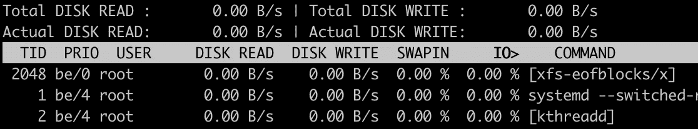
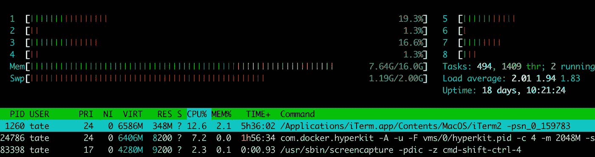
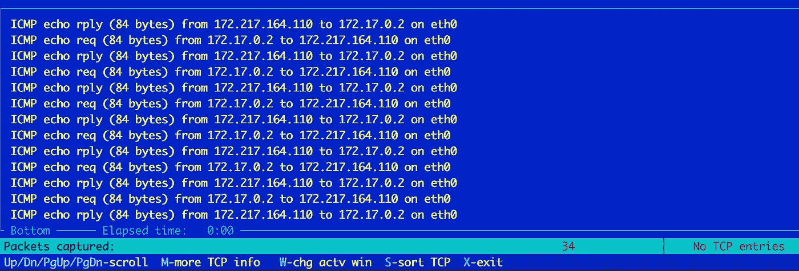
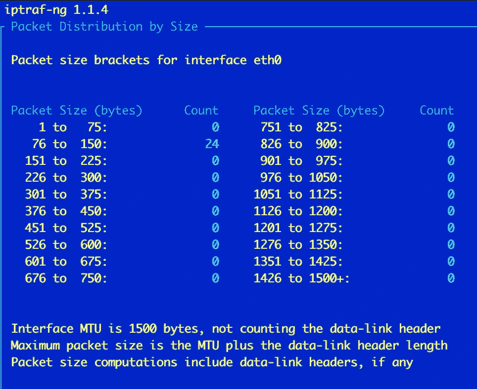
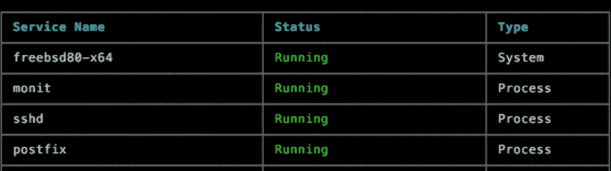
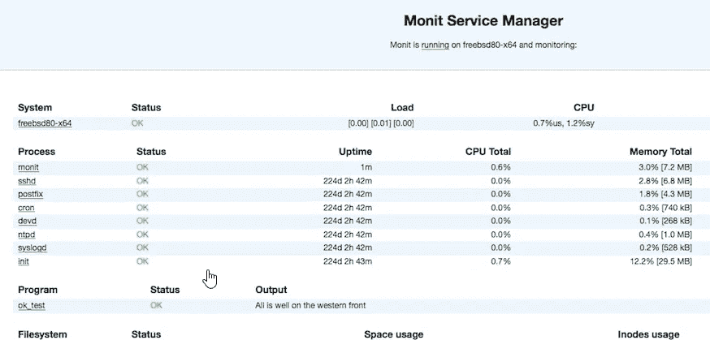

# 您应该使用的 4 个 Linux 监控工具

> 原文：<https://betterprogramming.pub/4-linux-monitoring-tools-you-should-use-38a136e68639>

## 用这些工具看看到底发生了什么

卢卡斯·布拉塞克在 [Unsplash](https://unsplash.com/s/photos/graph?utm_source=unsplash&utm_medium=referral&utm_content=creditCopyText) 上拍摄的照片。

如果你不知道你的服务器的底层操作系统正在发生什么，你就是瞎飞。你可以做出有根据的猜测，但是当它发生时，你需要原始数据——而且你很快就需要它。

为了对系统变更做出明智的决策，您需要能够查明问题并检查清晰的数据。

你有没有注意到一台机器运行缓慢，但 CPU 使用率似乎不是很高？您是否发现了系统上极高的网络利用率，但却不知道违规的进程？

这些工具会有所帮助。最好的部分是，它们中的大多数可以在没有 GUI 的情况下使用，并且可以很容易地安装在大多数服务器上。

下面是我日常使用的一些最好的 Linux 监控工具，帮助我快速准确地诊断问题。

# 1.iotop

谁在使用 I/O，iotop 中有多少？

如果你想知道你宝贵的 I/O 有多少被某些进程消耗掉了， [iotop](https://linux.die.net/man/1/iotop) 来拯救你！我无数次使用这种方法来观察渴求磁盘的进程啃噬 IOPS。

你无法从像 top 这样的传统工具中获得原始数据。当您使用 iotop 时，您得到的正是它听起来的样子:以 I/O 为中心查看进程和系统使用情况。

您可以将它用于多种目的，但最重要的一个目的是查看磁盘使用情况并标记潜在的瓶颈。将该工具与其他工具(如 top 或 htop)结合使用，可以让您更全面地了解您的机器上正在发生的事情。

我不建议使用 iotop 的一个原因是基准测试速度。尽管您可以清楚地了解每个进程使用了多少 I/O，但这更适合于实时监控，而不是重复测试。如果你对基准测试 I/O 感兴趣，我会看看一个叫做 [fio](https://fio.readthedocs.io/en/latest/fio_doc.html) 的工具。

# 2.htop

所有重要信息都在一个单一的窗口中。

这是我个人的最爱之一。[这个工具](https://hisham.hm/htop/)比普通的上衣更具视觉吸引力，并且有一个很棒的默认配色方案。很快，你就能清楚地了解系统的情况。

您可以在一个清晰的水平条形图上看到机器有多少个内核以及它们的利用率。您可以以同样的方式轻松获得内存使用统计数据，并且在底部还有经典的 top process 列表。

我如此喜欢 htop 的主要原因是它能迅速给我我所关心的信息。我想看看我的每个内核的 CPU 使用率和内存利用率，不是一个无聊的百分比。

如果你认为某个东西正在耗尽你系统上的所有内核，然后你打开 htop，那么你会看到很多红色。它的*快而*简洁。

# 3.IPTraf

在 iptraf-ng 中监视时向 Google 发送 pings。

这是[诊断网络问题的一个非常有用的工具](http://iptraf.seul.org/)。使用这个工具，您可以监控通过您系统的所有网络流量。您可以为特定的接口或流量类型(如特定的 TCP 端口)设置过滤器。这与 [Wireshark、](https://www.wireshark.org/)非常相似，只是它更轻量级，也可以在没有 GUI 的情况下运行。

您可以做一些简单的事情，比如按总数据包大小对流量进行统计分析:

iptraf-ng 中按数据包大小的统计细分。

您可以使用类似于`tcpdump`或`tshark`的命令行工具来做类似的事情，但是这个工具是菜单驱动的，更容易导航。如果你喜欢交互式过滤和查看你的流量，那么 IPTraf 是一个游戏改变者。

# 4.莫尼特

对一些受监控的进程运行 monit status 的结果。

这是您可以在 Linux 上利用的最通用、最健壮的监控工具之一。 [Monit](https://mmonit.com/) 已经问世多年，可以通过多种方式进行配置，以支持不同种类的阈值和性能警报。

Monit 允许您指定要在 Linux 系统上监控的进程、端口、文件等等。您可以使用复杂的回退计时器和消息来设置动态警报模式。

例如，您可能希望监控特定的进程以确保它正在运行。如果进程崩溃一次，只需重新启动它。如果它开始崩溃循环多次，不要重新启动进程，而是发送一个警报。像这样的进程监控可以通过 Monit 的几行配置轻松实现。

Monit 甚至为守护进程提供了一个漂亮的轻量级 web 界面，让您一目了然地了解正在发生的事情:

Monit web 界面。资料来源:mmonit.com。

无论您管理的是一台服务器还是一群服务器，Monit 都是最简单、最高效、最具成本效益的(免费！)关注事物状态的方法。

# 结论

感谢您抽出时间阅读。我希望您喜欢了解我最喜欢的一些 Linux 监控工具，以及为什么它们在分析行为不当的系统时会产生如此大的影响。