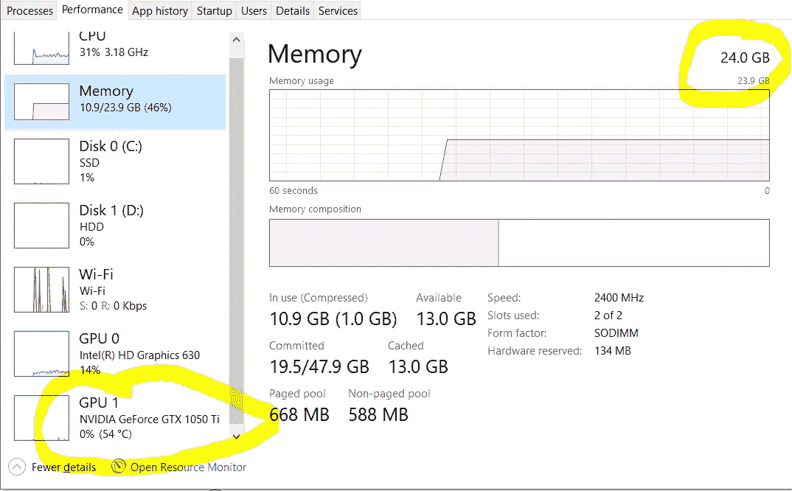

# 我作为数据科学初学者犯的 4 个错误

> 原文：<https://betterprogramming.pub/4-mistakes-i-made-as-a-data-science-beginner-40b6f0eb026c>

## 我犯了这些错误，这样你就不必犯了

茱莉亚·M·卡梅隆从[派克斯](https://www.pexels.com/photo/photo-of-child-sitting-by-the-table-while-looking-at-the-imac-4145153/?utm_content=attributionCopyText&utm_medium=referral&utm_source=pexels)拍摄的照片

如今，数据科学正在蓬勃发展。在过去的三个月里，我在我的 LinkedIn 时间线上观察了数据科学有志者的流量。这种增长似乎是合理的，因为今年有大量的数据科学职位空缺。

我收到了来自不同地点的 50 多人关于数据科学学习途径的消息。许多人不知道选择正确的数据科学途径。

当我阅读邮件时，我发现许多人不知道在他们的数据科学之旅中应该遵循的正确做法。但很明显，人们已经准备好学习，并给他们的质量时间学习数据科学领域，这是不可思议的。

我认为我可以帮助他们中的大多数人，因为我观察到许多人正在犯我在数据科学初学者旅程中犯的同样的错误。

# 1.过于关注 Python 了

Python 和数据科学是伙伴。是的， [R](https://www.r-project.org/about.html) 也有数据科学，但我们大多数人都在追求 Python。我们转向 Python 有一个很大的原因:大多数教程只有 Python 版本。你很难找到任何使用 R 语言的数据科学教程。

每个数据科学野心家都是从 Python 开始的，不错。但是我发现我的大多数追随者仍然坚持使用 Python。他们试图成为 Python 编程的专家，这对于任何数据科学有志者来说都是不公平的做法。

数据科学入门不需要成为 Python 的铁杆程序员。但是你应该花有限的时间(20-25 天)学习 Python。这就足够了。

在数据科学领域的大多数时候，你将不得不使用 Python 库，例如 [pandas](https://pandas.pydata.org/) 、 [NumPy](https://numpy.org/) 、 [Keras](https://keras.io/) 和 [Matplotlib](https://matplotlib.org/) 。如果你有使用列表、字典、元组、循环、条件、方法和类的基本概念，那就最好了。如果你害怕使用类，那么不用担心。在数据科学中你很少会用到类——只有当你使用 PyTorch 的时候。😅

# 2.犹豫是否使用预先训练好的模型

我已经做了这么多艰苦的工作来建立和训练我的定制神经网络——我不想听到预训练模型。

这是普遍现象。我们总是对使用预先训练好的模型犹豫不决，并试图忽略它们。我知道从头开始训练自己的神经网络是一种很好的做法，但请记住，神经网络是在 1944 年推出的。许多研究者已经尝试了多种模型结构，并提出了预训练模型。

将您的模型性能与预训练模型进行比较，然后深入研究这些预训练模型，这是一个很好的做法。目标应该是了解他们在模型中尝试的新模型层结构。

# 3.忽视神经网络的艺术

花了好一阵子学习 Python 之后，我们总是先从 NumPy，pandas，Matplotlib，线性回归开始，然后是 logistic 回归。

然后我们通常转向决策树、随机森林和 k-means 聚类(通常跳过 SVM😉).最后我们累了，然后为了清新我们的心情，我们尝试动手清理文本。截至目前，我们甚至还没有接触到神经网络。当我们试图学习神经网络时，事情变得无法控制。

这里的问题是，我们变得如此习惯于导入模型、分割数据和训练模型的糟糕做法，以至于我们从未准备好学习和构建我们的神经网络。

你应该知道，如今大多数激动人心的数据科学用例都处理图像和文本数据。例如，跟踪人类行为、面具检测、构建人工智能机器人和假新闻检测利用神经网络来获得更好的结果。

# 4.继续升级我的工作站

*   我只有 4 GB 的内存。
    我们升级到 8 GB 吧。
*   我仍然无法训练我的自定义神经网络。是时候把我的内存升级到 16 GB 了。
*   我的系统不能处理大批量。
    将内存升级到 24 GB。
*   我的系统加载了大量数据，但训练速度非常慢。
    我需要一个支持 GPU 的系统。

事情会继续下去，你永远不会对你的机器满意。

我的系统配置——但我仍然不满意

我发现的最好的解决方案是使用你的机器来解决基本的 ML 问题和文本相关的项目，并使用 [Google Colab](https://colab.research.google.com/notebooks/intro.ipynb?utm_source=scs-index) 来训练你的图像模型。

不要浪费时间不断升级你系统；你永远不会满足。或者，您可以购买谷歌 Colab Pro，以获得更多内存和高 GPU 能力。

# 摘要

我们已经讨论了我们作为数据科学有志者通常会犯的四个最大错误。我们已经讨论了为什么我们不应该更多地关注学习 Python 概念，预训练的模型如何帮助我们学习，以及神经网络的关键作用。

我们已经看到了为什么我们不应该浪费时间升级我们的工作站，而是找到一种更好的方法来相应地训练模型。我们还讨论了处理这些问题的最佳方法。

我希望你喜欢这个建议。下次再见。

感谢阅读！

*更多数据科技文章，* [*查看我的快讯*](https://mailchi.mp/4d33914bb328/pranjals-newsletter) *。*