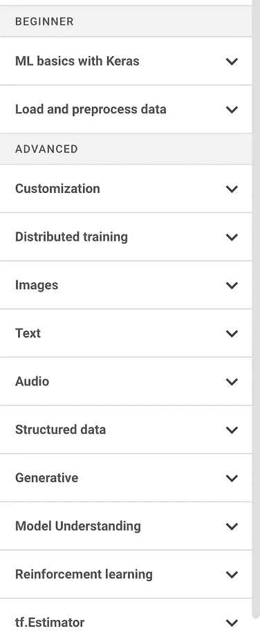
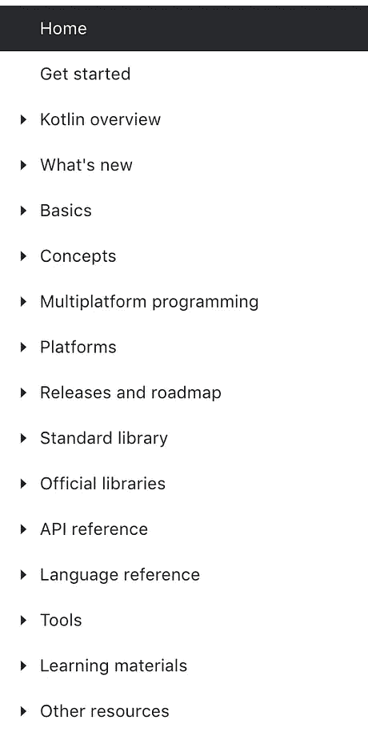
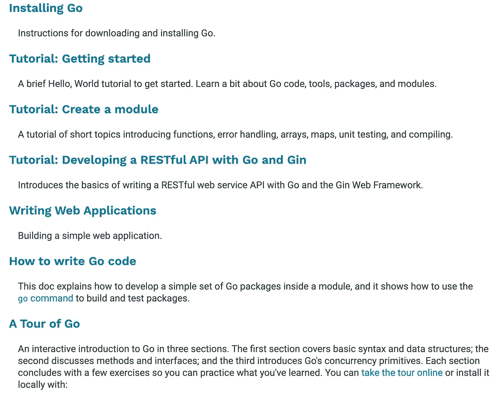

# 自学成才的开发人员在学习编码时犯的 4 个错误

> 原文：<https://betterprogramming.pub/4-mistakes-self-taught-developers-make-when-learning-to-code-bc294266e9af>

## 避免这些陷阱来加速你的学习过程

布雷特·乔丹在 [Unsplash](https://unsplash.com?utm_source=medium&utm_medium=referral) 上的照片。

现在没有计算机系统，任何行业都无法生存。多年来，编程一直是就业市场上最受欢迎的技能之一，这种趋势在不久的将来还会继续。虽然我们大多数人在大学里没有机会获得计算机科学学位，但我们必须将编写/阅读代码作为日常工作的一部分。

有些人可能比其他人更认真地学习编码，但是不管你有多少编码技能，我们中的许多人都属于自学者。我不在软件开发公司工作，但我的工作环境是一个研究所，那里有很多研究生和科学家，他们学习编码进行数据处理和分析。

因此，这些年来，我有机会与许多编程自学者一起工作。更重要的是，我自己也自学了十几年，知道自己犯过或者看到别人犯过的错误。如果我能警告自己这些错误，我就能以一种不那么痛苦的方式学习编程。

在本文中，我将使用学习编程语言作为例子。然而，这些错误不仅适用于学习特定的编程语言，也适用于专业领域的框架。

# 1.在编程方面没有明确的目标

自学者犯的最大错误是没有目的——他们不知道自己为什么要学习编码。没有确凿的理由，选择学习一门特定的编程语言对某些人来说基本上是随机的。以下原因并不能构成学习语言的好理由:

*   “很多事情都需要编程，现在似乎每个人都在使用 Java 或 Rust。让我开始吧。”
*   “数据科学很热门。好像每个数据科学家都用 Python，所以 Python 是我想学的东西。”
*   “我大学的时候学过 C，估计又要拿起 C 了。”

这些理由太肤浅，不是让你学习编码的强大动力。你会发现，至少需要几个月的时间，你才能对一门语言有初步的了解，几年后你才能熟练地使用这门语言(假设你经常使用这门语言)。因此，没有强烈的动机，学好一门语言几乎是不可能的。为了给你的学习之旅找到强有力的推进器，你应该清楚地知道你为什么要编程。

务实一点。你现在用编码解决了什么问题？可以帮助你的一些问题/步骤包括:

1.  我想通过编程完成什么项目(假设我已经非常了解编码)？
2.  一旦你确定了项目，问问你自己有什么选择，这样你就不需要学习编码了。学习编程需要很多时间，因此你最好的选择可能是根本不学。
3.  评估你需要掌握多少编程知识。了解简单的编程知识足以完成手头的工作吗？

# 2.未能评估语言/框架是否是正确的选择

坦率地说，现在有太多的语言和框架。即使你已经为你需要学习编程建立了坚实的理由，有时也很难选择学习哪种语言/框架。

你一定要记住语言只是解决问题的工具。因此，你试图解决的问题决定了你应该学习什么语言/框架。我的建议是不要过早承诺。在考虑可能的选择之前，你必须仔细研究你的问题，并对它们有充分的了解。

> “记住，代码实际上是我们最终表达需求的语言。我们可以创造更接近需求的语言。我们可以创建工具来帮助我们解析和组装那些需求到正式的结构中。但是我们永远不会消除必要的精度——所以代码总是存在的。”罗伯特·马丁

正如在上面的引用中所讨论的，当您做出选择时，您实际上是将您的问题转化为可以表达的需求。换句话说，代码/程序的需求应该精确地呈现你的业务问题，这样你就可以缩小你的语言/框架的选择范围来满足需求。

# 3.不是从官网开始

没有人讨厌捷径，但也没有人喜欢有很多妥协的捷径。当一个人开始学习编码时，他们可能会想出一种快速的方法来真正掌握这门语言。因此，他们可能会简单地搜索相关的 YouTube 视频，希望几个小时的视频可以神奇地涵盖该语言的所有基本内容。然而，有多少人能通过学习这些视频真正掌握这门语言呢？我怀疑有很多。

其他一些人想要更有条理的东西。所以他们可能会选择某个平台上的在线课程。毋庸置疑，有很多好的课程。然而，网络课程所能涵盖的内容是有限的。毕竟，每种语言都有太多的特性需要讨论。

我自己也学过几种语言和框架，从我的个人经验来看，我发现学习语言最有用的地方是官方文档。下图给你看了几个流行语言/框架的官网截图。

官网覆盖的知识(左:TensorFlow，中:Kotlin，右:Go)(截图取自公共领域)

如你所见，这些网站提供了关于语言/框架的非常详细的说明。所以，你可以很快开始学习。你想从官网开始学习有三个很好的理由:

1.  说明和教程是由语言或框架的开发团队准备的，因此您可以放心地假设他们对正在开发的工具有最多的了解。换句话说，你在向值得信赖的人学习。
2.  如今，语言和框架可以相对快速地发展。官方网站会跟踪这些更改/发布。因此，当你从官方网站学习时，你知道你使用的是最可靠的信息来源——而不是一些过时的视频/课程。
3.  当你更多地使用这种语言时，你会发现你必须参考 API 库来更深入地理解一些功能。因此，你会更容易做到这一点，因为在学习语言/框架时，你已经熟悉了官方网站。

# 4.不要弄脏你的手

我知道没有人喜欢挫折。我可以说学习一门新的语言/框架是令人沮丧的，因为我们在学习过程中会遇到无数的问题。为了避免这种挫折，我知道一些自学者坚持阅读——他们不写任何代码。这就像一个想学游泳但只做陆地训练的人，或者一个只使用模拟器的有抱负的飞行员。

编程是一种工程工作。你必须在实际环境中使用它。很简单，对吧？只需编写该死的代码并测试它是否如您所期望的那样工作。如果没有，检查问题所在并解决问题。

不要害怕打破东西。你在学习新的东西。婴儿学走路时总会绊倒。因此，当你学习编码时，只要通过编写简单的程序来弄脏你的手就行了——不管你是否遵循任何教程。当你发现代码中的错误时，你可以学到更多，因为当你在一个真实的项目中工作时，你会犯错误。及时修复 bug 是一项关键技能，你可以通过犯各种各样的错误来学习。因此，在早期犯错误并不是一个坏主意。

# 结论

学习编码是困难的，你应该为你将遇到的任何困难做好准备。最基本的想法是为你为什么想学习编码找一个好的理由。请记住，代码只是一个工具，您应该认真学习内容知识，这样您编写的代码才能满足预期的需求。