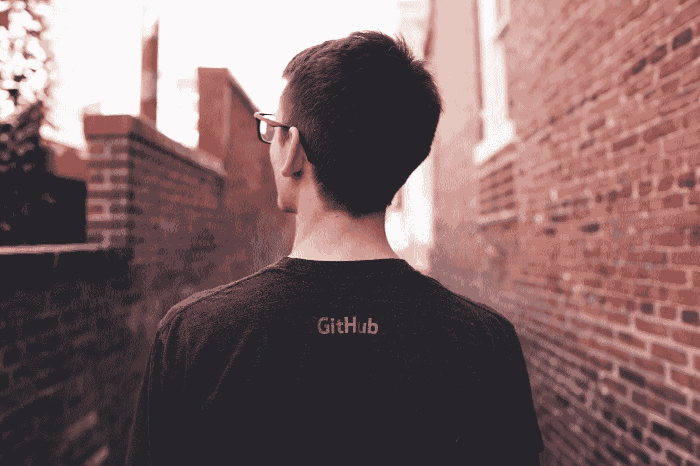
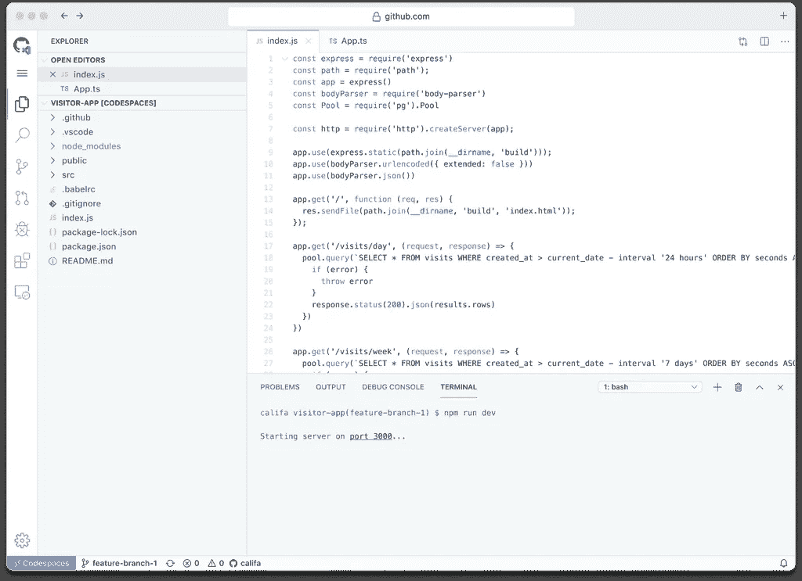
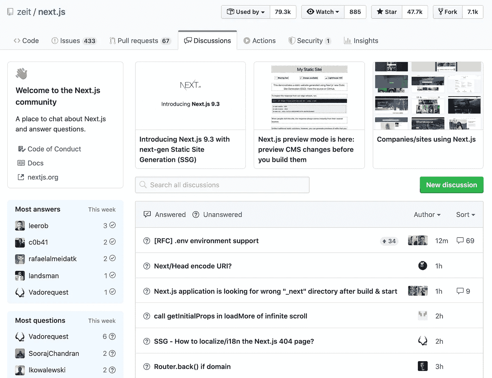

# 4 款新的 GitHub 产品将改变您的编码方式

> 原文：<https://betterprogramming.pub/4-new-github-products-that-will-change-how-you-code-27933401faa0>

## 来自第一次虚拟 GitHub 卫星活动的激动人心的公告

在 [Unsplash](https://unsplash.com/) 上 [Caleb White](https://unsplash.com/photos/NLE9RCsxX3c) 拍摄的照片。

就在最近，GitHub 举办了首次虚拟 GitHub 卫星活动。成千上万的人收看了当天的直播，包括主题演讲、现场编码音乐等。

当天开始时，GitHub 宣布了该平台即将推出的一些新功能，包括一个基于 web 的实时开发环境。这些新特性肯定会改变我们未来开源的方式。

# 代码空间

网络浏览器中的代码空间环境——图片来自 [GitHub 博客](https://github.blog/2020-05-06-new-from-satellite-2020-github-codespaces-github-discussions-securing-code-in-private-repositories-and-more/#codespaces)。

建立一个开发环境通常很困难，但是 GitHub 正在测试一个解决方案。它创建了 Codespaces，为你的 web 浏览器带来了一个完整的基于 VS 代码的环境，包括大多数 VS 特性，甚至终端访问。

您甚至可以启动一个代码空间，并从您最喜欢的桌面 IDE 连接到它，提供更多的定制以及在 web 上添加任何 VS 代码扩展的能力。

在撰写本文时，Codespaces 正处于有限的公开测试阶段，定价尚未最终确定。

# 讨论

[zeit/next . js 上的讨论标签](https://github.com/zeit/next.js/discussions) —图片来自 [GitHub 博客](https://github.blog/2020-05-06-new-from-satellite-2020-github-codespaces-github-discussions-securing-code-in-private-repositories-and-more/#discussions)。

以前，开源社区只能通过问题和拉请求在 GitHub 上交流。很快，GitHub 将发布一个组织对话和创建社区知识库的新功能。

讨论将在你的项目库中，所以它们将在你的社区已经在的地方。一些开源社区已经开始讨论，包括 [zeit/next.js](https://github.com/zeit/next.js/discussions) 和 [twbs/bootstrap](https://github.com/twbs/bootstrap/discussions) 。

# 代码扫描和秘密扫描

代码扫描演示—图片来自 [GitHub 博客](https://github.blog/2020-05-06-new-from-satellite-2020-github-codespaces-github-discussions-securing-code-in-private-repositories-and-more/#security)。

GitHub 将代码扫描变成了一种本地体验。现在，每次推送至您的回购都将使用 GitHub 操作进行漏洞扫描。它是免费开源的，任何公共项目都可以注册有限的公共测试版。

GitHub 还将其秘密扫描扩展到了私人存储库。该功能自 2018 年起可用于公共回购，现在也可用于私有代码。

# 私有实例

GitHub 将很快为其企业客户提供一个全新的、完全托管的选项。其私有实例计划带来了增强的安全性和新的策略功能，以满足每个客户的法规遵从性和安全性需求。

该产品尚未进入测试阶段，但可能很快就会进入。

# 结论

很快，GitHub 将向公众发布这些功能，使开源软件开发更加无缝、高效和安全。公司下一步会为我们准备什么？

*注:本文信息来自* [*本 GitHub 博文*](https://github.blog/2020-05-06-new-from-satellite-2020-github-codespaces-github-discussions-securing-code-in-private-repositories-and-more) *以及 2020 年 5 月 6 日举办的* [*虚拟事件*](https://www.youtube.com/watch?v=FhZTPM9ysWk) *。*

*作者与 GitHub 没有任何关系。*