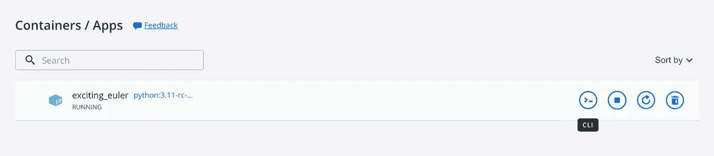
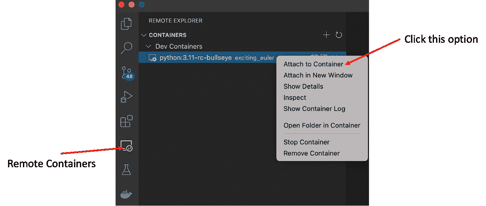
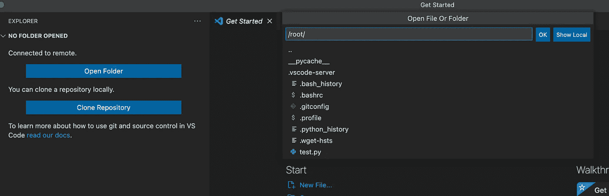
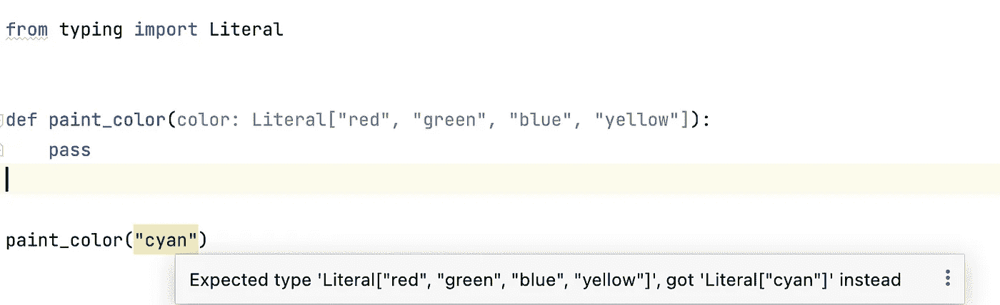

# Python 3.11 中的 4 项新类型注记功能

> 原文：<https://betterprogramming.pub/4-new-type-annotation-features-in-python-3-11-84e7ec277c29>

## TypedDict、任意文字字符串等等


照片由[鲁拜图·阿扎德](https://unsplash.com/@rubaitulazad?utm_source=medium&utm_medium=referral)在 [Unsplash](https://unsplash.com/?utm_source=medium&utm_medium=referral) 上拍摄

2022 年 4 月 25 日，Python 发布了最新的 alpha-3 . 11 . 0 a7，它代表了 3.11 开发的 alpha 阶段的最后一个版本。它将在 5 月初进入测试阶段，最终正式版 3.11 预计将于 2022 年 10 月发布。

我知道让您的应用程序适应最新的 Python 需要做大量的工作，而且大多数时候，您不需要这样做，因为您的应用程序可能在旧版本上运行良好。然而，如果你是那种喜欢尝试新事物的人，让我们从 Python 3.11 开始吧！

请注意，您不想修改您当前的应用程序，因为 3.11 仍处于 alpha 阶段，但这并不妨碍我们用 docker 映像来尝试它——一个独立于您的应用程序的独立虚拟容器。

在这些新特性中，我想在本文中重点介绍类型注释。Python 是一种动态类型语言，类型注释被许多类型检查器使用，这些检查器可以提供实时代码分析。许多代码错误，比如类型不匹配，可以在你编码的时候被识别出来。因此，Python 3.11 中类型注释的改进将帮助我们编写无错误的代码。

请注意，我们正在测试 alpha 版本，这些功能可能会发生变化。

# 先决条件

## 用 Docker 安装 Python 3.11

如果你的电脑上没有安装 Docker，你可以去[docker.com](https://docs.docker.com/get-docker/)找到安装说明。dockers 的想法是创建一个可复制的容器，简化应用程序的开发。

一旦安装了 docker，就可以在命令行工具上运行下面的命令。就我而言，我使用 Mac 电脑上的终端应用程序。

```
docker run -t -d python:3.11-rc-bullseye
```

该命令提取带有标签`python:3.11-rc-bullseye`的图像。以防你想知道这个标签是什么意思。`3.11`代表 Python 的版本，`rc`表示发布候选，`bullseye`是 Debian 版本[靶心](https://www.debian.org/releases/bullseye/)，此图基于此 Debian 版本。



docker 应用程序中的 Python 图像

如果你已经成功安装了这个镜像，你应该可以看到上面的东西，一个在容器/应用列表中的镜像。您可以将鼠标放在此图像上，并单击 CLI 图标，这将启动终端应用程序。

您可以简单地键入`python`，这将在终端中启用 Python 控制台，如下所示。

```
# python
Python 3.11.0a7 (main, Apr 20 2022, 17:55:51) [GCC 10.2.1 20210110] on linux
Type "help", "copyright", "credits" or "license" for more information.
>>>
```

从提示中，我们可以看到它是 Python 3 . 11 . 0 . a7——3.11 的第七个 alpha 版本。我们还可以通过运行以下代码来验证它:

```
>>> import sys
>>> sys.version
'3.11.0a7 (main, Apr 20 2022, 17:55:51) [GCC 10.2.1 20210110]'
```

## 在 Visual Studio 代码中使用容器(VSC)

使用命令行界面可以探索一些基本特性。然而，就编写代码而言，这并不是最愉快的。因此，我们可能希望使用类似 IDE 的代码编辑器，比如 [Visual Studio Code (VSC)](https://code.visualstudio.com/download) 。尽管有其他可供选择的 Python IDEs，但出于本教程的目的，我们将坚持使用 VSC。

假设您已经在计算机上安装了 VSC，要让您的 VSC 与 docker 镜像一起工作，您需要安装[远程容器](https://marketplace.visualstudio.com/items?itemName=ms-vscode-remote.remote-containers)扩展。安装完成后，您应该能够在侧边栏上看到一个选项卡，如下图所示。



将 VSC 系在容器上

单击选项卡后，您可以看到 VSC 填充了可用的容器——特别是 Python 3.11 容器。右键单击容器，您可以将 VSC 附加到容器。通过附加，将使用容器弹出一个新窗口。

## 创建用于评估的 Python 文件

您可以打开一个文件夹作为我们的项目。为了简单起见，我们只是使用默认的根文件夹，你可以找到下面的截图。



打开文件夹

在这个文件夹中，为了便于评估，我们创建了一个名为`test11.py`的 Python 文件。您可以通过在终端中调用`python -m test11.py`来运行该文件(如果您安装了 python 3，您可能必须使用`python3 -m test11.py`)。

# 关于打字的 4 个新特性

## 1.自我-类别类型

当我们在一个类中定义方法时，我们经常需要返回同一个类的一个实例。在许多情况下，返回值是我们用来调用该方法的实例对象。首先考虑下面的例子。

```
class Box:
    def paint_color(self, color):
        self.color = color
        return self
```

上面的代码没有使用任何类型提示，可能不清楚。所以我们可以添加更具体的打字信息。有些人可能会想到以下解决方案。

```
class Box:
    def paint_color(self, color: str) -> Box:
        self.color = color
        return self
```

然而，你不能让它工作，因为，在`Box`类的主体中，你不能使用`Box`，因为它还没有被定义！因此，现有的解决方法是使用类型变量，它充当待定义类型的代理，如下所示:

```
from typing import TypeVarTBox = TypeVar("TBox", bound="Box")class Box:
    def paint_color(self, color: str) -> TBox:
        self.color = color
        return self
```

这种方法的一个不便之处是，当你想改变类名时，比如说我们想把它重命名为`Container`，我们可能需要做如下的改变，类名、`TBox`定义和`paint_color`方法中返回值的类型，如下所示:

```
from typing import TypeVarTContainer = TypeVar("TContainer", bound="Container")class Container:
    def paint_color(self, color: str) -> TContainer:
        self.color = color
        return self
```

如果在您的项目中有许多这样的用法，这些变化可能是不小的。随着 Python 3.11 中`Self`类型的引入，事情变得更加简单。

```
from typing import Selfclass Box:
    def paint_color(self, color: str) -> Self:
        self.color = color
        return self
```

你应该熟悉实例方法中的参数`self`，它是实例对象。作为对应，`Self`表示使用它的类别。在上面的例子中，我们使用`Self`来表示返回值是一个“Self”类型的对象，它被解释为`Box`类。

除了不需要创建类型变量的好处之外，还有其他在官方 [PEP 673](https://peps.python.org/pep-0673/) 中讨论的好处，包括在子类中的使用。

## 2.任意文字字符串

第二个特性也与类型注释有关。我们来回顾一下现状。当我们定义一个接受字符串的函数时，我们可以使用`Literal`类型，如下所示:

```
from typing import Literaldef paint_color(color: Literal["red", "green", "blue", "yellow"]):
    pass
```

正如您所看到的，当我们希望一个函数接受一个字符串文字时，您必须指定兼容的字符串文字。但是，由于选项有限，当前代码分析认为这是一个错误(警告)，如下所示:



与定义的字符串文字不兼容的函数调用

为了解决这个限制，Python 3.11 引入了一个新的通用类型`LiteralString`，它允许用户输入任何字符串文字，如下所示:

```
from typing import LiteralString

def paint_color(color: LiteralString):
    pass

paint_color("cyan")
paint_color("blue")
```

当您使用`Literal`类型时，`LiteralString`类型为您提供了使用任何字符串文字而不是特定字符串文字的灵活性。更具体的`LiteralString`适用的用例，比如构造文字 SQL 查询字符串，可以参考官方 [PEP 675](https://peps.python.org/pep-0675/) 。

## 3.可变泛型

我们可以使用`TypeVar`创建具有单一类型的泛型，就像我们之前对`Box`所做的那样。当我们进行数值计算时，比如在`NumPy`和`TensorFlow`中基于数组的运算，我们使用具有不同维度和形状的数组。

当我们为这些不同的形状提供类型注释时，为每个可能的形状提供类型信息可能很麻烦，这需要一个类的单独定义，因为现有的`TypeVar`一次只能处理一种类型。

```
from typing import Generic, TypeVarDim1 = TypeVar('Dim1')
Dim2 = TypeVar('Dim2')
Dim3 = TypeVar('Dim3')class Shape1(Generic[Dim1]):
    passclass Shape2(Generic[Dim1, Dim2]):
    passclass Shape3(Generic[Dim1, Dim2, Dim3]):
    pass
```

如上所示，对于三维，我们必须定义三种类型和它们各自的类，这并不清楚，并且代表了我们应该小心的高度重复。Python 3.11 引入了`TypeVarTuple`，允许你使用多种类型创建泛型。使用这个特性，我们可以重构前面代码片段中的代码，得到如下代码:

```
from typing import Generic, TypeVarTupleDim = TypeVarTuple('Dim')class Shape(Generic[*Dim]):
    pass
```

因为它是一个`tuple`对象，所以您可以使用一个带星号的表达式来解包它包含的对象，在我们的例子中，它的类型数量是可变的。上面的 Shape 类可以是任何形状，这大大提高了灵活性，并且不需要为不同的形状创建单独的类。

关于使用`TypeVarTuple`的更多详细信息，请参考官方 [PEP 646](https://peps.python.org/pep-0646/) 。

## 4.TypedDict —灵活的关键要求

在 Python 中，字典是一种强大的数据类型，它以键值对的形式保存数据。这些键是任意的，您可以使用任何适用的键来存储数据。但是，有时您希望拥有一个包含特定键和特定类型值的结构化字典。在这种情况下，您可以使用`TypedDict`类型。

```
from typing import TypedDictclass Name(TypedDict):
    first_name: str
    last_name: str
```

如上图，我们定义了`Name`，它有`first_name`和`last_name`作为必需的键，它们的值应该是字符串。

我们知道有的人可能有中间名(说对应的键是`middle_name`)，有的人没有。即`Name`类作为`TypedDict`，应该允许`middle_class`缺失。没有直接的注释使键成为可选的，当前的解决方法是创建一个使用所有必需键的超类，而子类包括可选的键，如下所示:

```
from typing import TypedDictclass _Name(TypedDict):
    first_name: str
    last_name: strclass Name(_Name, total=False):
    middle_name: str
```

如上图，`_Name`级有`first_name`和`last_name`，而`Name`有`middle_name`。值得注意的是，我们需要将`total`指定为`False`，这意味着键`middle_name`可以在`Name`类中省略。

创建一个超类来满足这种业务需求是不方便的，我们应该有一个更好的解决方案——Python 3.11 引入了`NotRequired`作为类型限定符，以表明`TypedDict`可能缺少一个键。用法非常简单，如下所示:

```
from typing import TypedDict, NotRequiredclass Name(TypedDict):
    first_name: str
    middle_name: NotRequired[str]
    last_name: str
```

如上所示，我们不再需要超类/子类结构。相反，我们只是指定这个`TypedDict`中不需要`middle_name`——这样不是简洁多了吗？*请注意，您可能会看到* `*NotRequired*` *无法导入，我猜图像可能有问题。*

如果有太多可选键，可以使用 required 指定那些必需的键，而不是将那些可选键指定为非必需的。因此，针对上述问题的替代等效解决方案如下所示:

```
from typing import TypedDict, Requiredclass Name(TypedDict, total=False):
    first_name: Required[str]
    middle_name: str
    last_name: Required[str]
```

注意，在代码片段中，我们将`total`指定为`False`，这使得所有的键都是可选的。同时，我们将这些必需的键标记为`Required`，这意味着其他键可能会丢失。

有关此功能的更多信息，请参考官方 [PEP 655](https://peps.python.org/pep-0655/) 。

# 结论

在本文中，我们回顾了 Python 3.11 中关于类型注释的四个新特性。这些新特性允许您通过使用更强大的类型提示来编写更干净的代码。

提醒一下，Python 3.11 的最终正式版本是 2022 年 10 月。你准备好了吗？