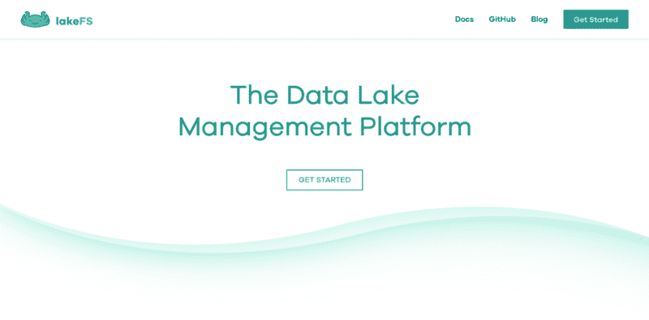
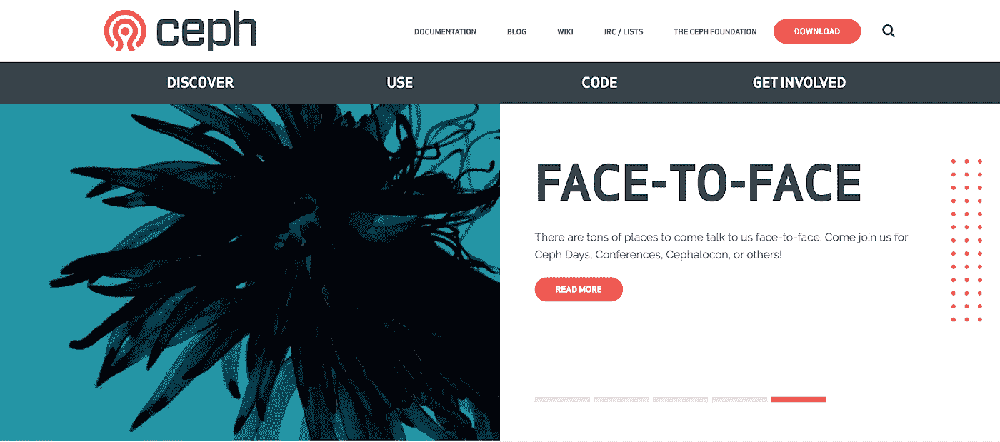
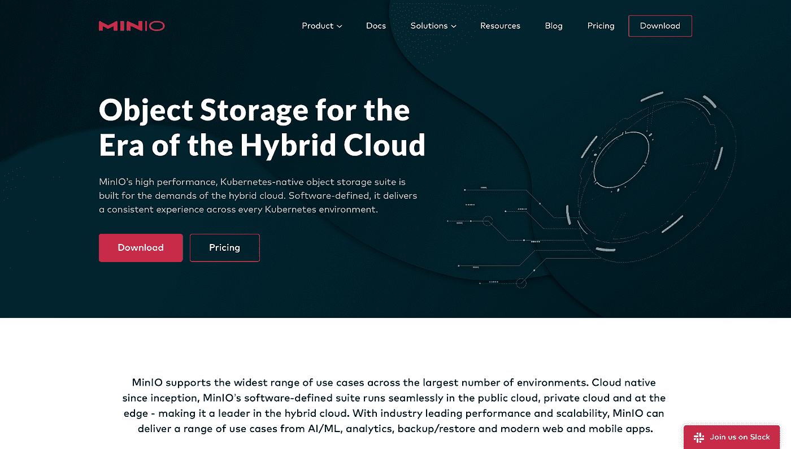
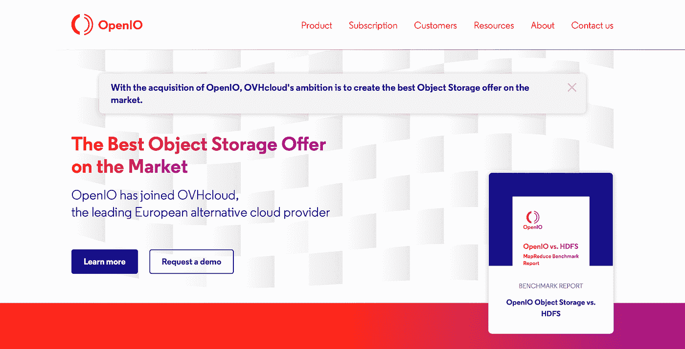

# 2021 年的 4 个开源对象存储平台

> 原文：<https://betterprogramming.pub/4-open-source-object-storage-platforms-for-2021-ceeaceb7e273>

## 每个程序员都应该使用的有用资源

乔希·威瑟斯在 [Unsplash](https://unsplash.com?utm_source=medium&utm_medium=referral) 上的照片

# 介绍

当处理大量的非结构化数据时，我们需要一个地方来存储它。我们可以选择许多不同的方式来存储数据，但我们今天将重点关注的是对象存储或基于对象的存储。在处理大量数据时，这是最佳选择，特别是因为它不贵，而且使数据管理更加容易。

如果您不熟悉，[对象存储](https://lakefs.io/object-storage/)是一种数据存储架构，它允许您在可伸缩的对象结构中存储大量非结构化数据。它将数据存储为带有元数据和唯一标识符的对象，使访问这些数据变得更加容易。现在，有许多平台提供对象存储设施。

这就是为什么在本文中，我们将告诉您四个有用的开源对象存储平台，它们包含健壮的特性，使它们成为 2021 年的伟大投资。

# 1.莱克夫斯

截图来自 [LakeFS](https://lakefs.io/) 。

LakeFS 是一个开源数据环境工具，允许您管理基于对象存储的数据湖。这些数据湖是您可以转储所有结构化和非结构化数据类型的存储库。LakeFS 还集成了许多工具，并支持亚马逊 S3 和谷歌云存储。此外，它可以与所有主要的数据框架一起工作，如 Hive、Spark、Presto、AWS Athena 等。

使用 LakeFS，您可以扩展数 Pb 的数据，还可以通过类似 Git 的分支和版本控制方法向其中添加数据，这允许您在不破坏数据的情况下添加更新。这种类似 Git 的方法还有助于轻松撤销数据更改，这使得处理数据更加容易和安全。

还可以通过查看 LakeFS 文档来了解其他特性和功能。

# 2.Ceph

截图来自 [Ceph](https://ceph.io/) 。

[Ceph](https://ceph.io/) 是对象存储、块存储、文件系统开源平台。它提供了与亚马逊的 S3 REST API 和 OpenStack 的 API Swift 完全兼容的对象存储功能。

Ceph 的对象存储允许您使用本地语言绑定和 Ceph 提供的其他技术轻松访问数据对象。如果您希望转变公司的 It 基础架构及其管理大量非结构化数据的能力，这是一个不错的解决方案。他们还有一些软件库，使得用 Java、C、C++、Python、PHP 和其他一些语言编写的软件能够使用本地 API 的能力访问 Ceph 的对象存储系统。

# 3.米尼奥

截图自 [MinIO](https://min.io/) 。

[MinIO](https://min.io/) 是一款开源云存储软件，提供高性能分布式对象存储，专为大规模数据基础设施而设计。它与亚马逊 S3 API 兼容，在 GitHub 上有超过 26K 颗星，有超过 680 名贡献者在其上工作。

MinIO 服务器存储所有类型的非结构化数据，如照片、视频、日志文件等。它也可以在开源 Apache V2 许可下使用，许多最强大的大数据和机器学习应用程序都使用 MinIO S3 对象存储。你可以在 MinIO 网站上查看许多其他功能。

# 4.OpenIO

截图来自 [OpenIO](https://www.openio.io/) 。

[OpenIO](https://www.openio.io/) 是一款开源对象存储解决方案，用于管理和保护大量非结构化数据。它允许您构建和操作弹性和安全的大规模存储基础架构。

OpenIO 与 S3 兼容，可以在任何硬件上部署或云托管。它也不需要在添加新硬件时重新分配数据；您可以立即使用您的额外容量。OpenIO 也是为大规模基础设施和大数据工作负载而设计的。除此之外，它还提供了直观的用户界面来简化存储管理员的日常工作。因此，您的数据变得非常容易访问和管理。

# 结论

您可以使用许多开源对象存储提供程序，它们提供了我们提到的许多特性中的一些。它们为您的所有存储需求提供了良好的解决方案，避免了高昂的财务成本。因此，选择一个具备您需要的所有功能的对象存储平台非常重要。

感谢您阅读这篇文章。希望你觉得有用。