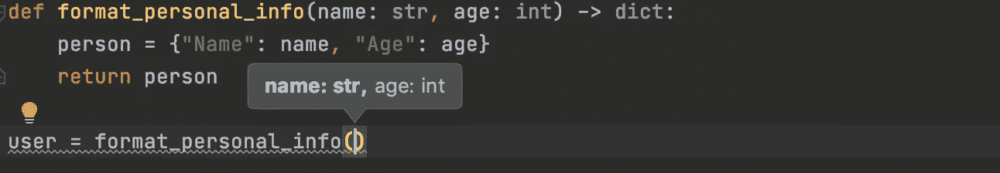
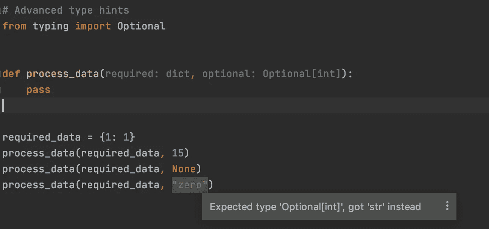
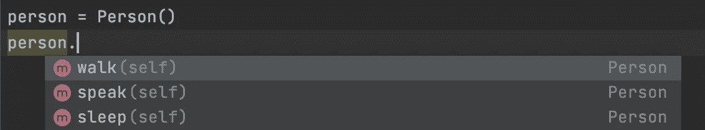
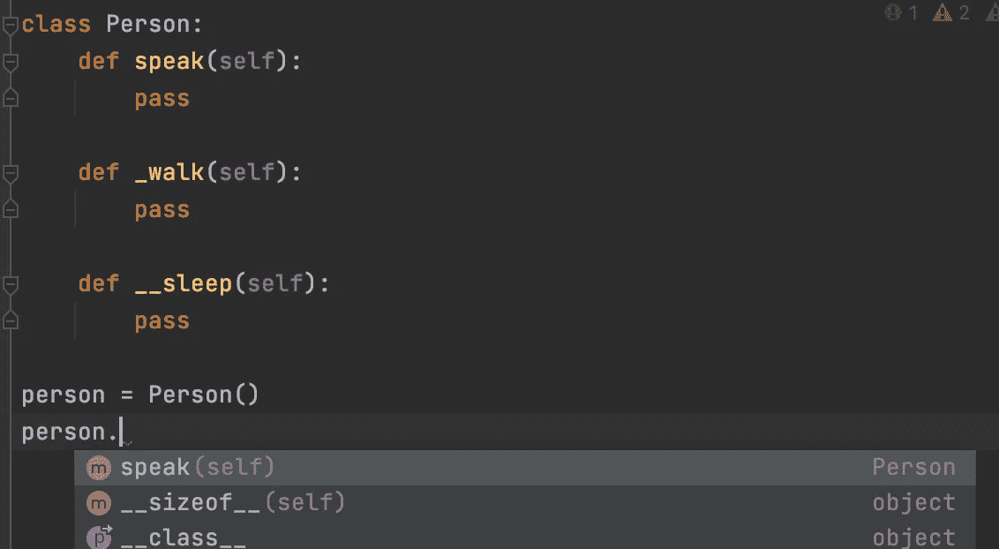

# 编写用户友好的 Python 函数需要考虑的 4 个选项

> 原文：<https://betterprogramming.pub/4-options-to-consider-for-writing-user-friendly-python-functions-269cd8c98d51>

## 函数不仅仅是好的名字和文档字符串


Patrick Fore 在 [Unsplash](https://unsplash.com?utm_source=medium&utm_medium=referral) 上拍摄的照片。

函数构成了任何 Python 或编程项目的驱动力。除了数据模型和结构设计之外，项目的功能在其可维护性方面也起着重要的作用。我们经常谈论代码库中函数和其他组件的可读性。在许多情况下，函数的可读性指的是合理的名称和清晰的文档字符串。这些应该是编写更好的函数的优先事项。

除了这些基础，Python 中还有可选的特性，可以让你的函数变得更好。他们对终端用户更友好。在本文中，我想谈谈其中的四个特性。

# 1.类型提示

静态类型语言通常需要在函数声明中指定参数的类型。作为一种动态语言，Python 不要求我们在函数中指定参数的类型。然而，随着 Python ( [PEP484](https://www.python.org/dev/peps/pep-0484/) )中类型提示的引入，可以在函数中提供参数的类型信息。

以下代码向您展示了一个简单的示例:

类型提示

通过类型提示，ide 可以在您调用这些函数时提供更有意义的信息，如下面的屏幕截图所示:



清除函数签名

需要注意的一点是，有时函数的类型超出了内置函数的类型(例如`str`、`int`、`list`)。在这种情况下，您可以利用包含更高级类型的`typing`模块。



高级类型提示

例如，上面的例子向你展示了`Optional`类型的用法。在该函数中，需要一个`int`或`None`。当我们试图使用不兼容的对象类型时，IDE(在我的例子中是 PyCharm)会给出一个适用的警告消息。

应该注意的是，即使您使用与类型提示不一致的不兼容对象类型调用函数，您的代码仍然可以运行，直到遇到异常。换句话说，Python 中并不严格要求输入。在 Python 中，在编译(到字节码)或运行时不执行类型检查，直到您的程序因为异常而被迫停止。

# 2.仅关键字参数

我们知道 Python 函数可以有位置参数和关键字参数。具体来说，关键字参数是由标识符(即关键字)指定的参数。相比之下，位置参数是由位置指定的参数。换句话说，位置参数不是关键字参数。

Python 中的函数调用范式允许我们通过位置隐式传递参数，或者通过关键字显式传递参数。下面的代码片段显示了一个示例:

Python 中的函数调用

然而，你可能知道，当我们按位置调用函数时，并不清楚某些参数是什么意思。在上面的例子中，使用关键字的第二次调用比第一次调用更清晰。

为了通过关键字强制调用，我们可以在定义函数时实现仅关键字参数:

仅关键字函数

函数中的星号表示星号后面的所有参数都必须指定为关键字参数。让我们试着调用这个函数:

```
>>> add_numbers_better(5, 7, 20)
Traceback (most recent call last):
  File "<input>", line 1, in <module>
TypeError: add_numbers_better() takes 2 positional arguments but 3 were given
>>> add_numbers_better(5, 7, deduction=20)
-8
```

如您所见，只有当我们将第三个参数设置为关键字参数，而不是位置参数时，才会调用该函数。

# 3.装修工

有时，我们希望我们的函数具有额外的调试或性能优化特性。例如，我们想知道我们的函数何时被调用，或者用特定的参数运行一个函数需要多长时间。

在这些情况下，我们可以考虑在编写函数时使用 decorators。一般来说，decorator 是高阶函数(从技术上讲，decorator 也可以实现为类)，它改变其他函数的行为，而不影响这些被修饰函数的原始操作。

让我们看看下面的玩具例子:

函数中的装饰者

*   我们创建一个`logging_time`函数来记录其他函数的执行时间。注意，这个函数返回一个本质上是修饰函数的函数。
*   除了自定义装饰器函数，我们还可以使用内置装饰器，比如`wraps`和`lru_cache`。
*   `wraps`装饰器有助于保存函数的元数据(例如注释、文档字符串)，而`lru_cache`允许缓存计算后的函数输出。因此，如果有对相同输入和输出的重复访问，比如使用递归函数，这是很有用的。

# 4.使用下划线进行访问控制

与许多其他面向对象的编程语言不同，Python 没有访问控制。严格来说，Python 中的一切都是公开的。然而，通过使用下划线，我们可以使我们的函数模仿一些访问控制特性，将 public 变为 protected 或 private。

当你想表达这些函数不打算公开使用的意图时，这是一个有用的特性。

Python 自定义类

假设我们在一个类中创建了一些函数，如上面的代码片段所示。通常，这些函数(或者更具体地说，实例方法)都是公共的。典型 Python IDE 中的自动完成建议清楚地揭示了这一事实。



公共职能

现在，我们更改这些方法的定义来更新它们的访问级别。现代 Python IDEs 足够聪明，可以知道这些函数的更新访问级别，如下面的自动完成建议所示。仅提示`speak`方法。



更新访问

顺便提一下，如果您想调用这些非公共方法，Python 中仍然允许您这样做。它涉及到对类名的篡改，如下所示:

```
>>> person = Person()
>>> person.speak()
>>> person._walk()
>>> # the private method with double underscore prefix triggers mangling in the format of _Class__method()
>>> person._Person__sleep()
```

因此，为了通过限制非公共函数来利用自动完成特性，您应该考虑在函数前面加上一两个下划线，使函数成为受保护的或私有的。

# 结论

在本文中，我们讨论了在创建 Python 函数时可以考虑使用的四个可选特性。尽管它们不是 Python 函数声明所必需的，但它们可以使您的函数更加用户友好。这里有一个快速回顾:

*   类型提示有助于指示函数接受什么输入以及函数产生什么输出。它们允许 ide 执行类型检查。
*   只有关键字的参数使得函数调用更加明确。
*   装饰者向函数添加额外的行为，并删除一些样板文件(例如日志)。
*   使用下划线可以使函数成为非公共的，从自动完成建议中删除它们。此外，你要清楚地表明，在大多数用例中，这些功能不是面向最终用户的。