# 规划大规模数据迁移的 4 种实践

> 原文：<https://betterprogramming.pub/4-practices-to-plan-a-large-scale-data-migration-8edd6c921aa5>

## 我从迁移 250 亿条记录中学到了什么


克里斯·布里格斯在 [Unsplash](https://unsplash.com/s/photos/migration?utm_source=unsplash&utm_medium=referral&utm_content=creditCopyText) 上的照片

数据迁移就是将数据从一个位置移动到另一个位置的过程。

随着业务的增长，数据迁移几乎是不可避免的。您可能需要更大的存储来支持数据增长。或者，由于不断发展的需求，您需要更改数据格式。

我最近用 Elasticsearch 完成了一次数据迁移。总共有*250 亿份文件*，整个过程差不多用了 *14 天*！

虽然听起来很简单，但数据迁移并非易事。没有系统停机的平稳迁移有许多注意事项。

在这篇文章中，我将与你分享我在完成一次大规模数据迁移后所获得的知识。无论您的系统架构如何，您都可以遵循这些实践。我们开始吧！🏃

# 读写标志

在连续的实时系统中执行数据迁移之前，您需要考虑两个问题。

第一，您如何确保新位置的数据保持更新？此时，您的 API 仍在向旧存储写入数据。对已迁移数据的任何更新都将在新存储中丢失。

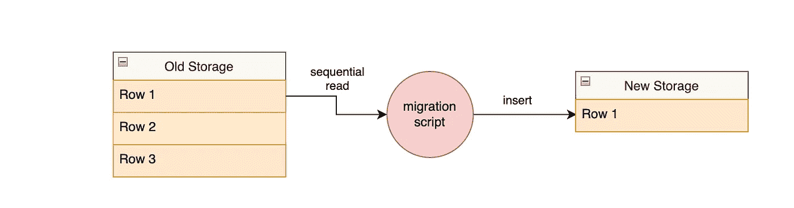

迁移第 1 行

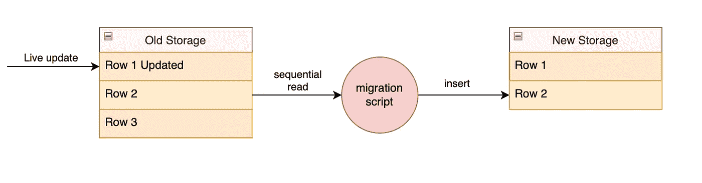

新存储中的第 1 行未更新

第二，如何平稳地迁移 API 以使用新的存储？类似地，如果发生任何不好的事情，您需要将 API 回滚到旧的存储。新旧存储之间的平稳过渡**是不停机迁移的关键。**

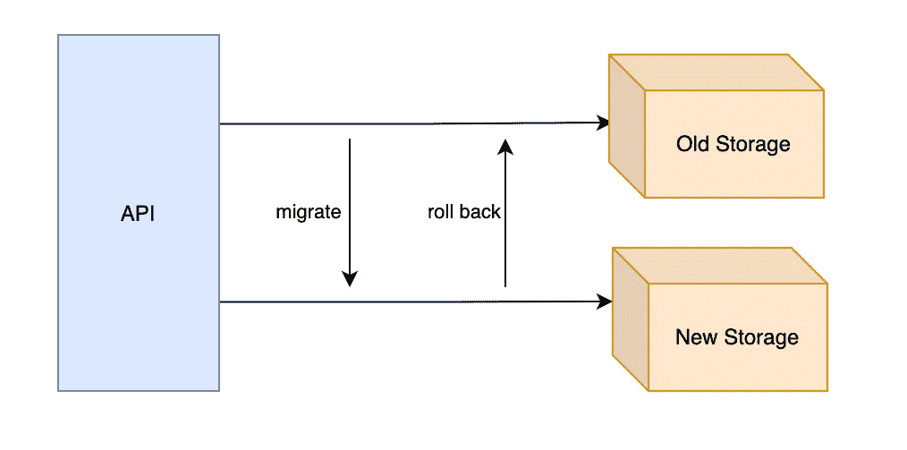

不停机的过渡

为了解决这些问题，我们将引入一个**读写标志**。标志是在运行时打开或关闭某些功能的开关，不需要任何代码更改。

我们的标志有 4 个值，每个值代表 API 与数据存储交互的一种特定方式。

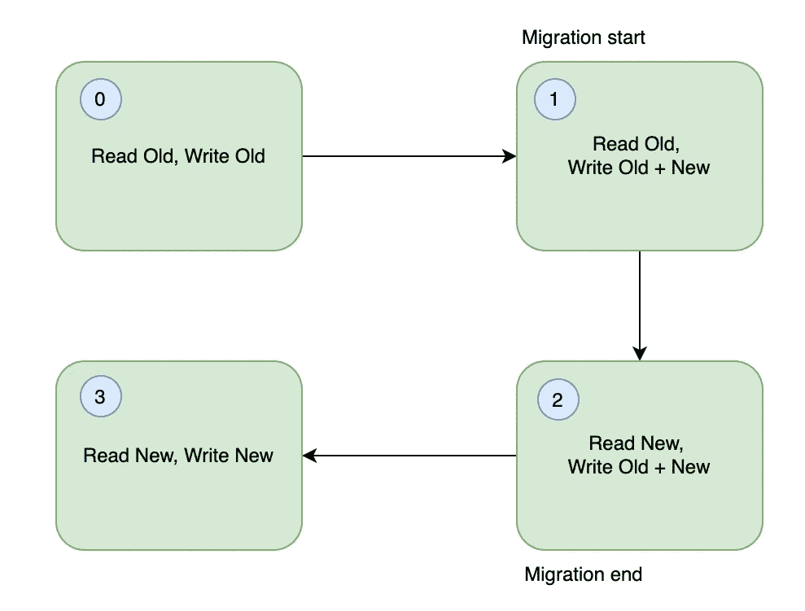

迁移的四个阶段

开始时，API 只与旧存储交互，这是默认行为。

当您将标志切换到 1 时，API 从旧的存储器读取数据，但是将数据写入两个存储器。向两个位置写入数据必须在数据迁移开始之前开始。这可确保新存储保持更新，旧存储保持正常工作。

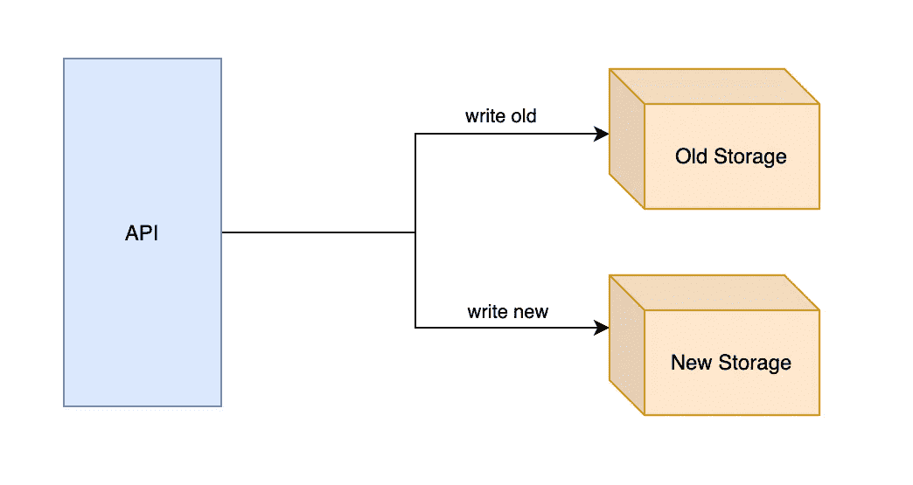

“双写”

一旦迁移结束，API 就可以从新存储中读取数据。如果出现意外错误，您可以立即将标志切换回 1。由于“双写”，旧存储仍然可用。

最后，当一切正常时，您可以切换您的 API 来完全使用新的存储。这标志着迁移的结束。

请注意数据流是如何由一个开关动态控制的。在整个过程中，不需要任何代码更改或部署。在迁移开始之前，可以预先准备好所有相关的逻辑。

在代码级别，我们可以使用读写标志轻松地执行条件检查。伪代码如下所示。

```
// 4 values of the flagoldOnly = 0
writeBoth = 1
readNew = 2
newOnly = 3// helper functions for condition checksfunction isReadNew(flag) {
    return flag == readNew || flag == newOnly
}func isWriteOld(flag) {
    return flag != newOnly
}func isWriteNew(flag) {
    return flag != oldOnly
}// read logicif isReadNew(flag) {
    read_new()
} else {
    read_old()
}// write logicif isWriteOld(flag) {
    write_old()
}
if isWriteNew(flag) {
    write_new()
}
```

# 资源规划

“双写”的一个主要问题是，它实际上是数据存储系统的常规写流量的两倍**。**

**根据您的系统，它可能无法承受这种额外的压力。迁移可能会增加正常 API 流量的延迟。在最坏的情况下，它可以完全扰乱系统，这对您的客户来说是个坏消息！**

**这是你需要做你的**尽职调查**的地方，以了解你的系统的容量。一种方法是执行[压力测试](https://en.wikipedia.org/wiki/Stress_testing_(software))来估计您的数据系统可以支持的最大写入流量。**

**一般来说，压力测试包括启动多个后台线程，并不断向系统发送并发请求。您可以将每个线程想象成一个无情的客户端。**

**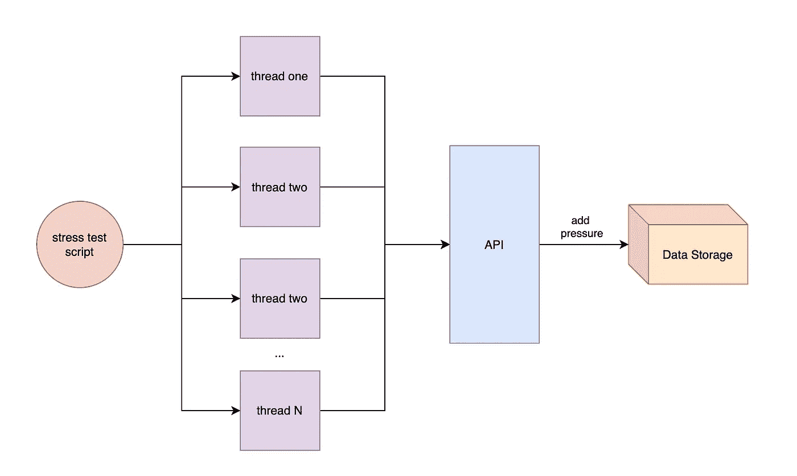**

**压力测试**

**我不会深入讨论压力测试的细节，因为它值得另写一篇文章。我用一个名为 [wrk](https://github.com/wg/wrk) 的工具和一个我自己写的 Go 脚本进行了压力测试。**

**在你对压力测试结果有信心后，你可以开始问自己一些问题。**

**您的新数据存储应该在单独的物理机上吗？新旧数据存储可以在同一个群集中吗？它们可以在同一个数据库实例中吗？**

**回答这些问题时，应该深入了解您正在使用的数据存储。不同的存储系统对高写入流量的反应不同。**

**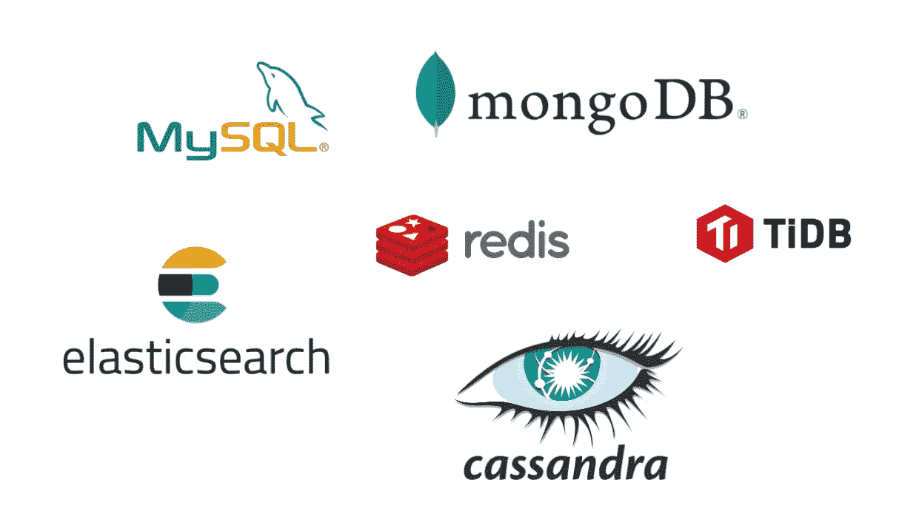**

**数据存储系统的例子**

**了解数据迁移可能对您的系统产生的影响对于准备应对意外情况非常重要！**

# **一致性检验**

**即使有读写标志和精细的资源规划，错误仍然可能发生！例如，由于网络问题，数据插入可能会超时。**

> **“任何可能出错的事情都会出错。”—墨菲定律**

**在将读写标志切换到 2 (read new)之前，建议执行一次**一致性检查**。**

**顾名思义，一致性检查会比较新旧存储之间的数据。它把旧的存储视为真理的来源。如果存在不一致，检查将执行数据修复。**

**如果您的数据非常大，一致性检查应该使用自动化脚本来完成。根据您对错误的容忍度，您可以执行完全或抽样一致性检查。**

**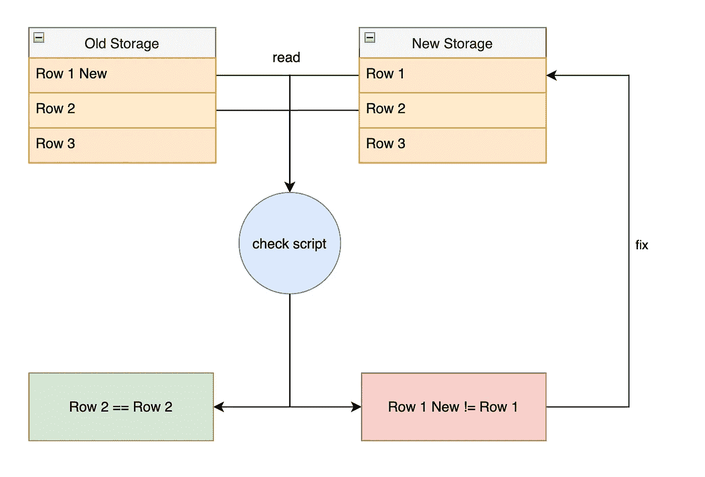**

**一致性检验**

**检查脚本还应该报告发现的不一致的百分比。如果它们高于您预期的阈值，您可能希望在将 API 切换为 read new 之前调查根本原因。**

**同时，数据修复可以同步或异步完成。**

**如果是同步的，检查脚本将在发现不一致后立即应用修复。否则，脚本可以将修复程序推入队列，供工作人员应用。**

**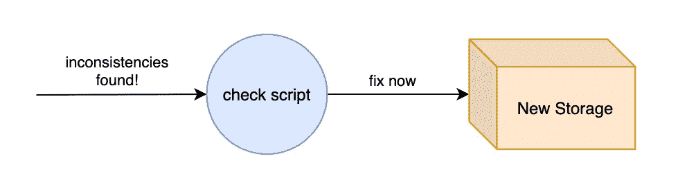**

**同步定位**

**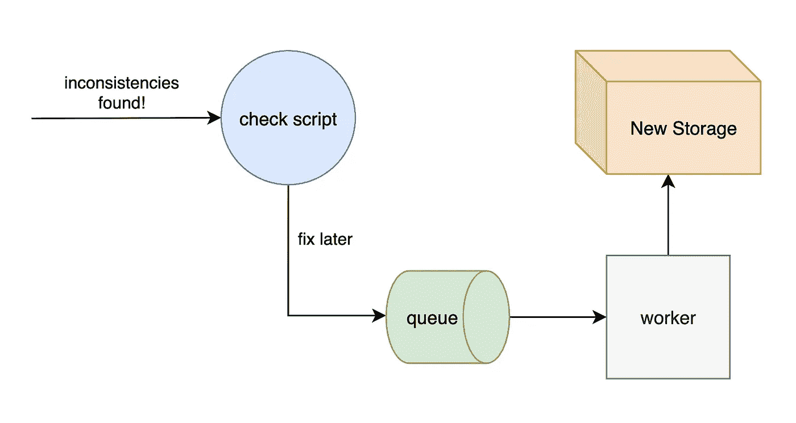**

**异步修复**

**但是修复方法重要吗？嗯，这要看情况…如果你想考虑一下，就在这里停下来😏**

**假设您的 API 正在同步地将数据写入新的存储。但是，您在一致性检查中选择了异步修复。**

**队列可能会经历短暂的延迟。当工作人员找到“补丁”时，存储器可能已经包含了来自 API 的更新。然后，工作人员将使用过时的“修复”覆盖更新的数据。**

**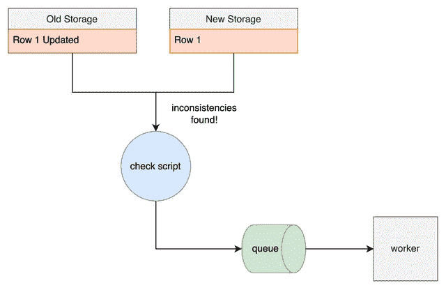**

**异步修复中的延迟**

**通常，同步修复就足够了，因为它很简单。**

**在这里我想强调的是，当数据开始在所有地方流动时，数据迁移是复杂的。你必须理解你的数据是如何表现的，否则你会被奇怪的不一致所震惊。**

# **记录的重要性**

**如果你已经编程一段时间了，你会同意系统日志是开发人员最好的朋友。在数据迁移中，我想强调两种类型的日志，它们将使您的生活轻松十倍。**

## **错误日志**

**记住，错误随时可能发生，你需要为此做好准备。当出现错误时，您的迁移脚本应该出于调试目的将其注销。**

**此外，与其依赖一致性检查来修复错误，我强烈建议您在错误发生时修复错误。**

**如果迁移需要 14 天，完整的数据检查也需要 14 天。如果你的项目急于完成，这可能是不可行的。**

**这就是错误日志非常有用的地方。您可以通过检查日志中未正确迁移的数据来手动执行修复。如果您足够有想象力，您甚至可以使用脚本来解析日志并进行修复！**

**通过这种做法，一致性检查将只是一种“保险”。最后进行抽样一致性检查会更快，而且绰绰有余。**

****

**在 [Unsplash](https://unsplash.com/s/photos/error-logs?utm_source=unsplash&utm_medium=referral&utm_content=creditCopyText) 上[视觉](https://unsplash.com/@visuals?utm_source=unsplash&utm_medium=referral&utm_content=creditCopyText)拍摄的照片**

## **进度日志**

**迁移大量数据是一个痛苦的过程。最好能知道它什么时候结束，这样你就可以计划你的庆祝活动了！**

**玩笑归玩笑，了解您的迁移进度可以告诉您向您的数据系统引入了多少额外的写流量。另外，你需要对你的利益相关者和技术领导负责。**

**我所做的是，我有一个后台线程，记录每分钟迁移的数据量。因为我知道数据的总量，所以我可以估计整个过程需要多少时间。**

**简而言之，您必须仔细考虑理解迁移过程所需的信息。尽可能多地注销它们。一旦开始迁移，后悔错过日志就太晚了。**

****

**迈克·范·登博斯在 [Unsplash](https://unsplash.com/s/photos/loading?utm_source=unsplash&utm_medium=referral&utm_content=creditCopyText) 上的照片**

# **最后的想法**

**总之，我介绍了四种可以帮助您更好地设计和规划迁移项目的实践。你可以(也应该)根据自己的需要调整这些做法。**

**如果数据量很小，这些实践中的一些是多余的。然而，当处理大量数据时，它们非常有用。**

**我想分享更多的信息，但是这篇文章太长了。请随意留下评论，这样我们可以交流思想，进行更多的讨论。在此之前，祝您的数据迁移好运！**