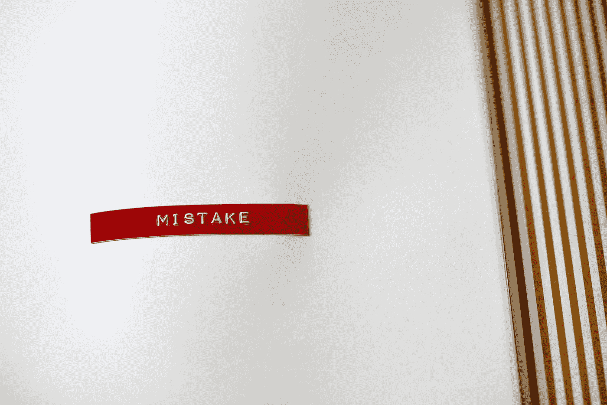

# 担任工程经理 10 年来的 4 个产品管理错误

> 原文：<https://betterprogramming.pub/4-product-management-mistakes-from-10-years-as-an-engineering-manager-c3294c4ee846>

## 不要让这些错误毁掉工程生产力

丹妮拉·霍尔泽在 [Unsplash](https://unsplash.com?utm_source=medium&utm_medium=referral) 上的照片

为了项目的整体利益，产品(和项目)管理和工程团队很好地合作是很重要的。不幸的是，虽然这两个部门应该在如何构建一个成功的软件项目上步调一致，但情况可能并不总是如此。

在过去的 10 年里，作为一名开发人员和工程经理，这里有一些我见过的对工程生产力影响最大的错误:

# 反复更换工具

有很多项目管理工具。有些是拥有大量插件的完整套件(如 [JIRA](https://www.atlassian.com/software/jira) ，而其他则是轻量级解决方案(如[特雷罗](https://trello.com/en))。同样，关于哪种工具最好，也有很多观点。这可能意味着一些人想要使用他们在过去 5 年中一直使用的工具，因为他们知道它并且它很舒服——而另一些人则想要四处跳跃并尝试下一个新事物。

但是，当新工具不断引入，工作在它们之间导出和导入时，就会造成大量混乱和无组织的碎片化工作。任务可能会被放弃，这可能会导致最后一分钟的紧急情况和错过最后期限。历史可能会被遗忘，这意味着可能需要更长的时间来解决未来类似的问题，或者理解最初为什么要做某事。即使在最好的情况下，也要花一些时间来学习如何使用新工具。

## 如何避免

*   **不要在真空中选择新工具。也许有人以前使用过某个工具，知道为什么它对你的团队有用或没用。可能工程更喜欢一个视图不同的工具，而执行团队需要一个可以产生某些报告的工具。获取多个输入。**
*   选择你的工具集，并坚持一段时间。这并不意味着你不能评估新工具，但是一旦你决定使用某样东西，你应该给团队一个机会去克服“使用新事物”的最初障碍。设定一个对每个人都合理的时间。
*   知道你什么时候应该改变。如果一个工具变得如此糟糕，以至于每个人都抱怨它或拿它开玩笑，那么他们很可能会避开这个工具，并且很可能会在它之外的一个他们更喜欢的工具中工作，从而使信息变得支离破碎。

# 改变方法

就像工具一样，有很多关于管理软件开发过程的最佳方式的想法。虽然大多数团队从规定的方法开始(敏捷、Scrum 等。)，大多数人倾向于随着时间的推移对其进行改进，以适应他们的特定需求。

久而久之，坏习惯也会溜进来，给团队留下类似于[scrubut](https://www.scrum.org/resources/what-scrumbut)的东西。当这些坏习惯出现时，扔掉所有东西，从头开始一些新的东西会很有诱惑力。这种**会**有用，会给你的团队带来新的能量，但如果这种情况发生得太频繁就不会了。就像工具集一样，过于频繁地改变方法会导致混乱和浪费时间。

## 如何避免

*   **了解你的团队**。如果你的团队习惯于快节奏的看板风格的环境，不要试图实现可扩展的敏捷框架([安全](https://www.scaledagileframework.com/))。试着选择一种与你团队的个性和偏好的工作风格相适应的方法。
*   **了解你的行业**。另一方面，如果你在一个监管非常严格的行业(如医疗保健)工作，SAFe 的流程可能对你很有帮助。
*   **不要做狂热者**。无论您使用哪种方法，都有可能对其进行调整以满足您的需求。一些定制可能是有效的和好的，但是要确保你没有掩盖实际的问题。没有规则*有*可以严格遵守，为了规则而把规则强加给团队的人会败坏士气。

# 让产品经理管理工程团队

工程团队应该与了解产品和业务愿景的产品经理一起工作。他们应该和一个项目经理一起工作，这个项目经理可以帮助他们实现这些愿景，并使项目保持在正轨上。这两个角色都不应该负责工程团队。

产品/项目管理和工程是不同的学科。虽然他们应该一起工作，但他们有不同的优势和劣势。

## 如何避免

*   **雇佣可靠的产品和项目经理。一个好的产品经理知道产品背后的*是什么*和*为什么*但是不需要告诉工程团队*如何*去构建它。他们应该在团队开发产品的时候支持他们，并帮助确定接下来要做的事情的优先顺序。**
*   雇佣强有力的工程经理。你的工程经理应该知道*如何*制造产品，并且能够带着关于*他们正在制造什么*以及*为什么*这对他们的客户很重要的问题去找他们的产品对应方。在这两个角色上做得好有助于确保团队合作，而不是一方欺负另一方。

# 狭隘的关注指标

有一个度量标准作为工程团队表现的关键指标是很诱人的——但是这个度量标准并不存在。[我以前写过团队如何有时陷入使用速度作为最重要的度量标准的陷阱](/3-metrics-for-engineering-team-success-other-than-velocity-5df9d79dbff9)，但是同样的事情可能发生在任何度量标准上。软件开发(尤其是在大型团队中)是一个非常复杂的系统，试图只关注一个度量标准会大大简化它。

大多数项目管理工具包含不同的报告和图表，以可视化团队如何以不同的方式工作。使用它们。

## 如何避免

*   **使用多个指标。**有许多不同类型的软件度量标准，它们可以以不同的方式使用。选择一套适合你的团队和他们工作方式的方法。
*   **不要让任何一个指标变得太重要。**以不同的方式来看待数据，以获得团队运作的整体视图，这一点很重要。不要因为一个指标看起来更好，就忽略另一个指标告诉你的信息。
*   **请记住，指标只有在稳定的情况下才有用。**如果你的团队正在改变他们的工具或方法，或者他们日常工作的任何其他方面，你的度量标准也会发生变化。

哪些项目管理错误耗费了您的工程团队的时间和金钱？你是如何解决这些问题的？