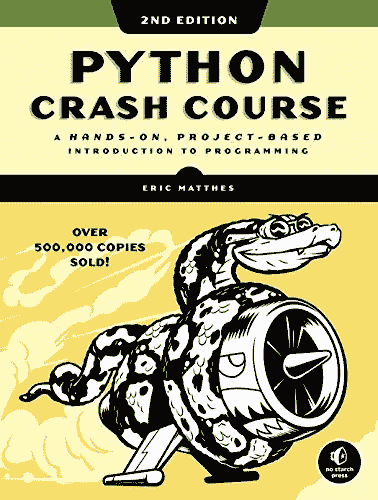
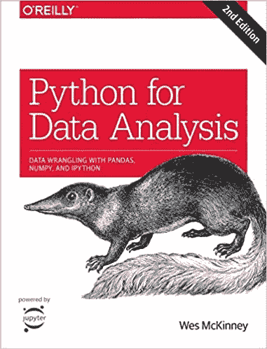
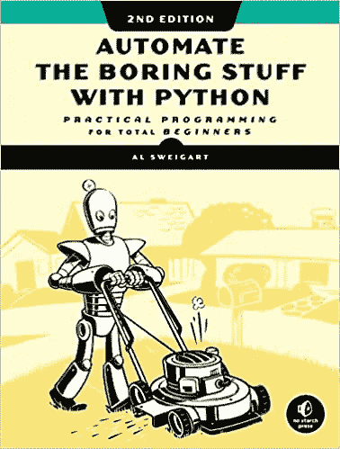
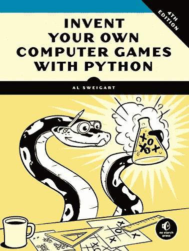

# 作为一名自学成才的程序员，我阅读了 4 本 Python 书籍

> 原文：<https://betterprogramming.pub/4-python-books-i-read-as-a-self-taught-programmer-5a5453840cdb>

## 学习 Python 来创建游戏、网站、自动化任务等的书籍

照片由[思想目录](https://unsplash.com/@thoughtcatalog?utm_source=medium&utm_medium=referral)在 [Unsplash](https://unsplash.com?utm_source=medium&utm_medium=referral) 上拍摄

Python 是您可以轻松学习的编程语言之一，这要归功于它对简单性和增强的代码可读性的强调。如果有一本书指导你从零开始学习 Python，并为你提供有趣的项目，让你可以将学到的所有概念付诸实践，那么学习 Python 会变得更加容易。

这就是为什么我列出了我刚开始学习时读过的书的清单。如果您刚刚决定学习 Python，一直在试图理解基础知识，或者您已经编写了 Python 代码，并且希望增加您在特定领域(数据分析、自动化、游戏等)的知识，我建议您阅读它们。

*免责声明:本文中列出的任何书籍都没有附属链接。确保你总是得到下面列出的任何一本书的最新版本(这将帮助你避免一些因编写旧版本的代码而带来的麻烦)。*

# Eric Matthes 的 Python 速成班

图片来自[亚马逊](https://www.amazon.com/Python-Crash-Course-Hands-Project-Based/dp/1593276036)

这是一本为没有编程经验，希望从零开始学习 Python 的人写的书。这本书的结构是为了让你先学习基本概念，然后用这些知识来完成你的第一个 Python 项目。

一开始，这本书会指导你如何安装 Python 和一个文本编辑器。当一切都设置好了，你将学习 Python 的基本编程概念，如变量、列表、循环等。最重要的是，这本书充满了帮助你从头开始编写干净代码的技巧。

一旦你学会了基础知识，这本书会给你三个项目来实践你所学的一切。第一个项目是为那些想通过制作一个简单的 Space Invaders 街机游戏来学习 Python 的人准备的(你将学习 Pygame 库)，第二个项目是为那些更喜欢了解 Python 的数据可视化库(Matplotlib，Plotly)的人准备的，而第三个项目是为那些想学习如何用 Python 创建 web 应用的人准备的(你将学习 Django)。

## **这本书是如何帮助我学习 Python 的？**

这是我读过的第一本 Python 书籍，我不得不说它真的帮助我理解了 Python 的基本概念。理论解释得很好，例子很容易理解，代码一行行解释得很详细。在这本书的第二部分，我选择了 web 应用程序项目，它通过创建一个漂亮的网站帮助我发展了 Python 知识。

看完《Python 速成班》，我看了下面列出的书，排名不分先后。选择一个能增加你感兴趣领域的知识的。

# Wes McKinney 的数据分析 Python

在本书中，您将学习 Python 的库，如 Numpy、Pandas、scikit-learn 和 Matplotlib，以便在 Python 中操作、处理、清理和处理数据集。为此，您需要很好地理解 Python 的基本概念。

图片来自[亚马逊](https://www.amazon.com/Python-Data-Analysis-Wrangling-IPython-ebook/dp/B075X4LT6K)

尽管第二章和第三章涵盖了阅读本书的必备知识，但如果你以前从未编程过，我建议你先学习“Python 速成班”中解释的 Python 的基本概念。这本书对 Python 基础知识的讲解对于初学者来说可能太快了。然而，如果你以前用 Python 编程过，你可以跳过这两章。

到本书结束时，你将能够有效地解决一系列数据分析问题。

## **这本书是如何帮助我学习 Python 的？**

这本书很好地介绍了 Python 中的数据科学工具，尤其是对那些有一些 Python 知识的人来说。如果你对学习数据科学感兴趣，我认为首先阅读这本书是一个好主意，因为一些数据科学书籍会假设你以前对 Python 和本书中解释的库有所了解。

书中写的所有数据集和代码都可以在 [Github](https://github.com/wesm/pydata-book) 上获得，这有助于在我们的计算机上测试这些例子。当我选择这本书时，我只阅读了熊猫和 scikit-learn 部分，因为它们是我感兴趣的库。我认为这些部分解释得很清楚，很容易理解。

如果你想从头开始学习数据科学，也可以考虑阅读我在下面文章中列出的书籍。

 [## 作为一名自学成才的数据科学家，我读了 4 本书

### 涵盖成为数据科学家所需的大部分内容的书籍

better 编程. pub](/4-books-i-read-as-a-self-taught-data-scientist-380d13d8bb0c) 

# 用 Python 自动化枯燥的东西

图片来自[亚马逊](https://www.amazon.com/Automate-Boring-Stuff-Python-2nd/dp/1593279922)

这本书着重于使用 Python 来解决我们日常面临的那些繁琐的任务，比如重命名文件或更新数百个电子表格单元格。通过这种方式，您将节省大量时间，并将您在 Python 中学到的知识付诸实践。

这本书从 Python 的一些基础知识开始，然后带你完成程序的创建，这些程序执行有用的自动化技术。在每章的结尾，你会发现一个练习项目，它会挑战你去改进那些程序，并使用你新获得的技能来自动完成类似的任务。

这本书将教你创建、更新、移动和重命名文件和文件夹，搜索网页和下载在线内容，更新和格式化任何大小的 Excel 电子表格中的数据，发送电子邮件回复和文本通知，等等。

## **这本书是如何帮助我学习 Python 的？**

我发现自动化项目非常有用，尤其是对于那些从事重复性和单调工作的人。在掌握了 Python 的基础知识之后，我读了这本书，所以我跳过了第一章，练习我的 Python 技能，试图在我的日常工作流程中自动化那些无聊的东西。多亏了这本书，我能够通过解决现实世界的问题来增加我的 Python 知识。

# 用 Python 发明你自己的电脑游戏

图片来自[亚马逊](https://www.amazon.com/Invent-Your-Computer-Games-Python/dp/1593277954)

这本书非常适合想通过创建游戏来学习 Python 的完全初学者。本书首先帮助您构建简单的游戏，如猜数字、井字游戏和刽子手，然后教您如何构建更高级的游戏，如基于文本的寻宝游戏和带有声音效果的动画避碰游戏。

在构建这些游戏时，您将学习编程和数学概念，这些概念将帮助您将循环、变量和流控制语句组合到真正的工作程序中，使用列表、字典和元组等数据结构，向游戏中添加图形和动画(您将学习 pygame 模块)，编写简单的人工智能程序等。

读完这本书后，你会学到关键的编程和数学概念，这些概念对你的游戏编程更上一层楼是必要的。

# 额外收获:超越基本的 Python 知识

一旦你掌握了 Python 的基础知识，我推荐你查阅这本书来不断增加你的 Python 知识，不管你想专攻什么主题。

与前几本书不同的是，通过“超越 Python 的基本知识”，，你将学到帮助你编写更好代码的最佳实践。这本书解释了编码风格、bug 的常见来源、lambda 等函数式编程技术、如何在面向对象编程中创建类等。

我正在读它，它是那种长时间呆在你键盘旁边的书！

*就是这样！希望那些书能像帮助我一样帮助你学习 Python。下面你可以找到一些我完成的 Python 项目。*

 [## 我们能打败庄家吗？用简单模型预测足球比赛

### 预测英超、西甲、意甲和德甲的足球比赛结果。

medium.datadriveninvestor.com](https://medium.datadriveninvestor.com/can-we-beat-the-bookies-predicting-football-games-with-a-simple-model-43fe020fb384)  [## 我曾经每年花 180 美元购买一个有利可图的赌博工具。今年我用 Python 做了一个

### 完整的代码创建一个足球博彩工具与熊猫和硒。

medium.datadriveninvestor.com](https://medium.datadriveninvestor.com/i-used-to-pay-180-yr-for-a-profitable-betting-tool-this-year-i-built-one-in-python-dda1a9b9581f) 

[**与 3k 以上的人一起加入我的电子邮件列表，获取我在所有教程中使用的 Python for Data Science 备忘单(免费 PDF)**](https://frankandrade.ck.page/bd063ff2d3)