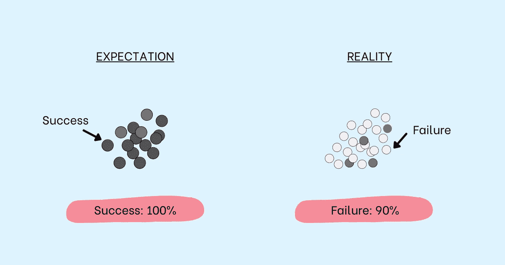

# 问自己 4 个问题来克服对失败的恐惧

> 原文：<https://betterprogramming.pub/4-questions-to-ask-yourself-to-overcome-the-fear-of-failure-753b296c51be>

## 3.当你失败的时候你会停止尝试还是因为你停止尝试而失败？

鸣谢:作者

如今，许多文章、书籍、播客和视频都在传达失败在塑造我们未来中的重要性。很难否认成功来之不易。任何试图爬山的人都会在途中遇到相当多的惊喜，有些是好的，但大部分是坏的。

成功登顶的人不是一路上面临许多艰难险阻的人，而是坚持和反抗的人——坚持自己的努力，抵制轻易放弃的道路。换句话说，不是我们的失败，而是我们对失败的反应决定了我们的结局。

对失败的恐惧会限制我们。另一方面，学会处理好它可以增加我们未来成功的机会。失败和我们处理失败的能力是生活中至关重要的技能。然而，我们并不是天生就能很好地处理失败。

从学校开始。可怕的 F 级与“失败”联系在一起。任何在成绩单上得过“F”的人都会记得失望、羞愧和自我怀疑的感觉。作为一个社会，我们庆祝成功，轻视失败。在学校、大学以及整个工作生涯中，我们都被期望做得很好。我们的整个奖励系统是围绕成就、表现和卓越来设计的，哪里还有失败的空间？

然而，不先失败就不可能成功。本杰明·富兰克林曾经说过:“不做准备就是在为失败做准备。”这适用于失败和实现目标。换句话说，如果你没有学会很好地处理失败，你可能永远不会成功。

> “学会失败意味着学会理解自己的错误，因为除非你知道哪里出了问题，否则你可能会做错误的事情来纠正它。”——梅根·麦卡德尔(Megan McArdle)在《失败的一面:为什么失败是成功的关键》

而当你做错事的时候，你可能很努力却没有进步。尽管很努力，但失败的经历仍然伴随着你。当面对另一种情况时，过去的负面后果可能会导致不作为，阻止你拥有采取行动所需的经验、能力和技能，这进一步灌输了对失败的恐惧，导致难以打破的恐惧和失败的循环。

唯一能让你与众不同的是你对失败的看法和反应。那就是不要让失败变成失败，而是成功的一课。不要把失败视为障碍，而是前进的机会。这是那种比害怕冒险的人更害怕错过机会和无所作为的人。

# 你失败了吗？

既然你知道学会处理失败是生活中的一项重要技能，没有人会教你如何做好，你应该自己学会。首先要问正确的问题:

## 摆脱失败和学会处理失败，哪个更有价值？

当被问到时，大多数人会优先考虑学习处理失败，而不是摆脱失败。然而，在我们的愿望和我们的行动之间存在着巨大的差距。

由于厌恶风险，我们大多数人花费时间和精力试图阻止失败，而不是在失败出现时制定行动计划来应对。

想想你最近的一些工作任务或项目，做一个现实检查:

*   你失败了几次？如果你一直成功，你真的认为你已经足够努力了吗？
*   你是否谨慎行事，不愿意冒险，或者探索需要你走出舒适区的机会？
*   你更害怕什么——失败还是冒险？

要想成功，不舒服也要舒服。你不能坐在自己的舒适区里，期待伟大的事情发生。为了实现对你重要的事情，你需要把一只脚放在你舒适的边界之外。当你这么做的时候，要愿意接受你会失败。

问题不再是你会不会失败，问题是一旦失败你会怎么做。当问题出现时，你将如何处理？

# 你是在进步，保持不变，还是变差了？

做任何有价值的事￫失败￫教训￫学习￫改进和成长

当你在某件事上失败时，你现在肯定知道什么是行不通的。你可能还没有取得成功，但如果你继续努力，并从失败中吸取教训，在未来的几个月或几年里，你会变得更好。

> “做得越多，失败越多。失败越多，学到的越多。你学得越多，你就变得越好。”—约翰·麦克斯韦在《向前失败:把错误变成成功的垫脚石》中

换句话说，如果你没有进步，你就没有真正失败和学习。

衡量你是否从失败中学习的一个很好的方法是确定在过去的一个月、六个月和一年中有什么进步:

*   你学到了什么新技能？
*   你现在工作和生活的哪个具体部分比较好？
*   你明白什么不行，为什么不行吗？
*   哪些具体领域需要你更多的时间和关注？

# 当你失败的时候你会停止尝试还是因为你停止尝试而失败？

当面对逆境时，大多数人感到犹豫不决、焦躁不安，并对未来感到焦虑。是之后发生的事情造成了不同——乐观主义者被经历短暂困扰，但很快恢复过来，而悲观主义者继续被失败的恐惧所麻痹。乐观主义者冲出这个阶段，认为这只是一个艰难的阶段，而悲观主义者陷入绝望，认为他们的处境是永久性的。

现代积极心理学之父马丁·塞利格曼研究了人们对逆境的“我放弃了反应”,他在《习得的乐观》中写道:

> “情绪和行动通常不会直接跟随逆境而来。相反，它们直接源于你对逆境的信念。这意味着，如果你改变对逆境的心理反应，你就能更好地应对挫折。”

当你在某件事上失败时，感到失望是正常的。不可以的是让这些感觉阻止你采取行动。

使用暂时的和具体的解释来描述不好的事件——暂时的解释会激励你努力解决你的问题，而具体的解释会把问题的焦点放在那个特定的事件上，而不是一概而论。临时和具体的解释将推动清晰度，并鼓励解决问题。这将使你能够掌控自己的处境，而不会感到绝望和无助。

将失败视为暂时的挫折，你就可以停止将它们视为放弃的永久借口。

# 你是在获取知识还是在学习前进？

当我们在某件事情上失败时，我们很容易欺骗自己，相信我们正在通过收集失败前后的所有数据来解决问题。是的，这是重要的第一步。但这不应该是我们的最后一次。

了解哪里出了问题很重要，但更重要的是利用这些知识采取行动。大多数人会花大量的时间分析失败的根本原因，却没有将任何解决方案付诸行动。

就像任何好的[战略](https://www.techtello.com/strategy-vs-tactics/)需要正确的策略来赋予该战略生命一样，每一次失败分析都需要扎实的实施来推进。

利用你从失败中获得的知识来实施新的策略，进行新的实验，或者探索新的做事方法。不要让你的学习止步于获取知识，用知识把你的愿望变成现实。

## **你是在承担责任而不把它个人化吗？**

当你犯了[错误](https://www.techtello.com/learning-from-mistakes/)并且这些错误导致失败时，很容易寻找替罪羊或者采取掩盖事实的态度。通过责怪别人或你无法控制的外部事件来逃避失败的责任可能会让你暂时松一口气，但这对你朝着目标前进没有任何帮助。

从失败中吸取教训的唯一方法是首先接受自己的失败。同时，不要让你的失败来定义你。将你的失败与你的身份分离开来。你失败了；这并不意味着你是一个失败者。

带着前进的愿望为你的失败承担责任需要承认错误，理解错误，并找出你的缺点，而不要让它们定义你是谁或你的[极限](https://www.techtello.com/fixed-mindset-vs-growth-mindset/)是什么。

## **你更担心你不能控制的事情还是你能控制的事情？**

作为人类，当我们掌控自己的生活时，我们会感到幸福和满足。这种控制倾向在积极地塑造我们的环境和环境中的事物时是有用的，例如，如果我们的愿望是吃得健康，那么去除房子里所有不健康的选择，用健康的替代物取而代之是一种让我们的环境与我们的愿望相一致的好方法。

然而，当我们没有意识到有些情况是我们无法控制的时候，想要控制一切的欲望可能是有害的。意外事件会让我们失去对局势的控制感，从而偏离正轨。

花时间和精力担心我们无法控制的事情会削弱我们看到和解决眼前情况的能力。我们可能看不到，虽然我们无法控制某些事情，但我们仍然有很大的权力来决定我们的选择和我们对这些事情做出的[决定。失败需要投资于那些决定，而不是因为那些你无法控制的决定而自责。](https://www.techtello.com/avoid-making-bad-decisions/)

# 摘要

1.  失败是成功的重要一步。如果你不失败并从失败中吸取教训，你就不可能成功。
2.  不是我们的失败，而是我们对失败的反应决定了我们的结局。
3.  学会处理好失败需要反对那些轻视失败，只庆祝成功的社会信仰和规范。
4.  与其花时间和精力去避免失败，不如制定一个行动计划，在失败出现时处理它。
5.  愿意走出你的舒适区一步。你不能坐在自己的舒适区里，期待伟大的事情发生。
6.  用以前的自己来衡量自己。如果你没有进步，你就不是真正的失败和学习。
7.  把你的失败描述为你生活中暂时的和特定的事件。这将使你能够采取一种解决模式，而不是采取一种弄巧成拙的目标，在这种情况下，你会对自己的处境感到无助和绝望。
8.  了解你失败的根本原因是很重要的一步，但更重要的是将学到的东西付诸实践。不要坐拥你的知识。将知识转化为行动。
9.  如果你不对自己的失败负责，你就无法进步。接受你的角色，不要把它和你的身份捆绑在一起。你失败了。这并不意味着你是一个失败者。
10.  花更多的时间在你能控制的范围内做出更好的选择和决定，而不是为那些你无法控制的失败而烦恼。

感谢阅读。在 Twitter 上关注我，了解更多故事。

*这个故事最初发表于*[*【https://www.techtello.com】*](https://www.techtello.com/failing-to-succeed/)*。*