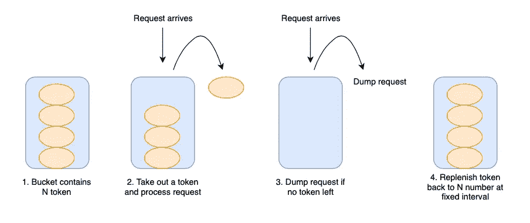
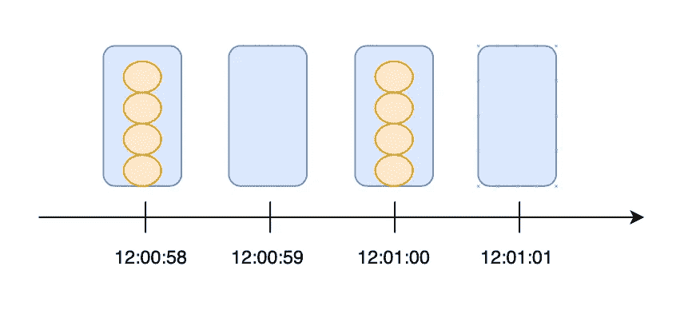
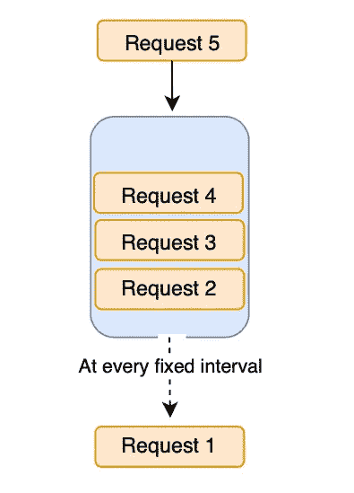
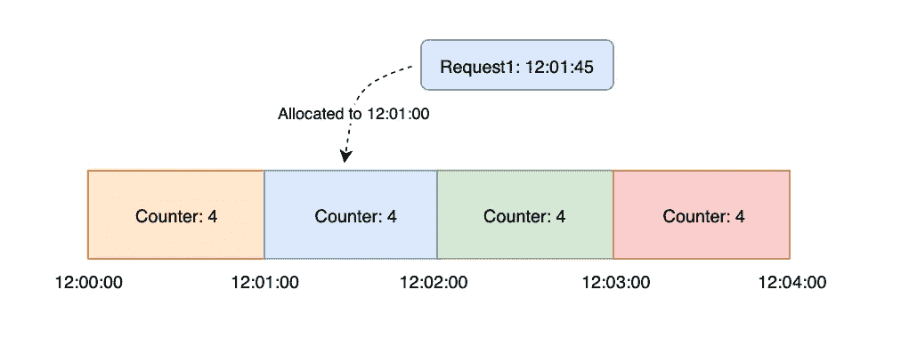
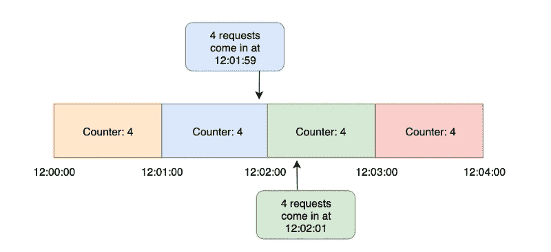
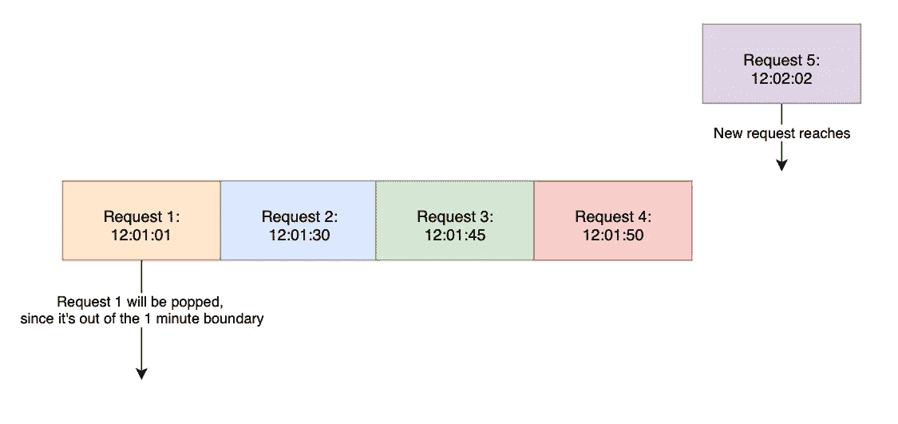

# 每个开发人员都应该知道的 4 种速率限制算法

> 原文：<https://betterprogramming.pub/4-rate-limit-algorithms-every-developer-should-know-7472cb482f48>

## 实现速率限制的初学者指南


照片由[维基共享资源](https://commons.wikimedia.org/wiki/File:Bucket_of_stones.jpg)提供

如果你以前处理过后端服务，你可能听说过速率限制这个术语。

如果没有这个重要的工具包，客户可以在任何时候向您的服务发出任意多的请求。这导致流量突然激增，从而囤积你的服务器。

在这篇博文中，让我们回到基本面，讨论四种常用的限速算法。

我们开始吧！

# 令牌桶

令牌桶是其他四个中最容易实现的一个。

我们来看看简化的步骤。



*   想象有一个包含`N`个令牌的桶
*   如果请求到达，我们从桶中取出一个令牌并处理请求
*   假设没有令牌剩余，我们丢弃并且不处理请求。
*   在每个固定的时间间隔，我们将桶中的代币补充回`N`号。

我们可以使用简单的哈希映射来实现该算法。

假设每个用户每分钟只能触发四个请求。

```
userID = 123
usersBucket[userID] = 4
```

当收到请求时，我们将`usersBucket[userID]`中的计数器减少`1`。如果令牌用完了，我们就放弃请求。在每一分钟，我们都将哈希表中的计数器重置回`4`。

这是一个棘手的情况:



*   12:00:59:用户触发了四个请求
*   12:01:00:我们将令牌重置回`4`
*   12:01:01:用户再次触发四个请求

在上面的场景中，用户在三秒钟内触发了八个请求！

为了确保更顺畅的流量，令牌的再填充速率应该不同于速率限制。

假设我们的速率限制是每分钟四个请求。我们可以每 15 秒钟充值一个代币，而不是每分钟充值四个代币。这防止了重置边界处的流量突然爆发。

# 漏桶

在前面的算法中，虽然我们每 15 秒补充一个令牌，但用户仍然可以在第 14 秒触发四个请求，这导致流量突然激增。

漏桶在确保更平稳的流量分配方面派上了用场。

以下是简化的步骤:



*   想象有一个桶，桶底有一个洞
*   当请求进来时，我们将请求填充到桶中
*   在每一个固定的时间间隔，一个请求从底层“泄漏”出来并得到处理

漏桶遵循 FIFO 概念。我们可以使用队列来实现它。

每个进来的请求不会被转储，而是被排队到一个桶中。在每个固定的时间间隔，首先进入的请求将被出队并处理。

使用漏桶，请求可以以不同的速率进入，而服务器以一个恒定且可预测的速率处理它们。

俗话说，“没有最好的解决方案，只有取舍。”一致的速率意味着漏桶以平均速率处理请求，导致较慢的响应时间。

# 固定窗

固定窗口与令牌桶非常相似，因此两者都可能经历流量的突然爆发。

一如既往，让我们简化步骤。假设我们正在实现每分钟四个请求的速率限制:



*   时间线根据每个窗口的分钟数进行分割
*   每个窗口包含一个计数器`4`
*   当请求到达时，我们根据时间戳的下限分配请求
*   如果请求在 12:01:45 进入，它将被分配到 12:01:00 的窗口
*   如果计数器大于`0`，我们递减计数器并处理请求
*   否则，我们放弃请求



当所有请求都到达窗口边界时，流量突发就会发生

固定窗口算法的最大缺点如下:

*   这将潜在地导致窗口边界附近的流量突然爆发
*   如果计数器在窗口开始时用完，所有客户端将需要等待很长的重置窗口

# 推拉窗


照片由[塔拉·温斯泰德](https://www.pexels.com/@tara-winstead/)在[像素](https://www.pexels.com/photo/a-child-playing-abacus-6692923/)上拍摄

滑动窗口算法非常类似于固定窗口算法，除了它解决了上述缺点。

假设我们正在实现每分钟四个请求的速率限制:



请求 5 将被处理并添加到阵列中，因为在最后 1 分钟内只有 3 个已处理的请求。将弹出请求 1。

*   数组(也称为窗口)用于存储已处理的请求及其时间戳
*   当一个请求到达时，我们遍历数组并检查在最后一分钟内处理的请求数
*   如果在最后一分钟内处理的请求数量少于四个，我们将请求添加到数组中并处理它
*   当我们遍历数组时，我们会弹出在最后一分钟之前处理的请求

如您所知，滑动窗口算法是确保在任何给定时间点严格遵守速率限制的理想选择。

由于我们存储了过去 1 分钟内的所有请求，并且在每次请求到达时循环遍历数组，因此该算法会消耗更多的内存和 CPU。

# 结论

这些算法各有不同的优点和局限性。

因此，在决定您的应用程序将承受的权衡时，了解它们是如何工作的变得至关重要。

我希望这篇文章对你有所帮助，下次再见！

如果你对这样的文章感兴趣，今天就和我一起报名 Medium 吧！

[](https://medium.com/@nganjason007/membership) [## 通过我的推荐链接加入 Medium—Jason Ngan

### 阅读 Jason Ngan(以及媒体上成千上万的其他作家)的每一个故事。您的会员费直接支持…

medium.com](https://medium.com/@nganjason007/membership)