# 您应该使用 Python 生成器的 4 个理由

> 原文：<https://betterprogramming.pub/4-reasons-why-should-be-using-python-generators-660458b0085d>

## Python 中的生成器不仅仅是列表的替代品


在 [Unsplash](https://unsplash.com?utm_source=medium&utm_medium=referral) 上 [Karsten Würth](https://unsplash.com/@karsten_wuerth?utm_source=medium&utm_medium=referral) 拍摄的照片。

生成器是 Python 中的一个构造，它允许延迟或临时加载数据流。它们可以像列表一样工作并被循环，但是生成器具有维护状态的能力。

是的，我知道没有例子对你来说毫无意义，所以让我们从下面的代码片段开始吧:

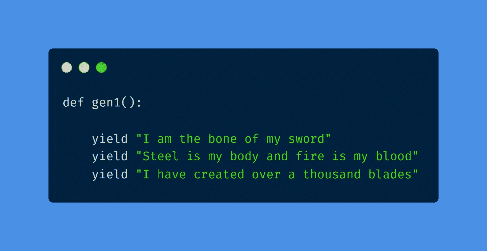

查看上面的函数，您可能会看到一个不熟悉的关键字`yield`。这个类似于`return`。但是，它特定于生成器。它允许你返回数据，但也存储了调用`yield`的点。这允许在下一次调用时跳过之前的`yield`(这将很快有意义)。

现在让我们按照*发生器*的运行方式运行该功能:

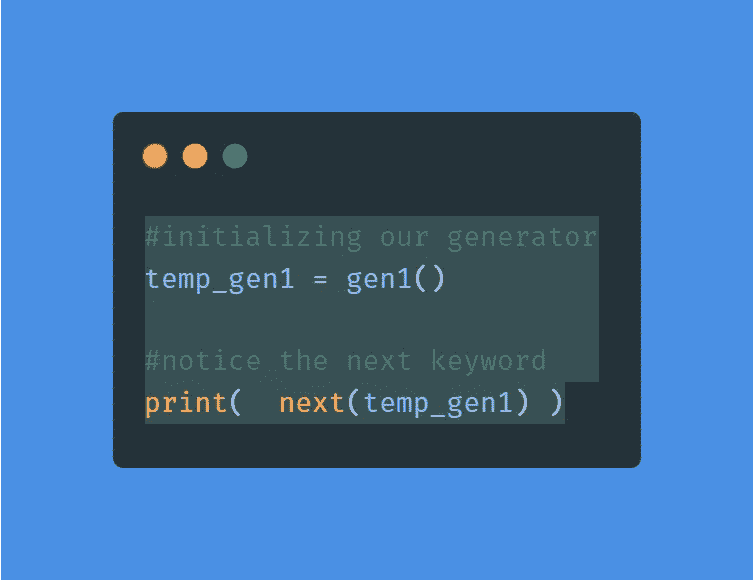

我们首先用`temp_gen1 = gen1()`初始化我们的生成器对象。接下来，我们使用`next`关键字。这允许我们跳到我们的`yield`语句的下一个迭代。鉴于这是第一次调用`next`关键字，它应该转到我们的`“I am the bone of my sword”`。

让我们来测试一下！

输出:

```
I am the bone of my sword
```

好了，它返回了第一个`yield`语句。没什么意思。让我们添加另一个`next(temp_gen1)`并打印到控制台:

```
print(  next(temp_gen1) )
```

输出:

```
I am the bone of my sword
Steel is my body and fire is my blood
```

现在看看发生了什么？直接跳到了下一条`yield`语句！

让我们添加另一个`next(temp_gen1)`并将其打印到控制台:

```
print(  next(temp_gen1) )
```

输出:

```
I am the bone of my sword
Steel is my body and fire is my blood
I have created over a thousand blades
```

看到模式了吗？正如我们之前所讨论的，它允许您返回一组特定的数据，但也存储了调用`yield`的点，如果您希望在下一次调用时跳过它。

无论何时调用`next`关键字，它都会跳转到下一个`yield`调用。如果您愿意，您可以轻松存储每次`yield`呼叫的结果。

完整代码:

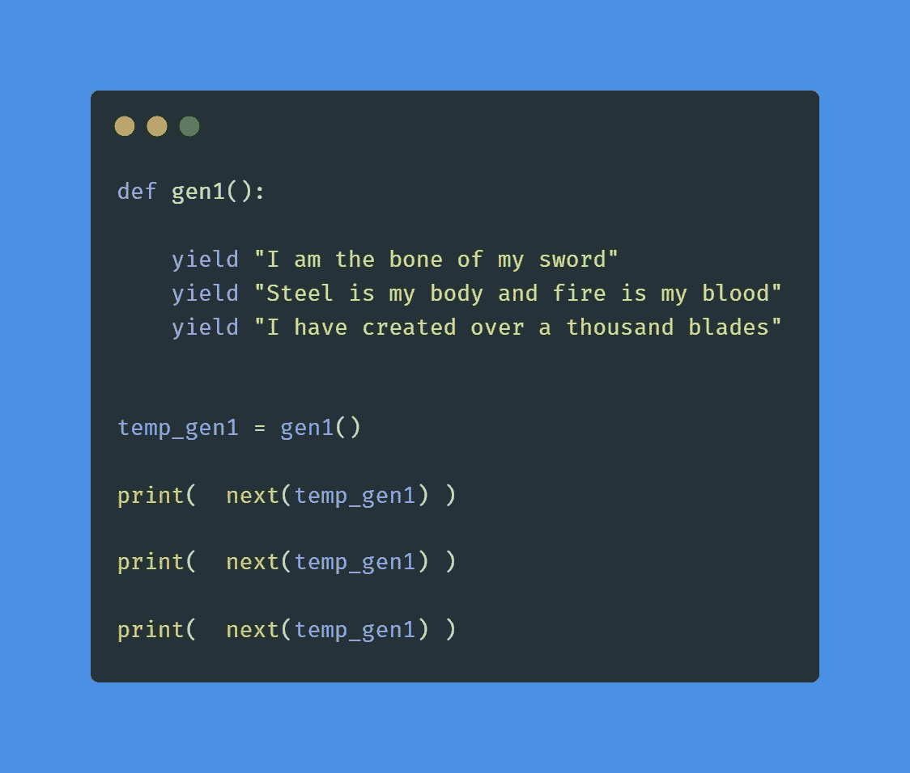

你可能很好奇如果没有下一个`yield`电话会发生什么，对吗？嗯，它会简单地抛出一个`StopIteration`异常。

让我们通过打印另一个`next(temp_gen1)`并执行来尝试一下。

输出:

```
I am the bone of my sword
Steel is my body and fire is my blood
I have created over a thousand blades
Traceback (most recent call last):
  File "d:/Jordan_Williams/coding1/Coding/Medium/idea 9/main.py", line 16, in <module>
    print(  next(temp_gen1) )
StopIteration
```

抛出一个`StopIteration`。要重新开始，必须重新分配发电机。

# 保持状态

发电机不会简单地在每一个呼叫中进入下一个`yield`。他们也维持着一种状态。

让我们看看下面使用相同函数的示例:

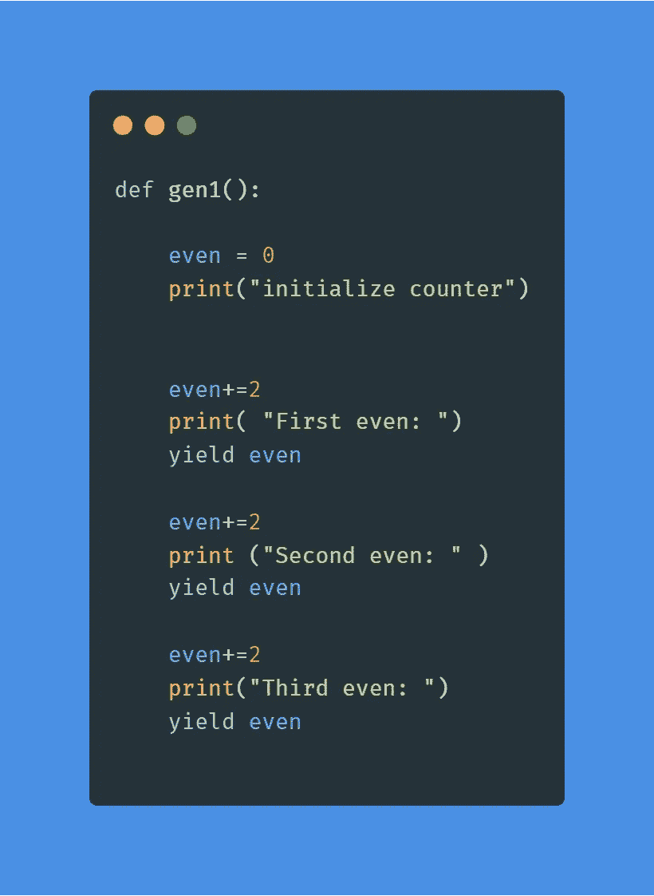

在上面的代码片段中，我们声明了一个生成前三个偶数的生成器。在生成器中，`even`变量每次由`2`递增，然后传递给`yield`每次返回。

让我们把这些打印出来，看看它们的输出:

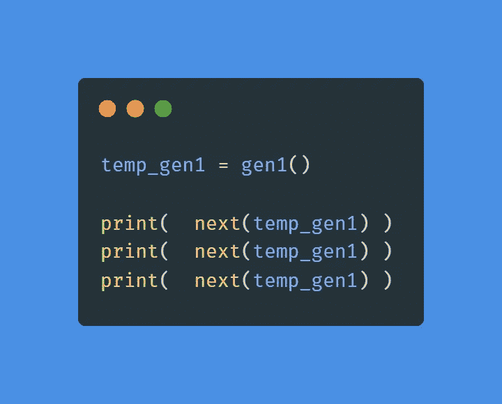

输出:

```
initialize counter
First even:
2
Second even:
4
Third even:
6
```

如您所见，该函数能够打印前三个偶数。在整个函数中，`even`变量一直保持不变。

完整代码:

# 循环发生器

生成器也可以像常规列表一样循环。

我们将使用一个循环，而不是像前面的例子那样打印:

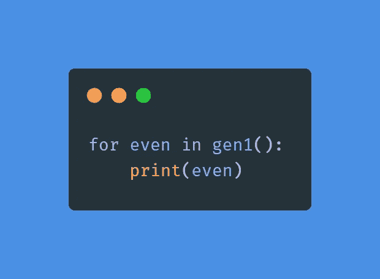

输出:

```
initialize counter
First even:
2
Second even:
4
Third even:
6
```

使用循环的好处是它将从头到尾贯穿所有的`yield`。这样，我们就不必担心当没有更多数据需要处理时，函数会出现`StopIteration`异常。

# 记忆效率

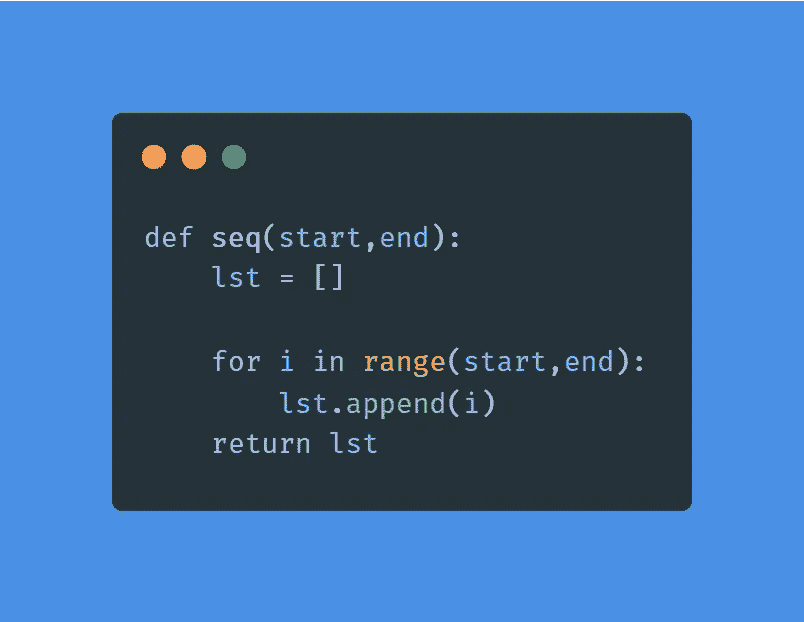

上面的函数将两个范围之间的数字序列生成一个列表。有了这样一个函数，所有的数字在初始化的时候都会被加载到内存中。

因此，如果我们用范围为 100-100，000，000 的序列初始化它，所有的数字都会被生成。

```
data = seq(100,100_000_000)
```

让我们为这一代人的死刑计时。

为此，我们必须导入 Python 时间库:

```
import time
```

现在，为了计时该序列的生成，我们将使用下面的代码片段:

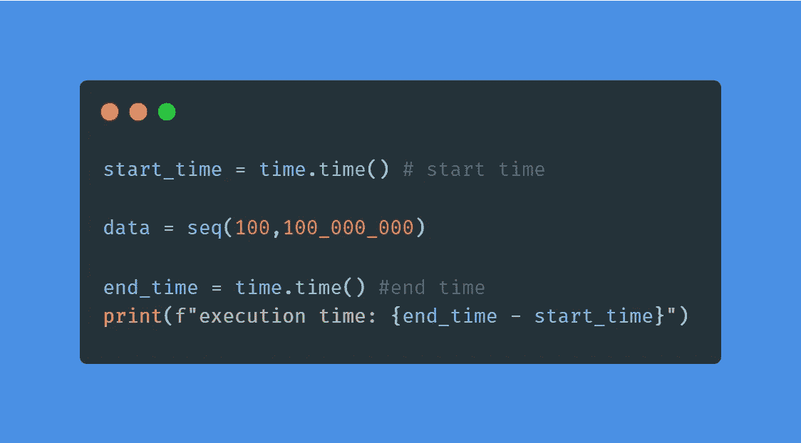

使用`time.time()`从开始到结束对`data = seq(100,100_000_000)`进行计时。该函数返回以秒为单位的当前时间。

输出:

```
execution time: 8.553153991699219
```

该函数的执行时间为 8 秒，因为所有元素都已生成。

完整代码:

与上面的代码片段不同，生成器按需创建序列。只有在使用`next`关键字时，才会加载元素。

让我们看一个与之前使用的函数等价的函数，但是这次使用生成器语法:

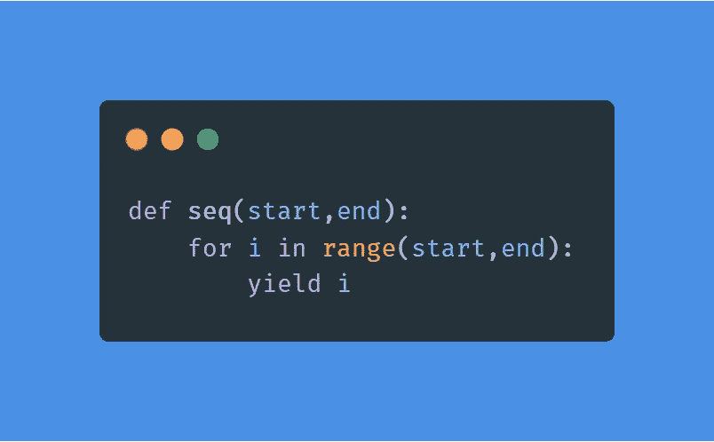

让我们替换前面示例中的函数并运行它。

输出:

```
execution time: 0.0
```

0.0 秒。尽管这个时间可能不是 100%准确，但你会注意到发电机的能量。在使用`next`关键字或循环之前，不会生成任何元素。

## **内存优势**

1.  记忆不是无限的。一个常规的列表会把所有的东西都存储在内存中，并且会因为大量的数据流而使你的系统崩溃。
2.  您可能不想一次得到所有数据，甚至不想一开始就得到所有数据。

这就是为什么在 Python 库和函数的许多实现中使用生成器的一些原因。它们在文件读取库中很常见。

使用`map`、`filter`和`open`函数在 Python 中很常见。在 Python 2 中，使用这些函数将返回一个列表。然而，从 Python 3 开始，它们的实现转向了生成器。

## **地图**

## **过滤器**

## **打开**

所有这些例子都使用`next`关键字跳转到下一个序列。

# 无限序列

生成器仅按需创建元素。这提供了创建无限序列的能力。这可以通过创建无限循环的`yield`数据来实现。

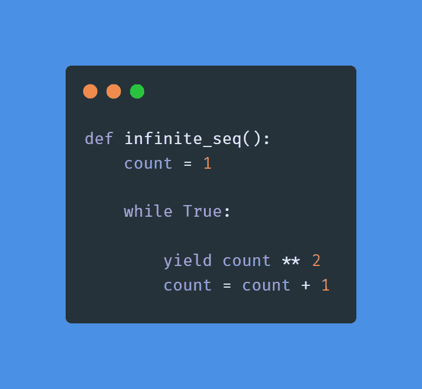

仔细看这个函数:`while True`。这个循环永远不会结束，因为它给出了从`1`到无穷大的每个数字的平方。但是，因为有发电机，这是没有问题的。

我们可以运行这个生成器任意次，它会产生一个值。

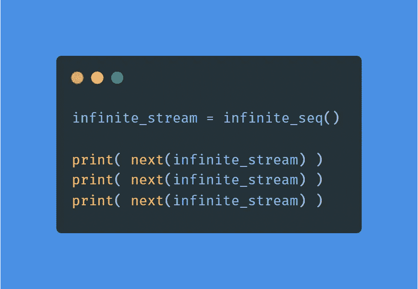

输出:

```
1
4
9
```

看，它产生数字 *1* 、 *2* 和 *3* 的平方。这可以做无数次。

完整代码:

# 生成器表达式

```
>>> list_compr = [i ** 2 for i in range(5)]
>>> list_compr
[0, 1, 4, 9, 16]
>>>
```

上面的片段说明了*列表理解*。这是创建列表的一种 Pythonic 方式。

我们已经知道发电机可以创造序列。然而，前面所有的例子都使用了函数。嗯，生成器表达式提供了一种类似的方式来创建序列，比如列表。

```
>>> list_generator = (i ** 2 for i in range(5))
>>> list_generator
<generator object <genexpr> at 0x000001F7F60D3CC8>
>>>
```

仔细看。

列表理解使用方括号(`[i ** 2 for i in``` range(5)]`)，生成器使用圆括号(`(i ** 2 for i in range(5))`)。这个微小的差别变成了一个发电机。

很方便，不是吗？

让我们来测试一下:

```
>>> next(list_generator)
0
>>> next(list_generator)
1
>>> next(list_generator)
4
>>> next(list_generator)
9
>>> next(list_generator)
16
>>>
```

# 结论

生成器是列表的有用替代品。当有大量数据时，或者如果您希望方便地给出流中的后续元素，可以使用它们。许多 Python 库都是用它们构建的。我强烈建议您在自己的代码中尝试一下。

让我们一起在 Python 的旅程中继续成长吧！