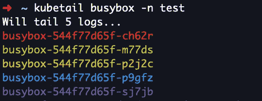
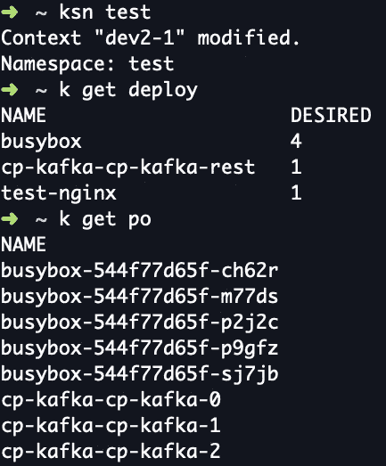
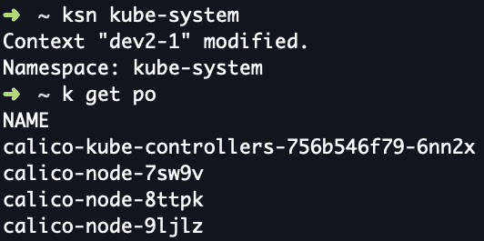
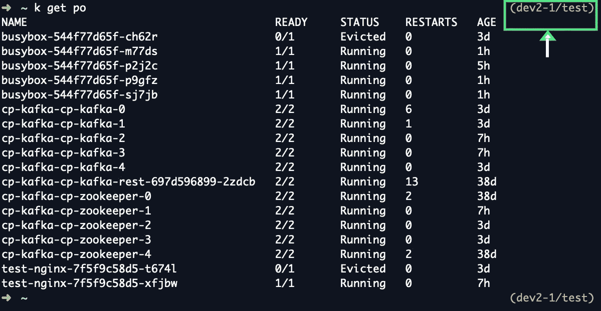

# 4 个简单的 Kubernetes 终端定制来提高您的生产力

> 原文：<https://betterprogramming.pub/4-simple-kubernetes-terminal-customizations-to-boost-your-productivity-deda60a19924>

## 这是我在生产中用于管理大规模 Kubernetes 集群的工具


照片由[安朵斯·瓦斯](https://unsplash.com/@wasdrew?utm_source=medium&utm_medium=referral)在 [Unsplash](https://unsplash.com?utm_source=medium&utm_medium=referral) 上拍摄

[我管理大规模 Kubernetes 集群已经有三年多的时间了](https://medium.com/better-programming/3-years-of-kubernetes-in-production-heres-what-we-learned-44e77e1749c8)，我想分享一下我对`kubectl`终端设置的极简主义方法，事实证明这种方法日复一日都非常有效。

一个定制良好的命令行终端可以显著提高您的工作效率。这是面包和黄油——这是所有奇迹发生的地方。

但是与流行的命令行定制和功能丰富的升级相比，我相信在安装任何新的二进制文件、包装器或修改时，简单的设置是节俭的。特别是在`kubectl`中，本机工具设计得非常好，几乎没有需要解决的问题。

这里是我给我的`kubectl`终端添加的四个简单的东西。有了这个设置，[我每天管理超过 400 台机器的 20 多个大规模 Kubernetes 集群](https://medium.com/better-programming/3-years-of-kubernetes-in-production-heres-what-we-learned-44e77e1749c8) 。

# 1.使用“kubetail”跟踪多个 Pod 实例的日志

使用`kubectl`您会注意到的第一件事是跨多个实例跟踪日志的困难。这是最常见的用例之一，但是`kubectl`没有。

如果您要在`kubectl`上跟踪单个 pod 的日志，它看起来会像这样:

`kubectl logs -f <POD_NAME> -n <NAMESPACE>`

在`kubetail`上，要跟踪多个 pod 的日志，您可以使用:

`kubetail <POD_NAME_REGEX> -n <NAMESPACE>`

这将跟踪名称与 regex 模式匹配的所有 pod 的日志。由于日志记录是跨多个 pod 同时进行的，`kubetail`使用不同的颜色来帮助区分和分析日志。



作者图片

`kubetail`是一个简单的包装器，它位于`kubectl`之上以实现这一点。安装很容易——你可以在这里找到说明。

# 2.动态更改默认命名空间

最终，为每一个`kubectl`操作一次又一次地提供名称空间标志变得既累又低效。为了解决这个问题，您需要一种动态设置和更改默认名称空间的方法。

我写了一个简单的别名函数`ksn`，它为我实现了这个功能(`ksn`暗示*设置名称空间*)。

作者的 Github 要点



作者图片



作者图片

通常，我们会根据手头的任务处理一系列名称空间。因此，如果我正在解决一个 Kafka 问题——比方说，十个命令中有八个被发送到一个名称空间`kafka`,那将成为我在此期间的默认名称空间。这可以为您节省大量时间，尤其是在处理需要发出大量`kubectl`指令的复杂任务时。

# 3.在 Shell 提示符中显示“kube-context”和“namespace”

发出`kubectl`命令时，必须时刻注意电流`kube-context`和`namespace`。当您同时管理跨越 20 个不同的`kube-contexts`和大约 50 个名称空间的集群时，这并不容易。在一个环境中，您很容易发出错误的命令，尤其是在跨不同上下文和集群进行多任务处理时。

为了解决这个问题，在终端提示符附近有一个显示器来随时告诉你活动的`namespace`和`kube-context`是非常有用的。

它看起来是这样的——在下面的例子中，我的`kube-context`是`dev2–1`，名称空间是`test`。有了这些信息，我在集群中执行命令时只需浏览一下就可以了。



作者图片

安装和设置说明可在[这里](https://github.com/superbrothers/zsh-kubectl-prompt)获得。

# 4.基本的“kubectl”别名

不用说，别名是在终端中定制和加速工作的最快方法。这些是我常用的别名，几乎已经成为我的第二天性。

```
alias k='kubectl '
alias kcc='kubectl config current-context'
alias kdp='kubectl delete po'
alias kgc='kubectl config get-contexts'
alias kge='kubectl get events --sort-by='\''{.lastTimestamp}'\'
alias kgp='kubectl get po'
alias kl='kubectl logs '
alias kpf='kubectl port-forward'
alias ksc='kubectl config use-context'
```

# 少即是多——不要过度烹饪终端

我们研究了针对`kubectl`用户的四种基本终端定制:

1.  使用`kubetail`跟踪多个 pod 实例的日志。
2.  动态地改变默认的`namespace`来显著地缩短`kubectl`指令。
3.  在提示符附近显示`kube-context`和`namespace` s，以避免意外错误。
4.  重要的`kubectl`别名列表。

与这种极简设置形成对比的是，流行的终端升级(如 [K9s](https://k9ss.io/) )通常是复杂的，功能丰富多彩的，但反过来又很慢，令人分心，最重要的是，没有必要。你添加的功能越多，你花在理解和浏览屏幕上所有附加信息上的时间就越多。

一个优雅的终端设置，比任何东西都更能增强你的注意力。

拥有一个简单的命令行终端设置允许您提高速度并熟练使用本机二进制文件和工具，这一点至关重要，尤其是当您使用大量基础架构时，登录和注销不同的 VM shell 配置文件。

你的终端设置应该丰富你作为一名工程师的经验，而不是让你失去它。