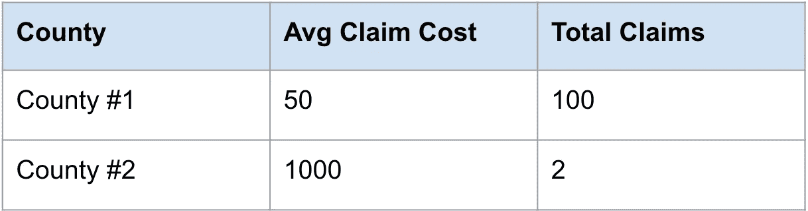
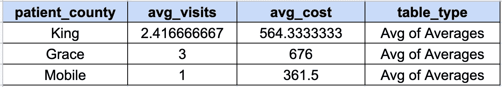
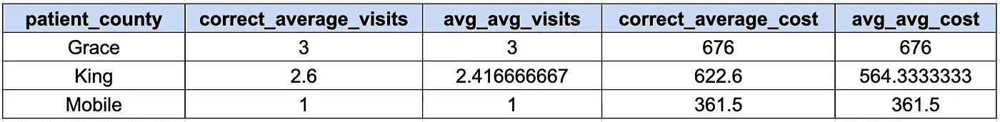
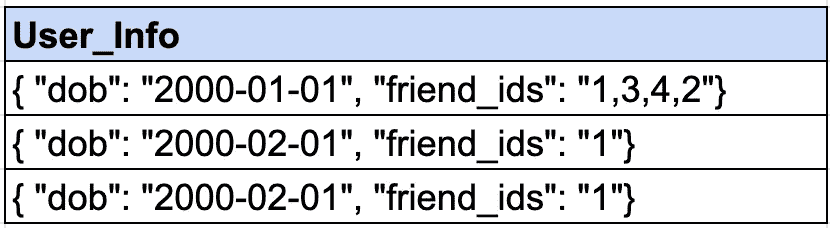
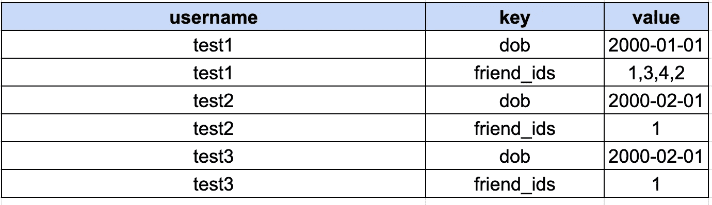
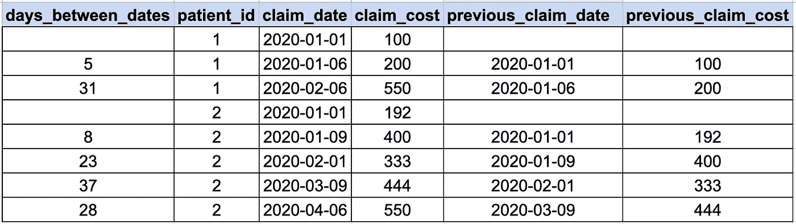

# 数据科学家和数据工程师的 4 个 SQL 技巧

> 原文：<https://betterprogramming.pub/4-sql-tips-for-data-scientist-and-data-engineers-56c41487752f>

## 请不要平均平均

乔纳森·弗朗西斯卡在 [Unsplash](https://unsplash.com/s/photos/analytics?utm_source=unsplash&utm_medium=referral&utm_content=creditCopyText) 上拍摄的照片

在过去的十年里，SQL 已经成为各行各业和各种工作岗位的通用技能要求。

像亚马逊和谷歌这样的公司通常会要求他们的数据分析师、数据科学家和产品经理至少熟悉 SQL。这是因为 SQL 仍然是数据的语言。因此，为了实现数据驱动，人们需要知道如何访问和分析数据。

有这么多人在查看、切片、操作和分析数据，我们想提供一些[技巧来帮助改进您的 SQL](https://www.theseattledataguy.com/how-to-write-better-sql-advanced-sql-episode-1/#page-content) 。

这些技巧和窍门是我们在编写 SQL 的过程中获得的。其中一些是该做的和不该做的，另一些只是最佳实践。总的来说，我们希望它们能帮助您的 SQL 更上一层楼。

有些提示是你不应该做的事情，即使你可能会受到诱惑，而其他的则是有助于确保你可以信任你的数据的最佳实践。总的来说，它们都是为了提供信息以及减少未来可能的麻烦。

# 不要平均使用 Avg()，这是不一样的

我们在人们的查询中看到的一个常见错误是取平均值。有些人可能认为这是显而易见的。然而，在网络上，有讨论和整篇文章解释为什么平均不好。

无论是在 SQL 中还是在一般情况下，求平均值为什么不好？因为它可能会被基于少量数据的平均值所扭曲。

例如，请看下表:

这里，我们已经计算了县一级的平均索赔成本。我们还可以看到，一个县的平均值基于 100 项索赔，另一个基于 2 项索赔。在现实生活中，该表不会包括索赔的总数—我们使用它来说明您可以多么容易地扭曲平均值。

如果我们想找出所有县的平均值。如果你试着计算平均值，你会得到 525 美元。这似乎不对。

如果 100 个索赔平均为 50 美元，只有 2 个索赔平均为 1000 美元，那么所有这些价值的平均值应该接近 50 美元，而不是 500 美元。所以，事实上，这些索赔的平均值大约是 68 美元。但是如果你平均这个平均数，你会得到一个几乎十倍大的数字。

那么为什么人们甚至会问平均平均可以吗？嗯，有时候求平均值能感觉接近预期输出。

让我们看一个 SQL 示例:

在这种情况下，我们将使用一个表，该表按县和年龄列出每个患者的平均费用和每个患者的平均就诊次数。但是，我们希望找到县一级每个患者的平均费用和每个患者的就诊次数。

如果我们使用上面的查询对表中的平均值进行平均，将得到以下输出:

但是我们也可以正确地编写一个查询来重新计算县粒度的平均值，如下所示:

让我们将该查询的输出与之前的输出进行比较:

您会注意到 King County 输出中的一些差异。如果我们比较一下平均访问量，它们看起来非常相似——分别是 2.4 次和 2.6 次。这可能是为什么有些人会相信平均值——它们有时可能接近实际产出，所以使用这种方法可能很有诱惑力。

但是，当我们查看每项索赔的平均成本时，我们会注意到在 560 美元和 620 美元之间有将近 58 美元的差异，几乎是 10%。当你谈到成本节约时，这是一个巨大的差异。

因此，尽管 2.4 和 2.6 之间的差异看起来很小，但它可能会导致一些巨大的差异。

# 您可以在 Sum 中使用 Case 语句

编写 SQL 的另一个重要技巧是学习如何在 sum 子句中使用 case 语句。当您试图用比率或分子来编写指标时，这可能非常有用。

例如，看看下面的查询。您将看到，我们需要点击表 claims 两次，以获得我们试图过滤的值的计数以及总行数。然而，我们可以减少这一点。

我们可以编写一个 case 语句来计算条件为真时的总值，然后除以总计数，如下面的查询所示。

你会注意到我们不需要敲两次桌子来得到两个数字。这样读起来也比较简单。根据我的经验，大多数 SQL 开发人员在使用 SQL 的第一年或第二年都会用到这个技巧。

这对于编写代码来计算一行中空值的百分比，或者计算仪表板的指标非常有帮助。反过来，这也是为什么许多分析师和数据工程师会熟悉这个技巧，只要他们必须编写大量的 SQL，而不只是使用拖放解决方案。

# 理解数组以及如何操作它们

数据库表中的数组和映射并不常见。然而，我注意到越来越多的团队依赖于非结构化数据，这些数据通常可以利用数组和数组函数等数据结构。

这是因为像 Postgres 这样的数据库和 Presto 这样的 SQL 引擎允许您在查询中处理数组。

尽管数组和映射不是新概念，但对于一些可能不太熟悉编程的分析师和数据科学家来说，它们是一个有点新的概念。这意味着您可能需要偶尔学习一些数组和映射函数来提取数据。

让我们从学习如何快速取消地图嵌套开始。地图是一种提供`key:value`关系的数据结构。这意味着您可以提供一个惟一的键，比如关于值的特定描述，比如`“first_name”:”George”`。一个映射也可以包含多个键值对，如下图所示。

在本例中，我们有两个想要访问的键，dob 和`friend_id`:

那么我们如何访问这些数据呢？让我们看看下面的查询。

如您所见，您可以为键和值定义一行。因此，当我们提取数据时，您可以获得特定的数据类型。

输出将如下所示:

您还可以检查数组的长度，查找特定的键，等等([在这里阅读更多关于 presto 数组的内容](https://www.postgresqltutorial.com/postgresql-array/))。我建议您不要仅仅使用映射和数组来代替良好的数据建模，但是，当您处理可能不需要特定模式的数据时，它们会派上用场。

# 提前和滞后以避免自连接

最后，让我们谈谈如何使用`Lead`和`Lag`窗口函数来避免自连接。

当您进行分析时，您经常需要比较两个事件的输出或计算两个事件之间的时间。

实现这一点的一种方法是将一个表与其自身自联接，并将两行连接起来。然而，其他漂亮的 SQL 函数是`Lag`和`Lead`函数。

这些允许用户引用指定的滞后或领先值。您还可以指定滞后值和超前值的所需粒度级别。

例如，在下面的查询中，我们通过`patient_id`对滞后和超前值进行划分。这意味着我们只关注患者层面的滞后和领先`claim_dates`和`claim_costs`:

该查询的输出如下所示:

您会注意到，对于每个患者的第一次约会，滞后时间`claim_date`和费用为零。这是因为没有预先成本或索赔日期。

总的来说，`lag`和`lead`函数可以使 SQL 开发人员的生活更加简单。

# SQL 的细节很重要

SQL 仍然是数据的语言。[学习这些技巧和诀窍](https://www.youtube.com/watch?v=kSt9NV-qZkc)有助于确保你的下一个仪表盘或分析更好。无论您是避免平均，还是编写数据质量检查，这些微小的改进都会产生巨大的差异。这些问题中的一些已经在公司中引起了很大的争议和讨论，所以我们希望这有助于你们中的许多人了解情况。

此外，如果您遵循这些 SQL 提示，您的数据分析将更加准确，并且您可以对您提供的数字更加自信。

感谢阅读。