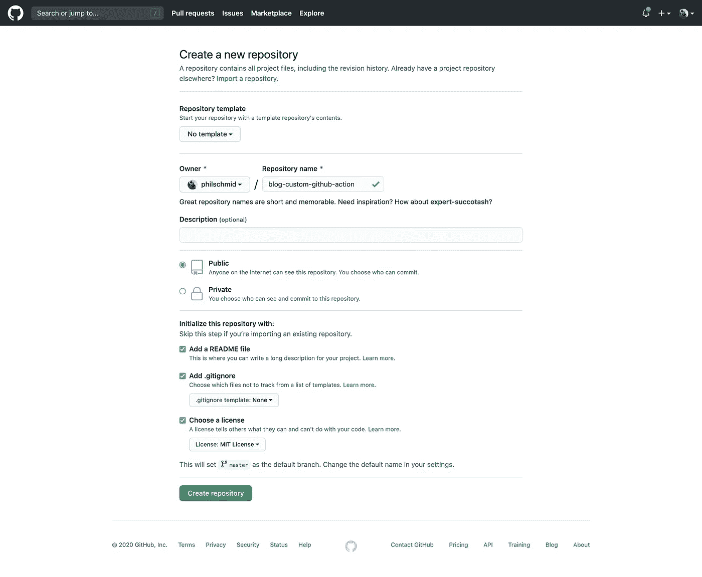
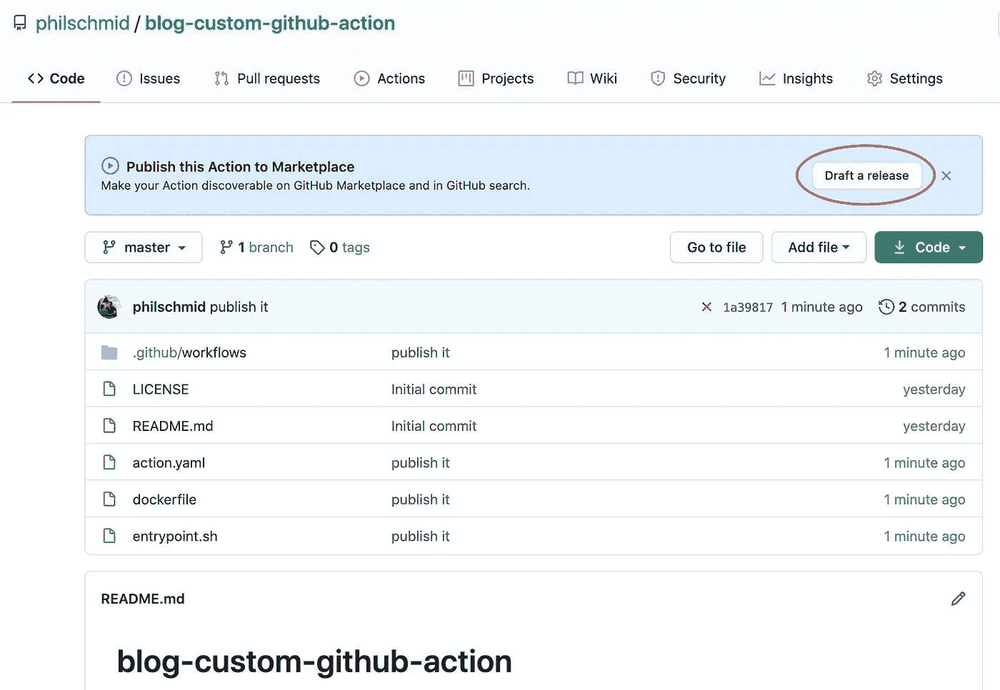
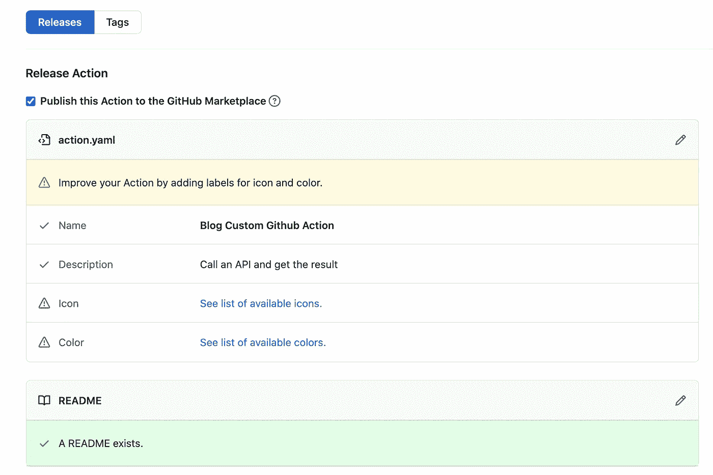
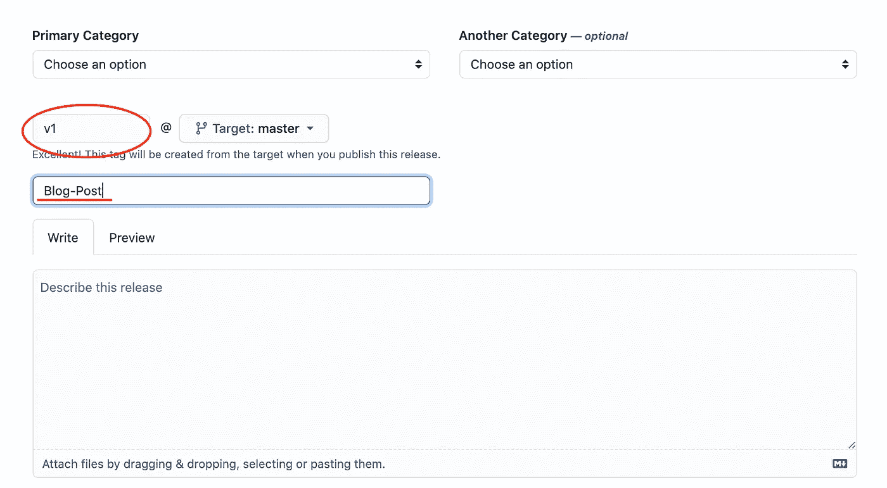
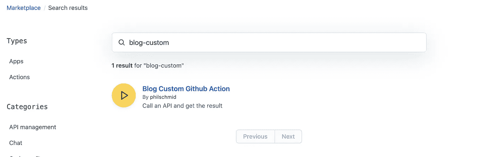

# 创建自定义 GitHub 动作的 4 个步骤

> 原文：<https://betterprogramming.pub/4-steps-to-creating-a-custom-github-action-d67c4cf0445a>

## 创建一个动作，离线测试，并在 GitHub 动作市场中发布

Jakob Owens 在 [Unsplash](https://unsplash.com/?utm_source=unsplash&utm_medium=referral&utm_content=creditCopyText) 上的照片。

*原载于 2020 年 9 月 25 日*[*https://www . philschmid . de*](https://www.philschmid.de/create-custom-github-action-in-4-steps)*。*

# 介绍

自动化、复杂性降低、可再现性和可维护性都是可以通过持续集成(CI)管道实现的优势。使用 GitHub 操作，您可以构建这些 CI 管道。

> 您可以使用存储库中定义的操作、GitHub 上公共存储库中的开源操作或发布的 Docker 容器图像来创建工作流— [GitHub 文档](https://docs.github.com/en/actions/getting-started-with-github-actions/about-github-actions)

我最近在工作中开始了一个新项目，我必须实施一个新的 CI 渠道。在这个过程中，我必须调用一个 API，验证结果，并传递它。我在`run`部分中完成了一个 20 行的内联脚本。这一点都不简单，不可维护，也不可重用。

在这次悲惨的失败之后，我开始研究如何创建定制的 GitHub 动作。令我惊喜的是，编写、测试和发布您自己的定制 GitHub 操作非常容易。我花了大约一个小时来研究、实现、测试、部署和发布我的行动。可以在 GitHub 上查看[。](https://github.com/marketplace/actions/download-custom-release-asset)

# 辅导的

在下面的教程中，我们将分四步创建一个定制的 GitHub 动作。我们的操作将执行一个简单的 bash 脚本。这个 bash 脚本将调用 pokeapi.co 的[API-endpoint，并将 PokeDex ID 作为参数。然后我们将解析结果并返回口袋妖怪的名字。之后，我们将在 GitHub 动作工作流中【bash 脚本的结果。](http://pokeapi.co/)

我们要做什么:

*   创建一个带有许可证的 GitHub 库。
*   创建一个带有输入和输出的`action.yaml`文件。
*   创建我们的 bash 脚本。
*   创建一个`Dockerfile`。

可选:

*   用`act`在本地测试。
*   将行动发布到 GitHub 行动市场。

你可以在这个 [GitHub 库](https://github.com/philschmid/blog-custom-github-action)中找到我们将要做的一切。

# 创建一个带有许可证的 GitHub 库

首先，[我们创建一个存储库](https://github.com/new)。我们可以直接添加`.gitignore`、`README.md`，以及许可证文件。对于存储库名称，我们可以使用任何我们想要的名称。

创建 GitHub 存储库的屏幕截图。

接下来，将存储库克隆到您的本地机器上，并使用您首选的 IDE 打开它。

# 创建一个带有输入和输出的`action.yaml`文件

接下来，我们在存储库中创建一个`action.yaml`文件。`action.yaml`是元数据文件，为我们的操作定义了输入、输出和主入口点。它使用 YAML 作为语法。

在我们的例子中，我们使用一个输入和一个输出。如果你想要关于`action.yaml`的详细文档，想了解更多关于配置的信息，看看[文档](https://docs.github.com/en/actions/creating-actions/metadata-syntax-for-github-actions)。

`action.yaml`必须包括:

*   `name`:你动作的名称。如果您想将 GitHub 操作发布到市场上，这必须是全球唯一的。
*   `description`:对你的动作正在做什么的简短描述。
*   `inputs`:定义可以传递给 bash 脚本的输入参数。在我们的示例`$INPUT_POKEMON_ID`中，您可以使用`$INPUT_{Variable}`来访问它们。
*   `outputs`:定义您稍后可以在另一个工作流程步骤中使用的输出参数。
*   `runs`:定义动作将执行什么(在我们的例子中，它将运行 docker)以及在哪里执行。

我们将要使用的`action.yaml`如下所示:

# 创建一个 Bash 脚本

第三步，我们创建名为`entrypoint.sh`的 bash 脚本。该脚本将在操作中执行。

出于演示的目的，我们使用一个简单的脚本来调用[pokeapi.co](http://pokeapi.co/)API，并用 [jq 处理器](https://stedolan.github.io/jq/)解析返回值以获得口袋妖怪的名称。为了为我们的动作创建输出，我们需要使用 GitHub 特定于动作的语法:`echo "::set-output name=<output name>::<value>"`。

# 创建一个`Dockerfile`

我们的四步教程的最后一步是创建一个`Dockerfile`。如果您不熟悉 Docker 和`Dockerfiles`，请查看 [Dockerfile 对 GitHub 动作的支持](https://docs.github.com/en/actions/creating-actions/dockerfile-support-for-github-actions)。

就是这样。我们做到了。为了使用它，我们在`.github/workflows`中创建新的工作流文件，并将我们的动作添加为`step`。

为了访问我们动作的输出，我们必须在步骤中定义`id`属性。

# 可选择的

前面的四个步骤向我们展示了如何构建我们自己的定制 GitHub 动作。但是我们从未测试过它是否如预期的那样工作。在接下来的两个额外步骤中，我们用 [act](https://github.com/nektos/act) 在本地测试我们的 Github 动作，然后将其发布到 GitHub 市场。

## 使用`act`进行本地测试

Act 是一个用 Go 编写的开源 CLI 工具包。它允许我们在本地执行和测试我们的 GitHub 动作。它支持环境变量、秘密和自定义事件。一定要去看看。安装说明可以在 GitHub 上的[中找到。](https://github.com/nektos/act#installation)

在测试我们的动作之前，我们必须在`.github/worklfows`中创建一个 GitHub 工作流。

之后，我们可以在终端中运行`act`，它应该会运行我们的操作。

用 act 进行本地测试的截图。

因此，我们可以看到我们的操作运行成功。它还在倒数第二行输出我们的`pokemon_name`:`"mewtwo attack"`。

## 将行动发布到市场

为了能够向市场发布定制的 GitHub 动作，我们需要一个全球唯一的名称。市场上不得有此名称的活动。

在我们提交并将文件推送到我们的存储库并转到 web 控制台后，我们应该会看到类似这样的内容:

起草 GitHub 版本的截图

如果我们点击“Draft a release”，我们应该会看到一个专门为 GitHub 操作定制的发布页面。

定义 GitHub 版本的屏幕截图

如果我们对名称和描述进行了绿色检查，我们就能够向市场发布该操作。

添加图标和颜色可以在`action.yaml`中完成。你可以在的文档中查看如何操作[。](https://docs.github.com/en/actions/creating-actions/metadata-syntax-for-github-actions#branding)

下一步是创建一个带有标题的新版本。因此，我们向下滚动一点，添加一个发布版本和标题。

创建 GitHub 版本的屏幕截图

之后，我们可以点击“发布”,我们的定制 GitHub 操作就发布到市场上了。我们可以在 https://github.com/marketplace 搜索“博客-定制”找到它

搜索 GitHub 行动市场的截图

现在，我们能够在工作流中使用我们的自定义 GitHub 动作，而无需将它放在项目文件夹中。

这只是如何将 GitHub 动作发布到市场的一个简单例子。还有许多自定义设置，如类别、图标和品牌，我们还没有解决。

# 结论

感谢阅读。我希望我能够防止一些 GitHub 操作失败。

有更多的可能性来创建你自己的 GitHub 动作(比如用 Node)。您可以在文档中找到更多信息[。此外，Github 为 GitHub 动作](https://docs.github.com/en/actions/creating-actions)提供了精彩的[文档。](https://docs.github.com/en/actions)

你可以在这个 [GitHub 库](https://github.com/philschmid/blog-custom-github-action)中找到教程的代码。

如果你有任何问题，随时联系我或评论这篇文章。你也可以在 [Twitter](https://twitter.com/_philschmid) 或 [LinkedIn](https://www.linkedin.com/in/philipp-schmid-a6a2bb196/) 上与我联系。