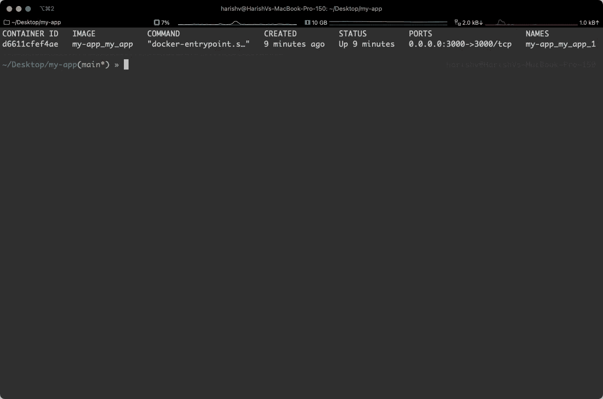
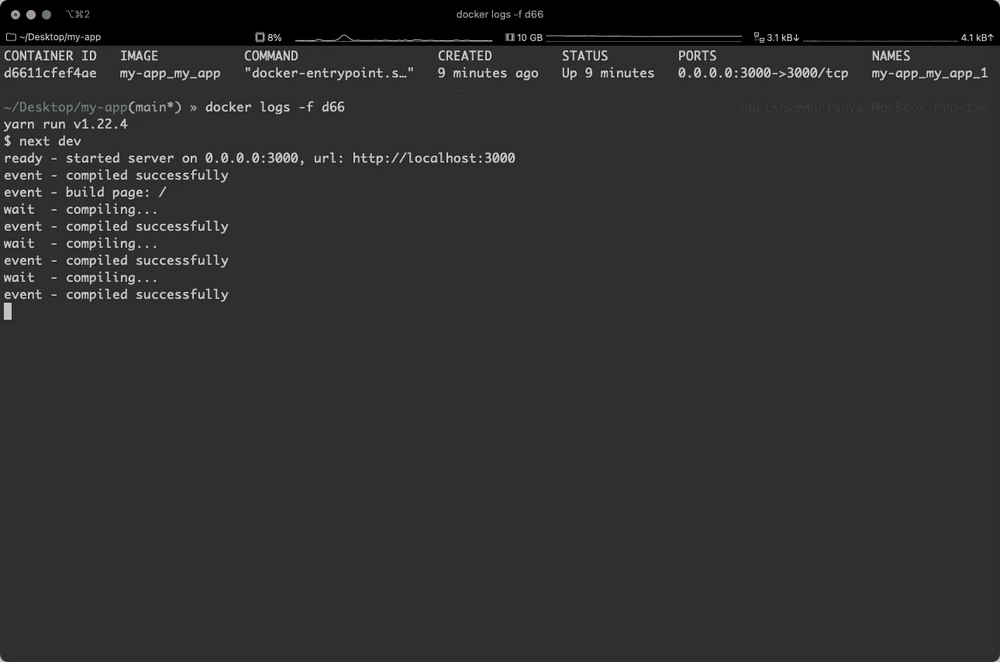

# 将 Next.js 应用程序分类的 4 个步骤

> 原文：<https://betterprogramming.pub/4-steps-to-dockerize-your-next-js-app-cfa8a54881af>

## 瞬间将你的 Next.js 应用容器化


凯瑟琳·麦科马克在 [Unsplash](https://unsplash.com?utm_source=medium&utm_medium=referral) 上的照片

# 什么是码头集装箱？

容器是软件的一个单元，它帮助我们紧凑地打包代码和依赖关系。这样做的主要优势在于，它有助于我们的应用在各种环境中高效可靠地运行。

当我们打包代码和依赖项时，会创建一个 Docker 映像。这个映像包含了我们的应用程序运行所需的一切，包括系统工具和库。

当我们构建并运行这些映像时，它们就变成了 Docker 容器。再次强调，这样做的巨大优势是帮助我们的软件以完全相同的方式运行，无论您使用的是什么操作系统——是 Linux 还是 Windows 等。Docker 容器帮助我们提供的这种一致性至关重要，尤其是在为生产部署应用程序时。

最近，容器化应用程序在很大程度上取代了通过虚拟机(VM)运行应用程序的传统方法。虚拟机需要底层操作系统的完整副本才能运行，您可以想象系统的库、工具等的总体副本需要多少空间。会消耗！

# 我们开始吧

既然我们已经讨论了容器的概要，让我们开始容器化我们的 Next.js 应用程序。

## 1.创建项目

出于演示的目的，我们将使用以下命令创建一个全新的 Next.js 项目:

```
yarn create next-app
```

按照提示完成创建新的 Next.js 项目。

让我们通过在项目目录中运行`yarn dev`来测试一切运行正常。

## 2.添加您的 docker 文件

现在，我们添加 docker 文件。在项目目录的根目录下，将下面的代码片段添加到一个名为— `Dockerfile`的文件中。

Dockerfile 文件非常简单明了。在代码序列中，我们是:

1.  `FROM node:12`:使用 Node.js 12.0 镜像。您可以修改版本以使用适合您应用的版本，或者使用`node:latest`获得最新版本。这将从 Docker Hub 中选取一个图像，Docker Hub 是 Docker 图像的全球存储库。我们选择的图片基于 Ubuntu。
2.  我们用`mkdir`命令在路径`/usr/src/app`下创建一个工作目录(如果它还不存在的话)。这有助于我们设置在下面的命令中将会发生什么。
3.  我们将所有必需的包文件，即`package.json`和`yarn.lock`复制到工作目录，并在容器中安装依赖项。
4.  我们将剩余的源文件复制到工作目录中。
5.  我们构建应用程序，并通过在容器上打开端口`3000`来公开它。
6.  我们使用命令`yarn dev`运行应用程序。你可以把它改成`yarn start`或者任何适合你在`package.json`中定义的脚本的名字。

**注意:**如果您使用`npm`而不是`yarn`，只需更新各自的命令(例如用`npm install`而不是`yarn install`)。

## 3.添加 Docker 撰写

Docker Compose 是一个运行多容器应用程序的工具。我们可以添加这个来协调我们的应用程序和 Docker 引擎。

让我们将下面的代码片段作为`docker-compose.yml`添加到项目目录的根目录下。

该代码片段将容器的端口`3000`暴露给外界，并指定使用哪个 Dockerfile 文件。`volumes`部分有助于启用 Next.js 应用程序的热重装，尤其是出于开发目的。

## 4.运行应用程序

要运行该应用程序，我们在项目目录的根目录下使用以下命令:

```
docker-compose up -d --build
```

该命令构建映像，并以分离模式(即在后台)将其作为容器启动。

要查看正在运行的容器，请使用:

```
docker ps -a
```



要查看容器的码头，请使用:

```
docker logs -f <container_id>
```



# 这是所有的乡亲

这就对了。将 Next.js 应用程序容器化只需要四个步骤。

感谢阅读。黑客快乐！