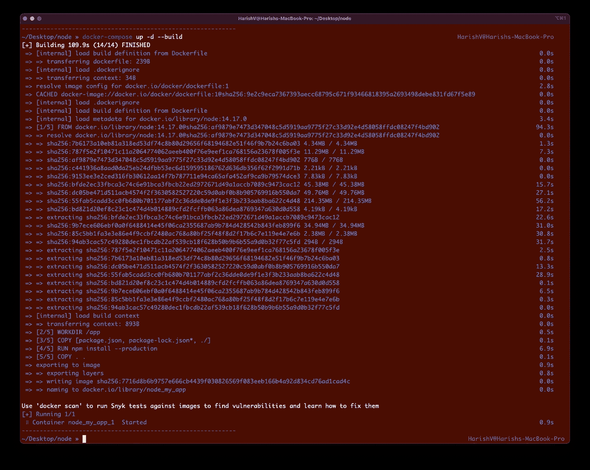
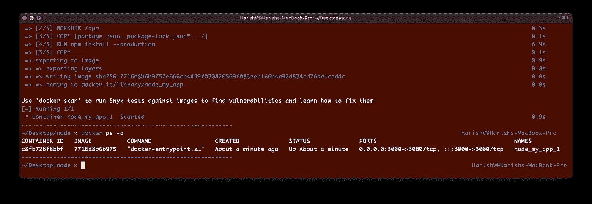
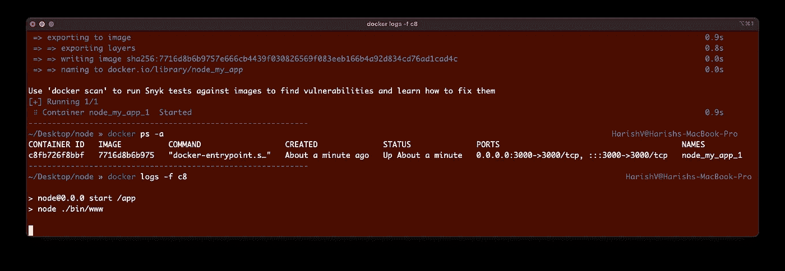

# 将 Node.js 应用程序分类的 4 个步骤

> 原文：<https://betterprogramming.pub/4-steps-to-dockerize-your-node-js-apps-c70037da1099>

## Node.js 应用程序快速归档指南


由[菲利克斯·奇弗金](https://unsplash.com/@felix_tch?utm_source=medium&utm_medium=referral)在 [Unsplash](https://unsplash.com?utm_source=medium&utm_medium=referral) 上拍摄的照片

# 什么是码头集装箱？

容器是软件的一个单元，它帮助我们紧凑地打包代码和依赖关系。这样做的主要优势在于，它有助于我们的应用在各种环境中高效可靠地运行。

当我们打包代码和依赖项时，会创建一个 Docker 映像。这个映像包含了我们的应用程序运行所需的一切，包括系统工具和库。

当我们构建并运行这些映像时，它们就变成了 Docker 容器。再次强调，这样做的巨大优势是帮助我们的软件以完全相同的方式运行，无论您使用的是什么操作系统——是 Linux 还是 Windows 等。Docker 容器帮助我们提供的这种一致性至关重要，尤其是在为生产部署应用程序时。

最近，容器化应用程序在很大程度上取代了通过虚拟机(VM)运行应用程序的传统方法。虚拟机需要底层操作系统的完整副本才能运行，您可以想象系统的库、工具等的总体副本需要多少空间。会消耗！

如果你想了解更多，Preethi Kasireddy 已经写了一篇关于 Docker、容器和 VMs [的精彩、详细、易懂的文章。一定要去看看！](https://medium.com/free-code-camp/a-beginner-friendly-introduction-to-containers-vms-and-docker-79a9e3e119b)

# 第一步。启动一个简单的 Node.js 应用程序

让我们在 Node.js 上创建一个简单的样板应用程序。要了解有关 express-generator 的更多信息，请访问此[链接](https://expressjs.com/en/starter/generator.html)。

打开终端，创建一个目录文件夹(如 my-app)并使用下面的命令来启动我们的应用程序。请注意，这需要 Node.js 8.2.0 或更高版本才能工作。

```
npx express-generator
```

就这样，我们将有一个功能性的 Node.js，基于 Express 的应用程序准备运行。要测试它，运行`npm run start`。

现在，访问 localhost:3000，它应该给出“欢迎使用 Express”消息。

# 第二步。添加 Dockerfile 文件

接下来，我们将向我们的存储库添加一个 docker 文件。创建一个名为`Dockerfile`的新文件，并向其中添加以下内容。

Dockerfile 文件非常简单明了。在代码序列中，我们是:

1.  `FROM node:14.17.0`:使用 Node.js 14.17.0 镜像。您可以修改版本以使用适合您的应用程序，或者只使用`node:latest`获得最新版本。这将从 Docker Hub 中选取一个图像，Docker Hub 是 Docker 图像的全球存储库。我们选择的图像基于 Ubuntu 操作系统。
2.  我们用`mkdir`命令在路径`/usr/src/app`下创建一个工作目录(如果它还不存在的话)。这有助于我们设置在下面的命令中将会发生什么。
3.  我们将所有必需的包文件，即`package.json`和`package-lock.json`，复制到工作目录，并在容器中安装依赖项。
4.  我们将剩余的源文件复制到工作目录中。
5.  我们构建应用程序，并通过打开容器上的端口`3000`来公开它。
6.  我们使用命令`npm start`运行应用程序。您可以将其更改为`npm run dev`或任何适合您在`package.json`中定义的脚本的名称。

**注意:**如果您使用`yarn`而不是`npm`，只需更新各自的命令(例如用`yarn install`而不是`npm install`)。

让我们也添加一个`.dockerignore`文件，这样我们在`.node_modules`文件夹中的模块依赖关系就不会被复制。我们将在容器本身上安装这些依赖项。

# 第三步。添加 Docker 合成文件

Docker Compose 是一个运行多容器应用程序的工具。我们可以添加这个来协调我们的应用程序和 Docker 引擎。

让我们将下面的代码片段作为`docker-compose.yml`添加到项目目录的根目录下:

# 第四步。运行应用程序

要运行该应用程序，我们在项目目录的根目录下使用以下命令:

```
docker-compose up -d --build
```

该命令构建映像，并以分离模式(即在后台)将其作为容器启动。



要查看正在运行的容器，请使用:

```
docker ps -a
```



要查看容器的码头，请使用:

```
docker logs -f <container_id>
```



# 结论

这就对了。Node.js 应用程序归档的简单四步指南。

接下来，您可能想知道如何配置 Nginx 反向代理和 SSL(例如使用 Let's Encrypt)。菲利普在这里写了一篇关于 T21 的文章。

Docker 在打包你的应用和服务时非常强大和有用。尝试使用上述步骤来部署您的下一个应用程序，并在下面留下您的评论！

码头作业快乐！