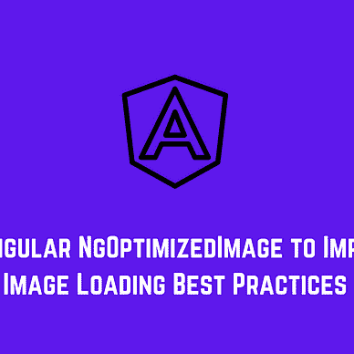

# 使用 Markdown 文件将 YouTube 嵌入 Nuxt.js 的 4 个步骤

> 原文：<https://betterprogramming.pub/4-steps-to-embed-youtube-in-nuxt-js-with-a-markdown-file-9d5fe9a0167a>

## 使用 Nuxt 将 YouTube 嵌入到博客构建中从未如此简单


由 [Unsplash](https://unsplash.com?utm_source=medium&utm_medium=referral) 上的 [AltumCode](https://unsplash.com/@altumcode?utm_source=medium&utm_medium=referral) 拍摄的照片

使用 Nuxt 将 Youtube 嵌入到博客构建中从未如此简单。包含`lite-youtube-embed`包，创建一个 Nuxt 插件和组件，你可以在你所有的 Markdown 内容文件中使用它。

在这篇文章中，我将向你展示如何自己去做。我们遵循以下步骤:

```
Table of Contents1\. Include the YouTube Lite Package
2\. [Add Plugin](#3a10)
3\. [Create Component](#a610)
4\. [Use Component in the Markdown File](#1ad5)
```

# 1.包括 YouTube Lite 包

首先，我们需要安装 npm 包 [lite-youtube-embed](https://www.npmjs.com/package/lite-youtube-embed) ，它是由 Google Chrome 团队成员和前端开发者 [Paul Irish](https://www.paulirish.com/) 创建的。这个包是为嵌入 Youtube 视频而构建的，比“普通”方式有更好的性能。

但是我不想深入研究在你的博客上嵌入 Youtube 播放器的性能瓶颈。我想向你展示如何用 Nuxt 在你的 Markdown 文件中实现 Youtube 播放器。

运行这个命令将它安装到您的 Nuxt 项目中。

```
yarn add lite-youtube-embed
```

或者

```
npm i lite-youtube-embed
```

将您的`nuxt.config.js`中的 CSS 文件添加到`css`属性中。

# 2.添加插件

在你的插件文件夹中创建一个插件文件`youtube.client.js`。确保你的名字中包含了`.client.js`，这样 Nuxt 只会在浏览器中加载这个。当然，我们还需要导入 JavaScript 库。

现在你需要在你的`nuxt.config.js`中注册这个插件，如下所示。

# 3.创建组件

要在 markdown 文件中使用`<lite-youtube>` web 组件，您必须创建一个 Vue 组件来包装它。否则，您将无法在页面上显示它。

我在`components`文件夹中创建了一个`Youtube.vue`组件。我添加了两个道具来传递 YouTube 视频 ID 和一个标签。

有了这个 YouTube 组件，你就可以开始在你的 Markdown 文件中使用它了。

# 4.使用降价文件中的组件

所以问题是，如何在你的降价文件中使用它？

将它添加到您的文件中，就像您通常对 Vue 组件所做的那样。

Nuxt 会神奇地把你的整个 Markdown 文件变成一个 HTML 页面，你可以在浏览器里看到，就像这样。


作者截图

# 谢谢！


读完这个故事后，我希望你学到了一些新的东西，或者受到启发去创造一些新的东西！🤗

如果我给你留下了问题或一些要说的话作为回应，向下滚动并给我键入一条消息。如果你想保密，请在 Twitter @DevByRayRay 上给我发一条 [DM。我的 DM 永远是开放的😁](https://twitter.com/@devbyrayray)

[**通过电子邮件获取我的文章点击这里**](https://byrayray.medium.com/subscribe) **|** [**购买 5 美元中等会员资格**](https://byrayray.medium.com/membership)

## 阅读更多


[雷雷](https://byrayray.medium.com/?source=post_page-----9d5fe9a0167a--------------------------------)

## 最新的 JavaScript 和 TypeScript 故事

[View list](https://byrayray.medium.com/list/latest-javascript-typescript-stories-0358ad941491?source=post_page-----9d5fe9a0167a--------------------------------)14 stories