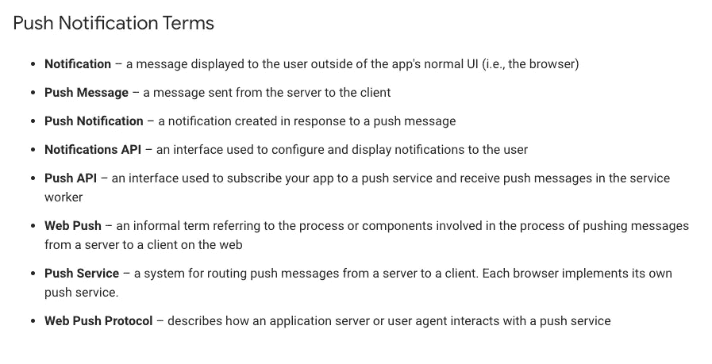

# 使用 Ably 和 Redux-Saga 设置 React-Native 推送通知的 4 个步骤

> 原文：<https://betterprogramming.pub/4-steps-to-setup-react-native-push-notifications-with-ably-and-redux-sagas-890916761576>

## 让您的用户了解您应用程序中最新、最棒的内容

Rami Al-zayat 在 [Unsplash](https://unsplash.com?utm_source=medium&utm_medium=referral) 上拍摄的照片。

如果你是一个已经在商店部署了一些项目的移动开发者，甚至是一个刚刚开始使用自己的应用程序的人，你肯定会同意现在每个应用程序都必须包含推送通知。

稍等一下。什么是推送通知？从更广泛的角度来看，什么是移动应用环境中的通知？

来源:[谷歌开发者](https://developers.google.com/web/ilt/pwa/introduction-to-push-notifications)。

想要一个简单的解释？

根据谷歌开发者的说法，“通知是在用户设备上弹出的消息。”推送通知是推送的(本地或远程)通知。如果你正在寻找更详细的技术解释，我强烈推荐你看一看这个[推送通知的介绍](https://developers.google.com/web/ilt/pwa/introduction-to-push-notifications)。

从实用的角度来看，推送通知是你和你的用户之间的直接沟通渠道(行动号召)。

现在您已经知道了它们是什么，让我们使用一个不太明显的实时服务来实现推送通知特性:[巧妙地](https://www.ably.io/)。

为了使用 Ably 服务，我们需要在进入代码之前执行一些步骤。前往其网站，按照步骤创建一个免费帐户，并获得一个 API 密钥。

*注意:Redux 和 redux-saga 设置超出了本文的范围。*

我假设您已经在您的项目中安装并配置了 [Redux](https://redux.js.org/) 和 [redux-saga](https://redux-saga.js.org/) ，那么让我们安装以下软件包:

*   `yarn add ably`
*   `ably-react-native`
*   `react-native-push-notification`
*   `@react-native-community/push-notification-ios`

安装完这些包并遵循所有必要的步骤(尤其是来自`push-notification-ios`的手动步骤)后，让我们编码并找点乐子吧。

# 1.设置 Ably，以便允许我们的应用程序与 Ably 门户网站的订阅服务进行通信

在项目的根路径中创建一个`ably.env`文件:

# 2.创建我们的挂钩来连接和订阅我们的频道

在您的项目中创建一个 hooks 文件夹，并将`ably.js`文件添加到其中:

# 3.为通知设置创建单独的文件

这个文件只是`PushNotification`函数的包装器:

# 4.行动，还原，传奇！

我使用 Redux 和 redux-saga 是因为触发我的推送通知的事件做了很多事情，而推送通知只是执行的许多步骤之一。也就是说，你不需要 Redux/redux-saga 来实现推送通知。

创建一个名为`notifications`的文件夹，将这三个文件放入其中。它们是你的行动、传奇和减速器:

# 结论

现在你已经设置好了一切，你可以在你的应用程序中使用`useAbblyChannel`钩子了。

快乐推送通知！