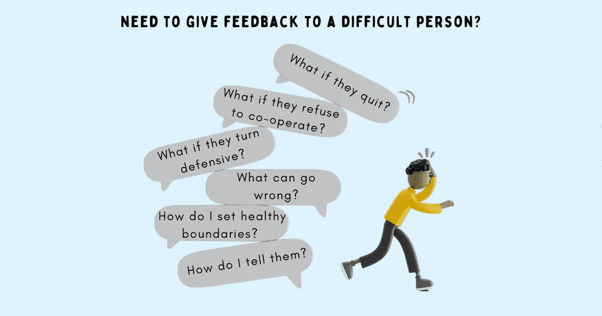

# 给难相处的人有效反馈的 4 个策略

> 原文：<https://betterprogramming.pub/4-strategies-to-give-effective-feedback-to-a-difficult-person-ae224b06021d>

## 尊重就像空气。只要它存在，就没有人去想它。但如果你把它拿走，人们能想到的就只有这些了。



鸣谢:作者

你的团队中有聪明、有才华、潜力大或表现好的人吗？那些擅长解决复杂问题的人，以及那些你在完成任务时似乎总是依赖的人。

他们的才华可能会被很多人羡慕，但如果他们只是在独立完成工作时才发光呢？如果您的团队发现很难与他们沟通和协作，这会影响他们的生产力和绩效，该怎么办？

如果他们:

*   当别人的想法不够时贬低他们。
*   当别人不同意他们的观点时，变得有防御性，并把它当成个人的。
*   设定极高的标准，并期望其他人也能达到。
*   通过喊叫或用肢体语言表达愤怒和沮丧来表达他们的不满。
*   通过打断别人，不让别人说话来建立自己的优越感。
*   期待区别对待，不遵循团队中的良好实践。

擅长他们所做的事情并不意味着他们可以哀叹、贬低或轻率地对待他人。每个人都应该得到尊重，没有人应该被期望容忍不良行为——即使是一个聪明的混蛋。

那么，你如何告诉他们，他们的行为是不可接受的，他们需要改变与他人合作的方式？

> 最好的老板不仅仅是给员工充电，招募和培养精力充沛的人。他们消除了负面影响，因为即使几个害群之马和破坏性行为也会破坏许多好人和建设性行为——罗伯特·萨顿

这并不意味着你马上就去摆脱它们。当其他方法都不起作用时，解雇应该是你最后的选择。在此之前，接受向这些难相处的人提供反馈的艰巨任务。

这是大多数管理者犯错误的地方。他们要么让这些难相处的人为所欲为太久，造成无法修复的损害，要么以不正确的方式提供反馈——他们拒绝接受，变得有防御性，甚至可能变得尖刻，这只会让与他们共事变得更加困难。

运用这 4 个策略给难相处的人提供反馈，但不要挑战他们，以免他们辞职或制造更多麻烦。

# 小心选词

交流反馈时使用的词汇会影响一个人的情感系统。说他们的好话会唤起快乐的感觉，而传达困难的反馈会引发负面反应。

对于一个难相处的人来说，使用某些词语来给出反馈是一大禁忌。它们会引发强烈的负面情绪，使他们处于守势:

1.  概括“总是”和“从不”这样的词。
2.  加强像不能，不应该，必须，服从，不得不这样的词语。
3.  挑战他们性格的词，如不好的，苛刻的，不专业的，粗鲁的。
4.  用错误、失败和不可接受这样的词来判断。

> 受过高等教育的人也倾向于高度重视逻辑，轻视情感的重要性。当然，你不能用情绪化的争论来赢得辩论，但是谈话不是辩论，人类天生就没有逻辑。我们是情感动物。从你的谈话中去除或试图去除情绪，就是提取大量的意义和重要性——塞莱斯特·黑德利

总之，要体贴。仔细考虑你所说的话的影响，避免情绪化的话语，这会使困难的反馈无效。

## **避免触发词的例子**

你开会总是迟到，而不是。你的行为也会宠坏团队中的其他人。

**这样说:**在过去的两次会议中，我注意到你在会议开始后 10-15 分钟才来。你如何能准时参加会议并为他人树立一个好榜样？

你应该让其他人在讨论中畅所欲言，而不是。不让别人说话是不礼貌的。

这么说:听取不同的观点有助于我们做出更好的决定。你如何鼓励其他人更多地参与讨论？

# 分享观察结果，不要妄加评判

当你带着封闭的思想进入对话时(我看到什么是真实的，没有别的办法)，你没有留下学习的空间，探索不同的观点或听别人说什么。

根据你的语气和肢体语言，反馈接收端的人可以在最初几分钟内感觉到你在评判。这让他们要么闭嘴——假设他们说的话不会改变你的想法——要么把谈话变成一场争论——以证明他们是对的，你是错的。

> 尊重就像空气。只要它存在，就没有人去想它。但如果你把它拿走，人们能想到的就只有这些了。当人们在谈话中感觉到不尊重时，互动就不再是最初的目的了——现在是为了捍卫尊严——凯瑞·帕特森

当给一个难相处的人提供反馈时，把你的观点和判断留在门口，以开放的心态参与讨论——思考对话，而不是独白。

你的目的不是让他们感觉不好，挑战他们的行为或工作方式——那只会伤害他们的自尊心，让他们抗拒你说的任何话。请改为这样做:

1.  分享你的观察。使用“我注意到了，我听到了，我观察到了，我看到了，我被告知了”这样的词语，而不是“你有，你做了，你说了，你做了”这样的词语。
2.  保持对具体行为的讨论，不要针对个人。
3.  坚持事实。
4.  谈影响。
5.  让他们找到解决方案。

让他们成为解决方案的一部分，让他们有机会重新思考、重新评估和重新考虑。当他们没有受到攻击或嘲笑时，他们更容易看到自己的行为和行动对他人的影响。

> 如果你知道自己正在被评判，同时又被发现有所欠缺，那就很难去倾听别人的意见

## **停止评判的例子**

**而不是:**你对别人大喊大叫。这不是对待他们的方式。学会控制自己的脾气。

**这样说:**我听说在上次会议中你提高了嗓门(事实)。这使得房间里的其他人不愿意大声说话。没有他们的贡献和同意，我们无法做出决定。这样会耽误项目(影响)。你能做些什么来支持他人的想法，从而鼓励他们分享(解决方案)？

你很粗鲁，总是打断别人的话。这是不可接受的。

**这样说:**在上次的讨论中，我注意到当 Rhea 在分享一个解决方案的时候，你几次打断了她，并接管了谈话(事实)。当你不让别人完成时，他们会觉得没人听，这会影响他们的信心。只有当团队中的每个人都感到安全并有权分享他们的意见并做出自己的决定(影响)时，我们才能作为一个团队成长。您能做些什么来启用它(解决方案)？

你告诉卡尔他是个笨蛋，而不是。你觉得自己怎么样？你不能这样和别人说话。太不专业了。

**这么说:**有人告诉我，在评审 Carl 的设计时，你说他傻(事实)。卡尔是一名非常敬业的员工，他总是渴望学习。不知道一些事情是可以的。它不会让人变得愚蠢。我们需要鼓励他们站出来学习(影响)，而不是在他们不知道一些事情时劝阻他们。展望未来，你如何以鼓励而不是阻碍他们的方式与团队合作(解决方案)？

# 倾听，让他们感到被倾听

听力研究的先驱拉尔夫·尼科尔斯博士说

> 人类最基本的需求是理解和被理解。理解别人的最好方法是倾听他们。

倾听并不意味着同意他们的观点，只是让他们知道你听到了他们的观点。

不被倾听的感觉会引发负面情绪，影响他们清晰思考和参与建设性讨论的能力。一旦他们感觉到不赞同，保护性盔甲就会升起，将他们从情绪暴露的风险中拯救出来——他们拒绝承担责任或把责任推给别人。

另一方面，被倾听会让他们放松警惕——这会让他们接受这些恐惧，并以好奇心为导向。他们愿意参与进来，倾听反馈，并集中精力寻找解决方案，而不是纠结于你所说的话。

> 真正的倾听包括抛开自我，也包括暂时完全接受他人。感受到这种接受，说话者会觉得越来越不脆弱，越来越倾向于向听者敞开他或她的内心深处——m·M·斯科特·派克

换句话说，通过积极倾听他们的心声，让他们觉得你把他们的最大利益放在心上

以下是几个需要参与和联系的后续问题:

*   多告诉我一些吧。
*   你对此有什么想法？
*   你会怎么解决？
*   你认为这是为什么？
*   另一种观点是什么？
*   如果你是这种情况，你会有什么感受？

当你不再假装倾听，而是真正让他们感到被倾听时，给一个难相处的人反馈会更容易。

# 根据所需的最终状态对齐

> 不是你宣扬什么，而是你容忍什么

健康的界限对于工作中所有员工的精神和个人健康至关重要。当这些界限被难相处的人利用时——要么是因为对什么构成有毒行为没有设定预期，要么是因为他们有普遍的态度问题，根本不在乎——有人在他们身边呆的时间越长，他们遭受的伤害就越大。

让这些难相处的人在系统中呆太久会破坏许多其他人的努力。他们周围的情感枯竭会影响他们如何工作，他们做什么，以及最终他们共同取得的成就。

当你给一个难相处的人反馈时，不要只谈问题。对准所需的最终状态。在双方同意的改变上贴上时间戳，让他们知道，如果他们没有学习和改进，他们应该愿意面对后果。

要做到这一点，说“让我们确保我们在同一页上。在[这么多时间]里，你将[陈述期望]。如果你想进一步讨论什么，我可以帮你。但是，请注意，我不会掉以轻心，如果情况没有改善，将会有后果。”

# 摘要

1.  难相处的人——尤其是那些在工作中表现出色的人——在接受反馈方面表现不佳。
2.  为了进行有效的对话，要注意你的用词。情绪化的话语会引发负面情绪，让他们处于守势。
3.  难相处的人对作为判断的反馈反应不佳。相反，分享你的观察，谈论影响，并邀请他们提出解决方案。
4.  当你一个人在说话时，其他人感觉不到被倾听。停下来听他们说。给他们思考和反思的空间，并提出自己的解决方案。
5.  不要在没有对期望的变化、时间表和不认真对待反馈的后果有明确预期的情况下留下反馈。

```
Follow me on [Twitter](https://twitter.com/techtello) for more stories. This story was originally published at [https://www.techtello.com](https://www.techtello.com/give-feedback-to-a-difficult-person/).
```