# 处理 NumPy 数组的 4 种技术

> 原文：<https://betterprogramming.pub/4-techniques-to-handle-numpy-arrays-5a0abb0cfda3>

## 掌握 Python 中每个数据科学工具的核心组件

照片由[克里斯汀·休姆](https://unsplash.com/@christinhumephoto?utm_source=medium&utm_medium=referral)在 [Unsplash](https://unsplash.com?utm_source=medium&utm_medium=referral) 拍摄

如果你正在学习 Python，并想成为一名数据科学家，那么 NumPy(以及 pandas)将是你工作中至关重要的一部分。所以最重要的是你要习惯它。数据集来自不同的来源和各种各样的格式，包括文档、图像、声音剪辑、数值测量或几乎任何其他东西的集合(经常有[缺失值](https://towardsdatascience.com/increase-productivity-data-cleaning-using-python-and-pandas-5e369f898012))。尽管存在这种明显的异构性，但将数据视为数字数组还是有帮助的。

也就是说，数值数组的操作和高效存储对数据科学家来说至关重要。谢天谢地，有专门的 Python 库来处理这样的数字数组:NumPy 和 [pandas](https://towardsdatascience.com/increase-productivity-data-cleaning-using-python-and-pandas-5e369f898012) 包。

本文将更详细地介绍 NumPy 数组。NumPy 是 *numerical Python，*的缩写，它提供了一个高效的接口来存储和操作密集数据。NumPy 数组和 Python 的内置列表类型有一些相似之处。但是在大型阵列中进行存储和数据操作时，NumPy 阵列更高效。NumPy 数组构成了 Python 中几乎整个数据科学工具生态系统的核心，所以一定要花些时间学习如何有效地使用 NumPy——这是值得的。

我强烈推荐每个学习编码的人使用 Jupyter Notebook [1]。一旦您安装并设置好了所有的东西，开始输入:

`**import** numpy **as** np`

# 1.从头开始创建数组

特别是对于较大的数组，使用 NumPy 内置的例程从头开始创建数组更有效。以下是最常用的类型:

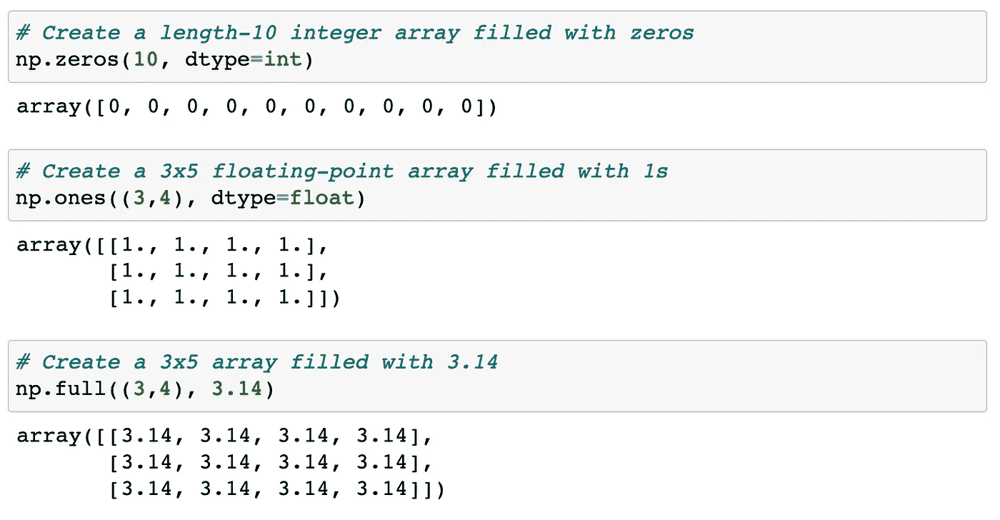

图片由[作者](https://boemer.medium.com/)创建

让我们创建一个用线性序列填充的数组。它应该在`0`开始，在`20`结束，并且只包含所有其他元素。注意，这类似于内置的`range()`函数。

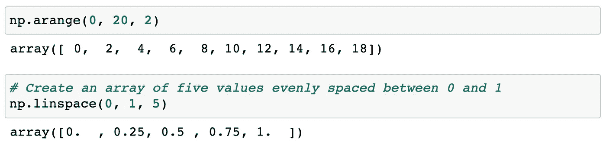

图片由[作者](https://boemer.medium.com/)创建

现在，我们将使用一些 NumPy 方法来生成随机数组。

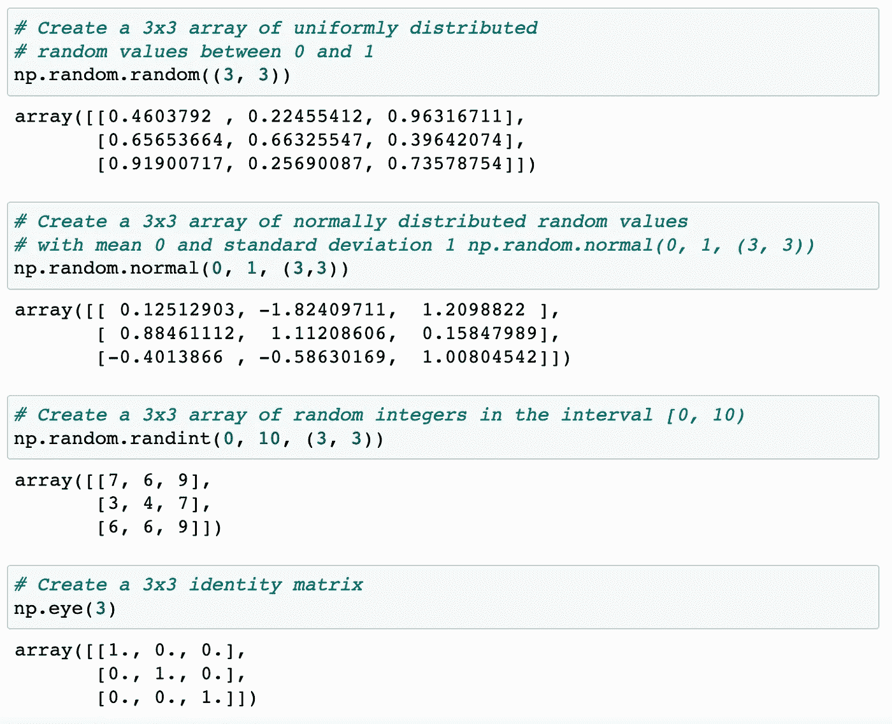

图片由[作者](https://boemer.medium.com/)创作

# 2.NumPy 中的数据操作

Python 中的数据操作与 NumPy 数组操作同义:甚至 Pandas 也是围绕 NumPy 数组构建的。尽管有些操作看起来有点枯燥，但它们是许多其他操作的基础。所以要好好了解他们。

## 2.1 NumPy 数组属性

首先让我们讨论一些对随机数组有用的数组属性:一维、二维和三维数组。让我们使用 NumPy 的随机数生成器并用一个设定值作为种子，以确保每次运行相同的代码时都生成相同的随机数组:

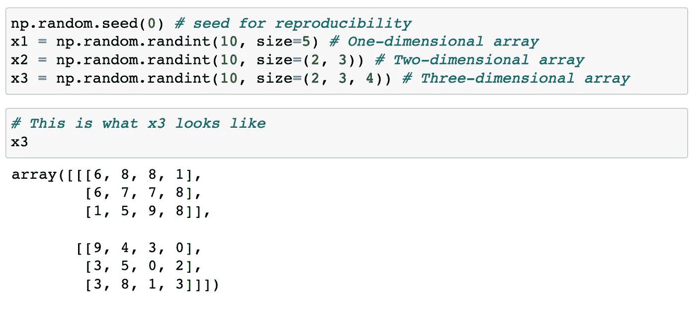

图片由[作者](https://boemer.medium.com/)创建

每个数组都有属性`ndim`(维数)、`shape`(每个维的大小)、和`size`(数组的总大小):

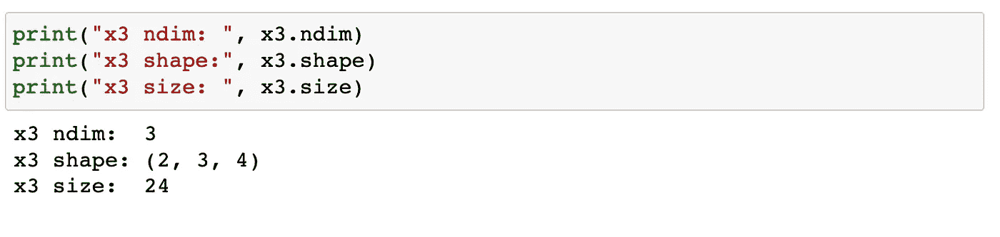

由[作者](https://boemer.medium.com/)创建的图像

## 2.2 数组索引:访问单个元素

如果你熟悉 Python 的标准列表索引，那么这将是小菜一碟，NumPy 会让你感觉非常熟悉。在一维数组中，可以通过在方括号中指定想要的索引来访问第*个*个值(从零开始计数)，就像我们处理 Python 列表一样:

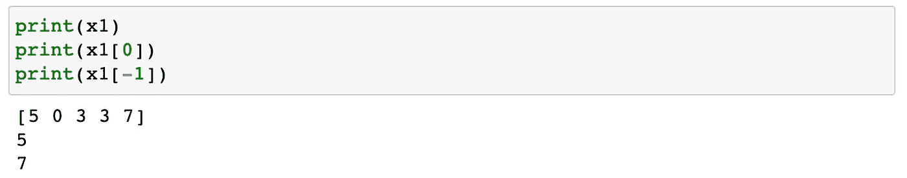

图片由[作者](https://boemer.medium.com/)创建

在多维数组中，使用逗号分隔的索引元组来访问和修改项:

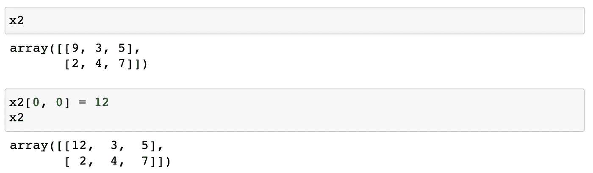

图片由[作者](https://boemer.medium.com/)创建

记住 NumPy 数组有固定的类型(不像 Python 列表)。这意味着，如果您试图将一个浮点值插入到一个整数数组中，该值将被自动截断。

## 2.3 数组切片:访问子数组

就像使用方括号访问单个元素一样，我们也可以使用它们访问带有切片符号的子数组，切片符号由冒号(`**:**`)字符指定。NumPy 切片语法与标准 Python 列表的语法没有什么不同。所以要访问一个切片数组 *x，*记住:

`**x[start:stop:step]**`

如果其中任何一个未指定，它们默认为尺寸的值`start=0`、`stop=size`和`step=1`。让我们来看看一维子数组的访问。

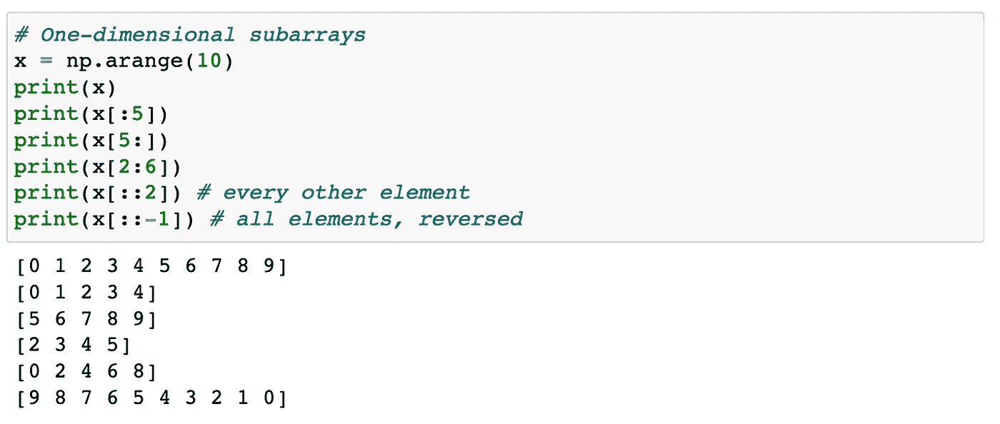

图片由[作者](https://boemer.medium.com/)创作

现在，让我们看看它在多维子阵列中的工作情况:

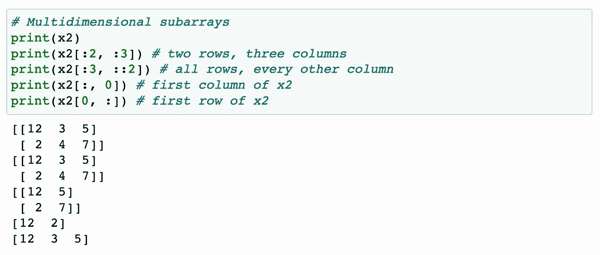

图片由[作者](https://boemer.medium.com/)创作

## 2.4 阵列的整形

另一种有用的操作是数组的整形。最优化的方法是使用`reshape()`方法。例如，如果您想将数字`1`到`9`放入一个 3x3 的网格中，您可以执行以下操作:

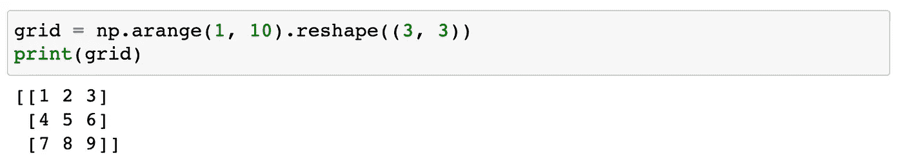

图片由[作者](https://boemer.medium.com/)创建

**注意**:为了让`reshape()`工作，初始数组的大小必须与整形后数组的大小相匹配。

另一种常见的整形模式是将一维数组转换为二维行或列矩阵。您可以使用 reshape 方法或在切片操作中使用`newaxis`关键字来完成此操作:

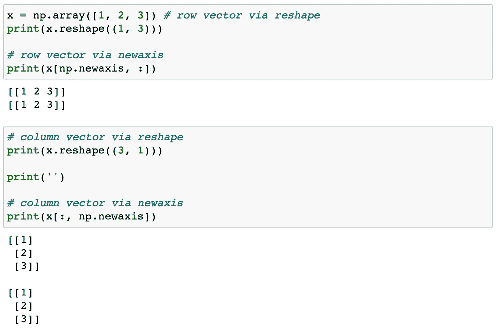

[作者创造的形象](https://boemer.medium.com/)

## 2.5 数组串联和拆分

所有以前的例程都在单个数组上工作。但是作为一名数据科学家，您经常需要将多个数组组合成一个数组，并将一个数组拆分成多个数组。因此，NumPy 中两个数组的连接主要是使用这些例程之一来完成的:`np.concatenate`、`np.vstack`或`np.hstack`。

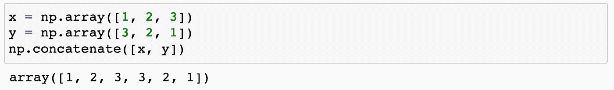

图片由[作者](https://boemer.medium.com/)创作

对于混合维度的数组，使用`np.vstack`(垂直堆栈)和`np.hstack`(水平堆栈)函数会更清楚:

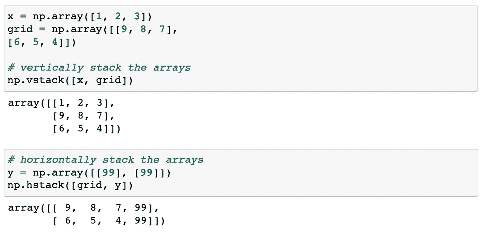

图片由[作者](https://boemer.medium.com/)创作

## 2.6 数组的拆分

与串联相反的是拆分，这可以通过使用函数`np.split`、`np.hsplit`和`np.vsplit`来实现。对于其中的每一个，我们可以传递一个给出拆分点的索引列表:

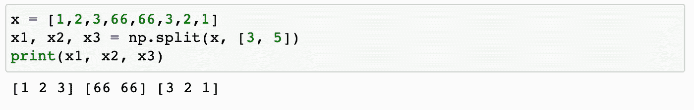

图片由[作者](https://boemer.medium.com/)创作

注意，`np.split`点通向 *N+* 1 子数组。相关功能`np.hsplit`和`np.vsplit`没有区别:

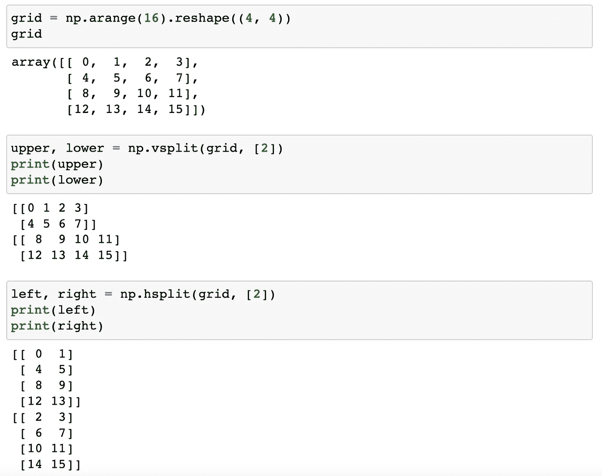

图片由[作者](https://boemer.medium.com/)创建

# 3.探索新奇的索引

花式索引在概念上很简单:它意味着传递一个索引数组来一次访问多个数组元素。例如，考虑以下数组:

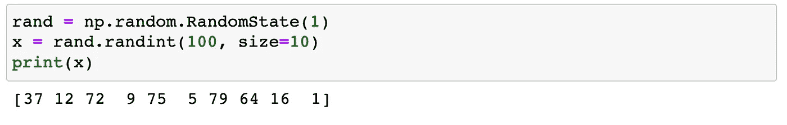

图片由[作者](https://boemer.medium.com/)创建

假设我们想要访问三个不同的元素。这是我们可以做的:

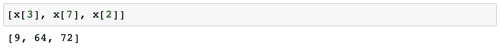

图片由[作者](https://boemer.medium.com/)创建

同样，我们可以传递一个索引列表或数组来获得相同的结果:

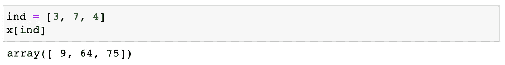

[作者创造的形象](https://boemer.medium.com/)

对于花式索引，结果的形状反映了索引数组的形状，而不是被索引的数组的形状:

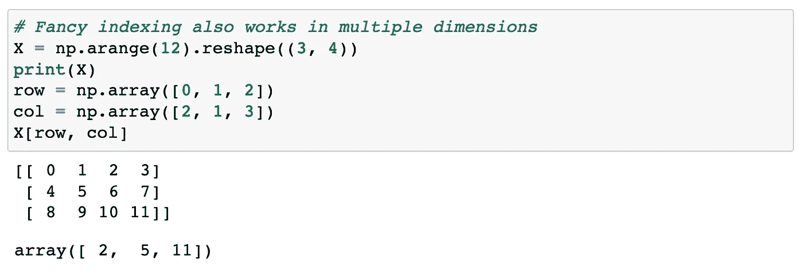

由[作者](https://boemer.medium.com/)创造的形象

花式索引的一个常见用途是从矩阵中选择行的子集。例如，我们可能有一个 *N* 乘 *D* 的矩阵来表示*D*维度中的 *N* 个点，例如从二维正态分布中提取的以下点:

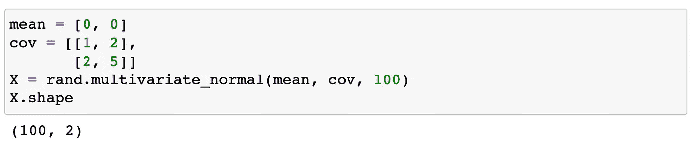

图片由[作者](https://boemer.medium.com/)创建

让我们使用花式索引来选择 10 个随机点。我们将首先选择 10 个没有重复的随机索引，并使用这些索引来选择原始数组的一部分。现在，使用绘图工具，我们可以看到哪些点被选中，让我们在选中的点上画大圆:

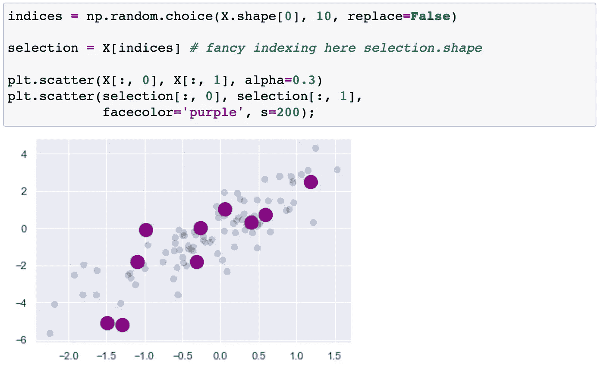

图片由[作者](https://boemer.medium.com/)创建

这种策略通常用于快速划分数据集，因为在统计模型验证的训练/测试分割(参见“[超参数和模型验证](https://jakevdp.github.io/PythonDataScienceHandbook/05.03-hyperparameters-and-model-validation.html)”)和回答统计问题的抽样方法中经常需要这种策略。

# 4.排序数组

到目前为止，我们主要关注的是使用 NumPy 访问和操作数组数据的工具。现在，让我们快速介绍一下与 NumPy 数组中的值排序相关的算法。例如，一个简单的选择排序从列表中重复查找最小值…

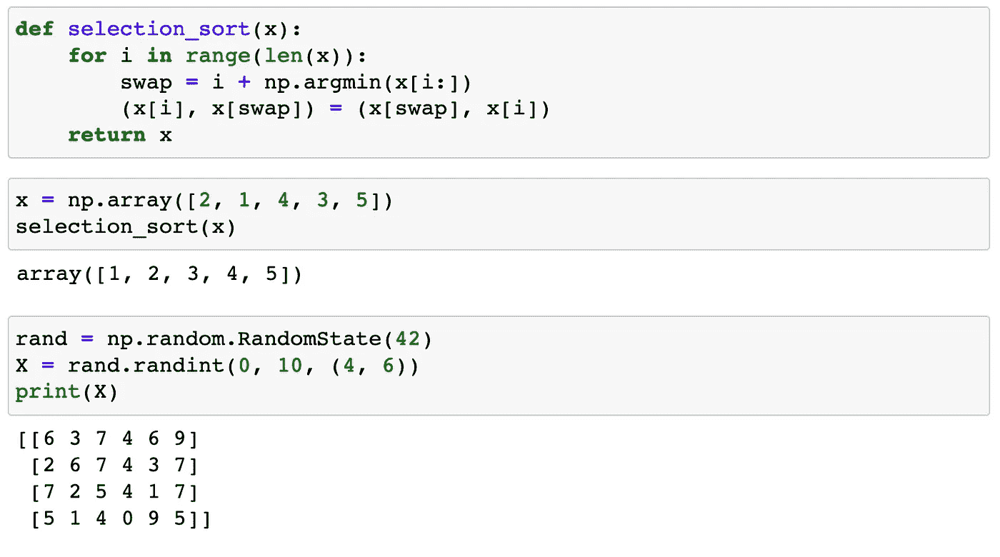

[作者创造的形象](https://boemer.medium.com/)

…并进行交换，直到列表排序完毕。我们可以用几行代码来编写:

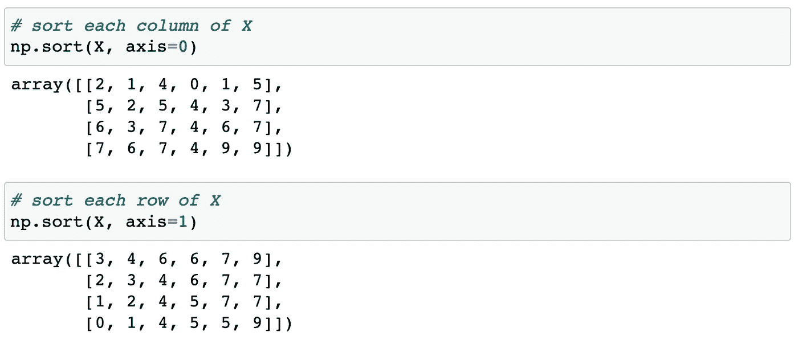

图片由[作者](https://boemer.medium.com/)创作

# 结论

数字数组的操作和高效存储对数据科学家来说至关重要。因此，掌握 NumPy 是每个数据科学家都应该追求的目标。然而，有一个很长的学习曲线，简单的数组可能是最好的起点。

希望本文能够为您提供开始使用 Python 中的 NumPy 所需的一些基础知识。从这里去哪里？查看 NumPy 的文档和一本名为《Python 数据科学手册》的书，作者是 Jake VanderPlas [2]。快乐学习！

# **参考文献**

****Jupyter 笔记本:**[https://jupyter.org/](https://jupyter.org/)**

****【2】Python 数据科学手册:**[https://jakevdp.github.io/PythonDataScienceHandbook/](https://jakevdp.github.io/PythonDataScienceHandbook/)**